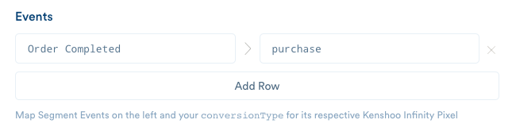

Kenshoo conversion tracking is an open, flexible system for collecting and utilizing information on conversions. This destination will map your Segment `.track()` events into Kenshoo Infinity Pixels!

## Track

In order to track conversions, you want to make sure you insert your **Subdomain** and **CID** into your destination settings. You can find these identifiers from Kenshoo by visiting your own profile settings page.

Next thing you need to do is to map the Segment `.track()` event names to the `conversionType` of the Kenshoo Infinity Pixel. The default value of this will be `'conv'`.



For each mapped `.track()` event, we will send `properties.revenue` (default to `'0'`), `properties.currency` (default to `'USD'`) and `properties.orderId` (capped at 64 chars). You can also map to Kenshoo's semantic `promoCode` property by passing in a destination-specific option:

```js
analytics.track('Conversion Event', {<properties>}, {
  integrations: {
    'Kenshoo Infinity': {
      promoCode: 'anything'
    }
  }
});
```

### Custom Properties

Note that Kenshoo only takes upto 15 custom properties. We will alphabetically sort your properties and only take the first 15. In accordance with Kenshoo's spec, we will replace all whitespace with underscores, remove all non-alphanumeric or non-underscore values, strip each custom property key after 100 characters (1024 chars for values). All values are encoded.

### Nested Objects or Arrays

If you send any nested objects or arrays, we will flatten and stringify them, delimited by an underscore:

```js
analytics.track('Some Event', {
  customParamArray: [1, 2, 3],
  customParamObjectSchools: {
    undergrad: {name: 'Georgia Tech', graduationYear: '2006'},
    gradSchool: {name: 'Georgia Tech', graduationYear: '2011'}
  }
})
```

would be sent as:

```
customParamArray: '1%2C2%2C3',
customParamObjectSchools_undergrad_name: 'Georgia%20Tech',
customParamObjectSchools_undergrad_graduationYear: '2006',
customParamObjectSchools_gradSchool_name: 'Georgia%20Tech',
customParamObjectSchools_gradSchool_graduationYear: '2011',
```

*Note*: All values are encoded.
