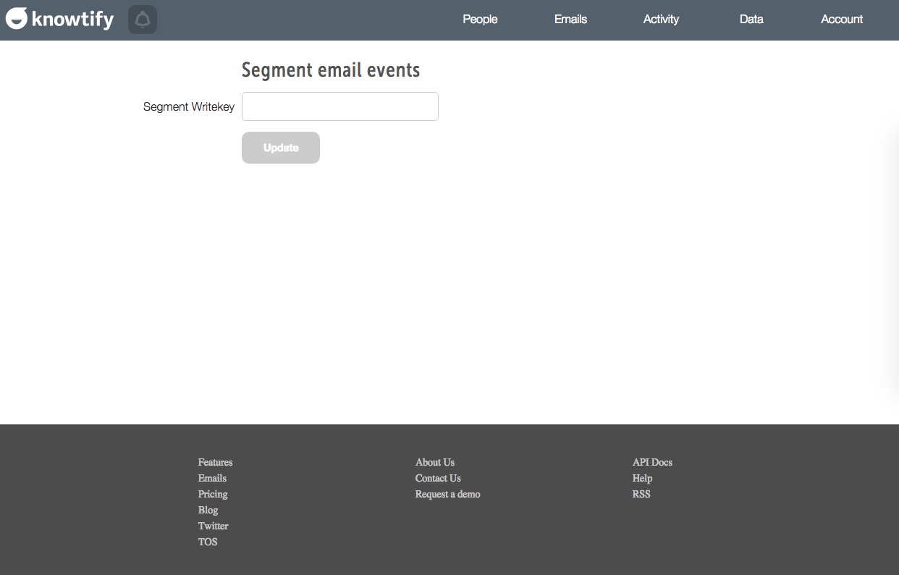

## Sending Data from Knowtify

Knowtify supports sending [email events](/docs/connections/spec/email/) to other tools on the Segment platform. These events will be sent as `track` calls to the other destinations you've turned on.

To enable this feature, follow this [link](http://www.knowtify.io/integrations/segment_email_events){:target="_blank"} and enter in your Writekey.

