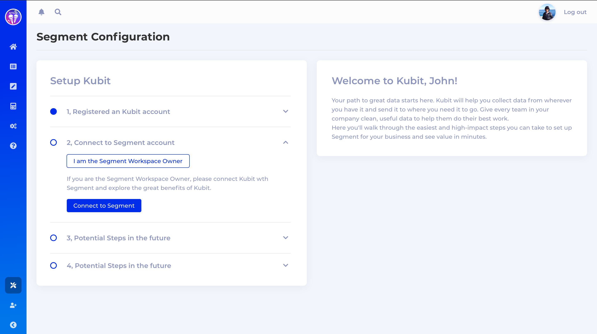

[Kubit](https://kubit.ai) is an analytics tool which makes deep data discovery and insights accessible for everyone. Kubit Smart Analytics help product people get clear, fast answers about user engagement and retention. When you send your events through Segment, you benefit from Kubit's AI-powered behavioral analytics, diagnostics, and collaborative workspaces.

This destination is maintained by Kubit. For any issues with the destination, [contact the Kubit Support team](mailto:support@kubit.ai).

## Getting Started



1. On Kubit's [Welcome Page](https://segment.kubit.ai/segment), click on “**Connect to Segment**”.
   
2. In Segment, select the Source to connect to the Kubit destination.
3. Click **Allow**.

## Page

If you aren't familiar with the Segment Spec, take a look at the [Page method documentation](/docs/connections/spec/page/) to learn about what it does. An example call would look like:

```js
analytics.page()
```
Segment sends Page calls to Kubit as a `pageview`.

## Track

If you aren't familiar with the Segment Spec,  take a look at the [Track method documentation](/docs/connections/spec/track/) to learn about what it does. An example call would look like:

```js
analytics.track('Login Button Clicked')
```
Segment sends Track calls to Kubit as a `track` event.
