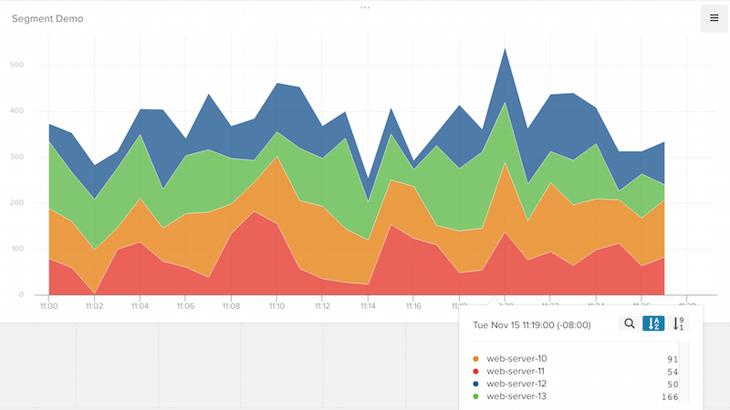

## Getting Started

When you enable Librato in the Segment web app, your changes appear in the Segment CDN in about 45 minutes, and then Analytics.js starts asynchronously loading the custom Librato provider on your website.
+ Since Librato only records custom events, no metrics appear in Librato until you start using the API explained below.

Librato supports the Segment `track` method for both client-side and server-side.

- - -

## Track

When you make a [Track call](/docs/connections/spec/track/), Segment adds a gauge measurement to Librato. The gauge is named after your event.

Here's an example using Node.js

```js
analytics.track({
  userId: '507f191e81',
  event: 'Event Triggered'
  properties: {
    value: 2
  }});
```

And here's an example with Python

```python
analytics.track('507f191e81', 'Event Triggered', {
      'value': 2
 })
 ```

The `value` event property allows you to set the magnitude of the data point. All other event properties will be ignored.

### Metrics

To get the most out of your event gauges,  enable the following options in the Librato interface for each Segment gauge:



`Period` - if set to 60 seconds, each data point on the graph represents the sum of the total number of events that happened in the last 60 seconds.

`Source Aggregation` - allows you to aggregate your gauge metrics over a period of time.

`Average: Sum` - sums measurement values over time.

### Metric Source
You may want to be able to split your time series metrics by the _source_, such as the computer which the event is coming from. By default, the source is set to the event, but you can override it by setting `context.Librato.source`.

Here's an example using Node.js

```javascript
analytics.track({
  userId: '507f191e81',
  event: 'Event Triggered'
  properties: {
    value: 2
  },
  context: {
     'Librato': {
        'source': 'your-web-server-X.X.X.XX'
     }
  }
});
```

And here's an example with Python

```python
analytics.track('507f191e81', 'Event Triggered',
  {
    'value': 2
   },
   {
    'Librato': {
      'source': 'your-web-server-X.X.X.XX'
  }
})
 ```
