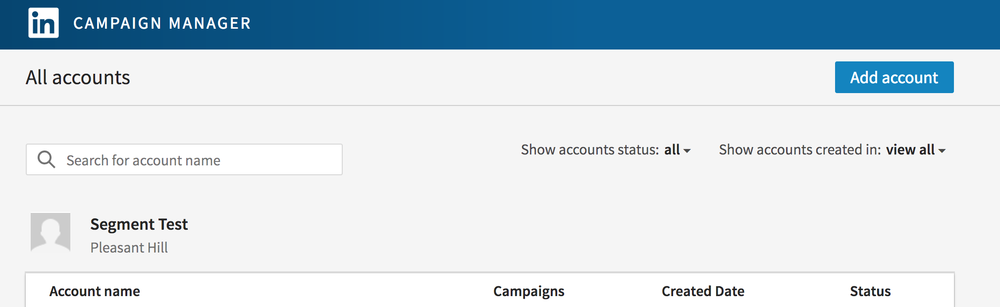
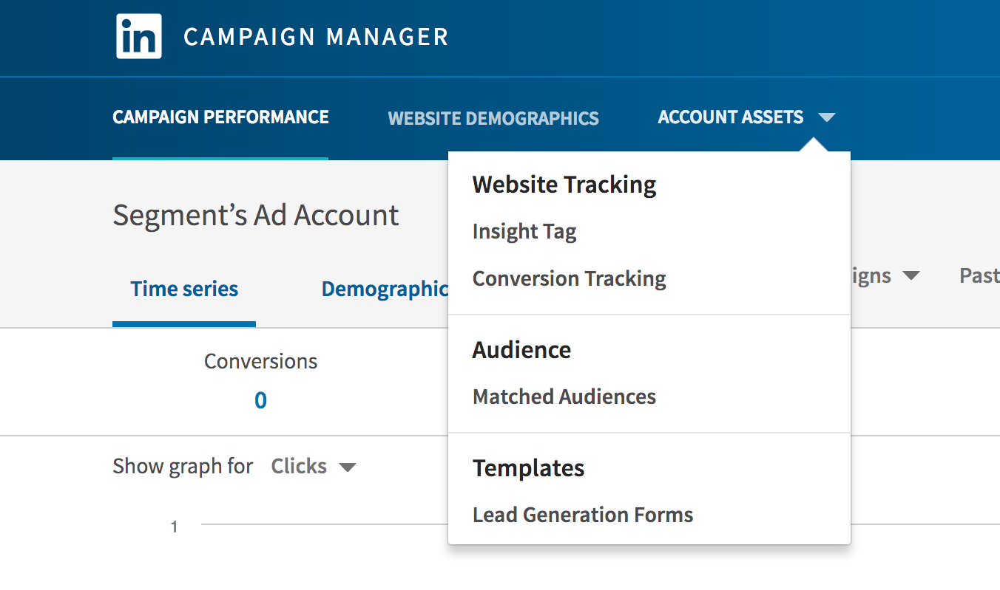
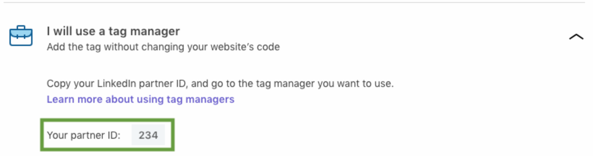
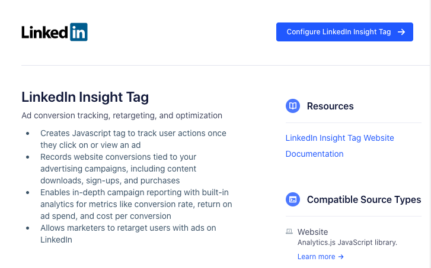
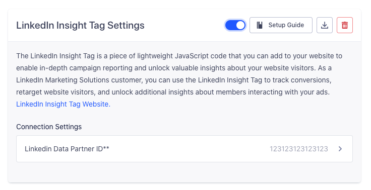

## Getting Started

When you enable the LinkedIn Insight Tag destination in the Segment web app, your changes appear in the Segment CDN in about 45 minutes, and then Analytics.js starts asynchronously loading LinkedIn Insight Tag's tracking snippet on your page.

(If you already had the LinkedIn Insight Tag's snippet installed on your page, you should remove it.)

- The LinkedIn Insight Tag automatically starts loading the pixel on sites which you load Analytics.js on.

The LinkedIn Insight Tag Destination doesn't use any Segment API calls (e.g. Identify, Track, etc), so you'll use the site-wide Insight Tag.

Here's how to get started with the LinkedIn Insight Tag!

### **1. Log into the LinkedIn Campaign Manager.**

If you don't have a LinkedIn business account, sign up for one now.
Once that's complete, go to the [LinkedIn Marketing Solutions page](https://business.linkedin.com/marketing-solutions/ads). From the **Advertising** dropdown menu, select **Sign in to Campaign Manager**.

Click the account name for which you'd like to set up website retargeting, conversion tracking, or website demographics.

### **2. [Create an Ad Account](https://www.linkedin.com/ad/accounts).**

Next, create an Ad Account in order to access the LinkedIn Insight Tag. It will ask for some currency information, but no payment is currently required to access the Insight Tag. Once the Ad Account is created, it's time to find the tag.

### **3. Get the LinkedIn Data Parter ID.**

From the Campaign Manager for the account, open the **Account Assets** dropdown menu. From there, select **Insight Tag** and move on to the specific tag.

From the **Manage Insight Tag** dropdown, select **See Tag**.

Click **I will use a tag manager**.

Your partner ID appears in a box below. Click the box to copy your partner ID to your clipboard.

### **4. Activate the LinkedIn Insight Tag destination in Segment.**

Log into your Segment account, go to the Destinations Catalog in the desired workspace, and select the LinkedIn Insight Tag destination (located at `https://segment.com/<Your Workspace>/destinations/catalog/linkedin-insight-tag`).

From there, click **Configure LinkedIn Insight Tag** and select the source for which you want to activate it. Click **Confirm Source**. The selected source loads, and a sidebar appears, asking for the LinkedIn Data Partner ID.

Select that option and paste in the LinkedIn Data Partner ID that you copied earlier. Click **Save**, then click **Activate Destination**. Our servers build the latest CDN for that source, and the LinkedIn Insight Tag loads on the sites that use that source's Segment snippet!
