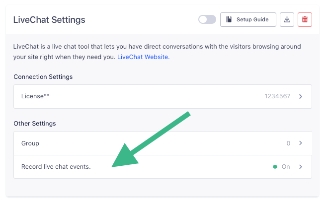

## Getting Started

When you toggle on LiveChat in Segment, this is what happens:

+ Our CDN is updated within 45 minutes. Then our snippet will start asynchronously loading LiveChat's javascript onto your page. This means you should remove LiveChat's snippet from your page.
+ LiveChat's chat box will appear on your page and you can start chatting with visitors.

LiveChat is only supported on the client-side.

- - -

## Identify

When you call `identify` on analytics.js, we take all the `traits` you provide and set them as custom variables using LiveChat's `set_custom_variables` function. We use the `userId` you provide to `identify` as a custom variable called `User ID`.

## Record Live Chat Events

With this destination, you can automatically record `track` events for live chat conversations. If you select this option, we'll collect the following events:
* Live Chat Conversation Started
* Live Chat Conversation Ended
* Live Chat Message
* Live Chat Message Received

These events will then flow out to your other tools, so you can do things like analyze if users who chat spend more money over time.

To learn more about the live chat events you can capture with this destination, head on over to our [Live Chat spec docs](/docs/connections/spec/live-chat/).

