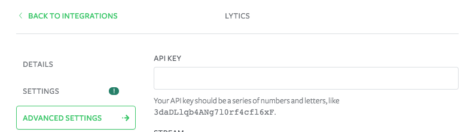

## Getting Started

1. Lytics uses our Javascript library so make sure to [go through our quickstart guide to get set up on that first](/docs/connections/sources/catalog/libraries/website/javascript/quickstart/).

2) Once you're recording data enable Lytics on your destination page using your Customer ID number, which can be found in the admin section of your Lytics account: **Account** -> **Manage Accounts**.

You can also enter your Data API Key under **Advanced Options**.  The data API Key can send data to Lytics, but not edit your account info.  The Full API Key has access to edit all of your account info, so it should not be used for sending data.

Paste into your Destination page:

## Features

You can see what [data fields Lytics pulls in by default](https://admin.lytics.io/#/documentation/jstag).  However, if you would like to pull in any custom data, you can [test it here](http://lytics.github.io/jstag/out/analyticsjs/).  This is generally not necessary when using Segment.
