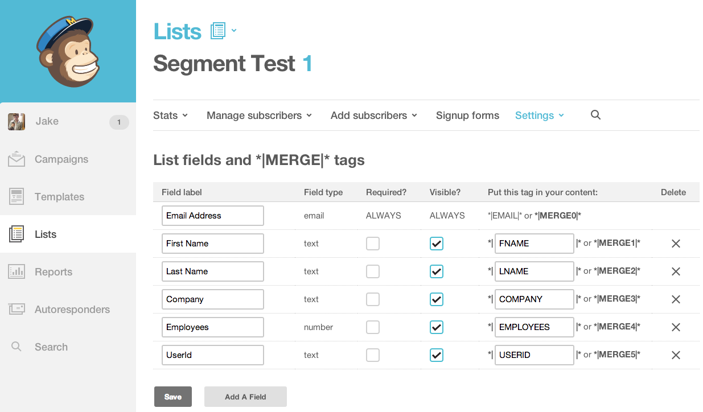
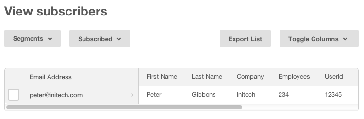

[Mailchimp](https://mailchimp.com/?utm_source=segmentio&utm_medium=docs&utm_campaign=partners) provides email marketing automation for e-commerce businesses. With Segment you can add people to your MailChimp list with a single [`identify`](/docs/connections/spec/identify/) call.


## Getting Started



1. From the Segment web app, click **Catalog**.
2. Search for "MailChimp" in the Catalog, select it, and choose which of your sources to connect the destination to.
3. In the destination settings, enter your MailChimp "API key" into the connection settings.
   You should create a new API key for the Segment destination. MailChimp restricts each API key to a maximum of 10 concurrent requests, so creating a dedicated one for Segment ensures maximum throughput for outgoing calls. You can read more about API keys on [MailChimp's docs](http://kb.mailchimp.com/integrations/api-integrations/about-api-keys).
4. Enter your MailChimp "[Audience ID](#audience-id)" into the connection settings.
5. Enter your MailChimp "[Datacenter ID](#datacenter-id)" into the connection settings.

## Identify

If you're not familiar with the Segment Specs, take a look to understand what the [Identify method](/docs/connections/spec/identify/) does. An example call would look like:

```javascript
analytics.identify('userId12345', {
  firstName: 'Bob',
  lastName: 'Dole',
  email: 'bob.dole@example.com'
});
```

Every time you call [identify](/docs/connections/spec/identify/) with an email address included, we will:

1. First ask Mailchimp if that email exists and what their subscriber status is for the `listId` you have provided in the destination settings.

2. If they do not exist, we will **subscribe** that user to the list immediately. If you have `doubleOptIn` setting enabled, it will send a confirmation email to that user before subscribing them and that email will not be tagged with a subscriber status of `pending`.

3. If they already have a subscriber status such as `pending`, `subscribed`, `unsubscribed` or `cleaned`, we will **NOT** resubscribe them but simply update their user `traits`.

So you no longer have to worry about the `identify` call resubscribing users unintentionally!

Segment recognizes `firstName`, `lastName` and `email` as [special traits](/docs/connections/spec/identify#traits), so we will translate those for you to match the Mailchimp accepted field names. Mailchimp includes these fields by default when you create a list.

### Recording Custom User Traits

If you want to view any other custom user traits in the Mailchimp list dashboard, you **must** [create a Custom Merge Field inside Mailchimp's UI](#custom-merge-fields) of the `traits` in your `identify` calls. Note that you do not need to map all `user.traits` you are sending inside Mailchimp. You only need to create Custom Merge Fields of the traits you *want* to see in your list view.

**IMPORTANT:** Mailchimp only supports merge tags that are 10 characters or shorter. So for every user `trait` you send inside the `.identify()` call, we will trim it to be the first 10 characters and will send it in **uppercase** form to Mailchimp. So it's very important that when you set up your merge tags in Mailchimp, your `Merge Tags` are the first 10 characters (excluding whitespace or special characters) of its `Field Label` (if it's over 10 characters).

For example, if your `Field Label` was `Way Too-Long123`, your `Merge Tag` should be `WAYTOOLONG`. And the `user.trait` inside your `.identify()` call would be `Way Too-Long123` since we will convert that to `WAYTOOLONG` before sending it to Mailchimp.

If you are going to be sending either a `boolean` or `null` object as a `user.trait` value, when creating the custom merge field for that trait inside Mailchimp, make sure to set the data type as `TEXT` since we will stringify all `boolean` or `null` objects to strings.

Also note that fields you specify in Mailchimp as date fields must receive dates. Passing non-date values will cause issues.

### Custom Merge Fields

To send custom merge fields/user traits to Mailchimp you need to create the merge field first in Mailchimp for each trait you want sent to Mailchimp. Then when you call `identify` with keys that match those `traits` they will appear in your Mailchimp list.

For example, if you have a list in Mailchimp with these custom merge fields:



You can populate those fields using this `identify` call:

```javascript
analytics.identify('userId12345', {
  firstName: 'Bob',
  lastName: 'Dole',
  email: 'bob.dole@example.com',
  company: 'Initech',
  employees: 234
});
```

For any other custom `traits` just add a Mailchimp Custom Merge Field inside of Mailchimp with a tag that matches the key you are using in your `identify` call. In the example these `traits` are **company** and **employees**. They will be shown as **COMPANY** and **EMPLOYEES** in Mailchimp, but you can record them in lower-case to `identify` and they will still be populated.

One thing to note is that you shouldn't use underscores in your custom Merge Field names.

Once Mailchimp has processed the new subscriber you'll see it show up in your list, like this:



### Recording userId

To record a Segment `userId` in Mailchimp, you must pass the userID as a trait on your `identify()` calls. We do not automatically map the Segment userID to any Mailchimp properties.

### Overriding List ID (Also now referred to as Audience ID)

If you have multiple lists (audiences) that your users can subscribe to, you can override the default list (audience) ID. Simply send a `listId` parameter as an option for Mailchimp:

```javascript
analytics.identify('userId12345', {
  firstName: 'Bob'
  }, {
    "MailChimp": {
      "listId": "ea7918abb6"
    }
  });
```

### Manually updating user subscription status

If you'd like to manually update a user's subscription status, you can do so by passing in `subscriptionStatus` property as an option for Mailchimp:

```javascript
analytics.identify('userId12345', {
  firstName: 'Bob'
  }, {
  integrations: {
    "MailChimp": {
      "listId": "ea7918abb6",
      "subscriptionStatus": "unsubscribed"
    }
  }
});
```

**Important:** You must use the semantic property exactly as is, `subscriptionStatus` (case-sensitive) and the value of this property *must* be one of the four valid statuses supported by Mailchimp: `pending`, `subscribed`, `unsubscribed`, and `cleaned` (all lowercase).

Again, this will **NOT** work for new users. New users will always have their subscription status set as either `pending` or `subscribed` depending on your double opt-in setting.

## Troubleshooting

### Why are my calls with trait arrays not showing up in MailChimp?
MailChimp does not support arrays as traits values. This can cause calls to not show up.
