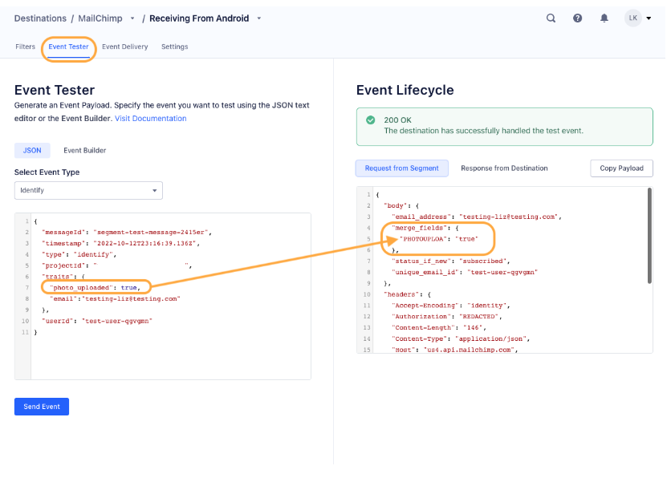

[Mailchimp](https://mailchimp.com/?utm_source=segmentio&utm_medium=docs&utm_campaign=partners){:target="_blank"} provides email marketing automation for e-commerce businesses. With Segment you can add people to your Mailchimp list with a single [`identify`](/docs/connections/spec/identify/) call.


## Getting started


1. From the Segment web app, navigate to **Connections > Catalog** and go to the **Destinations** tab of the catalog.
2. Search for *Mailchimp*, select it, and click **Configure Mailchimp**.
3. Choose the source to connect the destination to.
4. In the destination settings, enter your Mailchimp "API key" into the connection settings.
   You should create a new API key for the Segment destination. Mailchimp restricts each API key to a maximum of 10 concurrent requests, so creating a dedicated one for Segment ensures maximum throughput for outgoing calls. You can read more about API keys on [Mailchimp's docs](http://kb.mailchimp.com/integrations/api-integrations/about-api-keys){:target="_blank"}.
4. Enter your Mailchimp "[Audience ID](#audience-id)" into the connection settings.
5. Enter your Mailchimp "[Datacenter ID](#datacenter-id)" into the connection settings.

## Identify

If you're not familiar with the Segment Specs, take a look to understand what the [Identify method](/docs/connections/spec/identify/) does. An example call would look like:

```javascript
analytics.identify('userId12345', {
  firstName: 'Bob',
  lastName: 'Dole',
  email: 'bob.dole@example.com'
});
```

Every time you call [identify](/docs/connections/spec/identify/) with an email address included, Segment:

1. First asks Mailchimp if that email exists and what their subscriber status is for the `listId` you've provided in the destination settings.

2. If they don't exist, Segment **subscribes** that user to the list immediately. If you enabled the `doubleOptIn` setting, it sends a confirmation email to that user before subscribing them, and that email won't be tagged with a subscriber status of `pending`.

3. If they already have a subscriber status such as `pending`, `subscribed`, `unsubscribed`, or `cleaned`, Segment doesn't resubscribe them, but updates their user `traits`.

So you no longer have to worry about the `identify` call resubscribing users unintentionally!

Segment recognizes `firstName`, `lastName`, and `email` as [special traits](/docs/connections/spec/identify#traits), so Segment translates those for you to match the Mailchimp accepted field names. Mailchimp includes these fields by default when you create a list.

### Recording custom user traits

If you want to view any other custom user traits in the Mailchimp list dashboard, you **must** [create a custom merge field inside Mailchimp's UI](#custom-merge-fields) of the `traits` in your `identify` calls. Note that you don't need to map all `user.traits` you're sending inside Mailchimp. You only need to create custom merge fields of the traits you *want* to see in your list view.

> warning ""
> **IMPORTANT:** Mailchimp only supports merge tags that are 10 characters or shorter. For every user `trait` you send inside the `.identify()` call, Segment will trim it to be the first 10 characters and will send it in **uppercase** form to Mailchimp.


It's important that when you set up your merge tags in Mailchimp, your `Merge Tags` are the first 10 characters (excluding whitespace or special characters) of its `Field Label` (if it's over 10 characters).

For example, if your `Field Label` was `Way Too-Long123`, your `Merge Tag` should be `WAYTOOLONG`. And the `user.trait` inside your `.identify()` call would be `Way Too-Long123` since Segment converts that to `WAYTOOLONG` before sending it to Mailchimp.

If you're going to send either a `boolean` or `null` object as a `user.trait` value, when creating the custom merge field for that trait inside Mailchimp, make sure to set the data type as `TEXT` since Segment will stringify all `boolean` or `null` objects to strings.

Also note that fields you specify in Mailchimp as date fields must receive dates. Passing non-date values will cause issues.

### Custom merge fields

To send custom merge fields/user traits to Mailchimp you need to create the merge field first in Mailchimp for each trait you want sent to Mailchimp. Then when you call `identify` with keys that match those `traits` they will appear in your Mailchimp list.

For example, if you have a list in Mailchimp with these custom merge fields:


You can populate those fields using this `identify` call:

```javascript
analytics.identify('userId12345', {
  firstName: 'Bob',
  lastName: 'Dole',
  email: 'bob.dole@example.com',
  company: 'Initech',
  employees: 234
});
```

For any other custom `traits`, add a Mailchimp custom merge field inside of Mailchimp with a tag that matches the key you're using in your `identify` call. In the example, these `traits` are **company** and **employees**. They will be shown as **COMPANY** and **EMPLOYEES** in Mailchimp, but you can record them in lower-case to `identify` and they will still populate.

> success ""
> Don't use underscores in your custom merge field names. When Segment maps to Mailchimp merge fields, Segment removes the underscores and capitalizes the entire field.

Once Mailchimp has processed the new subscriber you'll see it show up in your list, like this:


### Recording userId

To record a Segment `userId` in Mailchimp, pass the user ID as a trait on your `identify()` calls. Don't pass the `userId` as a trait ID because the  `trait.id` is a reserved trait. Instead, pass the `userId` in a trait name with the corresponding merge field in Mailchimp. Segment doesn't automatically map the user ID to a Mailchimp property.

### Overriding List ID (Also now referred to as Audience ID)

If you have multiple lists (audiences) that your users can subscribe to, you can override the default list (audience) ID. Simply send a `listId` parameter as an option for Mailchimp:

```javascript
analytics.identify('userId12345', {
  firstName: 'Bob'
  }, {
    "MailChimp": {
      "listId": "ea7918abb6"
    }
  });
```

### Manually updating user subscription status

If you'd like to manually update a user's subscription status, you can do so by passing in `subscriptionStatus` property as an option for Mailchimp:

```javascript
analytics.identify('userId12345', {
  firstName: 'Bob'
  }, {
  integrations: {
    "MailChimp": {
      "listId": "ea7918abb6",
      "subscriptionStatus": "unsubscribed"
    }
  }
});
```

> warning ""
> **Important:** You must use the semantic property exactly as is, `subscriptionStatus` (case-sensitive) and the value of this property *must* be one of the four valid statuses supported by Mailchimp: `pending`, `subscribed`, `unsubscribed`, and `cleaned` (all lowercase).

Again, this will **NOT** work for new users. New users will always have their subscription status set as either `pending` or `subscribed` depending on your double opt-in setting.

## Troubleshooting

### Why are my calls with trait arrays not showing up in Mailchimp?
Mailchimp doesn't support arrays as traits values. This can cause calls to not show up.

## Engage

You can send computed traits and audiences generated using [Engage](/docs/engage/) to Mailchimp as a **user property**. To learn more about Engage, schedule a [demo](https://segment.com/demo/){:target="_blank"}.

Segment sends an [`identify` call](/docs/connections/spec/identify/) to the Mailchimp destination for each user being added and removed. The Mailchimp destination requires an email field in all Identify payloads. If a profile doesn't have an email identifier when the audience or trait is created in Segment, then the event will fail and will not be sent to Mailchimp. 

> success ""
> Before creating audiences or computed traits with Engage, you must first create merge fields in Mailchimp. Learn more about [recording custom user traits](#recording-custom-user-traits) and [sending custom merge fields](#custom-merge-fields) to Mailchimp.

The property name is the snake_cased version of the audience name, with a true/false value to indicate membership. For example, when a user first completes an order in the last 30 days, Engage sends an Identify call with the property `order_completed_last_30days: true`. When the user no longer satisfies this condition (for example, it’s been more than 30 days since their last order), Engage sets that value to `false`.

When you first create an audience, Engage sends an Identify call for every user in that audience. Later audience syncs only send updates for users whose membership has changed since the last sync.

> info "Real-time to batch destination sync frequency"
> Real-time audience syncs to Mailchimp may take six or more hours for the initial sync to complete. Upon completion, a sync frequency of two or three hours is expected.
