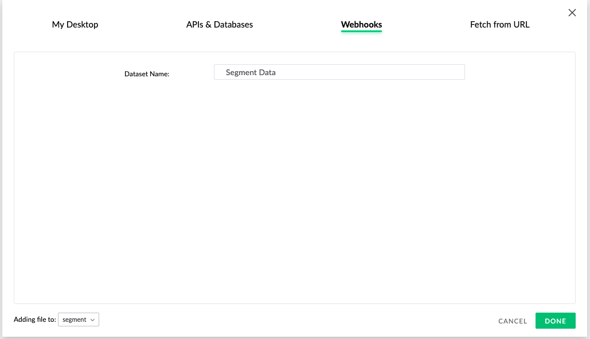

[Mammoth](https://mammoth.io/integrations/segment-com/?utm_source=segmentio&utm_medium=docs&utm_campaign=partners) provides self-serve analytics for analysts, businesses, and developers who can use Mammoth's data warehousing, data discovery & data preparation abilities to arrive at insights.

Mammoth allows you to blend your data from Segment with other sources of data such as databases and files. Using Mammoth, you can build multiple data pipelines, which are constructed by applying transforms through a no coding interface. Mammoth also allows for the visual discovery of the data and easy exports to databases such as MySQL, elasticsearch, and PostgreSQL.

This destination is maintained by [Mammoth](https://mammoth.io). For any issues with Mammoth Destination, [contact the Mammoth Support team](mailto:support@mammoth.io).




## Getting Started



There are three steps to get started using Mammoth with Segment. You can register for an account with Mammoth by clicking [here](https://mammoth.io/register/choose/starter).

1. Create a webhook dataset on Mammoth & copy the API KEY.
2. Connect Segment and Mammoth.
3. Use the *Extract from JSON* task to flatten data.


### 1. Create a webhook dataset on Mammoth.

Mammoth Segment destination requires a dataset on Mammoth's side. There are multiple types of datasets you can add. You want to add a webhook type of dataset on Mammoth for Segment Integration.


1. Log into app.mammoth.io.
2. You need to create a new dataset of type webhooks. To do so, click on the big green button in the data library and click on the option *Webhooks*. If you do not have any datasets in your account, you will see a button to add a webhook dataset on the data library itself.
3. This will open the add dataset dialog. Make sure the option selected is *Webhooks*.
4. Give your dataset a name & click on Done. A new dataset will appear in the data library.



The dataset you created will have an API KEY which will be needed to proceed on Segment UI. Here is how you copy it:


1. Click on the new dataset you created in the previous step.
2. On the preview panel, copy the API key by clicking on *copy*.


### 2. Connect Segment and Mammoth.


1. In the Segment App, select Add Destination. Search for and select Mammoth.
2. Paste the API KEY you copied in the previous step into the UI.

### 3. Use the *Extract from JSON* task to flatten data

Once you are configured according to the previous steps, data should start flowing into Mammoth. Mammoth will store all the data received from Segment in this dataset. You can use the *Extract from JSON* task to flatten the data into rows and columns. Once you have the data in a flat format, you can use Mammoth's capabilities to set up any number of pipelines you need.

1. When Mammoth receives data the, `REFRESH` button will show up in the preview panel. Click it to add that data to the dataset from the staging area.
2. Select the dataset and click on the open button.
3. You will be taken to the default View on the dataset. You will see one column of data called JSON.
4. Now we want to flatten the JSON data. Open the *ADD TASK* menu and click on the *Extract from JSON* task.
5. Use the *Extract from JSON* task as needed to flatten the data. *Extract from JSON* task will automatically suggest you the right options, and all you need to do is hit *Apply*. You can read more about *Extract from JSON* task [here.](https://mammoth.io/docs/content/feature_guide/tasks/json.extract.html)
6. You may need to apply the *Extract from JSON* task multiple times if the data is nested.

Mammoth will automatically refresh the data approximately every hour. You can also click on the *REFRESH* button to sync data immediately any time.


### Hints and Tips

Tasks you create with Mammoth do not modify your original data from Segment. You can reuse the original data and set up multiple task pipelines by creating multiple views on the same dataset.

You may also want to use the *Apply filter* task along with *Extract from JSON* task to flatten only certain types of data.

Once you have converted the JSON data into a row vs. column format, you can

- Use the *EXPLORE* menu and explore the data in any of the columns.
- Use other tasks provided by the *ADD TASK* menu to arrive at insights and automate reports.
- Export the data to another system from Mammoth.

Mammoth recommends that you use the *Save as Dataset* task in the *ADD TASK* menu to save your flattened data as a new dataset. Using this method, you separate your JSON extractions from your analysis & reporting.


## Page

If you're not familiar with the Segment Specs, take a look to understand what the [Page method](https://segment.com/docs/connections/spec/page/) does. An example call would look like:

```
analytics.page()
```

Page calls will be sent to the webhook dataset you created earlier. You can filter this data into a different view after you have set up JSON extract pipelines.


## Screen

If you're not familiar with the Segment Specs, take a look to understand what the [Screen method](https://segment.com/docs/connections/spec/screen/) does. An example call would look like:

```
[[SEGAnalytics sharedAnalytics] screen:@ "Home"];
```

Screen calls will be sent to the webhook dataset you created earlier. You can filter this data into a different view after you have set up JSON extract pipelines.


## Identify

If you're not familiar with the Segment Specs, take a look to understand what the [Identify method](https://segment.com/docs/connections/spec/identify/) does. An example call would look like:

```
analytics.identify('userId123', {
  email: 'john.doe@example.com'
});
```

Identify calls will be sent to the webhook dataset you created earlier. You can filter this data into a different view after you have set up JSON extract pipelines.


## Track

If you're not familiar with the Segment Specs, take a look to understand what the [Track method](https://segment.com/docs/connections/spec/track/) does. An example call would look like:

```
analytics.track('Clicked Login Button')
```

Track calls will be sent to the webhook dataset you created earlier. You can filter this data into a different view after you have set up JSON extract pipelines.
