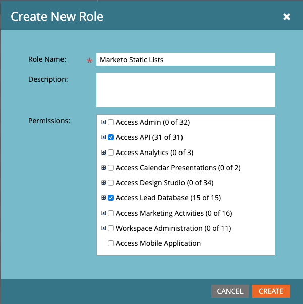
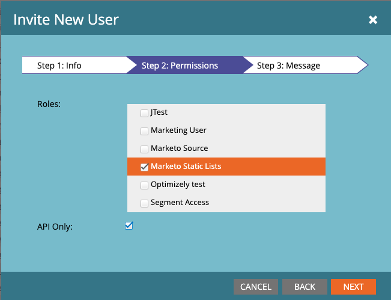
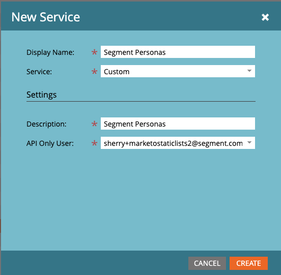
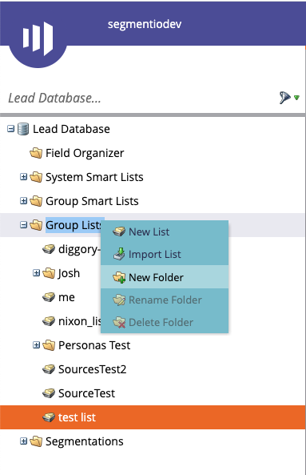
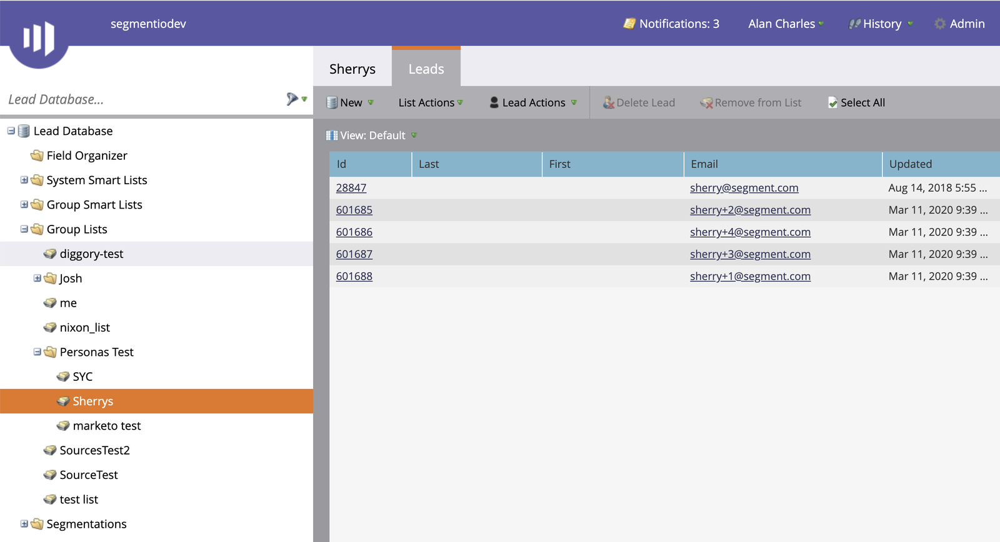
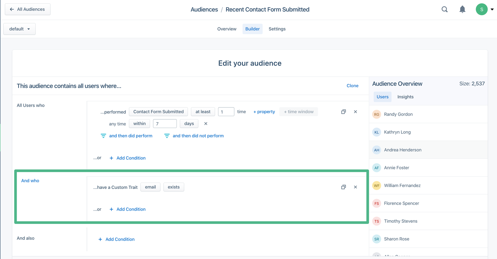

> note "Marketo vs Marketo Static Lists Destinations"
> This page is about the **Marketo Static Lists** destination developed specifically for use with Segment Personas. Marketo has strict API usage limits on the [main Marketo destination](/docs/connections/destinations/catalog/marketo-v2/), so although the main destination can receive events from Personas, we strongly recommend that you use the Marketo *Static Lists* destination with Personas instead.

## Overview

The Marketo Static Lists destination lets you sync audiences created using [Segment Personas](/docs/personas) into Marketo as a **List**. Once you create the audience, Segment sends that list of users to Marketo, and keeps it up to date as users enter and exit the audience specification.

This allows you to run email campaigns in Marketo without having to manually find and upload a refreshed csv of users. This documentation explains how to set up Marketo in Segment, and what to expect in your Marketo UI.

> info "Note:"
> You must have access to Personas as part of your Segment plan to use this destination. [Contact our sales team](https://segment.com/demo/) to try this out.

## Details

- **Supports Personas**: Yes
- **Personas Destination type**: List
- **Must create audience_name field before Personas can update those values?**: No. You don't need to create the _list_ in Marketo, however you do need to create the folder Segment will create the list in.
- **Audience appears as**: A list in the folder you created, in the Marketo Lead Database under Group Lists.
- **Destination rate limit**: 100 calls per 20 seconds, which is shared among all third-party API services
- **Lookback window allowed**: Yes
- **Identifiers required**: Email
- **Identifiers accepted**: Email
- **Client or Server-Side Connection**: Server-side

<!-- commenting out this table because the format is giant
| **Support for Personas**        | Yes     |
| **Personas Destination Method**  | List |
| **Must create audience_name field in the tool before Personas can update those values** | No. You do not have to create list in Marketo before Segment sends the audience to Marketo. However, you do need the pre-create the folder in which Segment will create the list. |
| **How does the audience appear within the destination?**                                | Marketo Lead Database → Group Lists → within a custom folder as a list  |
| **Are there rate limits?**  | Yes, 100 calls per 20 seconds, which is shared among all third-party API services     |
| **Lookback window allowed by Destination**    | Yes   |
| **Identifiers Required**   | email   |
| **Identifiers Accepted**    | email     |
| **Client vs. Server-Side Connection**   | Server-side  |-->

## How it works

Every time you create an audience in Personas and connect it to Marketo Static Lists, Segment does the following:

1. Creates a list with the same name as the Personas audience in the folder designated for Personas.
2. Adds any users to that list who both fit the audience definition and have an email address.
3. If a user has multiple email addresses on their identity graph, each email address becomes a unique entry on the list.
4. After the audience is configured, Segment checks which users still fit the audience definition, and adds or removes users from the audience.


## Configuring Marketo Static Lists

> success "Good to know:"
> To set up Marketo to receive Personas data, you need Marketo administrator access. If you don't have that access, work with the administrator for your organization.

### Step 1: Create an API-Only Marketo user

In this step, you'll create an API-Only Marketo user with both Access API and Lead Database access.

1. You can use an existing role with these permissions, or create a new role that has both Access API and Access Lead Database permissions. (Do this in Marketo by going to **Admin**→ **Users & Roles** → **Roles**).

   

2. Go to **Admin**→ **Users & Roles** → **Users** → **Invite New User** and create a new **API Only user** with the role that has both Access API and Lead Database permissions. **Be sure to check the API Only box.**

   

### Step 2: Create a Marketo Launchpoint Service for Segment Personas

1. Go to **Admin** → **Integration**→ **LaunchPoint** → **New**
2. Create a new service. In the Service field, select `Custom`, and in the **API Only User** field, select the user you created in step 1.
3. Write down the **Client Id** and **Client Secret** for this service, as you will need it in Step 4.

### Step 3: Create a Marketo Lead Database folder and get your Marketo Endpoint

1. Go to your Marketo Lead Database and create a new folder under Group Lists. Once connected, each Personas audience shows up as a list in this folder.

   

2. Before you continue to the next step, in Marketo, go to **Admin → Web Services**, and copy or write down the REST API Endpoint. **Be sure to copy the REST endpoint and not the SOAP endpoint.** You'll need that in the next step.

> warning "Warning:"
> Do not create a list in the folder for the audience. Segment creates the list for you!

### Step 4: Set up the Marketo Static Lists destination in Segment Personas

1. From your Segment workspace, go to **Personas → Destinations→ Add Destination** and then Search for Marketo Static Lists.
2. In the destination settings, enter the **Client Id**, **Client Secret**, **Endpoint** and **Folder Name** from the LaunchPoint service and folder you created in Steps 2 and 3. For **Endpoint**, note the Endpoint from Step 3.
3. Click the toggle to enable the Marketo Static Lists destination.

### Step 5: Create Personas audiences and add Marketo Static Lists as a destination

1. Navigate to the Personas Audiences tab or go to `https://app.segment.com/goto-my-workspace/personas/audiences` and create a new audience.
2. Give your audience a name, some event and trait criteria, then click **Preview**.
3. Select Marketo Static Lists as a destination for the Audience.

> info "Note:"
> Only users with an email address appear in the list in Marketo. Users with multiple email addresses as external ids appear in the list once for each email address.

You can view the audience in Marketo by going to **Lead Database→ Group Lists→Name of folder you created in Step 3 → Audience name**

## Troubleshooting

#### Not seeing an audience in Marketo

Check that you followed all of the set-up steps.

Wait six or more hours after setup for your audience to start appearing in Marketo.

Check that you didn't create a list in the folder for the audience - Segment creates the list for you, and an existing one can conflict.

Check that the audience members you expect have an email address on their profile.

#### Audience size is smaller than expected
Only users in the audience who also have an email address are uploaded to the list.

You might need to adjust your query to filter out users without an email so you can get a better estimate of how many users will appear on the list. In the example below, we added an AND condition where users have a Custom trait of `email` which `exists`.

If a user has multiple email addresses, each address appears once in the Marketo lists. 
