## Getting Started

To start sending data to Marketo, there are two things you must do. **Both of these steps require that you to log in with the Admin Marketo Account.**

### Enter your Marketo Credentials into your Destination settings
We'll need your Munchkin Account ID, Client Secret, and Client ID.

To get your Munchkin Account ID [login to your Marketo account](https://login.marketo.com/), click Admin in the top right corner, then click Munchkin on the left side bar.

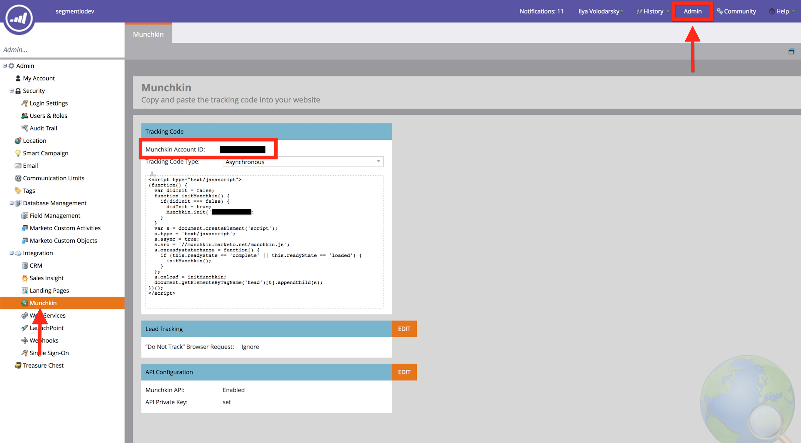


To get your Client Secret and Client ID, you must create a role that has full API access, an API only user, and then create a Service in Marketo.

To create a role with full API access:

1. Click **Admin** in the top right corner.
2. Click **Users & Roles** on the left side bar.
3. Click on the **Roles** tab.
4. Click **New Role**. Name your role and check the API Access box to assign the user full API access. Click Create.
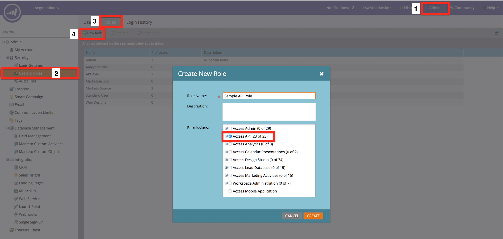


Now that you've created an API role, you have to assign that role to an API only user.

1. Click the Users tab.
2. Click Invite New User and fill out the necessary information in Step 1.
3. Assign the new role you created to this user in Step 2 and check the API Only box. Click next then Send.
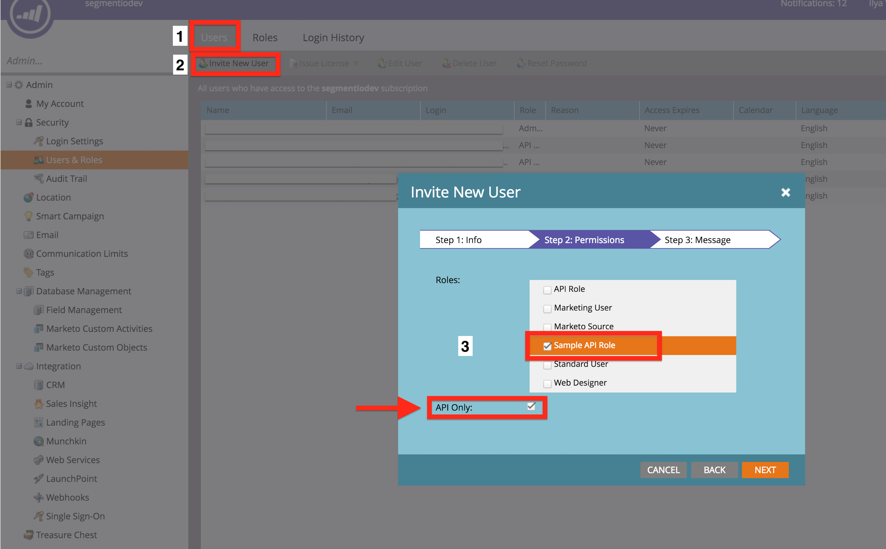


Next, create a Service and get Client Secret and Client ID from that Service.

1. Click LaunchPoint on the left side bar.
2. Click New and then New Service from the drop down.
3. Select Custom for the Service from the drop down.
4. Select the new API Only user you invited. This User must be an API Only user **and** be assigned a role that has full API access.
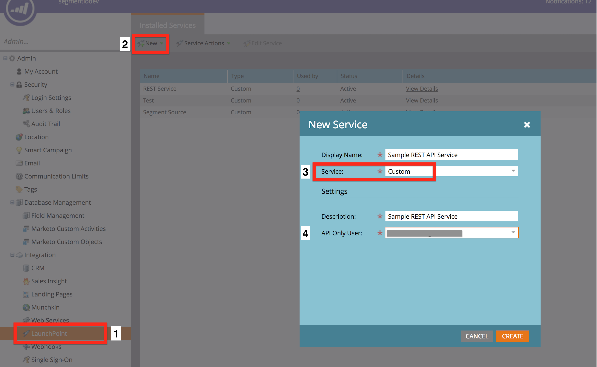

1. Click View Details on the new service that you've created and a small window will display with your Client Secret and Client ID. Copy and paste them into your Destination's Settings.
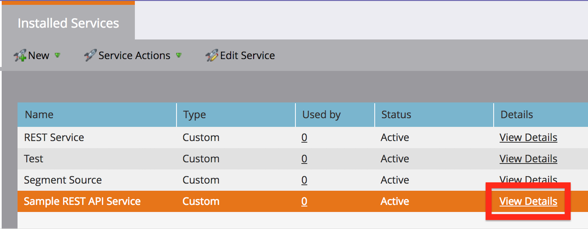


### Create a User ID and an Anonymous ID field in Marketo

1. Click Admin in the top right corner.
2. Click Field Management on the left side bar.
3. Click New Custom Field.
4. Select String as the type.
5. Name the field whatever you'd like.
6. Set the API name to `userId` for the user ID field and then `anonymousId` for the anonymous ID field. **Important:** The API names for the user ID and anonymous ID fields must be `userId` and `anonymousId` exactly. If anything in the API name is different, the destination will not work.
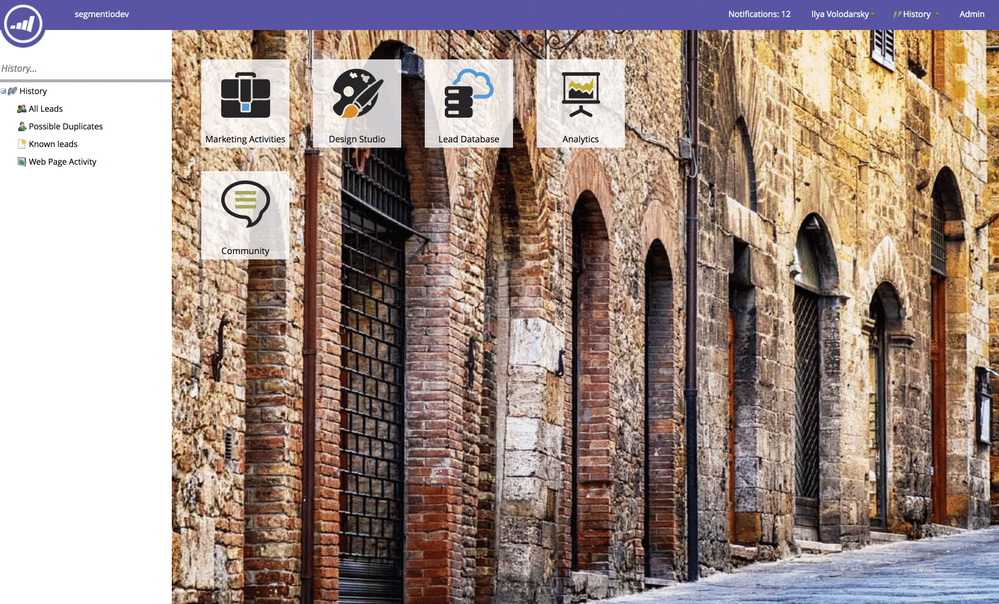

----------
## Identify

### Cloud-mode
When you call [`Identify`](/docs/connections/spec/identify/) in Cloud-mode, Segment uses [Marketo's REST API](http://developers.marketo.com/rest-api/lead-database/leads/#create_and_update) to create and update leads server-side.

### Device-mode
When you call [`Identify`](/docs/connections/spec/identify/) in Device-mode, Segment uses [Marketo's Background Form Submission](https://developers.marketo.com/blog/make-a-marketo-form-submission-in-the-background/) to create and update leads client-side.

There are additional steps you must take to send `.identify()` calls in Device-mode.

1. Create an empty form in Marketo. This form will always be hidden and can remain empty as long as the traits you need downstream are mapped in the **Marketo Custom Fields** Destination setting.
2. Input the associated **Marketo Form ID** and **Marketo Form URL** in your Marketo V2 Destination settings. This information can be found in Form Actions > Embed Code in the Marketo Design Studio:
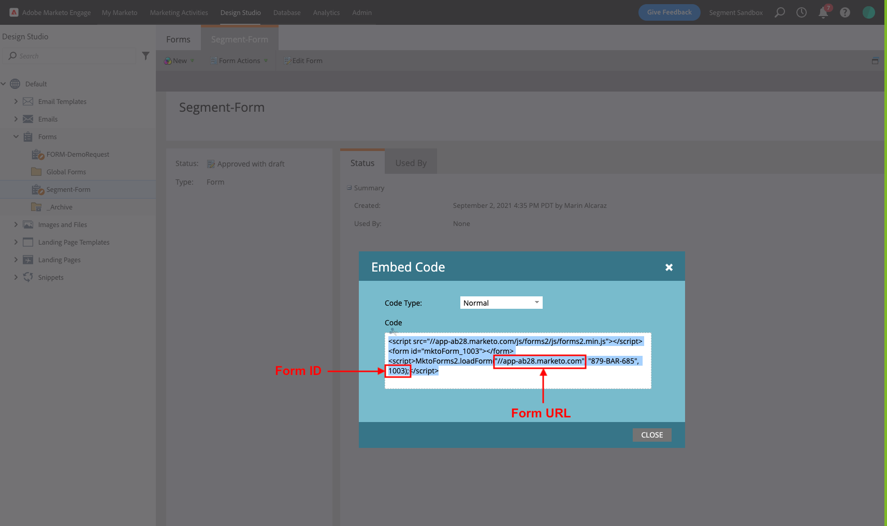

### Traits
Regardless of connection mode, we'll map the following spec'd Segment traits to Marketo's standard fields:

| **Segment Traits**    | **Marketo Standard Fields** |
| --------------------- | --------------------------- |
| `address.city`        | `City`                      |
| `address.country`     | `Country`                   |
| `address.zip`         | `Postal Code`               |
| `address.state`       | `State`                     |
| `birthday`            | `Date Of Birth`             |
| `company`             | `Company`                   |
| `email`               | `Email`                     |
| `firstName` or `name` | `First`                     |
| `gender`              | `Marketo Social Gender`     |
| `lastName` or `name`  | `Last`                      |
| `phone`               | `Phone`                     |

Here is a sample JavaScript Identify call with the all the standard traits:

```js
analytics.identify('1234', {
  firstName: 'Robyn Rihanna',
  lastName: 'Fenty',
  email: 'rihanna@example.com',
  gender: 'woman',
  phone: '555-555-5555',
  company: 'Segment.com',
  birthday: '1988-02-20T00:00:00.000Z',
  createdAt: '2007-05-31T00:00:00.000Z',
  address: {
    city: "Eugene",
    country: "USA",
    postalCode: "97405",
    state: "Oregon"
  }
});
```

If you'd like any other traits from your `.identify()` call to update a field in Marketo, you must create custom fields in Marketo and map them in the **Marketo Custom Fields** Destination setting.

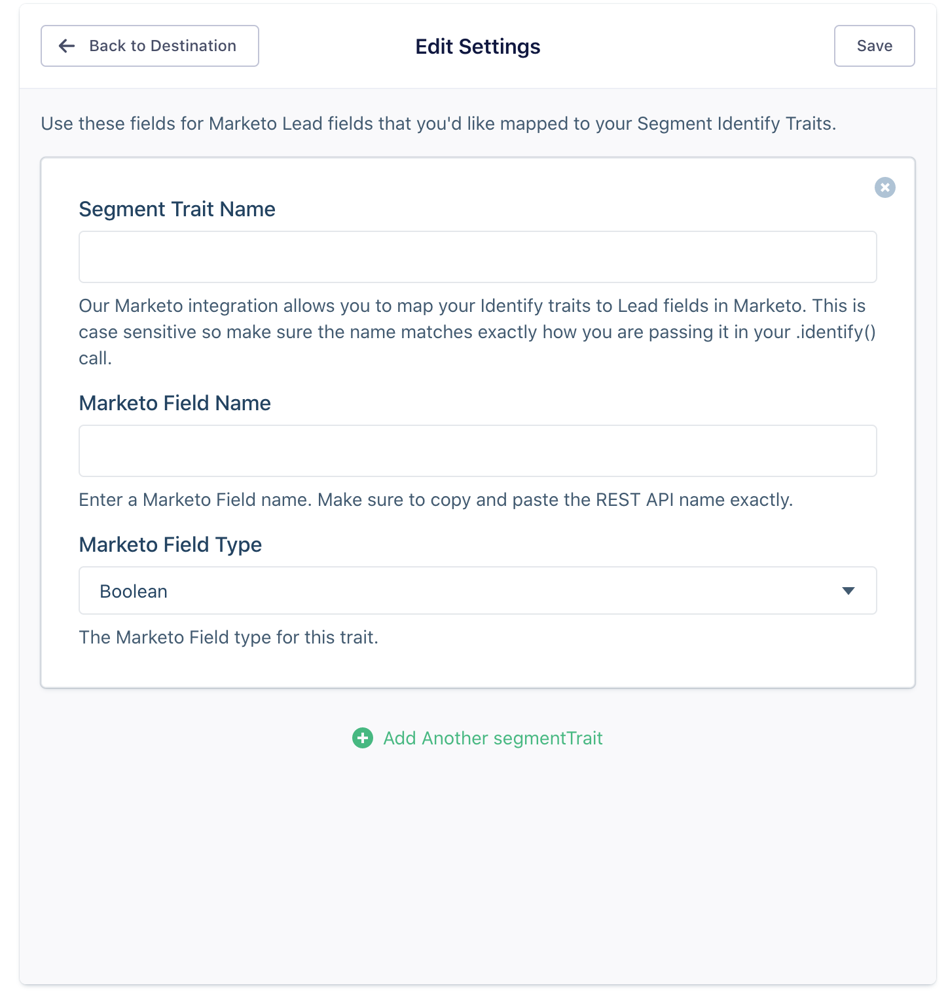

- **Segment Trait**. The name of the trait sent in your `.identify()` call.
- **Marketo Field Name**. The Marketo REST API name for the field. To get the REST API name for your fields in Marketo, click Field Management, then Export Field Names. A spreadsheet will download and the first column is the REST API name for your Marketo fields. **Make sure to copy and paste the REST API name exactly. This is case sensitive.**
- **Marketo Field Type**. When you are in Field Management, click on the field name in the bar on the right and you'll see the field type.
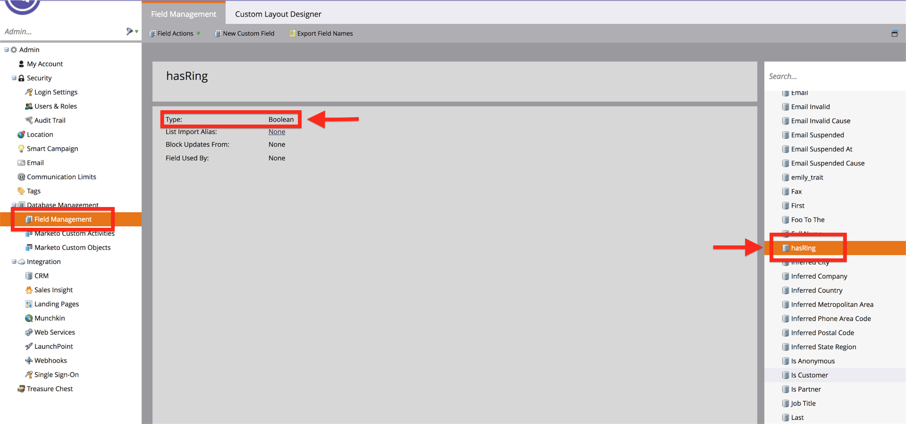

**Note:** Custom `address` traits must go in the top level `traits` object, not in the `address` object.

## Track

When you call [`Track`](/docs/connections/spec/track/), Segment maps the event to a pre-defined [Marketo Custom Activity](http://docs.marketo.com/display/public/DOCS/Understanding+Custom+Activities). There are two important things to note when sending `.track()` calls to Marketo:

1. You **must** map them to your Marketo Custom Activities in your Destination Settings. If you do not map a track call to a Custom Activity in your Destination Settings, we will not send the event to Marketo to help limit the amount of API calls made to Marketo.

2. You must either:

- Enable [Cloud-mode](/docs/connections/destinations/catalog/marketo-v2/#supported-sources-and-connection-modes)
- Enable [Device-mode](/docs/connections/destinations/catalog/marketo-v2/#supported-sources-and-connection-modes) and enable the [Send Track Events Server Side](/docs/connections/destinations/catalog/marketo-v2/#send-track-events-server-side) setting
- Send track events from one of our [server side libraries](/docs/connections/sources/#server)

Here is a sample Ruby  `.track()` event:

```js
Analytics.track(
  event: 'Segment Event',
  properties: {
    firstName: 'Alex'
  }
)
```

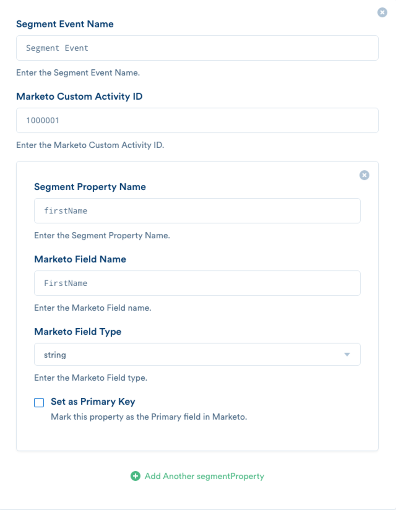

- **Segment Event Name**. Your Segment Event name.
- **Marketo Activity ID**. When you are in [Marketo Custom Activities](http://docs.marketo.com/display/public/DOCS/Understanding+Custom+Activities), click on the Marketo Activity in the right side bar that you'd like to map your Segment Track event to. Copy and paste the ID into your Destination Settings.
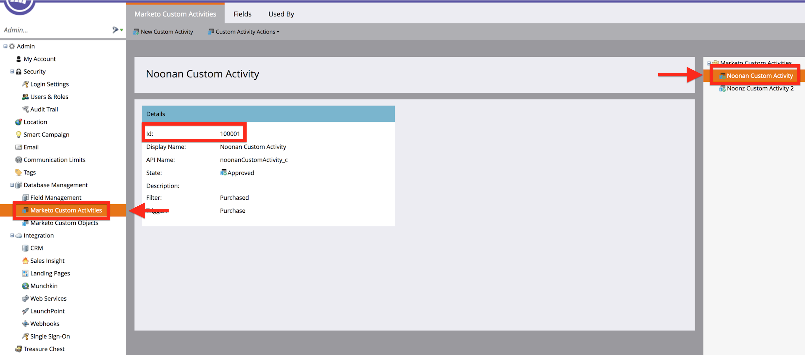

- **Segment Property Name**. The name of the property in your `.track()` call. This is case sensitive so make sure the name matches exactly how you are passing it in your `.track()` call.
- **Marketo Field Name**. The name of the Marketo Attribute for your Custom Activity. The Attribute names for a given Custom Activity can be found in the Fields tab of Marketo Custom Attributes. Click on the Custom Activity in the right side bar and a list of your Attributes for that Custom Activity will appear. **Make sure to copy and paste the API Name for your field exactly as it appears in Marketo. This is case sensitive.**
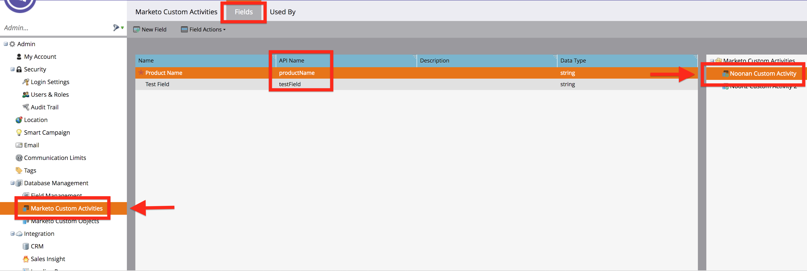

- **Marketo Field Type**. The type of the Marketo Attribute. The Attribute type can be found in the Fields tab of Marketo Custom Attributes. Click on the Custom Activity in the right side bar and a list of your Attributes for that Custom Activity will appear.


- **Primary Field**. When creating a Custom Activity in Marketo, you have to set a Primary Field. If you are unsure which field was set as the primary field, when you are looking at the list of fields for your Custom Activity in Marketo, there will be a red star next to your Primary Field.
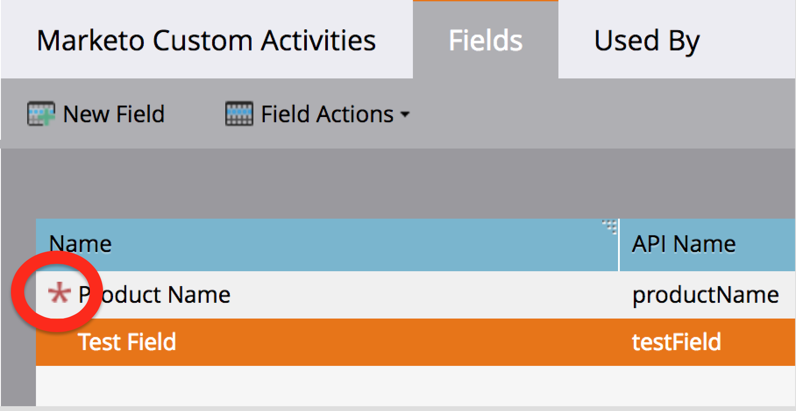

## Page

When you call [`Page`](/docs/connections/spec/page/), Segment uses [Marketo's Munchkin.js `visitWebPage` method](http://developers.marketo.com/javascript-api/lead-tracking/api-reference/#munchkin_visitwebpage). The URL is built from your `.page()` event and properties object into the form Marketo expects, so no need to worry about doing that yourself.

Marketo's `visitWebPage` method requires a URL and a user agent. Any calls that are missing either of these fields will not be sent to Marketo. User agent is automatically collected Client-side but if you are sending `.page()` calls from the server, make sure to set the user agent.

Here is a sample Node `.page()`  event:

```js
    analytics.page({
      userId: '019mr8mf4r',
      category: 'Docs',
      name: 'Node.js Library',
      properties: {
        url: '/docs/connections/sources/catalog/libraries/server/node',
        path: '/docs/connections/sources/catalog/libraries/server/node/',
        title: 'Node.js Library - Segment',
        referrer: 'https://github.com/segmentio/analytics-node'
      },
      context: {
        userAgent: "Mozilla/5.0 (Macintosh; Intel Mac OS X 10_9_5) AppleWebKit/537.36 (KHTML, like Gecko) Chrome/40.0.2214.115 Safari/537.36"
      }
    });
```


## Tracking Anonymous Activity in Marketo

If you would only like to track known users in Marketo, set your Track Anonymous Activity setting to false. There are a couple things to note when this setting is false:

1. Any call without a User ID will be rejected.
2. No anonymous activity will be sent to Marketo. Even after the user becomes known, none of their previous anonymous activity will be sent to Marketo.

If you'd like to track anonymous activity but don't want to have to parse through or view unknown leads, Marketo lets you create Smart Lists that will filter your leads (i.e. if you'd only like to view leads that have a user ID or an email). To do this, when you are in your Lead Database, click All Leads, then New. From the drop down, click New Smart List. Select the folder you'd like the Smart List to live in. After you've created the Smart List, select what field you'd like to filter by on the right side bar, drag it to the filters and then select what you'd specifically like to filter by for that field.


## Marketo API Limits

We do our best to limit the amount of API calls that we are making to Marketo but if you are hitting your 50k/day limit, we'd recommend only sending events to Marketo that you need. To prevent an event from being sent to Marketo, you can select destinations by doing the following:

```js
    analytics.identify({
      userId: '97234974',
      traits: {
        firstName: 'Alex'
      },
      integrations: {
        'Marketo': false,
        'Google Analytics': true
      }
    })
```

## Hybrid Device/Cloud-mode
Another option is to use Marketo in [Device-mode](/docs/connections/destinations/catalog/marketo-v2/#supported-sources-and-connection-modes) (assuming you are tracking events from a Website). Marketo does not limit API calls that originate from their Web SDK but it also only supports capturing Identify and Page events. If you would also like to capture Track events, you can choose to have these be routed through our server-side integration.

To enable this "Hybrid" mode, select the [Send Track Events Server Side](/docs/connections/destinations/catalog/marketo-v2/#send-track-events-server-side) setting and follow the instructions for mapping [Track](/docs/connections/destinations/catalog/marketo-v2/#track) events defined above.

## Preventing Duplicate Leads

Marketo allows you to upsert leads based on any field. We use email and userId as well as anonymousId if you are tracking anonymous activity. We will first use email since that is the field Marketo recommends is unique for your leads. However, many  `.track()` and `.page()` calls don't include an email address so then we will use the `userId` or `anonymousId` passed in your `.track()` and `.page()` calls to associate these events to leads in Marketo.

You can do one of the following to prevent duplicate leads:


1. **Recommended:** Upload a CSV adding your userId to all your leads in Marketo **before** enabling the destination. After you [create the userId field](/docs/connections/destinations/catalog/marketo-v2/#2-you-must-create-a-user-id-and-an-anonymous-id-field-in-marketo) in Marketo, you can upload a list of all your users with an email column and a userId column. Your CSV should look like this:

| **email**         | **userId** |
| ----------------- | ---------- |
| alex@email.com    | ABC1234    |
| natasha@email.com | XYZ9876    |

To upload a list to Marketo, when you are in Lead Database, click All Leads. Then click "New", then "Import List" from the drop down. Select your CSV, then click "Next". Make sure "Email Address" and "userId" are the Marketo Fields selected then click "Next". Name your list or select a pre-existing list. Select "None" for Acquisition Program. Then Click "Import".

2. Manually merge leads in Marketo. Follow [these instructions to merge](http://docs.marketo.com/display/public/DOCS/Find+and+Merge+Duplicate+People) any duplicate leads found in Marketo after enabling the destination.
3. Make sure to call identify first. This is already a recommended best practice as [part of our spec](/docs/connections/spec/identify/).
4. Pass an email in your `.track()` and `.page()` calls.

## Migrating from Marketo to Marketo V2

There are a few necessary steps that have to be taken to migrate from Segment's legacy Marketo v1 destinations, to Marketo V2.

**Important: Make sure you disable Marketo once you are done getting set up with Marketo V2. If you leave both enabled, there will likely be duplicate data in your Marketo account.**


1. Your Marketo credentials in your Segment Destination settings need to be updated. Our Marketo Destination used Marketo's SOAP API and Marketo V2 uses Marketo's REST API which requires different credentials. Check out the [Getting Started](/docs/connections/destinations/catalog/marketo-v2/#getting-started) guide for what credentials you'll need.
2. Two custom fields must be created in Marketo: userId and anonymousId. Check out [Getting Started](/docs/connections/destinations/catalog/marketo-v2/#2-you-must-create-a-user-id-and-an-anonymous-id-field-in-marketo) for exact details on how to create these custom fields in Marketo.
3. `Track` calls must be mapped in your Destination settings. Our Marketo Destination sent `track` calls as a Munchkin Visit WebPage event in Marketo. In Marketo V2, we'll send your track calls to your Marketo Custom Activities. Detailed instructions [here](/docs/connections/destinations/catalog/marketo-v2/#track).
4. If there are any custom Lead fields that you'd like sent to Marketo in your `Identify` calls, you must create custom fields in Marketo and add them in your Destination settings. In addition, if you are connecting Marketo V2 in Device-mode, an empty form must be created in Marketo to create and update leads. Detailed instructions [here](/docs/connections/destinations/catalog/marketo-v2/#identify).
5. Update anything in Marketo that rely on the way V1 sends `.track()` events to be triggered by your custom activities. For example, our V1 Marketo destination sent track events as a "Visit Web Page" event with `/event/<your_event_name>`. So if you a workflow that is triggered by a "Visit Web Page" event where the web page contains `/event/<your_event_name>`, you'll have to swap out the "Visit Web Page" event trigger you have with your Custom Attribute Trigger. In the right side bar, click the "Custom" folder under "Triggers" and select the trigger that you set for your custom activity:
   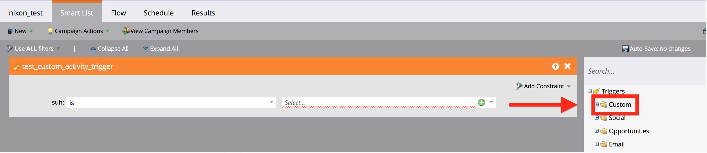


   To figure out what the trigger name for that Custom Activity is, navigate to the admin section of Marketo > Marketo Custom Activities > Click on your activity from the side bar and you'll see the trigger name:

   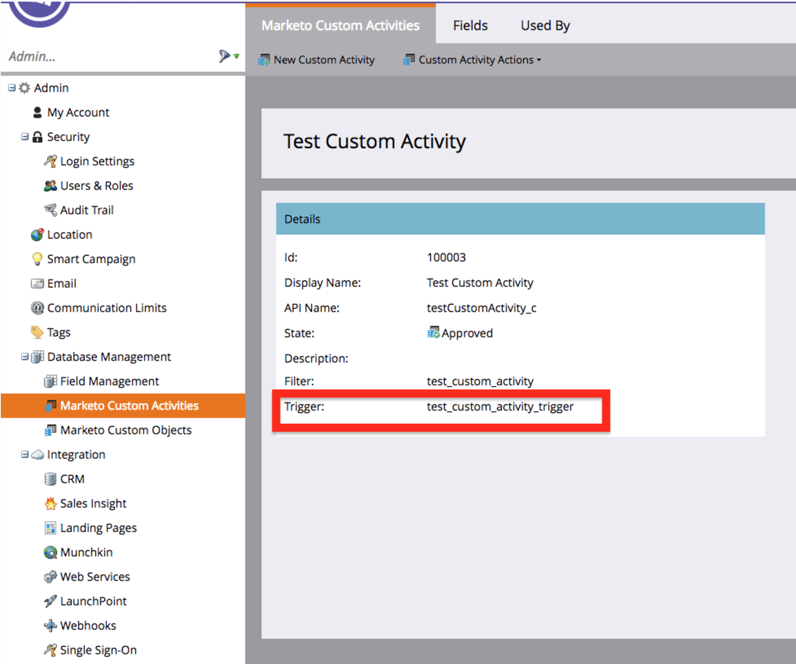

6. When enabling Marketo V2, because of the way Marketo's API works, there is potential to create duplicate leads, especially when the first enabling the destination. For ways to prevent this, check out the Preventing Duplicate Leads.
