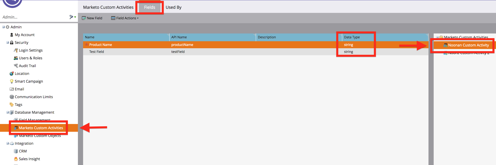

## Getting started

To start sending data to Marketo, there are two things you must do. **Both of these steps require that you to log in with the Admin Marketo Account.**

### 1. Enter your Marketo Credentials into your Destination settings
You need to enter your Munchkin Account ID, Client Secret, and Client ID.

To get your Munchkin Account ID, [login to your Marketo account](https://login.marketo.com/){:target="_blank"}, click **Admin**, then **Munchkin** in the side bar.


To get your Client Secret and Client ID, you must create a role that has full API access, an API only user, and then create a Service in Marketo.

To create a role with full API access:

1. Click **Admin**.
2. Click **Users & Roles** in the side bar.
3. Click on the **Roles** tab.
4. Click **New Role**. Name your role and check the API Access box to assign the user full API access. Click **Create**.


Once you've created an API role, you have to assign that role to an API only user.

1. Click the **Users** tab.
2. Click **Invite New User** and fill out the necessary information in Step 1.
3. Assign the new role you created to this user in Step 2 and check the API Only box. Click **Next**, then **Send**.


Next, create a Service and get Client Secret and Client ID from that Service.

1. Click **LaunchPoint** in the side bar.
2. Click **New > New Service**.
3. Select **Custom for the Service**.
4. Select the new API-Only user you invited. This user must be an API_Only user **and** be assigned a role that has full API access.


1. Click **View Details** on the new service that you've created. Your Client Secret and Client ID are displayed in a small window. Copy and paste them into your destination's settings.


### 2. Create a User ID and an Anonymous ID field in Marketo

1. Click **Admin**.
2. Click **Field Management** in the side bar.
3. Click **New Custom Field**.
4. Select **String** as the type.
5. Name the field whatever you'd like.
6. Set the API name to `userId` for the user ID field and then `anonymousId` for the anonymous ID field. **Note**: The API names for the user ID and anonymous ID fields must be `userId` and `anonymousId` exactly. If anything in the API name is different, the destination won't work.


## Identify

### Cloud-mode
When you call [Identify](/docs/connections/spec/identify/) in Cloud-mode, Segment uses [Marketo's REST API](http://developers.marketo.com/rest-api/lead-database/leads/#create_and_update){:target="_blank"} to create and update leads server-side.

### Device-mode
When you call [Identify](/docs/connections/spec/identify/) in Device-mode, Segment uses [Marketo's Background Form Submission](https://developers.marketo.com/blog/make-a-marketo-form-submission-in-the-background/){:target="_blank"} to create and update leads client-side.

There are additional steps you must take to send Identify calls in Device-mode.

1. Create an empty form in Marketo. This form will always be hidden and can remain empty as long as the traits you need downstream are mapped in the **Marketo Custom Fields** Destination setting.
2. Input the associated **Marketo Form ID** and **Marketo Form URL** in your Marketo v2 Destination settings. This information can be found in **Form Actions > Embed Code** in the Marketo Design Studio:


> info ""
> **Marketo Form ID** and **Marketo Form URL** are **required** fields for the Marketo SDK to initialize on your site. If these fields are left blank, the SDK won't initialize and data won't be sent downstream. 

### Traits
Regardless of connection mode, following spec'd Segment traits are mapped to Marketo's standard fields:

| **Segment Traits**    | **Marketo Standard Fields** |
| --------------------- | --------------------------- |
| `address.city`        | `City`                      |
| `address.country`     | `Country`                   |
| `address.zip`         | `Postal Code`               |
| `address.state`       | `State`                     |
| `birthday`            | `Date Of Birth`             |
| `company`             | `Company`                   |
| `email`               | `Email`                     |
| `firstName` or `name` | `First`                     |
| `gender`              | `Marketo Social Gender`     |
| `lastName` or `name`  | `Last`                      |
| `phone`               | `Phone`                     |

Here is a sample JavaScript Identify call with the all the standard traits:

```js
analytics.identify('1234', {
  firstName: 'Robyn Rihanna',
  lastName: 'Fenty',
  email: 'rihanna@example.com',
  gender: 'woman',
  phone: '555-555-5555',
  company: 'Segment.com',
  birthday: '1988-02-20T00:00:00.000Z',
  createdAt: '2007-05-31T00:00:00.000Z',
  address: {
    city: "Eugene",
    country: "USA",
    postalCode: "97405",
    state: "Oregon"
  }
});
```

If you'd like any other traits from your Identify call to update a field in Marketo, you must create custom fields in Marketo and map them in the **Marketo Custom Fields** Destination setting.


- **Segment trait**: The name of the trait sent in your Identify call.
- **Marketo field name**: The Marketo REST API name for the field. To get the REST API name for your fields in Marketo, click **Field Management**, then **Export Field Names**. A spreadsheet downloads and the first column is the REST API name for your Marketo fields. **Make sure to copy and paste the REST API name exactly. This is case sensitive.**
- **Marketo field type**: When you are in Field Management, click on the field name to see the field type.


**Note**: Custom `address` traits must go in the top level `traits` object, not in the `address` object.

## Track

When you call [Track](/docs/connections/spec/track/), Segment maps the event to a pre-defined [Marketo Custom Activity](http://docs.marketo.com/display/public/DOCS/Understanding+Custom+Activities){:target="_blank"}. There are two important things to note when sending Track calls to Marketo:

1. You **must** map them to your Marketo Custom Activities in your Destination Settings. If you don't map a track call to a Custom Activity in your destination settings, the event won't be sent to Marketo to help limit the amount of API calls made to Marketo.

2. You must either:

- Enable [Cloud-mode](/docs/connections/destinations/catalog/marketo-v2/#supported-sources-and-connection-modes)
- Enable [Device-mode](/docs/connections/destinations/catalog/marketo-v2/#supported-sources-and-connection-modes) and enable the [Send Track Events Server Side](/docs/connections/destinations/catalog/marketo-v2/#send-track-events-server-side) setting
- Send track events from one of our [server side libraries](/docs/connections/sources/#server)

Here is a sample Ruby Track event:

```js
Analytics.track(
  event: 'Segment Event',
  properties: {
    firstName: 'Alex'
  }
)
```


- **Segment event name**: Your Segment Event name.
- **Marketo activity ID**: When you are in [Marketo Custom Activities](http://docs.marketo.com/display/public/DOCS/Understanding+Custom+Activities){:target="_blank"}, click on the Marketo Activity in the right side bar that you'd like to map your Segment Track event to. Copy and paste the ID into your Destination Settings.


- **Segment property name**: The name of the property in your Track call. This is case sensitive so make sure the name matches exactly how you are passing it in your Track call.
- **Marketo field name**: The name of the Marketo attribute for your Custom Activity. The attribute names for a given Custom Activity can be found in the **Fields** tab of **Marketo Custom Attributes**. Click on **Custom Activity** to see a list of your attributes for that Custom Activity. **Make sure to copy and paste the API Name for your field exactly as it appears in Marketo. This is case sensitive.**


- **Marketo field type**: The type of the Marketo attribute. The attribute type can be found in the **Fields** tab of **Marketo Custom Attributes**. Click on **Custom Activity** to see a list of your attributes for that Custom Activity.


- **Primary field**. When creating a Custom Activity in Marketo, you have to set a Primary Field. If you are unsure which field was set as the primary field, when you are looking at the list of fields for your Custom Activity in Marketo, primary fields are denoted by a red star.


> info ""
> You can't map fields nested in objects as Marketo Custom Activity property names. You must flatten any objects you may need to access data from either before you send it to Segment, or while using an [Insert function](/docs/connections/functions/insert-functions/).

## Page

When you call [Page](/docs/connections/spec/page/), Segment uses [Marketo's Munchkin.js `visitWebPage` method](http://developers.marketo.com/javascript-api/lead-tracking/api-reference/#munchkin_visitwebpage){:target="_blank"}. The URL is built from your Page event and properties object into the form Marketo expects, so no need to worry about doing that yourself.

Marketo's `visitWebPage` method requires a URL and a user agent. Any calls that are missing either of these fields aren't sent to Marketo. User agent is automatically collected client-side but if you are sending Page calls from the server, make sure to set the user agent.

Here is a sample Node Page event:

```js
    analytics.page({
      userId: '019mr8mf4r',
      category: 'Docs',
      name: 'Node.js Library',
      properties: {
        url: '/docs/connections/sources/catalog/libraries/server/node',
        path: '/docs/connections/sources/catalog/libraries/server/node/',
        title: 'Node.js Library - Segment',
        referrer: 'https://github.com/segmentio/analytics-node'
      },
      context: {
        userAgent: "Mozilla/5.0 (Macintosh; Intel Mac OS X 10_9_5) AppleWebKit/537.36 (KHTML, like Gecko) Chrome/40.0.2214.115 Safari/537.36"
      }
    });
```


## Tracking anonymous activity in Marketo

If you'd only like to track known users in Marketo, set your Track Anonymous Activity setting to `false`. There are some things to note when this setting is false:

1. Calls without a User ID are rejected.
2. No anonymous activity is sent to Marketo. Even after the user becomes known, none of their previous anonymous activity will be sent to Marketo.

If you'd like to track anonymous activity but don't want to have to parse through or view unknown leads, Marketo lets you create Smart Lists that filter your leads. For example, you can filter to only view leads that have a user ID or an email. To do this, when you are in your Lead Database:

1. Click **All Leads**, then **New**.
2. From the drop down, click **New Smart List**.
3. Select the folder you'd like the Smart List to live in.
4. After you've created the Smart List, select what field you'd like to filter by, drag it to the filters and then select what you'd specifically like to filter by for that field.


## Marketo API limits

Segment tries to limit the amount of API calls being made to Marketo but if you are hitting the 50 k/day limit, Segment recommends only sending events to Marketo that you need. To prevent an event from being sent to Marketo, you can select destinations by doing the following:

```js
    analytics.identify({
      userId: '97234974',
      traits: {
        firstName: 'Alex'
      },
      integrations: {
        'Marketo v2': false,
        'Google Analytics': true
      }
    })
```

## Hybrid device or cloud-mode
Another option is to use Marketo in [device-mode](/docs/connections/destinations/catalog/marketo-v2/#supported-sources-and-connection-modes) (assuming you are tracking events from a website). Marketo does not limit API calls that originate from its web SDK, but it only supports capturing Identify and Page events. If you'd also like to capture Track events, you can choose to have these be routed through Segment's server-side integration.

To enable this "Hybrid" mode, select the **[Send Track Events Server Side](/docs/connections/destinations/catalog/marketo-v2/#send-track-events-server-side)** setting and follow the instructions for mapping [Track](/docs/connections/destinations/catalog/marketo-v2/#track) events.

## Preventing Duplicate Leads

Marketo allows you to upsert leads based on any field. Segment uses `email` and `userId`, as well as `anonymousId` if you are tracking anonymous activity. `email` is used first since that is the field Marketo recommends is unique for your leads. However, many  Track and Page calls don't include an email address. In that case, Segment uses the `userId` or `anonymousId` passed in your Track and Page calls to associate these events to leads in Marketo.

You can do one of the following to prevent duplicate leads:

**Recommended: Upload a CSV adding your userId to all your leads in Marketo _before_ enabling the destination**. 

After you [create the `userId` field](/docs/connections/destinations/catalog/marketo-v2/#2-you-must-create-a-user-id-and-an-anonymous-id-field-in-marketo) in Marketo, you can upload a list of all your users with an email column and a userId column. Your CSV should look like this:

| **email**         | **userId** |
| ----------------- | ---------- |
| alex@email.com    | ABC1234    |
| natasha@email.com | XYZ9876    |

To upload a list to Marketo, when you are in Lead Database:

1. Click **All Leads**.
2. Then click **New**, then **Import List**.
3. Select your CSV, then click **Next**. Make sure `Email Address` and `userId` are the Marketo Fields selected then click **Next"**.
4. Name your list or select a pre-existing list. Select **None** for Acquisition Program. Then click **Import**.

**Manually merge leads in Marketo**. 

Follow [Marketo's instructions to merge](http://docs.marketo.com/display/public/DOCS/Find+and+Merge+Duplicate+People){:target="_blank"} any duplicate leads found in Marketo after enabling the destination.

1. Make sure to call Identify first. This is already a recommended best practice as [part of the Segment spec](/docs/connections/spec/identify/).
2. Pass an email in your Track and Page calls.

## Migrating from Marketo to Marketo v2

There are a few necessary steps that have to be taken to migrate from Segment's legacy Marketo v1 destinations, to Marketo v2.

> warning ""
> Make sure you disable Marketo once you set up with Marketo v2. If you leave both enabled, there might be duplicate data in your Marketo account.

1. Your Marketo credentials in your Segment Destination settings need to be updated. The Marketo destination used Marketo's SOAP API and Marketo v2 uses Marketo's REST API which requires different credentials. Check out the [getting started in Marketo v2](/docs/connections/destinations/catalog/marketo-v2/#getting-started) guide for the credentials you need.
2. Two custom fields must be created in Marketo: `userId` and `anonymousId`. Check out [getting started in Marketo v2](/docs/connections/destinations/catalog/marketo-v2/#2-you-must-create-a-user-id-and-an-anonymous-id-field-in-marketo) for exact details on how to create these custom fields in Marketo.
3. Track calls must be mapped in your destination settings. The Marketo Destination sent Track calls as a Munchkin Visit WebPage event in Marketo. In Marketo v2, your track calls are sent to your Marketo Custom Activities. See the instructions [in the Track section](/docs/connections/destinations/catalog/marketo-v2/#track) for more detail.
4. If there are any custom lead fields that you'd like sent to Marketo in your Identify calls, you must create custom fields in Marketo and add them in your destination settings. In addition, if you are connecting Marketo v2 in device-mode, an empty form must be created in Marketo to create and update leads. See the instructions [in the Identify section](/docs/connections/destinations/catalog/marketo-v2/#identify) for more detail.
5. Update anything in Marketo that rely on the way v1 sends Track events to be triggered by your custom activities. For example, the v1 Marketo destination sent track events as a "Visit Web Page" event with `/event/<your_event_name>`. So if you have a workflow that is triggered by a "Visit Web Page" event where the web page contains `/event/<your_event_name>`, you need to swap out the "Visit Web Page" event trigger with your Custom Attribute Trigger. Click the **Custom** folder under **Triggers** and select the trigger that you set for your custom activity:
   
  > To figure out what the trigger name for that Custom Activity is, navigate to the **Admin** section of **Marketo > Marketo Custom Activities**, then click on your activity to see the trigger name:
   
6. When enabling Marketo v2, because of the way Marketo's API works, there is potential to create duplicate leads, especially when the first enabling the destination. For ways to prevent this, check out the [Preventing Duplicate Leads](https://nation.marketo.com/t5/knowledgebase/working-with-duplicate-leads/ta-p/248189){:target="_blank"}.

## Send a single source's data to multiple Marketo v2 workspaces

Segment doesn't support multiple instances of Marketo v2 for any source in Segment (for both Device-Mode and Cloud-Mode). If you need a single source's data sent to multiple Marketo v2 workspaces, follow the instructions on configuring a [Repeater destination](/docs/connections/destinations/catalog/repeater/) to route your source's data through the Repeater destination into a new source and new Marketo v2 destination instance.

To create a Repeater destination, new source, and second Marketo v2 destination:

1. Create and connect a new [Repeater destination](https://app.segment.com/goto-my-workspace/destinations/catalog/repeater) to your source and select the intended source.
2. Click **Add destination**, name the destination, and select **Fill in settings manually**.
3. Create a new source, then navigate to **Settings > API Keys** and copy the **Write Key** value.
   > From the Repeater destination's **Settings** page, find **Write Keys** in the **Connection Settings**. This is where your second source's write key from step 4 will go.
5. Navigate back to your Repeater destination and paste in the source's `writeKey` into the write key setting.
6. Add a Marketo v2 destination to your new source with the desired configuration settings.
7. Enable the Repeater destination, new source, new Marketo v2 destination.
8. Data is now transmitted from your originating source to the Repeater Destination (Event Delivery), then to the new source (Debugger), and finally to the Marketo v2 destination (Event Delivery).
