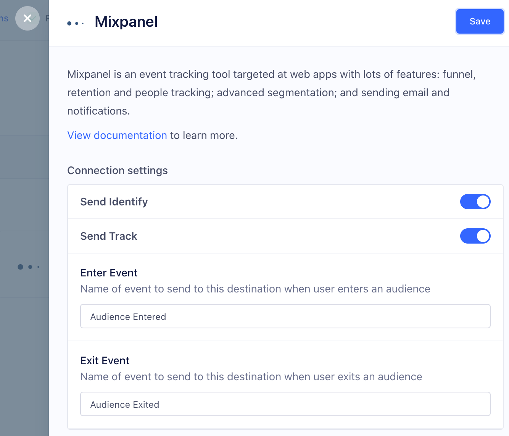
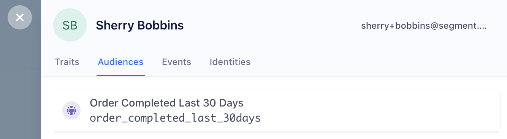

[Mixpanel](https://mixpanel.com/?utm_source=segmentio&utm_medium=docs&utm_campaign=partners) is an event tracking and segmentation platform for your web and mobile apps. By analyzing the actions your users perform, you can gain a better understanding to drive retention, engagement, and conversion. The client-side Mixpanel Destination code is open-source.

You can browse the code on GitHub for [Analytics.js in Device-mode](https://github.com/segmentio/analytics.js-integrations/tree/master/integrations/mixpanel), [iOS](https://github.com/segment-integrations/analytics-ios-integration-mixpanel) and [Android](https://github.com/segment-integrations/analytics-android-integration-mixpanel).

If you notice any gaps, outdated information or simply want to leave some feedback to help us improve our documentation, [let us know](mailto:docs-feedback@segment.com)!

## Getting Started



1. From the Segment app Destinations page click on **Add Destination**.
2. Search for Mixpanel in the Destinations Catalog and confirm the Source to connect to.
3. Copy your Mixpanel "API Secret" and "Token", and paste them into the Connection Settings in Segment.
4. Enable the destination to start sending your data to Mixpanel.

### Adding device-mode SDKs to React Native



## Page
If you're not familiar with the Segment Specs, take a look to understand what the [Page method](/docs/connections/spec/page/) does. An example call would look like:

```javascript
analytics.page()
```

By default, the Page call is transformed to Mixpanel events. This sends all `page` and `screen` calls with a single name, for example `Loaded a Page` or `Loaded a Screen` respectively, with the calls' properties in the body. This gives the best experience of Page/Screen analytics with Mixpanel's reporting.

You can disable this default by changing the "Track All Pages to Mixpanel with a Consolidated Event Name" in the Mixpanel destination settings.

If you want to track the `page` or `screen` calls to Mixpanel with the name or category in the event name, we offer three more options for sending page/screen calls.

> note ""
> **Note:** Beginning with "Consolidate Page" calls, the following options are each *mutually exclusive*. [See the code for details](https://github.com/segmentio/analytics.js-integrations/blob/master/integrations/mixpanel/lib/index.js#L96-L139)

1. Track All Pages to Mixpanel with a Consolidated Event Name
2. Track all Pages to Mixpanel
3. Track Categorized Pages to Mixpanel
4. Track Named Pages to Mixpanel

If you select "Track all Pages to Mixpanel", all `page` calls regardless of how you have customized it will send a `Loaded A Page`. Even if you have the other options enabled, we will only send this call to prevent double counting your pageviews.

If you select "Track Categorized Pages to Mixpanel", we will send a `Viewed [category] Page` event.

If you select "Track Named Pages to Mixpanel", we will send a `Viewed [name] Page` event.

**Note**: If both Option 2 and 3 are enabled, we will give precedence to `category`. If you pass both `category` and `name`, (e.g. `analytics.page('category', 'name');`), we will send a `Viewed category name Page` to Mixpanel.

In short, Segment will only send 1 event to Mixpanel per `page` call.

## Identify
If you're not familiar with the Segment Specs, take a look to understand what the [Identify method](/docs/connections/spec/identify/) does. An example call would look like:

```js
analytics.identify('userId123', {
  firstName: 'James',
  lastName: 'Gibbon'
})
```

The first thing you'll want to do is to identify your users so Mixpanel knows who they are. You'll use the Identify method to accomplish this which takes the unique `userId` of a user and any `traits` you know about them.

### People

Segment doesn't send data to Mixpanel People by default, since this usually requires upgrading your Mixpanel account. To enable Mixpanel People, change the "Use Mixpanel People" setting in your Segment Settings UI.

To add people properties in Mixpanel before you know the user's unique database `userId`, you can identify `traits` without the `userId`.

**Note:** this only works in Analytics.js and our mobile SDKs.

Your `identify` call would look like this in Analytics.js if you only want to set people properties without a `userId`:

```js
analytics.identify({
  email: 'hello@example.com',
  name: 'Ian Taylor'
})
```

## Group

Group calls are sent to Mixpanel if, **and only if**,

1. The Group Identifier Traits setting has one or more traits saved in the destination settings for Mixpanel.
   
2. You have created a group key of the same name in your Mixpanel [project settings](https://help.mixpanel.com/hc/en-us/articles/360025333632-Group-Analytics#implementation).
3. A Group trait with the same name as one of the configured Group Identifier Traits is sent with the group call.

```js
analytics.group("0e8c78ea9d97a7b8185e8632", {
  name: "Initech",
  company_id: "0e8c78ea9d97a7b8185e8632", // Group identifier trait.
  industry: "Technology",
  employees: 329,
  plan: "enterprise",
  "total billed": 830
});
```

Mixpanel supports multiple definitions of groups. For more information see [Mixpanel’s Group Analytics documentation](https://help.mixpanel.com/hc/en-us/articles/360025333632-Group-Analytics).

If the group call **does not** have a group trait that matches the Group Identifier Traits setting, then the event will be ignored.

### Group using Device-mode

When you call the Identify method from the client in either a browser using Analytics.js or one of our mobile SDKs a bunch of things happen:

We start by recognizing and translating our [special traits](/docs/connections/spec/identify/#traits) so that they fit the expectations of Mixpanel's API. The table below shows the mappings. You'll pass the key on the left into Segment and we will transform it to the key on the right before sending to Mixpanel.

<table>
  <tr>
    <td>`created`</td>
    <td>`$created`</td>
  </tr>
  <tr>
    <td>`email`</td>
    <td>`$email`</td>
  </tr>
  <tr>
    <td>`firstName`</td>
    <td>`$first_name`</td>
  </tr>
  <tr>
    <td>`lastName`</td>
    <td>`$last_name`</td>
  </tr>
  <tr>
    <td>`name`</td>
    <td>`$name`</td>
  </tr>
  <tr>
    <td>`username`</td>
    <td>`$username`</td>
  </tr>
  <tr>
    <td>`phone`</td>
    <td>`$phone`</td>
  </tr>
</table>

### Group using Cloud-mode

When you call the Identify method from any of our server libraries, we create or update the user in Mixpanel People with the traits you provide. Calling `identify` doesn't create any users in the standard Mixpanel reporting interface since that only supports `track` events.

You won't see server-side `traits` appear as super-properties on any events you track. This is because Mixpanel [has no REST API](https://github.com/mixpanel/mixpanel-node/issues/48) for setting [super properties](https://mixpanel.com/docs/managing-users/managing-user_advanced/specific-properties) for a `distinct_id`, so [`identify`](/docs/connections/spec/identify/) calls only affect Mixpanel People.

For Mixpanel People, it's important to `identify` a user before you call `track`. A `track` without an `identify` won't create a user in Mixpanel People.

If you use Cloud-mode, you must explicitly include the grouping value as an event property for any event you want to analyze using Mixpanel's Group Analytics.

### Register Super Properties

By default, each trait (i.e. properties in an `identify` call) is registered as a super property. This does not require passing a `userId` in the `identify` call. You can pass a `traits` object by itself and it will still register the traits as super properties.

We also allow you to disable the default behavior and register super properties explicitly by unchecking "Set All Traits as Super Properties or People Properties By Default" and explicitly specifying in the traits or properties you want us to register as super properties in Segment's Mixpanel destination panel. [Check out the documentation here](#explicitly-set-people-properties-and-super-properties)

#### Set People Properties

If you've enabled Mixpanel People in your Segment settings, we also call Mixpanel's `people.set` with the same `traits` object. There's no need for an additional API call to populate Mixpanel People.

We also allow you to disable the default behavior and set people properties explicitly by unchecking `Set All Traits as Super Properties or People Properties By Default` and explicitly specifying in the traits or properties you want us to set as people properties in the Mixpanel destination panel in Segment. Segment automatically includes any trait on an identify that matches one of Mixpanel's special properties, which you can see in the table above. [Check out the documentation here](#explicitly-set-people-properties-and-super-properties)

If you call `identify` without a `userId`, it may not set the People Properties inside Mixpanel, but it will cache those traits for later use with Segment's `analytics.js`. It is best practice to always call `identify` with a `userId`.

### Arrays

For array type traits passed to `identify` calls, we will use Mixpanel's `people.union` to union (append ignoring duplicates) them to their existing values. If the trait doesn't exist a new array will be created for you. To clear the contents of the an array trait you can pass an empty array `[]`.

## Track

If you're not familiar with the Segment Specs, take a look to understand what the [Track method](/docs/connections/spec/track/) does. An example call would look like:
```javascript
analytics.track('Button Clicked')
```
Because Mixpanel is an event tracking analytics tool, you'll want to [`track`](/docs/connections/spec/track/) your user's actions. The more useful events you [`track`](/docs/connections/spec/track/), the better Mixpanel becomes.

You should use the [`track`](/docs/connections/spec/track/) method to accomplish this. The Segment [`track`](/docs/connections/spec/track/) method maps events and event properties directly to Mixpanel events and event properties.

### Track Charge

If Mixpanel People is enabled in your Segment settings and you include an event property called `revenue`, we'll track a charge to the current user.

### Reserved Properties

There are two strings to avoid when naming event properties that will be sent to Mixpanel: `length` and `bucket`. `length` is interpreted as the JavaScript `.length` method, which causes the `mixpanel.track` call to fail silently. `bucket` is a reserved property that was used in the early days of Mixpanel. If you include a property called `bucket` in your events, it will not show up in the UI. However, it will not cause the `mixpanel.track` call to fail.

## Alias
If you're not familiar with the Segment Specs, take a look to understand what the [Alias method](/docs/connections/spec/alias/) does. An example call would look like:

```javascript
analytics.alias('newUserId')
```

**Important:** Mixpanel used to require that you call `alias` in all libraries to connect anonymous visitors to identified users. However, with the release of Mixpanel's new [Identity Merge feature](https://help.mixpanel.com/hc/en-us/articles/360039133851#enable-id-merge) this is no longer necessary. To enable ID Merge, go to your Mixpanel Settings Dashboard, navigate to **Project Settings > Identity Merge** and enable the setting from that screen. If you are _not_ using this setting, use the instructions below.**


As soon as you have a `userId` for a visitor that was previously anonymous you'll need to [`alias`](/docs/connections/spec/alias/) their old anonymous `id` to the new `userId`. In Mixpanel only **one** anonymous user history can be merged to **one** identified user. For that reason you should only call `alias` once, right after a user registered, but before the first `identify`.

You'll also want to `track` the action that caused the user to be identified or created. Read our [guide on how to identify new users](/docs/connections/spec/best-practices-identify/) to learn why.

Read more about how Mixpanel recommends using `alias` [in their docs](https://mixpanel.com/docs/integration-libraries/using-mixpanel-alias).

> success ""
> We recommend aliasing on the client is recommended whenever possible, due to technical limitations with aliasing server-side.

### Alias using Device-mode

In client-side Javascript you only need to pass the new identified `userId`. We automatically alias the old anonymous `id` to your new `userId`.

Here's a Javascript example where the new `userId` is `12345`:

```javascript
analytics.alias('12345');
analytics.identify('12345');
analytics.track('User Signed Up');
```

### Alias using Cloud-mode

If an `identify` or `track` call arrives to Mixpanel with a new `distinct_id` too quickly after an `alias` call, there is a race condition between the event and the alias call. As long as your `identify` and `track` calls arrive ~1 second after the `alias`, this shouldn't be an issue; when the alias queue is backed up, Mixpanel queues events as well, mitigating the race condition.

However, in cases when events are processed too quickly, before their corresponding alias, your calls can result in split/duplicate profiles.

Mixpanel's client-side Javasript library fixes this issue by continuing to send `track` calls to the original mixpanel `distinct_id` while the records update.
**To use that protection and avoid creating split profiles and broken funnels, we recommend doing all aliasing for Mixpanel on the client side through Analytics.js**

However, in certain circumstances, despite the risk of duplicate profiles, you may still wish to send the calls server-side. In those cases, there are two options for calling [`alias`](/docs/connections/spec/alias/) from your servers:

#### In Conjunction with Client-Side Tracking

If you're tracking anonymous users on the client side either from a browser or one of our mobile SDK you'll need to pass the Mixpanel `distinct_id` from the browser to your servers in order to [`alias`](/docs/connections/spec/alias/) it to the new `userId`.

First, use [`analytics.ready`](/docs/connections/sources/catalog/libraries/website/javascript#ready) to grab the Mixpanel `distinct_id`:

```js
analytics.ready(function(){
    var anonId = mixpanel.get_distinct_id();
});
```

Next, pass the `anonId` to your server and [`alias`](/docs/connections/spec/alias/), [`identify`](/docs/connections/spec/identify/), and [`track`](/docs/connections/spec/track/) your new user.

Here's a Node example where the new `userId` is `12345`:

```js
analytics.alias({ previousId: anonId, userId: '12345' });
analytics.flush(); // flush the alias

analytics.identify({userId: '12345'});
analytics.track({
  userId: '12345',
  event: 'Connected Facebook'
});
```
As you can see we recommend flushing the [`alias`](/docs/connections/spec/alias) to give Mixpanel a bit of extra time to process it on their side before you [`identify`](/docs/connections/spec/identify) and [`track`](/docs/connections/spec/track).

#### Tracking Exclusively Server Side

If you're tracking anonymous users in one of our server-side libraries that makes things a lot easier. All you have to do is [`alias`](/docs/connections/spec/alias/) the anonymous `id` to the new `userId`.

Here's a Python example of the [`alias`](/docs/connections/spec/alias/), [`identify`](/docs/connections/spec/identify/), [`track`](/docs/connections/spec/track/) sequence where the anonymous `id` was `92fh49fqh9849hf` and the new `userId` is `12345`:

```python
analytics.alias('92fh49fqh9849hf', '12345')
analytics.flush() # flush the alias

analytics.identify('12345')
analytics.track('12345', 'Registered')
```
As you can see we recommend flushing the [`alias`](/docs/connections/spec/alias) to give Mixpanel a bit of extra time to process it on their side before you [`identify`](/docs/connections/spec/identify) and [`track`](/docs/connections/spec/track).

## Best Practises

### Collecting contextual properties

If you are sending events server side, depending on your library (JS, mobile, or server), we will map as many [Mixpanel supported contextual properties](https://mixpanel.com/help/questions/articles/what-properties-do-mixpanels-libraries-store-by-default) as we can.

You can check out which [context properties are being automatically collected by any Segment library](/docs/connections/spec/common/). If you are using a library that does not support a certain contextual property, you can still send them manually with your events, as long as it is sent in accordance with our [spec](/docs/connections/spec/common/).

For example, if you want to send `utm` parameters with your server side library, you can attach a `context.campaign` object like this:

```javascript
// node library

analytics.track({
  userId: '019mr8mf4r',
  event: 'Purchased an Item',
  properties: {
    revenue: 39.95,
    shippingMethod: '2-day'
  },
  context: {
    campaign: {
      name: "TPS Innovation Newsletter",
      source: "Newsletter",
      medium: "email",
      term: "tps reports",
      content: "image link"
    }
  }
});
```

We do not map `$library_version` since that is reserved for Mixpanel's library version, not Segment's. We do not map to `$brand`.

- - -

## Features

### Autotrack

Mixpanel discontinued the Autotrack feature in February 2021. The feature is no longer available for use.

### People

By default we don't send data to Mixpanel People since it usually requires upgrading your Mixpanel account. If you want to enable Mixpanel People simply check the box for: **Use Mixpanel People** from your source destinations page in the Mixpanel sheet.

If you want to add people properties in Mixpanel before you know the user's unique database `userId` you can identify `traits` without the `userId`.

<!-- Removing this note as this has been tested with our server libraries and works (Feb 2020) -->
<!--**Note:** this only works in Analytics.js and our mobile SDKs.-->

Your `identify` call would look like this in Analytics.js if you only want to set people properties without a `userId`:

```js
analytics.identify({
  email: 'example@example.com',
  name: 'Ian Taylor'
})
```

### UTM Campaign Parameters

Since Segment's client-side javascript library (`analytics.js`) loads `mixpanel.js` in the background, you'll get the exact same functionality of Mixpanel around UTM Campaign Paramters as you would when using Mixpanel directly.

[Read more in Mixpanel's UTM docs](https://mixpanel.com/help/questions/articles/can-i-track-google-analytics-style-utm-tags-with-mixpanel)

In order to pass UTM parameters server-side, you can either pass properties or traits of `utm_source`, `utm_medium`, `utm_campaign`, `utm_content`, and `utm_term` in your track and identify calls, or pass them in your `context` object, for example:

```javascript
// node library

analytics.track({
  userId: '019mr8mf4r',
  event: 'Item Purchased',
  properties: {
    revenue: 39.95,
    shippingMethod: '2-day'
  },
  context: {
    campaign: {
      name: "TPS Innovation Newsletter",
      source: "Newsletter",
      medium: "email",
      term: "tps reports",
      content: "image link"
    }
  }
});
```

### Explicitly Set People Properties and Super Properties

We used to set all of your traits and properties as both Super Properties and People Properties (If you had Mixpanel People enabled) but now Mixpanel allows you to segment your reports by both People Properties and Super Properties. In order to give you better precision and control over what property or trait gets set as a Super Property or People Property, you can uncheck **Set All Traits as Super Properties or People Properties By Default** and pass in the properties or traits that you want to send to Mixpanel as People or Super Properties as shown below. We'll still pass through all of Mixpanel's special traits as People Properties so you only need to add the ones that aren't on [this list.](#group-using-device-mode) Note that we'll only set People Properties off of .identify() calls.


### Incrementing events

You don't need to add any extra code to increment event counts for Mixpanel people, as long as they are "known users". Tell us which events need to be incremented and we'll take care of the rest:


You can find this in the **Advanced Options** of your Mixpanel settings on your Segment Destinations page.

For each event name listed, we automatically call Mixpanel `increment`, and set a user trait of `Last + {{ event.name }}`.

For example, if you add **Logged In** to the list of increment events, we will increment a user trait called **Logged In** and set a trait called **Last Logged In** with the current date and time.

If you'd like to add an increment for viewing a specific page or screen, ensure you have the setting "Track Named Pages" selected and use the dynamically generated event name under "Events to Increment in People." For example, `.page('Signup')` would translate to "*Viewed* Signup *Page*" and `.screen('Listing')` would translate to "*Viewed* Listing *Screen*".

Remember, we will only send one event per `page` call.

**Note**: Increment only works for "known users", so if your track call is being made server-side, you need to pass in a userId. If your track call is being made client-side, you need to identify your user first.

### Incrementing properties

To increment at the property level, simply tell us which properties you'd like us to increment using the **Properties to increment** setting and we will call Mixpanel's `increment` for you when you attach a number to the property (e.g. `'items purchased': 5`)

### Reset Mixpanel Cookies

When a user logs out, we recommend that you cal `analytics.reset();` to wipe Segment cookie. Currently this function is not mapped to Mixpanel's reset method. If you are having issues with `distinct_id` such as not being matched with the right user, you should add this to your logout flow:

```javascript
analytics.ready(function(){
  window.mixpanel.cookie.clear();
});
```
### Ignore IP from Server to Disable Geo-location in Mixpanel People

If you'd like to avoid having any ip address sent to Mixpanel and by doing so, turn off geo-location for server-side users, pass the `context.ip` as 0.

Here's a python example:

```python
analytics.track(user_id=user.id,
  event='Ignore My IP', context={
  'ip': 0
})
```

Provide `context.ip` to all your [`identify`](/docs/connections/spec/identify/), [`track`](/docs/connections/spec/track/), and [`alias`](/docs/connections/spec/alias/) calls to make sure Mixpanel doesn't geo-locate your users.

### Sending data to Mixpanel's European Union Endpoint

If you'd like to implement Mixpanel in the European Union you will need to enable the setting "Enable European Union Enpoint" within the Mixpanel settings in the app. When this setting is enabled, Segment will automatically update the endpoint for any data sent from one of our server-side libraries or from a browser using Analytics.js or the iOS SDK.

If you are sending data using our Android SDK, you will need to specify the different endpoints using meta-data tags. On your app's `AndroidManifest.xml` file, you need to add the following tags under your `<application>` tags to override the track, engage, and group endpoints:

```xml
<meta-data android:name="com.mixpanel.android.MPConfig.EventsEndpoint"
           android:value="https://api-eu.mixpanel.com/track?ip=" />
<meta-data android:name="com.mixpanel.android.MPConfig.PeopleEndpoint"
           android:value="https://api-eu.mixpanel.com/engage=" />
<meta-data android:name="com.mixpanel.android.MPConfig.GroupsEndpoint"
           android:value="https://api-eu.mixpanel.com/groups" />
```

See the [Mixpanel documentation on their European Union endpoint](https://developer.mixpanel.com/docs/implement-mixpanel#section-implementing-mixpanel-in-the-european-union-eu) for additional information.

## Troubleshooting

### When Will I See Data from my Mobile App?

If you already have an app deployed with the Segment library, and you just enabled Mixpanel mobile, it can take up to an hour for all your mobile users to refresh their Segment settings cache, and learn about the new service that you want to send to.

After the settings cache refreshes, our library automatically starts sending data to Mixpanel.

Also worth noting, Mixpanel's SDK only submits requests to the Mixpanel servers when the app is backgrounded. That means you may see events in your Segment debugger while testing, but those requests won't actually be forwarded to Mixpanel until the app gets sent to the background.

If you are testing in Xcode remember you must first background the app, then the events will show up in Mixpanel. If you terminate the session without backgrounding those events will be lost.

### I'm seeing events come into Mixpanel but not people.

1. You'll need to make sure you're using [`identify`](/docs/connections/spec/identify/). A Mixpanel track does not create users in Mixpanel People.
2. Make sure to turn on the "People" setting so that all of your [`identify`](/docs/connections/spec/identify/) calls will be sent to Mixpanel's People feature.
3. Make sure you have disable the default filter in the Mixpanel People Explore tab.

## Appendices

### IP

If an `ip` property is passed to Mixpanel, the value will be interpreted as the IP address of the request and therefore automatically parsed into Mixpanel geolocation properties (City, Country, Region). After that IP address has been parsed, they will throw out the IP address and only hold onto those resulting geolocation properties. As such, if you want to display an IP address as a property within the Mixpanel UI or within raw data, you will simply want to slightly modify the naming convention for that property.

Instead of `ip`, you can use a property name of `user IP` or `IP Address` ( whatever is most clear for your implementation). This way, Mixpanel won't automatically interpret the IP address as an IP address, and instead store that value as a property on the event. You can read more [here](https://mixpanel.com/help/reference/http#tracking-events).


### Bypass "Last Seen" in Server-side Calls

You can bypass the automatic re-setting of the "Last Seen" date property by passing **active** with a value of `false` in the `context` object, as follows:

```python
analytics.identify(
  user_id='12345',
  traits={
    'name': 'Frank'
  },
  context={
    'active': false
  }
)
```

### Push Notifications

Push notifications are only available for projects bundling the Segment-Mixpanel SDK.

**Note**: You must set up your push notification handlers by calling into native Mixpanel methods. You can read more about how to approach this in our [iOS](/docs/connections/sources/catalog/libraries/mobile/ios/#what-if-your-sdk-doesnt-support-feature-x) and [Android](/docs/connections/sources/catalog/libraries/mobile/android/#how-can-i-use-a-destination-specific-feature) documentation._

### In-App Notifications

In-app notifications are only available for projects either bundling the Segment-Mixpanel SDK or using the client-side Web integration. You must set up your in-app notification handlers by calling into native Mixpanel methods.

**Note**: You can read more about how to approach this in our [iOS](/docs/connections/sources/catalog/libraries/mobile/ios/#what-if-your-sdk-doesnt-support-feature-x) and [Android](/docs/connections/sources/catalog/libraries/mobile/android/#how-can-i-use-a-destination-specific-feature) documentation.

### A/B Testing

**Note**: You must set up your push notification handlers by calling into native Mixpanel methods. You can read more about how to approach this in our [iOS](/docs/connections/sources/catalog/libraries/mobile/ios/#what-if-your-sdk-doesnt-support-feature-x) and [Android](/docs/connections/sources/catalog/libraries/mobile/android/#how-can-i-use-a-destination-specific-feature) documentation.

#### Device Connection Mode (Bundled Mobile SDK)

We support Mixpanel push notifications automatically using the [didRegisterForRemoteNotificationsWithDeviceToken method](/docs/connections/sources/catalog/libraries/mobile/ios/#how-do-i-use-push-notifications).

For *in-app* notifications and surveys, you can follow the Mixpanel documentation [here](https://mixpanel.com/help/reference/ios-inapp-messages). You can use the native functionality to control when to show an in-app message by following the instructions [here](/docs/connections/sources/catalog/libraries/mobile/ios/#what-if-your-sdk-doesnt-support-feature-x) and calling the native Mixpanel methods.

#### Cloud Connection Mode (Unbundled/ Serverside)

If you are using Mixpanel server side and you have access to your users' device tokens, you can import into Mixpanel by sending the token using `context.device.token` as described in our [specs](/docs/connections/spec/common/#context) with an `identify` call. We will send the token as Mixpanel's special trait `$ios_devices`. This only works on iOS. In order to use push on Android, you must bundle the Mixpanel SDK.

For example, using our [node library](/docs/connections/sources/catalog/libraries/server/node/):

```javascript
analytics.identify({
  userId: '019mr8mf4r',
  traits: {
    name: 'Michael Bolton',
    email: 'mbolton@example.com',
    plan: 'Enterprise',
    friends: 42
  },
  context: {
    device: {
      token: 'ff15bc0c20c4aa6cd50854ff165fd265c838e5405bfeb9571066395b8c9da449'
    }
  }
});
```

### Tracking Mixpanel Push Notification Open Rate

To enable push tracking, click the checkbox within Mixpanel as explained in [Mixpanel's documentation](https://mixpanel.com/help/questions/articles/how-do-i-track-push-notification-open-rate). This feature allows push notification opens to be tracked as properties of an app open event, however this will miss pushes which are received when the app is already open.

To add push open tracking, Mixpanel requires that on initialization Mixpanel is launched with options. Segment makes this  available through the factory `(instancetype)createWithLaunchOptions:(NSString *)token launchOptions:(NSDictionary *)launchOptions;`

*Note*: Push open tracking in Android is not currently supported by the Mixpanel Android library.


## Using Mixpanel with Personas

Mixpanel is a product analytics platform that is compatible as a Personas destination.

You can send computed traits and audiences created in Personas to Mixpanel and use them to create dashboards, run cohort analyses or to power messages.




### Using Personas Computed Traits with Mixpanel

You can send Computed Traits created in Personas to Mixpanel as `identify` calls to create user properties in Mixpanel.


You can check a specific user profile in Mixpanel for Computed Traits by going to **Users → Explore** and search for a specific user to view their profile.


Computed traits without a lookback window search across all historical events, and update in real time.

Computed traits with a lookback window only search across events that occurred within the specified timeframe. Computed traits *with* a lookback window are updated hourly.


If you choose to include anonymous users when you create the computed trait, you must use the [`alias` call](#alias) to merge user profiles when they become a known user.


### Using Personas Audiences with Mixpanel

You can send Personas Audiences to Mixpanel as `identify` or `track` calls. You can choose the type of call to send when you add Mixpanel as a destination for an audience.




When you send custom traits as `identify` calls, the name of the audience is added to the user’s profile as a user trait, with a boolean value to indicate if the user is in the audience. For example, when a user first completes an order in the last 30 days, we send an `identify` call with the property `order_completed_last_30days: true`. When this user no longer satisfies these criteria (for example when their last purchase was more than 30 days ago) Personas sets that value to `false`.



You can check a specific user profile in Mixpanel for Computed Traits by going to **Users → Explore** and searching for a specific user to view their profile.


When you first create an audience, Personas sends an  `identify` call for every user in the audience. Later syncs only send updates for users who were added or removed from the audience since the last sync.


When you use `track` calls, Segment sends an `Audience Entered` event when the user enters the audience, with the audience name as a property of the event. When the user exits the audience, Personas sends an `Audience Exited` event with the same property.


You can check a specific user profile in Mixpanel for audience events by going to **Users → Explore** and searching for a specific user to view their profile. Look for `Audience Entered` and `Audience Exited` events in the Activity Feed.


Audiences without a lookback window searches across all historical events and update in real time.

Audiences with a lookback window only search across events that occurred within the specified timeframe. Audiences *with* a lookback window are updated hourly.


If you choose to include anonymous users when you create an audience, you must use the [alias call](#alias) to merge user profiles when they become a known user.


## Setting Up Personas and Mixpanel

To send computed traits or audiences to Mixpanel, you first must connect it to your Personas space. Once it's set up, you can select Mixpanel as a destination for Personas data when you create computed traits or audiences.

1. Navigate to the Destinations tab in your Personas space.
2. Search for Mixpanel and click add destination.
3. Enter your API Secret and Token for the integration.
4. Enable the "Use Mixpanel People” toggle. This allows Personas to send `identify` calls to Mixpanel.

> success ""
> **Tip**: Mixpanel now accepts Identify calls by default. Previously, this was an additional paid feature.


## Mixpanel Personas Details

- **Supports Personas**: Yes
- **Personas Destination type**: Event Method (data is delivered to this Destination one-by-one on a realtime basis)
- **Traits and Audiences created by**: Traits and audiences are added as user properties using `identify` calls. You can send Audiences as `Audience Entered` or `Audience Exited track` calls with the audience name as an event property.
- **Must create audience_name field before Personas can update those values?**: No. If sent as an `identify` call, Personas auto-creates the computed trait or audience name as a user property.
- **Audience appears as**:
    - Computed traits appear as a lower case user property with spaces converted to underscores.
    - For audiences sent as an `identify` call, Personas creates a lower case boolean (true/false) user property. Spaces are converted to underscores.
    - For audiences sent as a `track` call, Personas sends `Audience Entered` and `Audience Exited` events with the audience name as an event property.
- **Destination rate limit**: [None](https://help.mixpanel.com/hc/en-us/articles/115004602563-Rate-Limits-for-API-Endpoints#track-and-engage-endpoints)
- **Lookback window allowed**: Yes, unlimited.
- **Identifiers required** : `userId` or `anonymousId`
- **Identifiers accepted** : `userId` or `anonymousId`
- **Client or Server-Side Connection**: Server-side


## Mixpanel Personas FAQs

**What happens if I delete an audience or trait in Segment?**

If you delete an audience or trait in Segment, it is not deleted from Mixpanel. To remove an audience-created property in Mixpanel, you must use either [the Mixpanel Engage API using the $unset method or hide user properties from the Lexicon](https://help.mixpanel.com/hc/en-us/articles/115004567926-Hide-or-Delete-Events-Properties-Users).

**If a user has multiple external ids in Segment, what happens when they enter an audience or have a computed trait?**

Segment sends an `identify` or a  `track` call for each external on the user’s account. For example, if a user has three email addresses, and you are sending `identify` calls for your audience, Personas sends three `identify` calls to Mixpanel and adds the latest email address to the user profile as the email “address of record” on the Mixpanel user profile.
