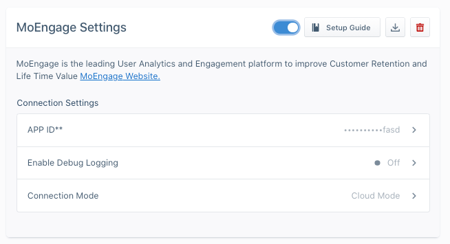

## Getting Started

Once you add the Segment-MoEngage library to your app, you can enable MoEngage from the Segment App. These new settings can take up to an hour to propagate to your existing users. For new users, it'll be instantaneous!

The Segment-MoEngage Integration is a bundled integration, meaning it requires that you add a client-side integration to your app.

## Setup MoEngage in your Segment Workspace:

To setup MoEngage do the following :
  1. First get your key(AppID) from the MoEngage dashboard. Navigate to `Dashboard --> Settings --> App --> General`.
  2. Go to your **Segment workspace**, go to **Destinations** and select **MoEngage**.
  3. Enable the MoEngage Destination.
  4. Go to the MoEngage Settings and enter the MoEngage AppID, obtained in **Step1**.
  5. Save the changes.
  6. Make sure you set the **Connection Mode**  to `Device Mode`. MoEngage requires this setting to use
      of features like push notifications and any in-app features of the MoEngage SDK.

These new settings will take up to an hour to propagate to your existing users. For new
users it'll be instantaneous! Segment-MoEngage Integration is a bundled integration, requires client side integration.



## iOS


To get started with MoEngage on iOS, first integrate your app with the [MoEngage-Segment-iOS](https://github.com/moengage/MoEngage-Segment-iOS){:target="_blank"} library. You can integrate MoEngage and Segment with [CocoaPods](http://cocoapods.org){:target="_blank"} or with Swift Package Manager.

  * Initialize pod with pod init command, this will create a podfile for your project.
  * Update your podfile by adding pod '**Segment-MoEngage**' as shown below:

  ```ruby
  use_frameworks!
  pod 'Segment-MoEngage'
  ```

   * Update the pod.

    pod update


 To install with SPM use the [MoEngage-Segment-iOS](https://github.com/moengage/MoEngage-Segment-iOS.git){:target="_blank"} library and set the branch as master or version as 7.0.0 and above.

### Configure the Segment SDK:

Navigate to the App Delegate file, and setup the Segment SDK:
1. Import `SEGMoEngageIntegrationFactory.h` and `SEGMoEngageInitializer.h`.
2. Initialize `MOSDKConfig` object and call `initializeDefaultInstance:` method of `SEGMoEngageInitializer`.
3. Initialize `SEGMoEngageIntegrationFactory` instance to the `SEGAnalyticsConfiguration` as shown below:

 ```objc
 #import <SEGMoEngageIntegrationFactory.h>
 #import <SEGMoEngageInitializer.h>
 #import <SEGAnalytics.h>

 - (BOOL)application:(UIApplication *)application didFinishLaunchingWithOptions:(NSDictionary *)launchOptions {

    //Initialize SDKConfig object and call initializeDefaultInstance: method of SEGMoEngageInitializer
    MOSDKConfig* sdkConfig = [[MOSDKConfig alloc] initWithAppID:@"YOUR APP ID"];
    [SEGMoEngageInitializer initializeDefaultInstance:sdkConfig];

    // Add your configuration key from Segment
    SEGAnalyticsConfiguration *config = [SEGAnalyticsConfiguration configurationWithWriteKey:@"configuration key"];

    // Add MoEngageIntegrationFactory. Without this data will not come to MoEngage.
    [config use:[SEGMoEngageIntegrationFactory instance]];
    [SEGAnalytics setupWithConfiguration:config];
  }
  ```

### Tracking User Attribute

User attributes are specific traits of a user, like email, username, mobile, gender etc. **identify** lets you tie a user to their actions and record traits about them. It includes a unique User ID and any optional traits you know about them.

 ```objc
 [[SEGAnalytics sharedAnalytics] identify:@"a user's id" traits:@{ @"email": @"a user's email address" }];
 ```

Read more about [identify calls](/docs/connections/sources/catalog/libraries/mobile/ios/#identify).


### Tracking Events

Segment uses event tracking to track user behavior in an app. `track` calls let you record the actions your users perform. Every action triggers an "event", which can also have associated attributes.

 ```objc
 [[SEGAnalytics sharedAnalytics] track:@"Item Purchased" properties:@{ @"item": @"Sword of Heracles"}];
 ```

Read more about [track calls](/docs/connections/sources/catalog/libraries/mobile/ios/#track).


### Reset Users

The `reset` method clears the SDK's internal stores for the current user. This is useful for apps where users can log in and out with different identities over time.

 ```objc
 [[SEGAnalytics sharedAnalytics] reset];
 ```

Read more about the [reset method](/docs/connections/sources/catalog/libraries/mobile/ios/#reset).


### Install / Update Differentiation

Since your app might already be on the App Store, you must specify whether your app update would be an `UPDATE` or an `INSTALL`.
To differentiate between those, use one of the method below:

 ```objc
 //For new Install call following
 [[MoEngage sharedInstance] appStatus:AppStatusInstall];

 //For an app update call following
 [[MoEngage sharedInstance] appStatus:AppStatusUpdate];
 ```

Read more on [install/update differentiation](https://developers.moengage.com/hc/en-us/articles/4403910297620){:target="_blank"}.

### Set the data center

By default, the data center setting in the SDK is set to `data_center_01`. Follow the steps in the [MoEngage - Data Redirection](https://developers.moengage.com/hc/en-us/articles/4403910162452-Data-Center){:target="_blank"} to update the data center value. If not set correctly, several features of the MoEngage SDK will not function.

### Using features provided in the MoEngage SDK

Along with tracking your user's activities, you can use the MoEngage iOS SDK for more effective user engagement:

#### Push Notifications:
Push Notifications are a great way to keep your users engaged and informed about your app. You have following options while implementing push notifications in your app:

**Segment Push Implementation:**

1. Follow the directions to register for push notifications [with the Segment SDK](/docs/connections/sources/catalog/libraries/mobile/ios/#how-do-i-use-push-notifications).

2. In your application's application:didReceiveRemoteNotification: method, add the following:
  ```objc
  [[SEGAnalytics sharedAnalytics] receivedRemoteNotification:userInfo];
  ```

3. If you integrated the application:didReceiveRemoteNotification:fetchCompletionHandler: in your app, add the following to that method:
  ```objc
  [[SEGAnalytics sharedAnalytics] receivedRemoteNotification:userInfo];
  ```

4. If you implemented handleActionWithIdentifier:forRemoteNotification:, add the following to that method:
  ```objc
  [[SEGAnalytics sharedAnalytics] handleActionWithIdentifier:identifier forRemoteNotification:userInfo];
  ```

**MoEngage Push Implementation:**
For information about the MoEngage push implementation, see [**Push Notifications**](https://developers.moengage.com/hc/en-us/articles/4403943988756){:target="_blank"} in the MoEngage documentation.


#### In-app messaging
In-App Messages are custom views which you can send to a set of users to show custom messages, give new offers, or direct to a specific page. For more information about In-app messaging, see [MoEngage - In-App NATIV](https://developers.moengage.com/hc/en-us/articles/4404155127828-In-App-Nativ){:target="_blank"}.


#### Cards
Create targeted or automated App Inbox/NewsFeed messages that can be grouped into various categories, and target your users with different updates or offers that can stay in the Inbox/Feed over a designated period of time. For more information about cards, see [MoEngage - Cards](https://developers.moengage.com/hc/en-us/articles/4404058438676-Cards-in-iOS){:target="_blank"}.


#### Compliance
To make the App compliant with policies (such as GDPR) while using MoEngage's SDK, follow the instructions in this [doc](https://developers.moengage.com/hc/en-us/articles/4403905438228-SDK-initialisation){:target="_blank"}.

### Segment Docs
For more info on using **Segment for iOS** refer to [**Developer Docs**](/docs/connections/sources/catalog/libraries/mobile/ios/) provided by Segment.


## Android

To use MoEngage in an Android app, you must perform the following steps to set up your environment.


To enable the full functionality of MoEngage (like Push Notifications, InApp Messaging), complete the following steps in your Android app.

### Adding the MoEngage Dependency

Along with the Segment dependency, add the below dependency in your `build.gradle` file.

```groovy
 implementation("com.moengage:moengage-segment-integration:$sdkVersion") {
        transitive = true
    }
```
with `$sdkVersion` replaced by the latest version of the MoEngage SDK.

The MoEngage SDK depends on the below Jetpack libraries provided by Google for its functioning, make you add them if not
 done already.

```groovy
    implementation("androidx.core:core:1.6.0")
    implementation("androidx.appcompat:appcompat:1.3.1")
    implementation("androidx.lifecycle:lifecycle-process:2.4.0")
```
Refer to the [SDK Configuration](https://developers.moengage.com/hc/en-us/articles/4401984733972-Android-SDK-Configuration){:target="_blank"} documentation to know more about the build config and other libraries used by the SDK.

### Register MoEngage with Segment SDK

After adding the dependency, you must register the integration with Segment SDK. To do this, import the MoEngage
 integration:

```java
import com.segment.analytics.android.integrations.moengage.MoEngageIntegration;
```

Add the following line:

```java
Analytics analytics = new Analytics.Builder(this, "write_key")
                .use(MoEngageIntegration.FACTORY)
                .build();
```


### Initialize the MoEngage SDK

Copy the APP ID from the Settings Page `Dashboard --> Settings --> App --> General` and initialize the MoEngage SDK in the onCreate method of the `Application` class

> info ""
> **Note:** MoEngage recommend that you initialize the SDK on the main thread inside `onCreate()` and not create a worker thread and initialize the SDK on that thread.

```java
// this is the instance of the application class and "XXXXXXXXXXX" is the APP ID from the dashboard.
MoEngage moEngage = new MoEngage.Builder(this, "XXXXXXXXXXX")
            .enableSegmentIntegration()
            .build();
MoEngage.initialiseDefaultInstance(moEngage);
```
### Exclude MoEngage Storage File from Auto-Backup
Auto backup service of Android periodically backs up the Shared Preference file, Database files, and so on.

For more information, refer to [Auto Backup](https://developer.android.com/guide/topics/data/autobackup){:target="_blank"}.

As a result of the backup, MoEngage SDK identifiers are backed up and restored after re-install.
The restoration of the identifier results in your data being corrupted and the user not being reachable using push notifications.

To ensure data isn't corrupted after a backup is restored, opt-out of MoEngage SDK storage files.

Refer to the [documentation](https://developers.moengage.com/hc/en-us/articles/4401999257236-Exclude-MoEngage-Storage-File-from-Auto-Backup){:target="_blank"} for further details.

### Install or update differentiation
This is required for migrations to the MoEngage Platform so the SDK can determine whether the user is a new user on your app, or an existing user who updated to the latest version.

If the user was already using your application and has just updated to a new version which has the MoEngage SDK, below is an example call:

```java
 MoEAnalyticsHelper.INSTANCE.setAppStatus(context, AppStatus.UPDATE);
```

If this is a fresh install:

```java
MoEAnalyticsHelper.INSTANCE.setAppStatus(context, AppStatus.INSTALL);
```

### Configure Push Notifications

Copy the Server Key from the FCM console and add it to the MoEngage Dashboard. To upload it, go to the Settings Page `Dashboard --> Settings --> Channel --> Push --> Mobile Push --> Android` and add the Server Key and package name.
**Please make sure you add the keys both in Test and Live environment.**

#### Add meta information for push notification

To display push notifications, some metadata regarding the notification is required. For example, the small icon and large icon drawables are mandatory.


Refer to the [MoEngage - NotificationConfig](https://moengage.github.io/android-api-reference-v11/core/com.moengage.core.config/-notification-config/index.html){:target="_blank"} API reference for all the possible options.


Use the `configureNotificationMetaData()` to pass on the configuration to the SDK.


```java
MoEngage moEngage =
        new MoEngage.Builder(this, "XXXXXXXXXX")
            .configureNotificationMetaData(new NotificationConfig(R.drawable.small_icon, R.drawable.large_icon))
            .enablePartnerIntegration(IntegrationPartner.SEGMENT)
            .build();
MoEngage.initialiseDefaultInstance(moEngage);
```

#### Configuring Firebase Cloud Messaging

For showing Push notifications there are 2 important steps:

1. Registration for Push, for example generating push token.
2. Receiving the Push payload from Firebase Cloud Messaging(FCM) service and showing the notification on the device.

##### Push registration and receiving handled by the application

###### Opt-out of MoEngage registration

To opt-out of MoEngage token registration mechanism disable token registration while configuring FCM in the `MoEngage.Builder` as shown below

```java
MoEngage moEngage = new MoEngage.Builder(this, "XXXXXXXXXX")
            .configureNotificationMetaData(new NotificationConfig(R.drawable.small_icon, R.drawable.large_icon))
            .configureFcm(FcmConfig(false))
            .enablePartnerIntegration(IntegrationPartner.SEGMENT)
            .build();
MoEngage.initialiseDefaultInstance(moEngage);
```

###### Pass the push token to the MoEngage SDK

The Application must pass the Push Token received from FCM to the MoEngage SDK for the MoEngage platform to send out push notifications to the device.
Use the below API to pass the push token to the MoEngage SDK.

```java
MoEFireBaseHelper.getInstance().passPushToken(getApplicationContext(), token);
```

Please make sure token is passed to MoEngage SDK whenever push token is refreshed and on application update. Passing token on application update is important for migration to the MoEngage Platform.

###### Passing the Push payload to the MoEngage SDK

To pass the push payload to the MoEngage SDK call the MoEngage API from the `onMessageReceived()` from the Firebase receiver.
Before passing the payload to the MoEngage SDK you should check if the payload is from the MoEngage platform using the helper API provided by the SDK.

```java
if (MoEPushHelper.getInstance().isFromMoEngagePlatform(remoteMessage.getData())) {
  MoEFireBaseHelper.getInstance().passPushPayload(getApplicationContext(), remoteMessage.getData());
} else {
  // your app's business logic to show notification
}
```

##### Push Registration and Receiving handled by SDK

Add the below code in your manifest file.

```xml
<service android:name="com.moengage.firebase.MoEFireBaseMessagingService">
 	<intent-filter>
		<action android:name="com.google.firebase.MESSAGING_EVENT" />
 	</intent-filter>
</service>
```

When the MoEngage SDK handles push registration, it optionally provides a callback to the Application whenever a new token is registered or the token is refreshed.

An application can get this callback by implementing `FirebaseEventListener` and registering for a callback in the Application class `onCreate()` using `MoEFireBaseHelper.getInstance().addEventListener()`


Refer to the [MoEngage - API reference](https://moengage.github.io/android-api-reference-v11/moe-push-firebase/com.moengage.firebase.listener/-firebase-event-listener/index.html?query=open%20class%20FirebaseEventListener){:target="_blank"} for more details on the listener.


##### Callbacks

Segment recommends that you add the callbacks in the onCreate() of the Application class since these callbacks can be triggered even when the application is in the background.

###### Token Callback

When MoEngage SDK handles push registration, it optionally provides a callback to the application whenever a new token is registered or the token is refreshed. To get the token callback implement the [TokenAvailableListener](https://moengage.github.io/android-api-reference/pushbase/com.moengage.pushbase.listener/-token-available-listener/index.html){:target="_blank"} and register for the callback using [MoEFireBaseHelper.getInstance().addTokenListener()](https://moengage.github.io/android-api-reference/moe-push-firebase/com.moengage.firebase/-mo-e-fire-base-helper/add-token-listener.html){:target="_blank"}.

###### Non-MoEngage Payload

If you're using the receiver provided by the SDK in your application's manifest file, SDK provides a callback in case a push payload is received for any other server apart from MoEngage Platform. To get a callback implement the [NonMoEngagePushListener](https://moengage.github.io/android-api-reference/moe-push-firebase/com.moengage.firebase.listener/-non-mo-engage-push-listener/index.html){:target="_blank"} and register for the callback using [MoEFireBaseHelper.getInstance().addNonMoEngagePushListener()](https://moengage.github.io/android-api-reference/moe-push-firebase/com.moengage.firebase/-mo-e-fire-base-helper/add-non-mo-engage-push-listener.html){:target="_blank"}.


#### Declare and configure Rich Landing Activity:

A rich landing page can be used to open a web URL inside the app through a push campaign.

The configuration below is only required if you want to add a parent activity to the Rich landing page. If not, you can move to the next section.
To use a rich landing page you need to add the below code in the AndroidManifest.xml

Add the following snippet and replace `[PARENT_ACTIVITY_NAME]` with the name of the parent
 activity; `[ACTIVITY_NAME]` with the activity name which should be the parent of the Rich Landing Page

```xml
<activity
  android:name="com.moe.pushlibrary.activities.MoEActivity"
  android:label="[ACTIVITY_NAME]"
  android:parentActivityName="[PARENT_ACTIVITY_NAME]" >
</activity>
```

You are now all set up to receive push notifications from MoEngage. For more information on features provided in MoEngage Android SDK refer to the following links:

* [Push Notifications](https://developers.moengage.com/hc/en-us/sections/360013606771-Push){:target="_blank"}

* [Location Triggered](https://developers.moengage.com/hc/en-us/articles/4403443036564-Location-Triggered){:target="_blank"}

* [In-App messaging](https://developers.moengage.com/hc/en-us/sections/360013831431-In-App-Messages){:target="_blank"}

* [Notification Center](https://developers.moengage.com/hc/en-us/articles/4403878923284-Notification-Center){:target="_blank"}

* [API Reference](https://moengage.github.io/android-api-reference/index.html){:target="_blank"}

* [Compliance](https://developers.moengage.com/hc/en-us/sections/4403894212116-Compliance){:target="_blank"}

* [Release Notes](https://developers.moengage.com/hc/en-us/articles/4403896795540-Changelog){:target="_blank"}


### Identify
Use [Identify](/docs/connections/sources/catalog/libraries/mobile/android/#identify) to track user-specific attributes. This is the same as tracking [user attributes](http://docs.moengage.com/docs/identifying-user){:target="_blank"} on MoEngage. MoEngage supports traits supported by Segment as well as custom traits. If you set traits.id, MoEngage sets that as the Unique ID for that user.

> info ""
> MoEngage supports anonymous identifiers in Device-mode only. If you use the MoEngage destination in Cloud-mode, use a known user identifier.

### Track
Use [track](/docs/connections/sources/catalog/libraries/mobile/android/#track) to track events and user behavior in your app.
This will send the event to MoEngage with the associated properties. Tracking events is essential and will help you create segments for engaging users.

### Reset
If your app supports the ability for a user to logout and login with a new identity, then you'll need to call reset for the Analytics client.

### Sample Implementation

Refer to [this](https://github.com/moengage/moengage-segment-integration){:target="_blank"} GitHub repository for sample implementation

## Web

The MoEngage WebSDK offers the ability to send push notifications to Google Chrome, Opera and Firefox browsers. Complete the following steps after you've configured Segment's `analytics.js.`


### Integration

#### 1. Setup your MoEngage Web SDK settings at MoEngage Dashboard
Configure the [web settings](https://app.moengage.com/v3/#/settings/push/web){:target="_blank"} on the MoEngage dashboard to start using MoEngage <> Segment integration.

If you have selected `HTTPS` mode of integration in the settings, complete the following steps:

#### 2 Set up for HTTPS websites

#### 2.a Download the required files (HTTPS)
For HTTPS Web Push to work, you need to host two files in the `root` directory of your web server. These two files will be available for you to download at the [web settings page](https://app.moengage.com/v3/#/settings/push/web){:target="_blank"}.
* manifest.json
* serviceworker.js

> note ""
> **Note**: Please make sure the name of the serviceworker file is `serviceworker.js`. Please contact MoEngage support at support@moengage.com if you wish to have some other name for the serviceworker file.

#### 2.b Add link to manifest in HTML (HTTPS)
Add the following line in the <head> tag of your page.

```html
<head>
  ...
	<link rel="manifest" href="/manifest.json">
  ...
</head>
```

#### 2.c Use your existing manifest or serviceworker file (HTTPS)
If you already have these files,

1. **Manifest** - Add the sender ID you saved on MoEngage dashboard as the `gcm_sender_id`. If you've used `MoEngage Shared Project` while setting up, your sender id is `540868316921`. Edit your `manifest.json` as follows:
  ```json
  {
    ...
    "gcm_sender_id": "GCM_SENDER_ID",
    ...
  }
```

2. **Service Worker** - Add the following line to the top of your `serviceworker.js` file
  ```js
  importScripts("//cdn.moengage.com/webpush/releases/serviceworker_cdn.min.latest.js?date="+
  new Date().getUTCFullYear()+""+new Date().getUTCMonth()+""+new Date().getUTCDate());
  ```

### Identify
Use [Identify](/docs/sources/website/analytics.js/#identify) to track user specific attributes. This is equal to [tracking user attributes](https://docs.moengage.com/docs/tracking-web-user-attributes){:target="_blank"} on MoEngage. MoEngage supports traits supported by Segment as well as custom traits.

> info ""
> MoEngage supports anonymous identifiers in Device-mode only. If you use the MoEngage destination in Cloud-mode, use a known user identifier.

### Track
Use [track](/docs/sources/website/analytics.js/#track) to track events and user behavior in your app. This will send the event to MoEngage with the associated properties. Tracking events is essential and will help you create segments for engaging users.

### Reset
If your website supports the ability for a user to logout and login with a new identity, then you'll need to call [reset](/docs/sources/website/analytics.js/#reset-logout) method in `analytics.js`.

### Optional
For information about optional feature, see the documentation below:
* [Configure opt in type](https://docs.moengage.com/docs/configuring-notification-opt-in){:target="_blank"}
* [Self-handled opt-ins](https://docs.moengage.com/docs/self-handled-opt-ins){:target="_blank"}
* [SDK callbacks](https://docs.moengage.com/docs/tracking-opt-ins-on-your-own){:target="_blank"}

### Test Mode and Debugging
While updating the MoEngage settings on the Segment Dashboard, you can enable the logging functionality of the MoEngage SDK to see the SDK logs on the browser console. Just set `Enable Debug Logging` to `On` and the SDK loads in debug mode.

> note ""
> **Note**: When you enable debug mode, the events and attributes of the users send to the `TEST` environment of your MoEngage App.
