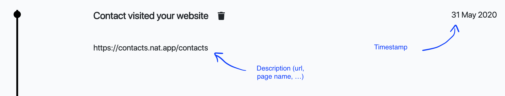

[Nat.app](https://nat.app?utm_source=segmentio&utm_medium=docs&utm_campaign=partners) is a CRM tool for founders and sales people that makes it easy to stay in touch with users and find product market fit.

This destination is maintained by Nat.app. For any issues with the destination, [contact the Nat team](mailto:segment@nat.app).



## Getting Started



1. From the Destinations catalog page in the Segment App, click "Add Destination".
2. Search for "Nat.app" in the Destinations Catalog, and select the "Nat.app" destination.
3. Choose which Source should send data to the "Nat.app" destination.
4. Go to the [Nat.app settings page](https://contacts.nat.app/settings), find and copy the "API key".
5. Enter the "API Key" in the "Nat.app" destination settings in Segment.

## Identify

If you aren't familiar with the Segment Spec, read the documentation to learn what the [Identify method](/docs/connections/spec/identify/) does. An example call would look like:

```js
analytics.identify('userId123', {
  email: 'john.doe@example.com'
});
```

Identify calls are sent to Nat.app as an `identify` event.

> warning ""
> Nat.app only accepts Identify calls. They must contain an `email` and a `timestamp` or else Nat.app will not accept them.

If an `identify` event contains an email, it is added to the timeline of the contact record for that email address as an interaction. Nat only generates one event per day per contact to keep Nat's *closeness indicator* accurate.

You can also include a `url` that is added as a description to the event in the user's timeline.

Here is an example of an `identify` even that has been added to a timeline:


## Accepted data format

Nat accepts several types of data formats to make the integration as easy as possible. There is a recommended format as well as alternative formats.

### Recommended format - with traits & page

In the recommended format, the user email is stored in `traits`, and the url in `page`.

```js
{
"type": "identify",
"timestamp": "2020-05-31T17:55:47.263Z",
"traits": {
    "email": "peter@example.com"
  },
"page": {
      "url": "https://example.com"
    }
}
```

### Alternative formats

Nat also accepts other formats to meet specific customer needs. Contact [segment@nat.app](mailto:segment@nat.app) if you need a custom format.

#### Example 1 - Without traits or url information

```js
        {
      "timestamp": "2020-05-31T17:55:47.263Z",
      "type": "identify",
      "email": "test@example.com"
    }
```

#### Example 2 - With event information but without traits

In this case, the `event ` replaces the `url` in the app.

```js
    {
      "timestamp": "2020-05-31T17:55:47.263Z",
      "type": "identify",
      "email": "test@example.com",
      "event": "User logged in",

      },
    }
```


## Required & Optional data

**Required: email & timestamp**
If the integration can't identify an `email` and a `timestamp`, it returns an error. Please follow the recommended format.

**Optional: url**
A description data point is optional and must be called `url`. It is added in the timeline as illustrated in the image above. If `url` is not included, a standard message is be added to the timeline instead.
