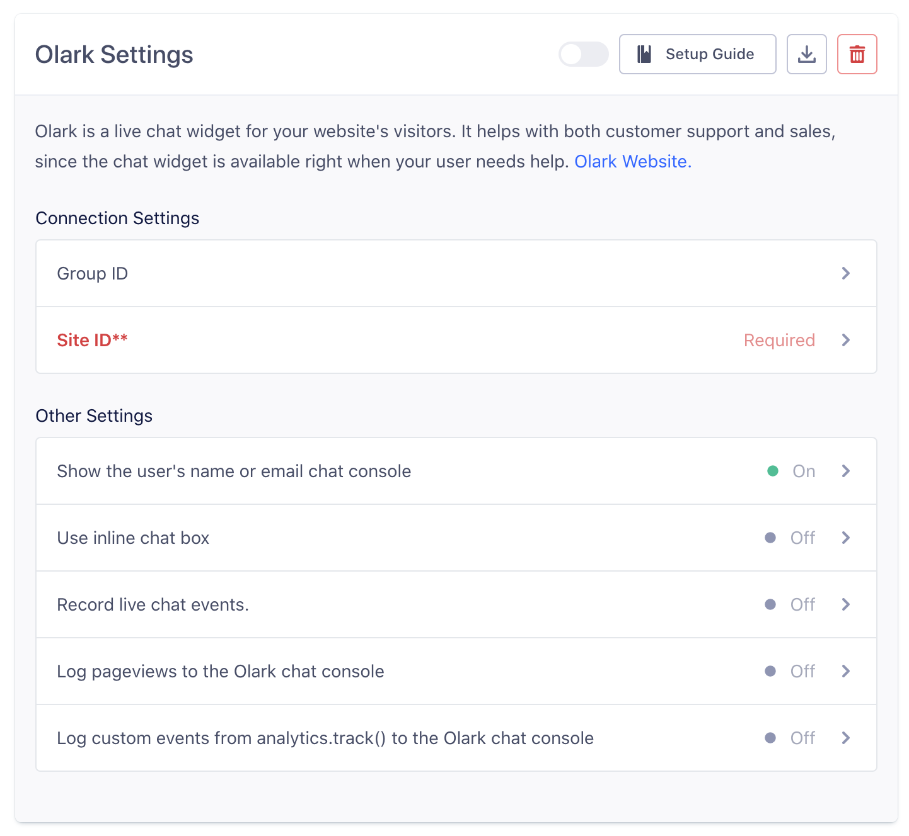

## Getting Started

When you enable Olark in the Segment web app, your changes appear in the Segment CDN in about 45 minutes, and then Analytics.js starts asynchronously loading Olark's `loader0.js` onto your page. This means you should remove Olark's snippet from your page.
+ Olark's chat box will appear on your page, as configured in your [Olark account](http://www.olark.com/?r=qhl4tltg), and you can start chatting with visitors.

Olark is only supported in device mode (on the client).

- - -

## Page

When you call [`page`](/docs/connections/spec/page/), we call Olark's `sendNotificationToOperator` function as `looking at *url*`. You must enable this option with the *pageview* flag, because it can sometimes be bothersome.


## Identify

When you call [`identify`](/docs/connections/spec/identify/) on `analytics.js`, we send the following data to Olark:

* We call `api.chat.updateVisitorNickname` with `traits.name` and `traits.email`, or just their `traits.name` or just their `traits.email` or their `userId`. In that order of preference.
* We call `api.visitor.updateEmailAddress` with `traits.email` if you send it, or `userId` if that's an email.
* We call `api.visitor.updateFullName` with `traits.name` if you send it, or `traits.firstName` and `traits.lastName` appended with a space in between, if you send both first and last name.
* We call `api.visitor.updatePhoneNumber` with `traits.phone` if you send it.
* We call `api.visitor.updateCustomFields` with `traits`.

More documentation on the Olark API can be found [in Olark's docs](https://www.olark.com/documentation?r=qhl4tltg).

## Track

When you call [`track`](/docs/connections/spec/track/) or one of its helpers on analytics.js, we call Olark's `sendNotificationToOperator` function as `visitor triggered *eventName*`. You must enable this option with the *track* flag, because it can sometimes be bothersome.

- - -

## Features

### Customizing the chat box

All the settings you can change [from your Olark settings pages](https://www.olark.com/help/customize), like targeted chat and your chat box design, still work exactly the same when Olark is enabled using Segment.

### Olark JavaScript API

If you'd like to use the native Olark JavaScript functions after turning on Olark using Segment our `ready` function will allow you to do that. Since we still load the Olark library in the background you can access those functions like this:

```js
analytics.ready(function(){
  olark('api.box.shrink')
});
```

[Read the ready docs for more details](/docs/connections/sources/catalog/libraries/website/javascript/#ready)

- - -


## Record Live Chat Events

Using Olark through Segment gives you the ability to automatically record `track` events for live chat conversations. If you select this option, we'll collect the following events:

* Live Chat Conversation Started
* Live Chat Message Sent
* Live Chat Message Received

These events will be sent to other tools in your stack that can accept track calls, so you can do things like analyze if users who chat spend more money over time.

To learn more about the live chat events you can capture with this destination, head on over to our [Live Chat spec docs](/docs/connections/spec/live-chat/).


