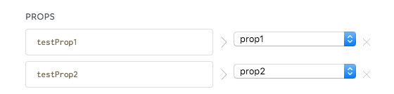
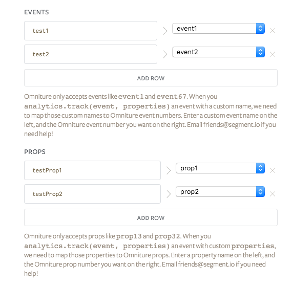

## Getting Started

When you enable the Omniture destination in Segment, your changes appear in the Segment CDN in about 45 minutes, and then Analytics.js starts sending all mapped `track` calls to your Omniture installation.

If you already host an Omniture instance on your page, we will hook into that. In the absence of an existing client-side instance we will create one that points to the **Tracking Server URL** you entered in your Omniture settings on Segment.


### Overview

The Omniture destination on Segment works with [all of our tracking sources](/docs/connections/sources/). When you send events using our mobile SDKs or server-side sources we translate that data into XML format and pass it to Omniture's XML Insertion API. Events tracked in client-side javascript are sent directly from the browser.

- - -

## Page

Pageviews can be tracked using Segment with [`page`](/docs/connections/spec/page/) calls from the browser. You must call it at least once per page. The javascript snippet you copy-paste from the set up guide comes with a default, `analytics.page();` call.

*You can extend the basic call to include the page name:*

```javascript
analytics.page('Home');
```

This will set `s.pageName` on Sitecatalyst to **Home**.

Going a step further, you can extend the `page` call with additional properties.

Like this:

```javascript
analytics.page('Product', {
  channel: 'Electronics',
  campaign: 'Radio Spot XYZ',
  sku: 'X-1287XL888C'
});
```

This will set the `channel` and `campaign` automatically for the pageview sent to Sitecatalyst. This also works for track calls and for some other fields from our [spec](/docs/connections/spec/common/#structure) including `state`, `zip`, `purchaseId`, and `transactionId`.

By default the `sku` property will not be sent to Omniture. First you have to map `sku` inside the Segment interface to a numbered `eVar` or `prop`:


Check out the `page` method docs for more information about our [page tracking API](/docs/connections/spec/page/)

## Track

Event tracking in Omniture requires one extra step as compared to other destinations.

You'll have to map each event and event property to a corresponding Omniture `event`, `prop`, or `eVar` in our interface. Once you've created that mapping, Segment automatically translates your `analytics.track()` calls and send them to Omniture.

Here's an example mapping in our interface:



And the corresponding `track` call:

 api-example '{
  "action": "track",
  "userId": "12345",
  "event": "Played Song",
  "properties": {
    "song": "YMCA",
    "genre": "Disco"
  }
}'}}} 

```js
{
  "action": "track",
  "userId": "12345",
  "event": "Played Song",
  "properties": {
    "song": "YMCA",
    "genre": "Disco"
  }
}
```

In this example Segment will automatically send the following data to Omniture:

- `s.events = 'event99';`
- `s.prop4  = 'YMCA';`
- `s.prop67 = 'Disco';`


We _will not_ send any `event`, `prop` or `eVar` which isn't found in your mapping. Except for [Ecommerce events](#e-commerce), which are automatically aliased to Omniture events.

With [`track`](/docs/connections/spec/track) in place, you'll no longer need to write Omniture-specific code to send data to Omniture. Once you create the mapping Segment automatically sets up all of the tracking code and send the data to the Omniture server.

### eVars

With Segment you can map an event name or property to an  `eVar` in Omniture. This works the same way as the mapping example above.

## E-Commerce

Our Omniture destination works with our standard [Ecommerce API](/docs/connections/spec/ecommerce/v2/).

Here's how we map our standard ecommerce events to Omniture events:

<table>
  <tr>
    <td>Viewed Product</td>
    <td>`prodView`</td>
  </tr>
  <tr>
    <td>Added Product</td>
    <td>`scAdd`</td>
  </tr>
  <tr>
    <td>Removed Product</td>
    <td>`scRemove`</td>
  </tr>
  <tr>
    <td>Order Completed</td>
    <td>`purchase`</td>
  </tr>
</table>

These events are specific to Omniture and thus, not mentioned in our ecommerce docs. However, we will still translate the following event names to Omniture's naming conventions as mapped below:

<table>
  <tr>
    <td>Viewed Cart</td>
    <td>`scView`</td>
  </tr>
  <tr>
    <td>Opened Cart</td>
    <td>`scOpen`</td>
  </tr>
  <tr>
    <td>Viewed Checkout</td>
    <td>`scCheckout`</td>
  </tr>
</table>

For [ecommerce events](#e-commerce), Segment automatically sends standard properties to Omniture, like `category`, `product`, `quantity`, `orderId`, and `price`.

- - -

## Mobile

Segment supports Omniture mobile app analytics using the Omniture XML Insertion API. You'll no longer need to deal with the Omniture SDKs at all.

For getting started with our mobile sources, check out the [iOS](/docs/connections/sources/catalog/libraries/mobile/ios) and [Android](/docs/connections/sources/catalog/libraries/mobile/android) technical docs.


### Add the Omniture Report Suite Id / Report Server Url

The first thing you'll want to do is to add the **Report Suite Id** and the **Report Server Url** settings to your Segment Omniture destinations settings.


### When Will I See Data?

If you already have an app deployed with the Segment library, and you just turned on Omniture mobile, it will take up to an hour for all your mobile users to refresh their Segment settings cache, and learn about the new service that you want to send to.

After the settings cache refreshes, our library will automatically start sending data to Omniture.


### Android Permissions

*You'll need to make sure you added these permissions to your `AndroidManifest.xml`:*

```xml
<uses-permission android:name="android.permission.INTERNET" />
<uses-permission android:name="android.permission.ACCESS_NETWORK_STATE" />
```

## Miscellaneous

### Custom Links

In order to populate the Custom Links report when sending data server-side, you'll need to pass `context.page.url` manually.
