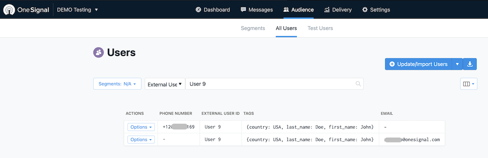
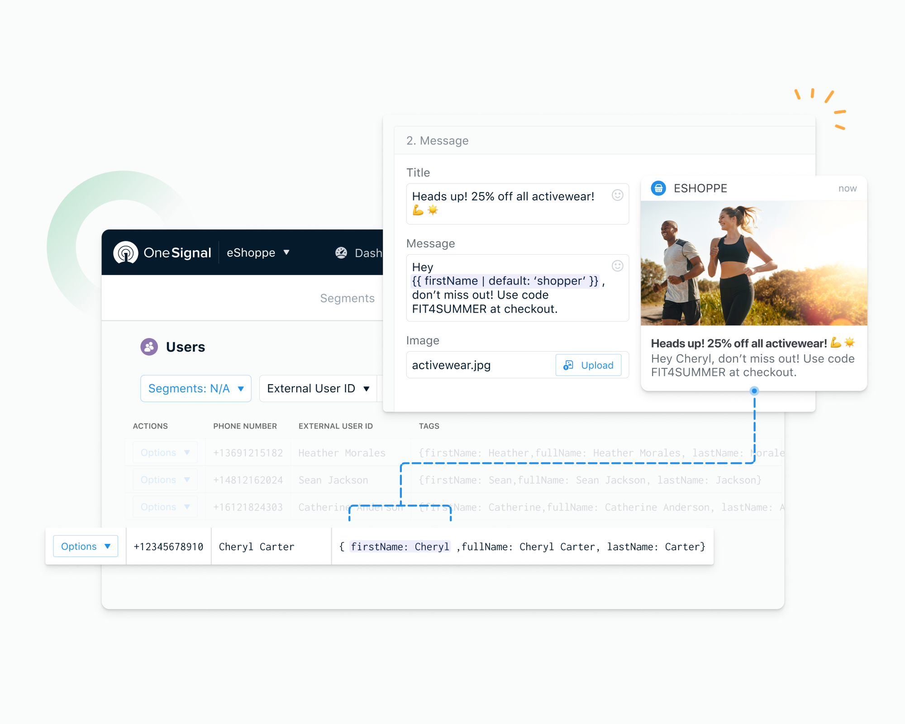
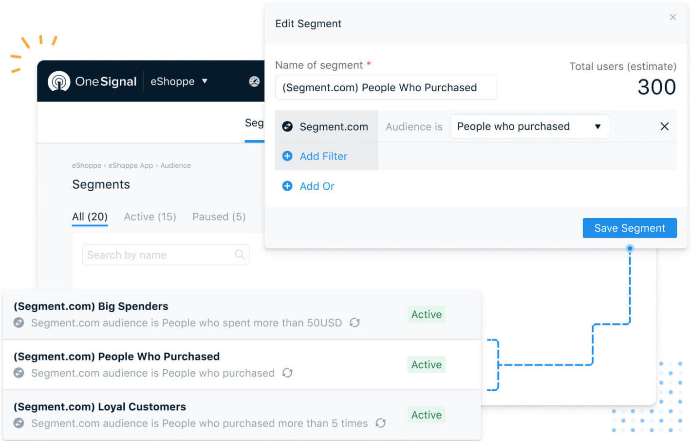

[OneSignal](https://onesignal.com/?utm_source=segmentio&utm_medium=docs&utm_campaign=partners){:target="_blank"} is the market leader in driving customer engagement with multi-channel messaging across Web and Mobile Push, In-App Messages, SMS, and Email subscribers.
This destination is maintained by OneSignal. For any issues with the destination, [contact the OneSignal Support team](mailto:support@onesignal.com).

> info ""
> The OneSignal Destination is available to customers on OneSignal Growth, Professional and Enterprise plans.

## Getting Started



1. Log in to the [OneSignal Dashboard](https://app.onesignal.com/){:target="_new"}
2. Navigate to **Segment App** -> **Settings** -> **Analytics** -> **Segment.com** and click **Activate**.
3. The Segment App opens in a new window. Log in to authenticate the connection from OneSignal.
4. Select the Workspace and Source to connect with OneSignal.


> info ""
> OneSignal maps the `userId` field to the **[External User ID](https://documentation.onesignal.com/docs/onboarding-with-onesignal#step-3-connect-user-data-to-onesignal)** field in OneSignal.


## Supported methods

OneSignal supports the following methods, as specified in the [Segment Spec](/docs/connections/spec).

### Identify

Send [Identify](/docs/connections/spec/identify) calls to update Users. For example:

```js
analytics.identify('userId123', {
  firstName: 'John',
  lastName: 'Doe',
     country: ‘USA'
});
```

Segment sends Identify traits as [Player Data Tags](https://documentation.onesignal.com/docs/add-user-data-tags) in OneSignal.

> warning ""
> OneSignal doesn't accept nested objects or arrays as user properties.



> info "Data Tag Limits"
> Your OneSignal plan may cap incoming Data Tags. Once you've reached your Data Tag limit, your user traits won't update in your OneSignal destination.

### Track

Send [Track](/docs/connections/spec/track) calls to update Data Tags. For example:

```js
analytics.track('Add to Cart', {
    product_name: 'Sunglasses',
    brand: 'Rayban'
})
```

OneSignal stores Track properties as Data Tags but drops the event name. In the above example, `Add to Cart` is dropped.

To keep the event names on OneSignal Data Tags, append the event name to the properties. For example, `Add_to_Cart_brand` instead of `brand`.



## Personas

Send Computed Traits and Audiences generated using [Segment Personas](/docs/personas) to OneSignal. To learn more about Personas, contact Segment for a [demo](https://segment.com/contact/demo){:target="_blank"}.

### Audiences

Personas Audiences appear as a [segment](https://documentation.onesignal.com/docs/segmentation) in OneSignal.

Track calls from Audiences create a OneSignal [segment](https://documentation.onesignal.com/docs/segmentation) with the Audience Name.

Identify calls from Audiences create a OneSignal [segment](https://documentation.onesignal.com/docs/segmentation) with the Audience Name and add Data Tags on all the matching user records.



Audiences sends Identify and Track calls to OneSignal when a user enters or exits the Audience.

### Computed Traits

OneSignal stores Track and Identify calls from Personas Computed Traits as [Data Tags](https://documentation.onesignal.com/docs/add-user-data-tags) for the OneSignal User/Player's records.

## OneSignal Destination FAQ
### Managing Segment's Reserved and Custom Traits

* Segment sends user traits to OneSignal as Data Tags. The number of data tags OneSignal allows depends on your OneSignal pricing plan. OneSignal drops the data tags that go over your set number. .

* OneSignal always updates the `firstName` and the `lastName` properties for matching users. All other traits are added/updated on a firstcome basis. `firstName` and `lastName` tags are stored as `first_name` and `last_name`.

* Send User properties to OneSignal with blank/null values to remove the corresponding Data Tag from the OneSignal user record.

* OneSignal doesn't store `email` and `phone` properties. To update `email` and `phone` properties in OneSignal, create a player record with the email address and/or a phone number and map those records with the External_User_ID. Additional properties from Segment map across all your matching records, including email and phone number records.
