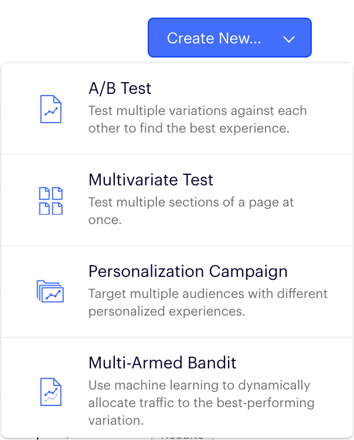
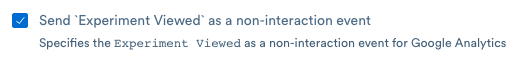
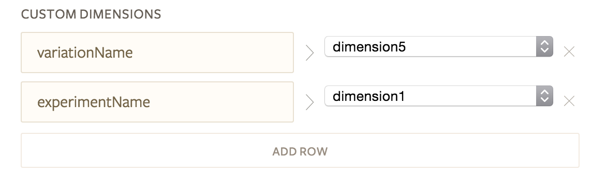

## Getting Started

Segment's **Optimizely Web (previously Optimizely)** destination supports the following Optimizely products:


* [Optimizely X Web](#optimizely-x-web)
* [Optimizely Full Stack (JavaScript)](#optimizely-full-stack-javascript-sdk)

If you're interested in implementing Optimizely Full Stack server-side or on mobile, see Segment's [**Optimizely Full Stack** destination](/docs/connections/destinations/catalog/optimizelyx/), which supports:

* [Optimizely Full Stack (server)](/docs/connections/destinations/catalog/optimizelyx/#server-side)
* [Optimizely Full Stack Android (cloud-mode)](/docs/connections/destinations/catalog/optimizelyx/#android-cloud-mode-implementation)
* [Optimizely Full Stack iOS (cloud-mode)](/docs/connections/destinations/catalog/optimizelyx/#ios-cloud-mode-implementation)

**Use Cases**



## Implementation Prerequisite

Optimizely works differently than other Segment destinations: Because the Optimizely Web Snippet and Full Stack SDKs are used to modify and deliver experiences to users, they generally must be implemented at a point in your Website or app that allows them to make visual modifications in-time for users.

Because of this Optimizely requires that customers implement their Web Snippet and SDKs natively, before the Segment snippet or implementation.

Although Segment maps `track`, and in some cases `page`, events to Optimizely's [`custom events`](https://help.optimizely.com/Build_Campaigns_and_Experiments/Custom_events_in_Optimizely_X), customers must implement the snippet on their site to ensure that experiments run and Optimizely decision events can be sent to Optimizely and Segment.

Segment provides specific implementation details for each Optimizely product in the sections below, in addition to details of the out-of-the-box mappings Segment's Optimizely component handles for Optimizely users.


## Optimizely X Web

### Getting Started

1. In your Segment source dashboard, enable the "Optimizely Web" destination (*not the "Optimizely Full Stack" destination*).
2. In Optimizely, go to the project you want to set the integration for. Then navigate to Settings -> Implementation and select the snippet to include on your Web page.
4. In your Optimizely dashboard, copy the snippet provided at the bottom of the page.
5. Include the snippet immediately after the opening `<head>` tag on every page where you'd like to include Optimizely's JavaScript.
6. Now, paste your Segment snippet below the Optimizely snippet on every page where you'd like to include Segment's JavaScript.
7. Finally, remember to define any [custom `events`](https://help.optimizely.com/Build_Campaigns_and_Experiments/Custom_events_in_Optimizely_X) in your Optimizely dashboard, and to add those `events` as [`metrics`](https://help.optimizely.com/Measure_success%3A_Track_visitor_behaviors/Metrics_in_Optimizely_X) with the appropriate Optimizely Experiments. In Optimizely in the Implementation tab, select 'Custom Event' and give it an API name that corresponds to the Segment `track` event name. Once the Optimizely events are created, they can be added to experiments as metrics to start tracking Segment data to an Optimizely experiment.

### Track

Behind the scenes, Segment's Optimizely Web destination creates a global Optimizely queue on the page. Upon invocation of a Segment `track` event, Segment pushes the `track` event to the global queue.

Segment forwards the event to Optimizely:
* If the Segment event name matches exactly the name of an active experiment `metric` set up in the Optimizely dashboard;
* If the experiment `metric` is associated with a running experiment;
* If the current user has been assigned a `userId` using Segment's `identify` method (e.g. `analytics.identify('123')`);
* If the current user is activated in a running experiment with the associated `metric`.

Segment also handles the following mapping:
* Segment `track` event name to Optimizely `eventName`.
* Segment `track` event `properties` to Optimizely `eventTags`.

`revenue` values should be passed as a Segment `property`. The value should be an integer and represent the value in cents, so, for example, $1 should be represented by `100`.

> note ""
> **Note:** [Custom Event Tags](https://docs.developers.optimizely.com/full-stack/docs/include-event-tags) in Optimizely, which include all Event Tags except `revenue` and `value`, are not displayed on the Optimizely results page, however, they are available in a [Data Export](https://docs.developers.optimizely.com/web/docs/data-export) report.

### Page

Segment maps `page` calls to its own `track` events, i.e. invoking `analytics.page('Page Viewed')` using Segment's API maps the event to a `analytics.track('Page Viewed')` event. Segment maps the `track` event to other downstream destinations like a regular Segment `track` event.

### Experiment Listeners

Upon activation of an Optimizely experiment, an "Experiment Viewed" `track` event is sent to Segment. The event includes Optimizely experiment metadata.

Upon activation of an Optimizely experiment, an “Experiment Viewed” `track` event is sent to Segment. The event includes Optimizely experiment metadata which is sent whenever the Optimizely [`campaignDecided` listener](https://docs.developers.optimizely.com/web/docs/add-listener#section-campaign-decided) is activated.


> note ""
> **Note:** When an Optimizely Web experiment is activated, Optimizely automatically sends an "Experiment Viewed" `track` event to Segment. This makes the Optimizely Web integration act as both a Destination and a Source, because the `track` calls enrich and send Experiment Decisions and Exposure event data to Segment, which can be used by other platforms.

#### Standard or Redirect Experiments

**Properties sent using `track` calls:**

* campaignName
* campaignId
* experimentId
* experimentName
* referrer (only set if the effective referrer is different than `document.referrer`)
* variationName
* variationId
* audienceId
* audienceName
* nonInteraction (based on your advanced settings inside Segment)

`campaignName` and `experimentName` are the same if you create an experiment directly rather than creating an "experience" inside a personalized campaign. However, `campaignId` is still auto generated by Optimizely's API, thus it is different than the `experimentId`.

  

**Example call automatically invoked upon page load:**

```javascript
analytics.track('Experiment Viewed', {
  campaignName: 'Countdown to Stranger Things 2',
  campaignId: '7554165405',
  experimentId: '7556781578',
  experimentName: 'What about Barbs?',
  variationId: '7578240035',
  variationName: 'Variation Barbs',
  audienceId: '7527565438',
  audienceName: 'Netflix Bingers',
  nonInteraction: 1
});
```

**Trait sent using `identify` calls:**

* experimentName
* variationName

**Example call automatically invoked upon page load:**

```javascript
analytics.identify({
  'Experiment: What about Barbs?': 'Variation Barbs'
});
```

Since `traits` are cached, if you run multiple experiments during a user session subsequent experiments would fire `identify` calls containing previous experiment data.

#### Sending Experiment Viewed events as Non-Interaction for Google Analytics

If you're using Google Analytics, you'll likely want to check this setting in the Segment UI for the Optimizely Web destination:

  

This appends an additional property in your "Experiment Viewed" events called `nonInteraction` and set it to 1. This is to prevent the "Experiment Viewed" event from affecting your bounce rate.

#### Sending Experiment Viewed event properties as Google Analytics Custom Dimensions
  
If you're sending your experiment data to Google Analytics in the form of `track` calls, Segment recommends creating hit-scoped custom dimensions in Google Analytics with titles like "Experiment Name" and "Variation Name," and then map the properties to those Custom Dimensions accordingly. For example, if you set Custom Dimension 5 to "Experiment Name" and Custom Dimension 1 to "Variation Name," here's how you'd configure the mappings in your Segment<>GA settings:

  

## Optimizely Full Stack (JavaScript SDK)

### Getting Started

1. In your Segment source dashboard, enable the "Optimizely Web" destination (*not the "Optimizely Full Stack" destination*).
2. Require Optimizely's `@optimizely/optimizely-sdk` on your site and create an `optimizelyClientInstance`.
3. The instance must be named `optimizelyClientInstance`.
4. Attach the `optimizelyClientInstance` to the `window` so Segment recognizes it.
5. Now, paste your Segment snippet below the Optimizely implementation on every page where you'd like to include Segment's JavaScript. Or, if you've implemented Optimizely in a separate file, ensure Segment loads only after Optimizely has been initialized.
6. Finally, define any [`events`](https://docs.developers.optimizely.com/full-stack/docs/create-events) and [`attributes`](https://docs.developers.optimizely.com/full-stack/docs/define-attributes) in your Optimizely dashboard, and to associate `metrics` with the appropriate Optimizely Experiments. Segment maps `track` event names to Optimizely `eventName` - the `eventName` corresponds to an experiment `metric`.

> note ""
> **Note:** If you are using Optimizely SDKs v1.x or v2.x: if a visitor has any `activate` or `isFeatureEnabled` calls, their `attributes` object for these calls must match the `attributes` object passed to any `track` calls for that user id so that it can be correctly attributed on the Optimizely results page.

If you are using Optimizely SDKs v3+ or the React SDK, [Easy Event Tracking](https://blog.optimizely.com/2019/02/26/introducing-easy-event-tracking-the-easier-way-to-understand-and-optimize-the-customer-journey/) is enabled by default for decision events. Set up does not require maintaining the attributes of a user as long as the user id stays the same between Optimizely `activate` and `isFeatureEnabled` calls and Segment `track` calls to have Optimizely `metrics` populated in the Optimizely results page. If you would like to segment your Optimizely results by user `attribute`, then make sure the `attributes` passed in for the `activate` and `isFeatureEnabled` calls match the `attributes` passed in for the `track` calls for that user id.

For more details on how events are attributed on the Optimizely results page, refer to their documentation [here])(https://help.optimizely.com/Analyze_Results/How_Optimizely_counts_conversions).

### Track

Upon invocation of a Segment `track` event, Segment maps the event to an Optimizely `track` event:
* If the Segment event name matches exactly the name of an active experiment `metric` set up in the Optimizely dashboard;
* If the experiment `metric` is associated with a running experiment;
* If the current user has been assigned a `userId` using Segment's `identify` method (e.g. `analytics.identify('123')`);
* If the current user is activated in a running experiment with the associated `metric`.

Segment also handles the following mapping:
* Segment `track` event name to Optimizely `eventName`.
* Segment `track` event `properties` to Optimizely `eventTags`.
* Segment `track` event `traits`, falling back to cached user `traits`, to Optimizely `attributes`.

`revenue` values should be passed as a Segment `property`. The value should be an integer and represent the value in cents, so, for example, $1 should be represented by `100`.

**Note:** Custom [Event Tags](https://docs.developers.optimizely.com/full-stack/docs/include-event-tags) in Optimizely, which includes any Event Tag outside of `revenue` or `value`, will not be displayed on the Optimizely results page, however, they will be available in a [Data Export](https://docs.developers.optimizely.com/web/docs/data-export) report.

### Page

Segment maps `page` calls to its own `track` events, i.e. invoking `analytics.page("Page Viewed")` using Segment's API maps the event to `analytics.track("Page Viewed")`. Segment maps the `track` event downstream to other destinations like a regular Segment `track` event.

### Experiment Listeners

Segment does not implement experiment listeners for Optimizely X Full Stack.

### Tracking Anonymous Data with Optimizely X Full Stack

If you are sending anonymous data to Optimizely X Full Stack using their server-side SDK elsewhere and would like to send anonymous data for the same user using this Segment client-side component, you can pass in an Optimizely-specific `userId`:

  ```javascript
  analytics.track('Some event', { /* properties */ }, {
    Optimizely: { userId: 'some anonymousId' }
  });
  ```

## Troubleshooting

### No Data for Anonymous Users

Segment does not map any data to Optimizely from the Segment<>Optimizely Web destination for anonymous users - in other words, to map `track` and `page` data, a user must be `identified` with a `userId`.

### Lower Experiment Viewed counts inside Segment and other tools vs. Optimizely unique visitors

The count of "Experiment Viewed" events may be slightly lower compared to the number of unique visitors seen in Optimizely because Optimizely loads synchronously and Segment loads asynchronously. This means that if the user quickly closes or redirects from a page, sometimes Segment does not have enough time to scrape the experiment data from the global Optimizely object and make its API calls back to Segment and to your other enabled tools.


### Sending Segment event 'properties' as Optimizely 'events'

If you follow the Segment recommended naming conventions for `track` calls, you might not automatically capture the specificity of the conversion event that you want to for the Optimizely `eventName`. For example, you might see a Segment `track` event with the `eventName` "Category Clicked", with additional important details about the event is stored in the Segment event's `properties`. However, you want to send an `event` to Optimizely with the `eventName` "Clicked Shirts" . Here is an example of that Segment `event`:

```javascript
analytics.track('Category Clicked', {
  category: 'Shirts',
  productId: '1234',
  productName: 'Red Cotton T-shirt',
  price: 23.95
});
```

If you were to send this Segment `track` event to Optimizely using any of the Segment integrations, you would only be able to use the `eventName` ‘Click' as a `metric` in Optimizely since custom event tags in Optimizely are not available on the [Results page](https://help.optimizely.com/Analyze_Results/The_Experiment_Results_page_for_Optimizely_X).

To send a `track` event from Segment with the context about that event from the `properties` to Optimizely, create a [custom Segment Destination Function](/docs/connections/destinations/destination-functions/) that maps the Segment `eventName` to a more specific Optimizely `eventName` and send an Optimizely `event` payload with the transformed `eventName` to the Optimizely [Event API](https://docs.developers.optimizely.com/web/docs/event-api). Using the example above, the Segment `track` event ‘Click' can be transformed to an Optimizely `event` with the `eventName` ‘Clicked Shirt'.

### Sending effective referrer in your automatic page calls

If you are running redirect experiments, you might run into a case where the effective referrer is different than the referrer that is captured by `page` calls, such as the default page call in our Segment snippet.

For example, let's say you run a redirect experiment on page `http://home.com` that redirects you to `http://home-offers.com`. Now, if a customer visits your page using a Google ad, you want to make sure that the `page` call fired on `http://home-offers.com` knows that the true referrer was Google and NOT `http://home.com`.

Our Optimizely Web destination detects this and send the effective referrer value as a property of the subsequent Experiment Viewed. Segment also overrides the `context.page.referrer` with the effective referrer.

More importantly, to send the true referrer value with the initial `page` call inside the Segment snippet, you can look up `window.optimizelyEffectiveReferrer`, and if it exists, you can pass that into your `page` call. This is how you might modify your Segment snippet:

```javascript
<script type="text/javascript">
  !function(){var analytics=window.analytics=window.analytics||[];if(!analytics.initialize)if(analytics.invoked)window.console&&console.error&&console.error("Segment snippet included twice.");else{analytics.invoked=!0;analytics.methods=["trackSubmit","trackClick","trackLink","trackForm","pageview","identify","reset","group","track","ready","alias","debug","page","once","off","on","addSourceMiddleware","addIntegrationMiddleware","setAnonymousId","addDestinationMiddleware"];analytics.factory=function(t){return function(){var e=Array.prototype.slice.call(arguments);e.unshift(t);analytics.push(e);return analytics}};for(var t=0;t<analytics.methods.length;t++){var e=analytics.methods[t];analytics[e]=analytics.factory(e)}analytics.load=function(t,e){var n=document.createElement("script");n.type="text/javascript";n.async=!0;n.src="https://cdn.segment.com/analytics.js/v1/"+t+"/analytics.min.js";var a=document.getElementsByTagName("script")[0];a.parentNode.insertBefore(n,a);analytics._loadOptions=e};analytics.SNIPPET_VERSION="4.1.0";
  analytics.load("YOUR_WRITE_KEY");

  /* MODIFIED SECTION */
  // Hey did Optimizely set an effective referrer?
  if (window.optimizelyEffectiveReferrer) var referrer = window.optimizelyEffectiveReferrer;

  // If they did, override the document.referrer
  referrer ? analytics.page({ referrer: referrer }); : analytics.page();
  /* MODIFIED SECTION */

  }}();
</script>
```
