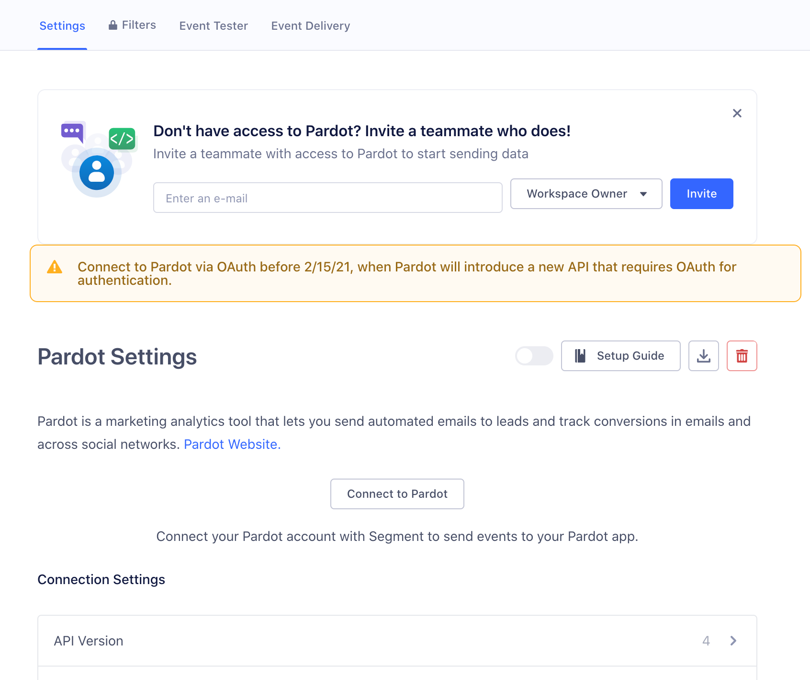

## Getting Started

When you enable Pardot in the Segment web app, your changes appear in the Segment CDN in about 45 minutes, and then Analytics.js starts asynchronously loading Pardot's javascript onto your page. This means you should remove Pardot's snippet from your page. Pardot automatically collects anonymous visitor data data on your site. Pardot is supported on the client-side and server-side.


## Update your Segment Pardot destination to use Salesforce SSO

> info ""
> Starting February 15, 2021, Pardot will require that you authenticate using Salesforce's single sign-on (SSO), rather than a Pardot username and password. If you are not already using SSO, you must reconnect your Segment Pardot destination using Salesforce SSO before February 15th to keep data flowing to Pardot.

If you don't have a Salesforce account, contact your Salesforce administrator. They can grant you a Salesforce Identity License, which allows you to use Salesforce for SSO purposes without provisioning a full Salesforce account.

To reconnect Pardot to Segment using SSO authentication:
1. In the Segment app, click **Connections** on the left, then click **Destinations**. Select your Pardot destination.
2. On your Pardot settings page, click **Connect to Pardot**, and follow the steps to connect using OAuth.
   

3. On the next screen, you are prompted to authenticate using your Salesforce username and password.
   If you don't have a Salesforce account, contact your Salesforce administrator. They can grant you a Salesforce Identity License, which allows you to use Salesforce for SSO purposes without provisioning a full Salesforce account.
4. On the Pardot destination settings page, click **Primary Business Unit Id** and specify the [Primary Business Unit Id](/docs/connections/destinations/catalog/pardot/#primary-business-unit-id) associated with your Pardot Account in Salesforce.

## API Access
To connect to the Pardot API, Segment requires that you authenticate your account using your Salesforce single sign-on (SSO) credentials. When you first connect to the Pardot destination, you are prompted to sign in using Salesforce SSO.

> success ""
> If you don't have a Salesforce account, contact your Salesforce administrator. They can grant you a Salesforce Identity License, which allows you to use Salesforce for SSO purposes without provisioning a full Salesforce account.

### Pardot Version 3 and Version 4

There are currently two active versions of the Pardot platform, version 3 and version 4. The major change in version 4 is the new ability to create multiple prospects in Pardot with the same email address.

Previously, this was not possible. Email was used by Pardot as a distinct identifier. In version 4 however, in order to update an *existing* prospect, you must provide either the Pardot ID for a given user OR the Salesforce FID. If one of these values is not provided in a request, Pardot will create a new prospect. More information is available on their [website](http://developer.pardot.com/kb/api-version-4/).

The Segment Pardot destination provides two different options to support this new functionality. Read on to learn more.

## Identify

### Version 3

When you call `identify`, Segment creates or updates a prospect in Pardot. If you are using version 3 of the Pardot platform, make sure you pass an `email` trait so Segment can check if that prospect already exists. If a prospect already exists, Segment updates its fields with the `traits` you provide. Otherwise, Segment creates a new prospect.

```js
analytics.identify('YOUR_DATABASE_USER_ID', {
    email: 'tom@example.com',
    name: 'Tom Smykowski'
    company: 'Initech, Inc',
    department: 'Customer Service',
    years_in_business: '10',
    notes: 'Working on a "Jump to Conclusions" mat',
    description: 'Im a people person. What the hell is wrong with you people?',
    title: 'VP of Engineering'
});
```

Find other accepted traits in [Pardot's Prospect field reference](https://developer.pardot.com/kb/object-field-references/#prospect).

You can provide custom fields, but they won't be updated or visible until you create them in the Pardot user interface by going to **Admin > Configure Fields > Prospect Fields**.

### Version 4

> note ""
> The Segment integration with v4 of the Pardot API is currently in beta, and is only available in cloud-mode.

If you are using version 4, the functionaly is the same as version 3 except you will need to provide some kind of identifier to Segment that we can use to correctly handle either the creation of a new prospect *or* the update of an existing one. There are two options for this.

#### FID or ID Properties

If you are able to access either the **SalesforceFID** or **PardotID** for a given user, you can pass these properties to Segment as [integration specific options](/docs/connections/sources/catalog/libraries/server/node/#selecting-destinations). The properties must be named either `id` to pass a PardotID, or `fid` to pass the Salesforce FID.

```javascript
analytics.identify({
    userId: 'YOUR_DATABASE_USER_ID',
    traits: {
        email: 'bill@segment.com'
    },
    integrations: {
        Pardot: {
            fid: '00339000033ZUR6'
        }
    }
});
```

#### Lookup Field

If you do not have access to a given user's **SalesforceFID** or **PardotID**, you can alternatively specify a custom field in your Pardot instance for us to use to lookup and match a given user on.

For example, if you maintain an internal uuid for each of your users, you could create a field in Pardot with a name of your choosing (`org_id` for example) and in your integration settings, specify this field name. Then, when you send an `identify` event to Segment we will check to see if a prospect exists in Pardot with a value in this custom field that matches the value of a trait property with the same name as the custom field. If the match is successful, we will update that prospect with their proper PardotID. If not, we will create a new prospect.

Here is an example that assumes you have a custom field in Pardot called `org_id`:

```javascript
analytics.identify({
    userId: 'YOUR_DATABASE_USER_ID',
    traits: {
        email: 'bill@segment.com',
        org_id: '1sf324fd53'
    }
});
```

If a user existed in your Pardot instance with a custom field called `org_id` and a value of `1sf324fd53`, the user would be successfully updated. Otherwise, a new user would be created with `org_id` properly populated for future reference.

**Use UserID as Lookup Field Value**

Alternatively, you can specify in your integration settings that we use the `userId` passed in as an argument to the `identify` event to match the user on. Keeping with the above example, if you already were using your internal `org_id` as the `userId` for Segment events, you could enable this option and avoid having to explicitly define it as a trait.

**Important**: If you have users in Pardot that do not have values for the custom field you will be using as a lookup field, you will likely see duplicate prospects being created.

If possible, we recommend you explore bulk updating all existing users to ensure they have a value for this custom field before enabling the integration.

### Client Side

On the client-side browser Segment loads Pardot's JavaScript snippet to enable [anonymous visitor tracking](http://www.pardot.com/products/marketing-automation/benefits/website-visitor-id-and-anonymous-visitor-tracking/).

### Troubleshooting

#### Updating a prospect's email creates a new prospect

If you use Version 4 of the API and use a lookup field to match existing prospects with Segment `identify` events, Pardot creates a new prospect when you try to update a prospect's email address. This is because the Pardot API does not allow write operations using an email address - you can only run a read (or lookup) operation with email addresses. (This restriction also applies to the SalesforceFID.) In this case the Segment integration performs a _read_ operation for a prospect matching the new email you sent. The read operation does not return a lookup field match, and so Pardot creates a new user.

To update a user's email, you must pass either a PardotID or a SalesforceFID (see above for specifics on how to do this).
