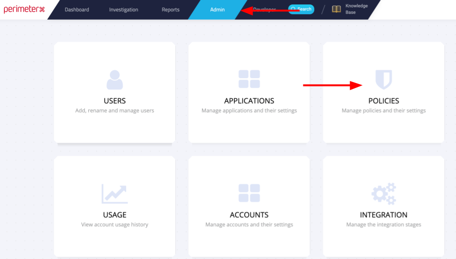
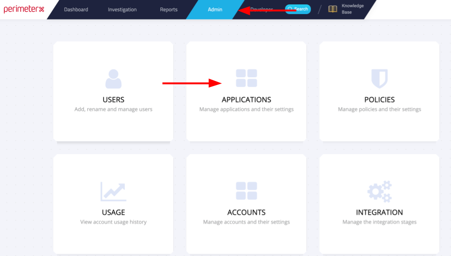

When you toggle on the PerimeterX Destination in Segment, our CDN is updated within 5-10 minutes. Our snippet will start asynchronously loading PerimeterX's snippet onto your page. This means you should remove PerimeterX's snippet from your page.

## Getting Started

1. Create a new Policy within PerimeterX.

2. Configure your Application

3. Copy your Application ID and paste into your Segment PerimeterX settings

## Identify

PerimeterX will send an `.identify()` call back to Segment on every page load with the following custom trait: `pxResult`. The value of `pxResult` will be either 0 or 1 meaning the traffic is either human or non-human.

You have the option to map up to 10 of your Segment `.identify()` traits to custom parameters in PerimeterX. Here's how:

1. Create the custom parameter in PerimeterX. Click "Admin" > "Applications" > choose your application. Under "Custom parameters" click "Add".
2. Choose a Parameter (1-10) and then a display name.

3. In your Segment PerimeterX Destination settings, enter the name of the `.identify()` trait you'd like to map the the custom parameter you created and then enter the number of the custom parameter (1-10).

