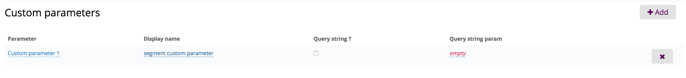
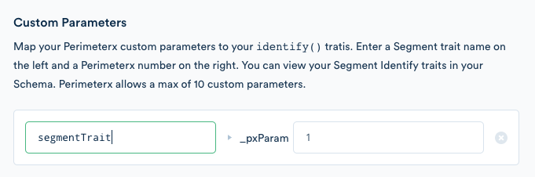

When you enable the PerimeterX destination in the Segment app, your changes appear in the Segment CDN in about 45 minutes, and then Analytics.js starts asynchronously loading PerimeterX's snippet onto your page. This means you should remove PerimeterX's snippet from your page.

## Getting Started

1. Configure your [Policy and Application within PerimeterX](https://dash.readme.io/project/pxconsole/v1.0/docs/segment).
2. Copy your Application ID and paste into your Segment PerimeterX settings

## Identify

Every time your page loads, the PerimeterX snippet asynchronously fires an `identify` call with the trait `pxResult`. The value of `pxResult` will be either `0` or `1`, meaning the traffic is either human or non-human.

You can map up to 10 of your `identify` traits to custom parameters within PerimeterX.

To map an identify trait in PerimeterX:

1. Create the custom parameter in PerimeterX. Click **Admin > Applications** then choose your application.
2. Under **Custom parameters** click **Add**.
3. Choose a Parameter (1-10) and a display name:

4. In your Segment PerimeterX Destination settings, enter the name of the `identify` trait to map to the custom parameter you created. Then enter the number of the custom parameter (1-10).

