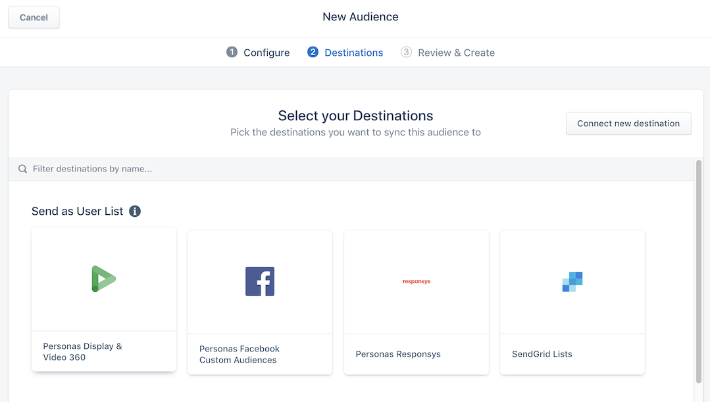

Google's [Display & Video (DV360)](https://marketingplatform.google.com/about/display-video-360/) service is an end-to-end campaign management tool that enables enterprise customers to plan, measure, and run display and video advertisements.

> info ""
> **Note**: You can connect to a Google Ad Manager account. For more information, see [4. Create an audience and finish DV360 configuration](#4-create-an-audience-and-finish-dv360-configuration) below.

Segment's integration with DV360 enables Segment customers to sync audiences created in Personas with DV360 to enable centralized audience management and improved retargeting.

> warning ""
> **Important**: You must meet certain implementation criteria to use the DV360 integration:
> - For web traffic, you must have a client-side `analytics.js` source.
> - For mobile app traffic, you must have a mobile source.

> info ""
> **Note**: Since the release of `analytics-ios` version 4, Segment no longer collects IDFA automatically. To collect and pass IDFA to your DV360 integration, follow the steps for Ad Tracking and IDFA in the [Analytics-iOS mobile source](/docs/connections/sources/catalog/libraries/mobile/ios#ad-tracking-and-idfa) documentation.

## Details
 
<table>
<tr>
<td>
**Requirements**
</td>
<td markdown=1>
 - Business tier Segment customers with Personas
 - One of the following sources, depending on type:
   - For web: analytics.js
   - For mobile app: a mobile source that passes an advertising identifier
 - A personas space. Non-Personas spaces are not compatible with DV360.
 - A Google Marketing Platform account
</td>
</tr>
<tr>
<td>
**Audience appears as**
</td>
<td>
An audience list with the name of your Personas Audience on the DV360 **All Audiences** screen
</td>
</tr>
<tr>
<td>
**Destination rate limit**
</td>
<td>
None
</td>
</tr>
<tr>
<td>
**Lookback window allowed**
</td>
<td>
30 days
</td>
</tr>
<tr>
<td>
**Historical backfill supported**
</td>
<td>
No
</td>
</tr>
<tr>
<td>
**Identifiers required**
</td>
<td markdown=1>
One of:
- `idfa` (iOS)
- `advertisingId` (Android)
- `anonymousId` (Web)
</td>
</tr>
<tr>
<td>
**Connection type**
</td>
<td markdown=1>
- Client-side (DoubleClick Floodlight)
- Server-side (DV360)
</td>
</tr>
<tr>
<td>
**Aliasing supported**
</td>
<td>
No
</td>
</tr>
</table>


- **Requirements**:
  - Business tier Segment customers with Personas
  - One of the following sources, depending on type:
    - For web: analytics.js
    - For mobile app: a mobile source that passes an advertising identifier
  - A Personas space. Non-personas spaces are not compatible with DV360.
  - A Google Marketing Platform account
- **Audience appears as**: An audience list with the name of your Personas Audience on the **DV360 All Audiences** screen
- **Destination rate limit**: None
- **Lookback window allowed**: 30 days
- **Historical backfill supported**: No
- **Identifiers required (one of the following)**:
  - `idfa` (iOS)
  - `advertisingId` (Android)
  - `anonymousId` (Web)
- **Connection type**:
  - Client-side (DoubleClick Floodlight)
  - Server-side (DV360)
- **Aliasing supported**: No

## Components

The Segment DV360 integration uses two components, the [DoubleClick Floodlight tag](/docs/connections/destinations/catalog/doubleclick-floodlight/) and Personas Display & Video 360 integration

### DoubleClick Floodlight tag

Segment users must add this tag to their web properties. The tag performs several functions, but when enabled for the DV360 integration, it allows Segment to send information about users directly to Google client-side.

> info ""
> **Note**: This component is required only if you want to sync audiences based on web traffic.

### DV360 destination

The DV360 destination syncs audience data between Segment and Google Display & Video 360. For more information about enabling the DV360 destination, see [Set up](#set-up) below.

## Set up

Configuring this integration requires action by both you in your Segment workspace, and Google in your Google Marketing Platform account. As a result, the time required to finish configuration and set up can vary.

### 1. Enable Segment to create user lists in DV360

Before you begin the integration steps, Google must provide permission for Segment to push user lists to your organization's DV360 account on your behalf. Once requested, Google provides an email form to sign and finalize the permission grant.

You can use this template to draft an email to your account representative.

```
 Hi there,

    I'd like to request access for Segment (account id 262932431) to push user lists into DV360 for our ad account [insert your account id].

    Could you please provide guidance on which permission level should be granted to Segment for our case? (`invite_partner` or `invite_advertiser`).

    Thanks.
```

Your Google account representative will suggest one of the following permission levels:

| Permission          | Business type                                                                  | Audience list availability                    |
| ------------------- | ------------------------------------------------------------------------------ | --------------------------------------------- |
| `invite_partner`    | An agency, trading desk, or large individual advertiser (with many sub-brands) | Any advertiser within your organization.      |
| `invite_advertiser` | A single business that runs its own advertising campaigns                      | The single advertiser linked to your account. |

Your selection here depends on the type of business you plan to support with the DV360 destination.

> info ""
> **Note**: The permission level and numeric connectionID are required in later steps. Be sure to have these available before you continue.

### 2. Configure client integration for web traffic

> info ""
> **Note**: This step is necessary only if you want ot use Google User IDs to build audiences based on website traffic. If you plan to use mobile identifiers only, continue to [3. Enable and configure the DV360 destination](#3-enable-and-configure-the-dv360-destination).

Segment requires the [DoubleClick Floodlight](/docs/connections/destinations/catalog/doubleclick-floodlight/) tag on your website to enable the creation of audiences based on website traffic. This allows Segment to send Google the appropriate identifier (typically `anonymousId`) for users that are in an audience. Google stores these identifiers on its servers and matches them against `google_id`.

To configure DoubleClick Floodlight:

> warning ""
> **Prerequisite**: Create a [JavaScript Website](/docs/connections/sources/catalog/libraries/website/javascript/) source in your Segment workspace if one does not exist. Ensure that this source is configured to track visitors to your website. For more information about configuring Javascript sources, see the [Analytics.js Quickstart guide](/docs/connections/sources/catalog/libraries/website/javascript/quickstart/).

1. In your workspace, visit the **Catalog** and search for the **DoubleClick Floodlight** destination.
2. Connect your JavaScript Website source to the DoubleClick Floodlight destination, and configure the following settings:
   1. **Get DoubleClickID**: `On`
   2. **Google Network Id**: `segment`
   3. Your [Segment Write Key](/docs/connections/find-writekey/). You can retrieve your write key from the Settings tab on the Source.
   4. **DoubleClick Advertiser ID**
      - If you use DoubleClick Floodlight for DV360 only, enter `DV360`.
      - If you use DoubleClick Floodlight for other use cases in addition to DV360, enter the Advertiser ID from your Doubleclick Floodlight account.
3.  Switch the toggle to enable the destination.

### 3. Enable and configure the DV360 destination

Connect the DV360 destination to the Personas source from which you'll send data to DV360.

To enable the DV360 destination:

1. Searh for and select **Personas Display & Video 360** in the destinations catalog.
2. Select the Personas space you want to connect to the destination.
3. Switch the toggle to enable the destination.

> info ""
> **Note**: The destination does not have configurable settings until you create an audience, described [here](#4-create-an-audience-and-finish-dv360-configuration)

### 4. Create an audience and finish DV360 configuration

Create an [Audience](/docs/personas/audiences) in a new or existing Personas space. After you create the audience, you can select the Personas Display & Video 360 destination.



> info ""
> **Note**: These settings are tied to a single audience. Each additional audience you send to DV360 requires you to input these values.

When you select the destination, you're prompted to complete the destination settings. The settings you enter must match the information you shared when you [requested access](#1-enable-segment-to-create-user-lists-in-dv360) for Segment to post to your DV360 account:

| Setting                        | Description                                                                                                                                                               |
| ------------------------------ | --------------------------------------------------------------------------------------------------------------------------------------------------------------------------|
| User Role Granted              | The permission you requested from Google. Either `Advertiser`, `Partner`, or `Publisher`. **Note:** Select `Publisher` only if you plan to connect to Google Ad Manager.  |
| Account ID                     | The ID of your DV360 or Ad Manager account.                                                                                                                               |

On Step 3: Review & Create, **deselect** the Historical Backfill option to ensure that audience sizes between Personas and DV360 align more closely.

> info ""
> **Note**: When you create a new audience based on a web source,  and select the Historical Backfill option, Segment computes the audience based on data already received, and sends that computed audience data to the destination, regardless of when a user actually joined the audience.
>
> In the case of the DV360 destination, due to DV360's reliance on browser cookies from Doubleclick Floodlight, only users who visited the site *after* Doubleclick Floodlight was added to the site are eligible to sync to the DV360 destination.
>
> As a result, if you select Historical Backfill for the DV360 Personas audience, the audience you first send to DV360 might be significantly smaller than the size displayed in Personas.

After you complete the set up process, allow up to 24 hours for Google to create the new audience list. Once the list is created, Segment can begin to sync users to that list. Google may require additional time to process the initial audience additions. The entire first sync to DV360 may require 24-48 hours to complete. As a result, the first few audience syncs after you create the audience may fail.

Extra information from the API (settings, connection modes, etc.) are automatically pulled in here.


## FAQ
### What is Segment's relationship with Google DV360 and is the data that Segment sends considered to be First or Third party?

Google considers Segment to be a DMP or Data Onboarder. Audience information pushed from Segment to your DV360 account is considered to be **First-Party** data.


### I am a publisher, not an advertiser or agency. Is there a Google Ad Manager integration?

Segment's Google DV360 Destination is compatible with Google Ad Manager. To send audience data to Ad Manager, select `Publisher` as the **User Role Granted** as described [above](https://paper.dropbox.com/doc/Google-DV360-Personas-Destination--A9Fw9vhscekAnHIWRPtmXK~MAg-uvbuDlyY03HJYZAFvS6UZ#:uid=445237064167468263180208&h2=Create-an-audience-and-finish-).


### When will my data appear in DV360?

When you complete the connection between Segment and DV360, it can take from 24 to 48 hours for Google to create the user list. This must complete before Segment can begin to sync users into that list.


### What identifiers are needed to enable this integration?

Google's [documentation](https://developers.google.com/authorized-buyers/rtb/downloads/cookie-bulk-upload-proto) provides information about the accepted identifiers for this integration.


- To use DV360 with web traffic, you must collect `anonymous_id` through the client-side `analytics.js` Source.
- To use DV360 with mobile traffic, you must collect  `IDFA`s through Segment's mobile sources.


### Why is my audience in DV360 smaller than the audience that I see in Personas? What affects match rates?

Match rates may differ between Personas and DV360 for the following reasons:

#### Go-forward data

When you first preview and create an audience in Personas, the audience may contain many audience members. This is more likely if you select the **Historical Backfill** option. This does not reflect the audience that syncs to DV360 for the following reasons:


1. During an audience sync, Segment sends a list of `anon_id` values to Google. Google attempts to match those values in their match table, to find an associated `google_user_id`.
2. To complete this lookup, Google must have both the `anon_id` and have it store along side a matched `google_user_id`. This occurs when a user visits your website with both the Doubleclick Floodlight tag installed, and the DV360 integration completed.

As a result, you must have Doubleclick Floodlight and the DV360 integration in place before Google can match users and make them available for retargeting.

To help reduce the difference between Personas and DV360 audience sizes, Segment recommends that you deselect the `Historical Backfill` option when you create the audience that syncs to DV360.

#### Impact to third-party cookies: Browser Policies

The DV360 integration for web traffic relies on Doubleclick Floodlight, which itself relies on a `google_user_id` cookie. While this cookie is “yours”, browsers treat this as a third-party cookie because it is served from Google's servers, and not the same domain as your website. As browsers become more privacy-oriented, they block third-party cookies by default.

Users who visit your website in Firefox and Safari, and who do not specifically allow third-party cookies, are not identifiable by Doubleclick Floodlight (`google_user_id`). This prevents Google from identifying a match between an `anon_id` sent from Segment, and results in lower match rates.

#### Impact to third-party cookies: Adblockers

All browser-based adblocking software intentionally blocks most third-party cookies, including the Doubleclick Floodlight cookie necessary for identification. As a result, Google cannot match users who employ adblocking software in their browsers.

#### IDFA impact: Recent Apple announcements

Apple has announced an updated privacy policy that, while not rolled out yet, impacts the way businesses collect IDFA data. When enacted, this privacy policy will significantly reduce the percentage of users for which IDFA data is collected. This change will result in lower match rates, as both Segment and Google will see a decline in the number of IDFA values sent by Segment, and matched by Google.

#### Invalid Google IDs

Sometimes, Google denies IDFA or `google_user_id` values when they consider them to be invalid or inactive.

#### Modifying Lists Configuration in DV360

Any changes to a DV360 list's configuration (for example, modifying the membership expiration from 540 days to a value that matches the time window on the personas audience) is **very risky** and **will likely** cause mismatches between Personas audiences and the lists in Google. Segment ensures that the integration works successfully only if there are no changes made to the configurations in DV360. DV360 lists are created with parameters that are known to be compatible with Personas. Configurations that differ from Segment's can cause mismatches by removing more users than intended, or by not accepting valid uploads.


### Why is the audience size larger in DV360 than in Personas?

Personas syncs every IDFA or `anonymous_id` value for each user in an audience. When DV360 receives this data, it does not de-duplicate in the event that multiple identifiers map to the same unique user. This may result in a larger audience list in Google compared to Personas.


### Why don't I see matches in DV360?

The most common cause of matches not appearing in DV360 is an error with Doubleclick Floodlight. From the website where tracking is enabled, open the Network inspector, and confirm that outgoing requests to `idsync.segment.com` appear.


### How does third-party cookie eradication impact the DV360 Destination?

Google Chrome has committed to replacing third-party cookies with an alternative, but has not announced a timeframe for that alternative. Segment will not update this integration until these updates from Google are announced.


### Can I use Personas audiences to target YouTube ads with this integration?

No. YouTube (through DV360) does not support the type of lists that Segment provides.

### Why do I see destination settings after I add my audience, but not when I first enable the destination?

The DV360 Destination works on a per-audience basis. This enables you to:

- Send data from different audiences to different DV360 accounts.
- Send data to Google Ad Manager with the same destination.
