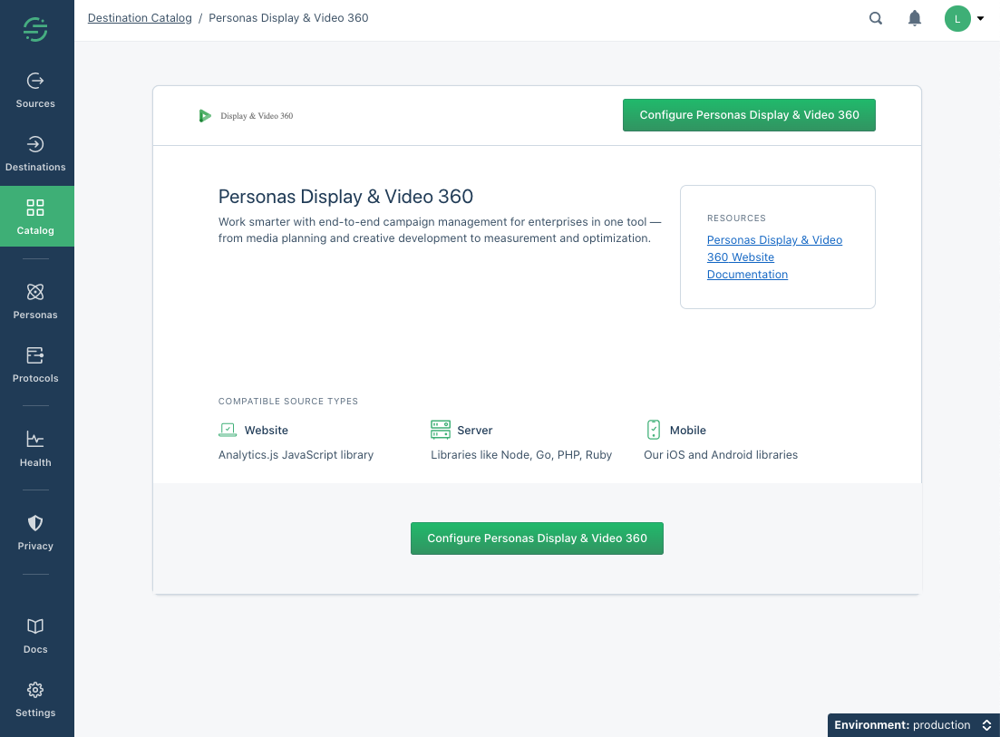
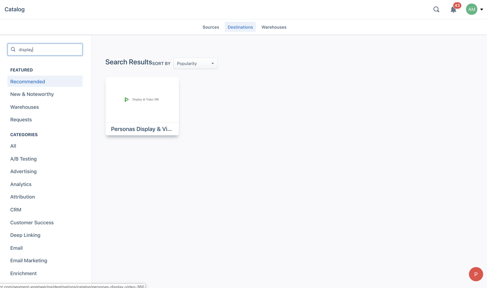
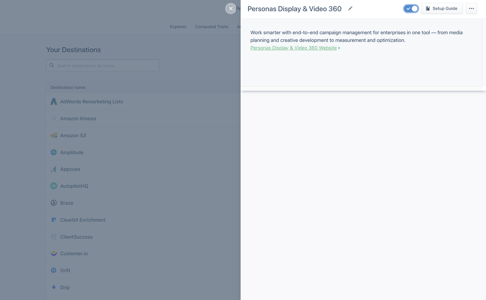
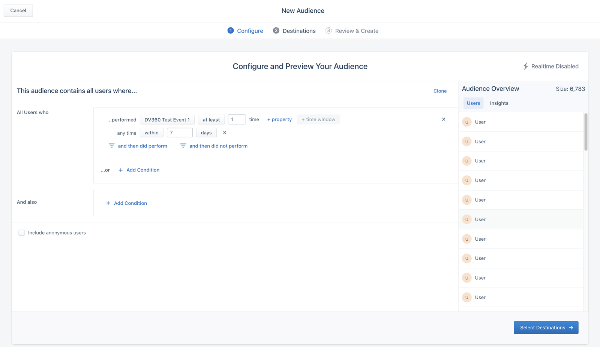
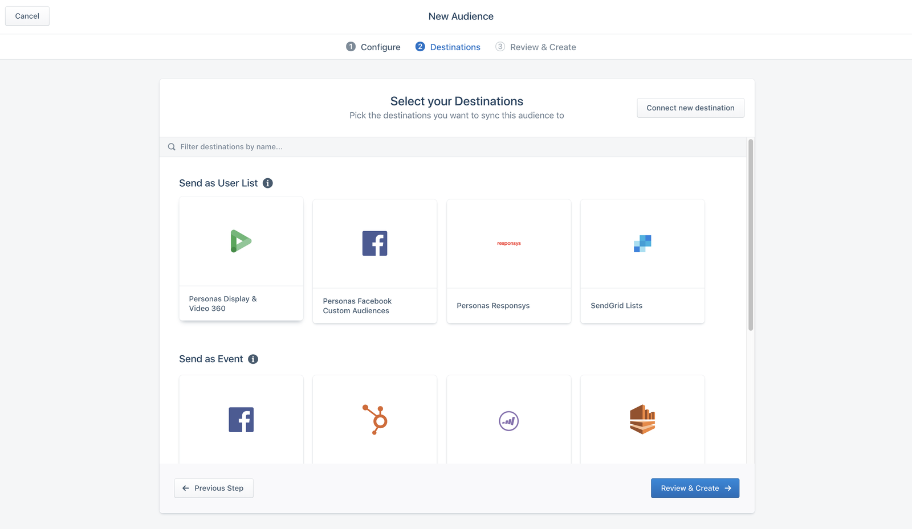
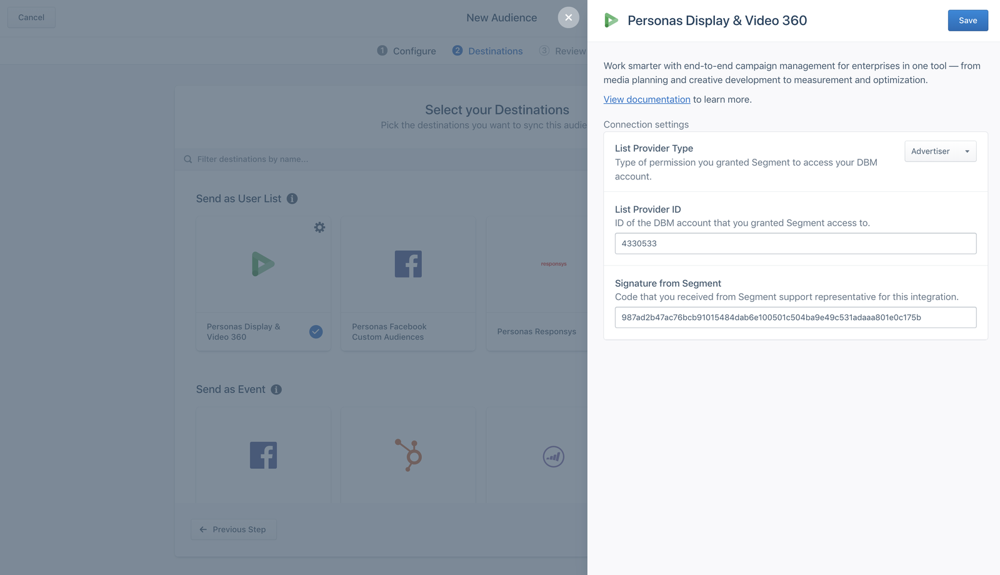

[Google Display & Video 360 (DV360)](https://marketingplatform.google.com/about/display-video-360/), previously called ‘DoubleClick’ and part of the Google Marketing Platform, is an end-to-end campaign management tool for small businesses and enterprises. It can help with anything from media planning and creative development to measurement and optimization. When paired with [Segment’s Personas](https://segment.com/product/personas/), you now have the ability to sync [audience lists](https://segment.com/docs/personas/audiences/) straight to DV360’s platform and perform in-depth analysis on your customer’s browsing and purchasing activities across various client-side platforms.

You must have Personas in your Segment plan to use this destination. Please [contact](https://segment.com/contact/demo) our sales team to try this out.

> info ""
> **Note**: DV360 is currently in beta. This means that there may still be some bugs for us to iron out, and we’re excited to hear your thoughts. If you are interested in joining or have any feedback to help us improve the DV360 Destination, and its documentation, please [let us know](https://segment.com/help/contact)!

## How It Works

When you create an audience in Personas and connect it to DV360, Segment creates a corresponding user list in DV360 with the same name as the audience in Personas. It can take 24 to 48 hours for Google to process the audience list. Once processed, Segment starts syncing either [google user_ids](https://developers.google.com/authorized-buyers/rtb/cookie-guide) or mobile identifiers (`IDFA` on iOS and Google `advertisingId` on Android). Segment sends the entire audience on each sync to DV360. As users enter and exit the audience, they are added to, or removed from from the csv Segment sends to Google’s API.

### Using Google User ID

This integration requires manual set up, both on your end (requesting access from Google) and on the Segment backend. When a customer visits your website, Segment triggers the DV360 cookie id client-side using a cookie-sync, and stores the ID on the Personas user profile. You should see an identifier type `google_gid` on a user’s identities. Then, when you build an audience, Personas uses that cookie ID as the main identifier when it pushes lists of ids to DV360 list endpoints.

> success ""
> **Tip**! The client cookie may use the name “Doubleclick”, a previous version of the DV360 product name.

## Quick Info

- **Personas Destination type**: List
- **Must create audience_name field before Personas can update those values?**: No, Personas creates the audience for you.
- **Audience appears as**: An audience list with the name of your Personas Audience on the DV360 “All Audiences” screen.
- **Destination rate limit**: None.
- **Lookback window allowed**: Unlimited
- **Identifiers required** : One of `ios.idfa`, `andriod.idfa`, or `google_gid`
- **Identifiers accepted** : `ios.idfa`, `andriod.idfa`, and `google_gid`
- **Client or Server-Side Connection**: Server-side
- **Aliasing supported:** No


## Use Cases

DV360 is a new type of integration that uses a client-side component (cookie syncing) and a list-destination component (sending cookies to a list) to expand on your use cases. It is especially useful for re-marketing.

### Suppression Audiences

Create an audience of users that have signed up, purchased a product, or otherwise performed some conversion event. Getting those users into Google in a timely manner (hourly syncs) ensures that marketers aren’t spending extra ad money to target users that have already completed a conversion event.

### Re-targeting Audiences

Another use case is to target everyone who completes an initial action, but doesn’t follow through on a purchase or conversion event. Marketers can create audiences to re-target these individuals and remind them to complete that transaction.

> info ""
> Re-targeting can also mean targeting anonymous visitors (for example, those with no known identifier like email or mobile IDFA). DV360 supports re-targeting using a a cookie-syncing mechanism.

### Connect between Google Products

One benefit of using Google is the [exchange of information between the different Google platforms](https://support.google.com/displayvideo/answer/6339564?hl=en). Once your audience list exists in Google’s Marketing Platform it’s easy to connect to other Google products, and this allows you to reach the specific audiences you care about with greater precision.

## Set Up

### 1. Request that Google grant Segment access

You can grant two levels of permissions:
- access for Segment to push lists to DV360 as a partner as a whole, or
- access for Segment to push lists to specific advertiser or partner IDs in DV360.

Once you decide what level of permissions work best for you, contact your Google account manager and request that Segment be given access your DV360 account. You can use this template:

```
Hi there,

I'd like to request access for Segment (account id 262932431)
to push user lists into DV360 for our ad account <insert your account id>.

Thanks.
```

Google response with an email agreement you must sign to confirm that you want to grant Segment permission to access your account.

Once you accept, Google changes your back-end settings to give Segment the access level you requested.

### 2. Set up client integration

> info ""
> **Note**: This step is only needed if you want to use Google User IDs to build audiences based on website traffic. If you only plan to use _mobile identifiers_, skip to step 3.

To create audiences based on website browsing events, set up the Segment-to-Google cookie-syncing feature. This step allows Segment to retrieve the Google user id using our client-side Analytics.js library.

1. Create a “[Javascript Website](https://segment.com/docs/connections/sources/catalog/libraries/website/javascript/)” source in Segment.
2. Follow [the Analytics.js Quickstart guide](https://segment.com/docs/sources/website/analytics.js/quickstart/).
3. In your workspace, click **Catalog**, and search for **DoubleClick Floodlight**.
4. Connect the destination to the source you created in the first step, and leave all settings blank.

> success ""
> **Tip**: The field "DoubleClick Advertiser ID” is required, but you can enter any value.

### 3. Set up DV360 Destination in Personas

The DV360 Personas destination is in beta, and so you must access it using a special link.

Copy example link below, replacing *both* instances of `<workspace_slug>` with your Segment workspace slug, and replacing `<space_slug>` with your personas space.

```text
https://app.segment.com/<workspace_slug>/destinations/catalog/personas-display-video-360?sourceSlug=personas_<source_slug>&spaceSlug=<personas_space_slug>`
```
Your personas space slug is found in the URL when you are viewing your personas space right after `spaces/`, and your source slug is typically your personas space slug prepended with `personas_`.

Paste the resulting url into your browser’s URL bar and press Enter.

On the screen that appears, click **Configure Display & Video 360**.



<!-- 4/17/2020, still in beta these instructions aren't possible yet
1. Go to the Personas space you want to connect to DV360, and go to the **Destinations** tab.
2. Click **+ Add Destination**, and then search for “display” in the catalog.
3. Click **Configure Display & Video 360**.



-->


### 4. Contact the Segment Support Engineering team to request access

The last configuration item you need is a signature generated by the Segment Support Engineering team. Segment uses this signature as a protective measure so that only _you_ can send audiences to your account.

Submit a ticket using [our contact form](https://segment.com/help/contact) to request this signature.

In the ticket, provide a link to the personas space that will use DV360, the connection entity (or permission type) you want to push lists to (`INVITE_ADVERTISER` or `INVITE_PARTNER`), and the entity (or account) ID.

If you plan to push Google User IDs, also include a link to the source you set up in step 2.

### 5. Create your first DV360 audience

Once you receive the signature, you can create your first audience!

> warning ""
> **Note**: You must set up DV360 as a destination in your Personas space _before_ you create the audience, or else it won’t appear as an option in the list.

1. Go to your Personas space, click the **Audiences** tab, then click **New Audience**.
2. Build your audience!
The audience in the example image below includes all users who complete “DV360 Test Event 1” once in the last seven days:

   

3. When you save the audience, pick **Personas Display & Video 360** as the destination to connect to the audience.

   

4. Finally, the audience requires three settings:
  - List Provider Type (connected entity/permission type)
  - List Provider ID
  - Signature that you received from Segment

   

Google may take 24 to 48 hours to process your audience, and for audience lists to appear in their platform. Because of this, the first few audience syncs after you create the audience might fail.

## Troubleshooting

### Not seeing an audience in Google

Make sure you successfully authorized Segment to sync audiences to Google, and that you authorized the Google account you are trying to use, along with the Personas space you are trying to use.

Google has two levels of permissions that you can authorize:

- authorize Segment to push list to DV360 as a partner as a whole
- authorize Segment to push lists to a specific advertiser/partner ID.

Contact your Google representative to determine which permissions you enabled, and if they match the settings you configured in Segment.

> warning ""
> **Note**: Segment generates signatures based on the Personas space, list provider type, and list provider ID. Signatures are **not** transferable between Personas spaces, and must be regenerated if you change either your list provider type or ID.

### Audience size larger than expected

Personas syncs every IDFA for every user in the audience separately. If a user has multiple IDFAs, they might be associated with more than one IDFA in the Google systems. This might make Google’s user list larger than your audience size in Segment.

### Audience size smaller than expected

If you see fewer users in Google than you see in your audience in Segment, it may be because of Google denying some IDFAs or Google user ids. DV360 denies any IDFAs that Google considers invalid or inactive.
