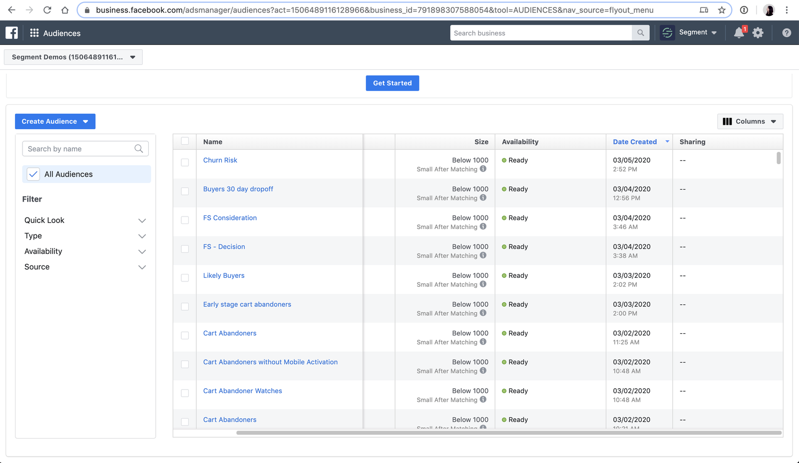

## Overview

The Facebook Custom Audiences Destination is one of the most popular Personas Destinations. It has a variety of use cases related to suppression, acquisition (using lookalikes), retargeting, and more.

This Destination can send audiences (lists of users) created in Personas to Facebook Custom Audiences as a **User-List**. Once you set this up, Segment sends an initial list of users to Facebook, and then keeps it up-to-date as new users enter or exit that audience.

This allows you to run advertising campaigns in Facebook without having to manually find and upload a refreshed a csv of users. We currently support Facebook Custom Audiences for Known Users.

> info ""
> **Note:**You must have access to Personas as part of your Segment plan to use this destination. [Contact the Segment sales team](https://segment.com/demo/) to try this out.

## Other Facebook Destinations Supported by Segment
This page is about the **Facebook Custom Audiences** destination developed specifically for use with **Segment Personas**. For documentation on other Facebook destinations, see the pages linked below.

| **Facebook Destination**                                                                                    | Supported by Personas |
| ----------------------------------------------------------------------------------------------------------- | --------------------- |
| **[Facebook App Events](/docs/connections/destinations/catalog/facebook-app-events/)**                      | Yes                   |
| **[Facebook Offline Conversions](/docs/connections/destinations/catalog/facebook-offline-conversions/)**    | Yes                   |
| **[Facebook Pixel](/docs/connections/destinations/catalog/facebook-pixel/)**                                | No                    |
| **[Facebook Custom Audiences](/docs/connections/destinations/catalog/personas-facebook-custom-audiences/)** | Yes                   |
| **[Facebook Conversions API](/docs/connections/destinations/catalog/actions-facebook-conversions-api/)**    | Yes                   |

## Details

- **Supports Personas**: Yes
- **Personas Destination type**: List
- **Must create audience_name field before Personas can update those values?**: No, Personas creates the audience for you.
- **Audience appears as**: As a Facebook Custom Audience
- **Destination rate limit**: None
- **Lookback window allowed**: Yes
- **Identifiers required** : Email or Mobile Device ID (IDFA)
- **Identifiers accepted** : Email and Mobile Device ID (IDFA). Other identifiers can be sent through [Additional Traits Matching](#public-preview-feature-additional-traits-matching).
- **Client or Server-Side Connection**: Server-side
- **Minimum audience size required**: 100

## Use Cases: Known Users

Facebook Custom Audiences allows you to efficiently run several marketing and advertising operations. The list below contains the most popular use cases when you know personally identifiable information (PII) about your users, such as email address, name, phone number, etc. Facebook takes the data that you send to Facebook Custom Audiences and matches it to the users that are on Facebook to enable these use cases.

1. **Suppression Audiences.** Create an audience of users that signed up, purchased a product, or otherwise performed some conversion event. Getting those users into Facebook in a timely manner (hourly syncs) prevents you from spending money targeting users that already converted. You can do this by creating an Audience in Personas, and syncing it to the Facebook Custom Audience Destination.

2. **Lookalikes & Seed Audiences.** You can use Personas to create a detailed profile of your most loyal customers (sometimes called a “seed audience”) and then send this list of customers to Facebook. In Facebook, you can then use Facebook's lookalike audiencing features to find similar users to target. For example, you might want to create a group of high-value users that have spent a certain amount of money on your product, and then use Facebook audiences to find similar users.

3. **Re-targeting Audiences.** You can use Personas to target users who completed some initial action, but didn't follow through on a purchase or other conversion event. You can create audiences to re-target these individuals and remind them to complete the purchase or other process.

## Use Cases - Anonymous Users (Facebook Pixel support only)

Sometimes, users visit your website and perform high-intent activities such as looking at a product or pricing page multiple times, but they don't convert (buy), and they don't provide any personally identifiable information so you can contact them.

Facebook offers the Facebook Pixel, which allows you to retarget these types of anonymous users with advertising. This works by identifying users based on a cookie set in their browser. You can create a Website Custom Audience in Facebook for this use case.

## How it works

**Every time you create an audience in Personas and connect it to Personas Facebook Custom Audiences, Segment does the following**:

1. Creates a Facebook Custom Audience (of type Customer List) with a name that matches the Personas Audience.
2. Adds any users that fit the audience definition, based on the matching identifiers that Facebook supports (hashed). Facebook uses these identifiers to match users to Facebook users in their ads system.
3. Once the audience is configured, Segment checks which users still fit the audience definition based on the same identifiers, and adds or remove users from the audience, every hour.

> success "Tip:"
> You can use the Audience History feature in Facebook to see this change over time.

## Set up

> success ""
> Before you start, make sure you have a Facebook Ads account with “Advertiser” or “Admin” access to link Personas to Facebook Ads.

### 1. Authorize Facebook Custom Audiences

- Go to your Personas Space in your Segment Workspace.
- Go to the Destinations tab and click “Add Destination”.
- Select the Personas Facebook Custom Audiences option, and click **Configure Personas Facebook Custom Audiences**.
- Authorize Facebook Ads and select a Facebook account ID to sync to.

### 2. Create an audience in Segment Personas & connect to Facebook

- Go to the Audience Builder in Personas and create a new Audience with your desired event and trait criteria.
- Go to your Personas space, and select the Facebook destination you added to connect the audience to Facebook.
- Give the audience a name and description, and click **Create**.
- Your audience starts syncing from Personas to Facebook Ads.

> note ""
> **Note**: If you change the name of the audience in Personas, it will not be reflected in Facebook.

### 3. Verify that the audience appears in Facebook

Once created, the audience should be available in Facebook in ten minutes unless it's unusually large.

- From within Facebook Ads, go to **Business Manager > All tools > Assets > Audiences**.
- Click the Facebook audience name that matches your Personas audience name, and check **Audience History** to see how many users were added.

## Additional Traits Matching

> note ""
> This feature is in Public Preview and usage is subject to the terms contained in the [First Access and Beta Preview Terms](https://segment.com/legal/first-access-beta-preview/){:target="_blank"}. For access, contact your CSM or email Segment at [friends@segment.com](mailto:friends@segment.com).

Previously, Segment only sent email and mobile IDs to Facebook. A new beta feature can send an expanded list of identifiers or traits to Facebook, so that Facebook can try to use these additional datapoints to match to their user profiles. If you have this feature enabled and implemented any of these traits in your Segment tracking, Personas can send this data to Facebook. Segment can now also sync multiple emails if the profile contains more than one. Additionally as part of this feature, Segment hashes fields before sending them downstream to Facebook, if required. (See the table below for hashing requirements.) Please note that the trait data implemented in your Segment tracking must match the naming convention and format specified in the table below, otherwise we are not able to send it to Facebook.

| **Name**        | **Trait Key formats supported**   | **Facebook Keys**  | **FB Hashing Required** | **FB Guidelines**     |
| Email       |                                                              | EMAIL                | Yes (Segment does the hashing for you. In case you are *already* hashing emails, emails will get sent to Facebook double-hashed. Facebook will still match on double-hashed emails, but this is *not* recommended.                  | Trim leading, trail whitespace, and convert all characters to lowercase.                                                                                  |
| Mobile ID   |                                                              | MADID                | No                  | Use all lowercase, keep hyphens.                                                                                                                          |
| First Name  | first_name firstname firstName first                | FN                   | Yes                 | Use `a`-`z` only. Lowercase only, no punctuation. Special characters in UTF8 format.                                                                      |
| Last Name   | last_name lastname lastName last                    | LN                   | Yes                 | Use `a`-`z` only. Lowercase only, no punctuation. Special characters in UTF8 format.                                                                      |
| Phone       | phone phone_number phonenumber phoneNumber          | PHONE (+12023095976) | Yes                 | Remove symbols, letters, and any leading zeroes. You should prefix the country code if `COUNTRY` field is not specified.                                  |
| Gender      | gender gen                                                | GEN                  | Yes                 | Use these values: `m` for male and `f` for female.                                                                                                        |
| Birth Year  | birth_year                                                   | DOBY                 | Yes                 | Use the YYYY format from 1900 to current year.                                                                                                            |
| Birth Month | birth_month                                                  | DOBM                 | Yes                 | Use the MM format: `01` to `12`.                                                                                                                          |
| Birth Day   | birth_day birthday date_of_birth DOB dateOfBirth | DOBD                 | Yes                 | Use the DD format: `01` to `31`.                                                                                                                          |
| State       | state address_state                                       | ST                   | Yes                 | Use the 2-character ANSI abbreviation code, lowercase. Normalize states outside U.S. in lowercase, no punctuation, no special characters, no white space. |
| City        | city address_city                                         | CT                   | Yes                 | Use `a`-`z` only. Lowercase only, no punctuation, no special characters, no white space.                                                                  |
| Zipcode     | zip zip_code zipCode                                   | ZIP                  | Yes                 | Use lowercase, no white space. Use only the first 5 digits for U.S. Use Area/District/Sector format for the UK.                                           |
| Country     | country_code countryCode                                  | COUNTRY              | Yes                 | Use 2-letter country codes (lowercase) in ISO 3166-1 alpha-2.                                                                                             |

## Troubleshooting

### Not seeing an audience in Facebook

Make sure you authorized Facebook and selected the correct account ID.

### Audience size smaller than expected

Segment sends lists of users with identifiers that Facebook supports to Facebook. The matching logic itself occurs within Facebook. Facebook is more likely to be able to match a user profile if you track as many identifiers as possible, including email, mobile advertising identifiers (IDFA, Google advertising ID), and others. If Facebook is unable to identify users based on the data that you provide, then the match rate will be low.

For example, many B2B SaaS businesses have users that sign up for their products with a work email address, like `jane.doe@segment.com`. However, most Facebook users sign up for Facebook with a personal email only, like `janedoe@gmail.com`. If you only provide the work email address, and no other identifiers, then Facebook can't match your user to the Jane Doe Facebook profile. This is the case for all identifiers - Facebook must have the identifier somewhere in a user's profile, or else they can't match on it.

Please note, emails must be in a plain text format. Facebook also provides these guidelines for the emails that you send to them: trim leading, trail whitespace, and convert all characters to lowercase.

### Do you support LTV audiences?
Facebook has a feature called [value-based audiences](https://developers.facebook.com/docs/marketing-api/audiences/guides/value-based-lookalike-audiences/){:target="_blank"} where you can send an additional field like LTV, to tell Facebook how to optimize their advertising based on a customer's value. Personas does not currently support this feature.
