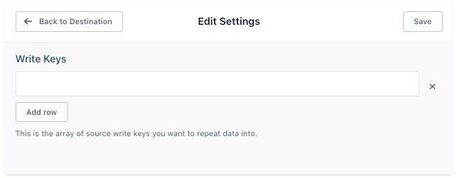

This destination is maintained by Segment and is not available to customers on the free plan.

## Getting Started

The Repeater destination forwards events from a source back into another source, as though that event occurred in the second source.

Events are not cached in the Repeater, so it only handles real-time events. You can specify multiple sources as Repeater destinations.

## Configuration

Add the Repeater as a destination for the source that you want to replicate events from.

Find the source that you want events to flow to, and copy the `writeKey` from that source.

Go back to the Repeater destination's settings, and add this `writeKey` to the write keys list for Repeater.

You can do this for as many sources as you need.

Repeater sends all events it receives to the sources you specified, identified by the write key(s) you added.
