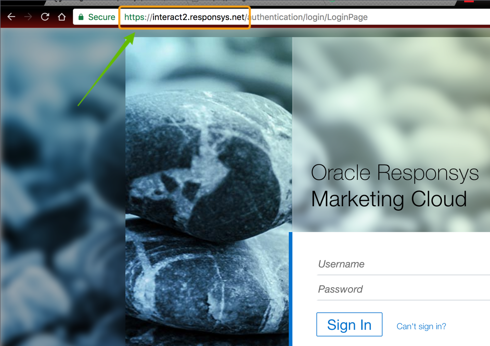

## Getting Started

Before you enable Responsys in your destinations page, there are a few things in your Segment destination settings you must set up. Once the set up is complete, you'll be able to use `.identify()` calls to add records to **Profile Lists**, **Profile Extension Tables** and `.track()` calls to add records to **Supplemental Tables**.

### Pre-requisite steps

1. Choose the **pod** that hosts your Responsys account.

<table>
  <tr>
    <td>Pod</td>
    <td>Login Endpoint</td>
  </tr>
  <tr>
    <td>interact2</td>
    <td>interact2.responsys.net</td>
  </tr>
  <tr>
    <td>interact5</td>
    <td>interact5.responsys.net</td>
  </tr>
  <tr>
    <td>rsys8</td>
    <td>interact.rsys8.net</td>
  </tr>
  <tr>
    <td>rsys9</td>
    <td>interact.rsys9.net</td>
  </tr>
</table>

_NOTE_: You can find your account's endpoint by simply going to your Oracle Responsys login screen and looking at your url.



2. Enter your **username** and **password** for your Responsys account. We require these credentials in order to retrieve an auth token from Oracle in order to send data to your account on your behalf.

3. Enter the name of the default **Folder** you'd like to send your Segment data to. Don't worry, you can override the default folder name on a per-call basis using destination specific options for [`.identify()`](#overriding-default-folder-and-list-names).

4. Enter the name of your default **Profile List** where you would like to store your `.identify()` calls. Again, this can be overriden using destination specific options on a per-call basis as seen [here](#overriding-default-folder-and-list-names).

5. Choose whether you'd like to set your **Default Permission Status** to be `OPTIN` or `OPTOUT`. Unless configured otherwise, the default will be `OPTOUT`.

Once you have entered these required settings, you are ready to integrate your Oracle Responsys account through the Segment platform!

## Identify

There are two things you can do with Segment's `.identify()` calls in regards to Responsys:

* Upsert records to a **Profile List**.
* Extend that record by upserting a corresponding record in a **Profile Extension Table**.

### Merging Records to a Profile List

Take a sample `.identify()` call:

```js
// analytics.js

analytics.identify('rick', {
  email: 'wubba-lubba-dub-dub@morty.com',
  seasonTwo: true,
  phone: '4012221738',
  address: {
    street: '19 Forest Lane',
    city: 'East Greenwich',
    state: 'RI',
    postalCode: '02818',
    country: 'USA'
  }
});
```
**IMPORTANT**: In order to merge records properly, our destination requires that all `.identify()`  contain at least a `userId` or a `traits.email`!

The above call will try to first find an existing record in the provided Profile List with a matching `userId` of `'rick'` and or `email` of `'wubba-lubba-dub-dub@morty.com'`. If a record is found, we will update the rest of the columns so long as you pass the information using our [identify spec](/docs/connections/spec/identify). The below is how we map our spec'd Segment traits to Responsys' semantic Profile List columns:

<table>
  <tr>
    <td>Segment Trait Name</td>
    <td>Responsys Profile List Column Names</td>
  </tr>
  <tr>
    <td>userId</td>
    <td>`CUSTOMER_ID_`</td>
  </tr>
  <tr>
    <td>email</td>
    <td>`EMAIL_ADDRESS_`</td>
  </tr>
  <tr>
    <td>phone</td>
    <td>`MOBILE_NUMBER_`</td>
  </tr>
  <tr>
    <td>address.street</td>
    <td>`POSTAL_ADDRESS_1_`</td>
  </tr>
  <tr>
    <td>address.city</td>
    <td>`CITY_`</td>
  </tr>
  <tr>
    <td>address.state</td>
    <td>`STATE_`</td>
  </tr>
  <tr>
    <td>address.postalCode</td>
    <td>`POSTAL_CODE_`</td>
  </tr>
  <tr>
    <td>address.country</td>
    <td>`COUNTRY_`</td>
  </tr>
</table>

#### Email and Mobile Permission Statuses
If you would like to keep track of users who are opting in or out of marketing communications  in your apps and websites  indicate a key of the custom trait to map to Responsys `EMAIL_PERMISSION_STATUS_` or `MOBILE_PERMISSION_STATUS_` fields in your Segment settings. **NOTE:** The value of this custom trait key must be a boolean. When the value is true that indicates the user wants to opt in and false indicates the user wants to opt out. Segment will transform that boolean into the appropriate Responsys accepted format (`I` or `O`).

_Responsys does not have an API to create Profile Lists so you must create one manually inside their UI_.

### Merging Records to a Profile Extension Table

If you would like to send records to a **Profile Extension Table (PET)**, this destination can either create the PET for you or you can simply enter the name of any of your existing PETs. The match column name will be the `userId` and `email` (must send at least one). So be sure to include the `userId` or `traits.email` in your `.identify()` calls!

#### Creating a Profile Extension Table through Segment:

All you have to do is enter the desired name of your PET in your Segment destination settings.

Say that the following is your first `.identify()` call after you've entered the PET name that does not exist yet in your Responsy account:

```js
// analytics.js

analytics.identify('rick', {
  email: 'wubba-lubba-dub-dub@morty.com',
  name: 'rick',
  age: 60,
  genius: true
});
```

This would create a PET where its columns would be `NAME`, `AGE` and `GENIUS`. Since `email` is mapped already in your Profile List, we will not create a duplicate column in your PET. We will also automatically set the column type according to the value of the trait you've sent. We will run a quick validation such as checking the length of any `string` values to make sure we set the appropriate `STR###` as well as checking any `number` values should be an `INTEGER` or `NUMBER` in Responsys.

The following is how we map the column types as well as what the default type will be in the event more than one valid column type can be set (i.e. A string value that had 24 chars will still default to `STR500`.

<table>
  <tr>
    <td>Segment Trait Value Type</td>
    <td>Possible Responsys Column Types</td>
    <td>Default</td>
  </tr>
  <tr>
    <td>`timestamp`</td>
    <td>TIMESTAMP</td>
    <td>TIMESTAMP</td>
  </tr>
  <tr>
    <td>`number`</td>
    <td>INTEGER, NUMBER</td>
    <td>NUMBER</td>
  </tr>
  <tr>
    <td>`string`</td>
    <td>CHAR, STR25, STR100, STR255, STR500, STR4000</td>
    <td>STR500</td>
  </tr>
  <tr>
    <td>`boolean`*</td>
    <td>STR25, STR100, STR255, STR500, STR4000</td>
    <td>STR25</td>
  </tr>
</table>

NOTE: _Responsys does not have a boolean column type, so we will just stringify to `'true'` or `'false'`_.

**IMPORTANT**: Since Responsys will reject any messages that try to merge columns that do not exist in a given Profile Extension Table, we will make sure to _only_ send accepted column names. So it is very important to keep your tracking code, the destination settings, and your table schema in Responsys in sync!

#### Merging Records to Existing Profile Extension Table

If you already have a Profile Extension Table you'd like to use, simply enter the name of the list in your settings. Note that we will _only_ send traits with matching column names in your schema, meaning that we will drop any traits that are not pre-defined in your PET before sending the request.

### Overriding Default Folder and List Names

If you need more flexibility or need to add different users to various Folders or Profile Lists/Extension Tables, you can use our **destination specific options**.

```js
// analytics.js

analytics.identify('rick', {
  vip: true
}, {
  Responsys: {
    listName: 'segment_vip_emails', // Profile List Name
    folderName: 'segment_vips', // Folder Name
    petName: 'segment_vip_users' // Profile Extension Table Name
  }
});
```

The above call will override all your default names in your Segment destination settings. It is a great way to implement programmatic bucketing of your users into specific folders and lists!

## Track

You can send Segment's `.track()` events to add (**NOT** merge) records to any **Supplemental Table**. However, it is currently not possible to pull all the valid columns for a given Supplemental Table as you would with Profile Lists, meaning that you **must** explicitly map your the names of your track events and properties and provide their corresponding Reponsys table names and column names and types.

#### Creating a Supplemental Table through Segment:

Similar to how our `.identify()` call works, you can opt to let Segment create the Supplemental tables by providing all the necessary mappings in your settings. We will try to upsert records to that table name first and if it doesn't exist, we will create the table for you using the exact column mappings you have provided in the Segment destination settings. You do not need to map every column to Segment properties if you do not wish to do so, as Responsys allows you to update records partially, with the exception of [**Primary Keys**](#primary-keys).

**IMPORTANT**: If you make any updates to your Segment `.track()` or Supplemental Table schema without updating the changes in your destination settings, you can risk records not being added correctly to simply having the messages rejected entirely. Especially if the changes relate to [**Primary Keys** configuration](#primary-keys).

#### Merging Records to Existing Supplemental Tables

As long as you provide the exact mappings that reflects the existing schema of your Supplemental Table, we can add records. You do not need to map every column to Segment properties if you do not wish to do so, as Responsys allows you to update records partially, with the exception of [**Primary Keys**](#primary-keys).

### Primary Keys

All Supplemental Tables must have at least one **Primary Key**. Responsys supports up to four per table. It's very important that whichever properties you choose to set as one of the Primary Keys always have unique values. Otherwise, you will risk overwriting historical records in your Supplemental Tables.

Note that if you are using more than one primary key for a given table, only one of those need to send a unique value in order to successfuly add a new record.

#### Using Segment's messageId as a Primary Key

The easiest way to ensure you choose a unique Primary Key is to enable **Use Segment Message ID**. This feature will send `SEGMENT_MESSAGE_ID` as a primary key column with the value being Segment's `messageId` field. Since this property is uniquely generated by Segment, you can ensure that you do not overwrite any historical records in your tables.

Note that this does count against your limit of four Primary Keys per table.

If you'd like to use this feature for an existing Supplemental Table, you can modify your schema and add the column `SEGMENT_MESSAGE_ID`. If you do not do this but enable this option, all your track events will be rejected by Responsys.

Furthermore, if you do not provide Segment with **all** of the primary key column names, the message will be rejected by Responsys API.

### Map UserId

In order to attribute the event record in your Supplemental Tables with the matching records in your Profile Lists or Profile Extension Tables, we recommend enabling the **Map Segment UserId** option. If enabled, we will send the `userId` attached to the `.track()` payload as a Responsys field.

**IMPORTANT**: Make sure if you are mapping an existing Supplemental Table, you have created a field in your table called `CUSTOMER_ID_`! Otherwise if you have not created the table and is relying on Segment to do so, we will create the field `CUSTOMER_ID_` and set the field type as `STR500`.

### Map Email

Since we still accept `.identify()` calls without `userId`s so long as it has `traits.email`, you can also enable this for your `.track()` events if you want to attribute event records using `email`. We will lookup `context.traits.email` (which is automatically cached if you are using a mobile library), `properties.email`, and fallback on the `userId` field if it is a valid email address.

**IMPORTANT**: Make sure if you mapping an existing Supplemental Table, you have created a field in your table called `EMAIL_ADDRESS_`! Otherwise, if you have not created the table and is relying on Segment to do so, we will create the field `EMAIL_ADDRESS_` and set the field type as `STR500`.

## FAQ

### How do you handle nested objects?

We will flatten any traits or properties that are nested objects of arrays and objects with the delimiter of an underscore.

Take the following `.track()` call with some nested properties:

```js
// analytics.js

analytics.track('Watched Rick and Morty', {
  show: {
    title: 'Rick and Morty',
    episode: {
      season: 1,
      categories: ['comedy']
    }
  }
});
```
We would send column names as:

* `show_title`: `'Rick and Morty'`
* `show_episode_season`: `'1'` (_note_: Responsys accepts strings for column types NUMBER and INTEGER so we always stringify `number`s)
* `show_episode_categories_0`: `'comedy'`

**IMPORTANT**: When mapping your Segment Properties for those that you know you will be sending as nested objects, be sure to type the flattened version. So for example, if you are sending:

```js
// properties
{
  address: {
    street: '100 California Street'
  }
}
```

You should enter `address_street` as your Segment Property Name.

### I'm seeing a 'Merge cannot be done on one field' in the Segment debugger!

This error occurs when you try to upsert a record to a Profile Extension Table but you did not provide any additional traits other than what we used to match the columns. For PETs, we use your `userId` or `traits.email` from your `.identify()` calls to upsert the record. You need to send at least one other trait that would map to a field in your PET.
