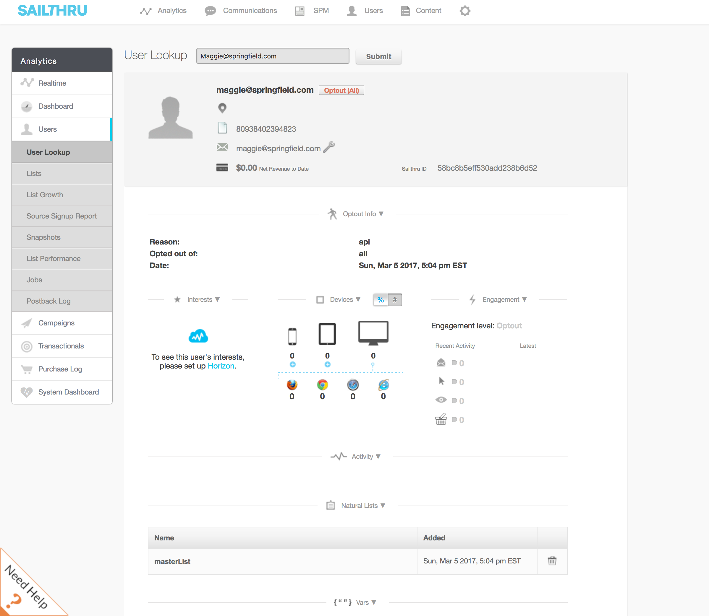
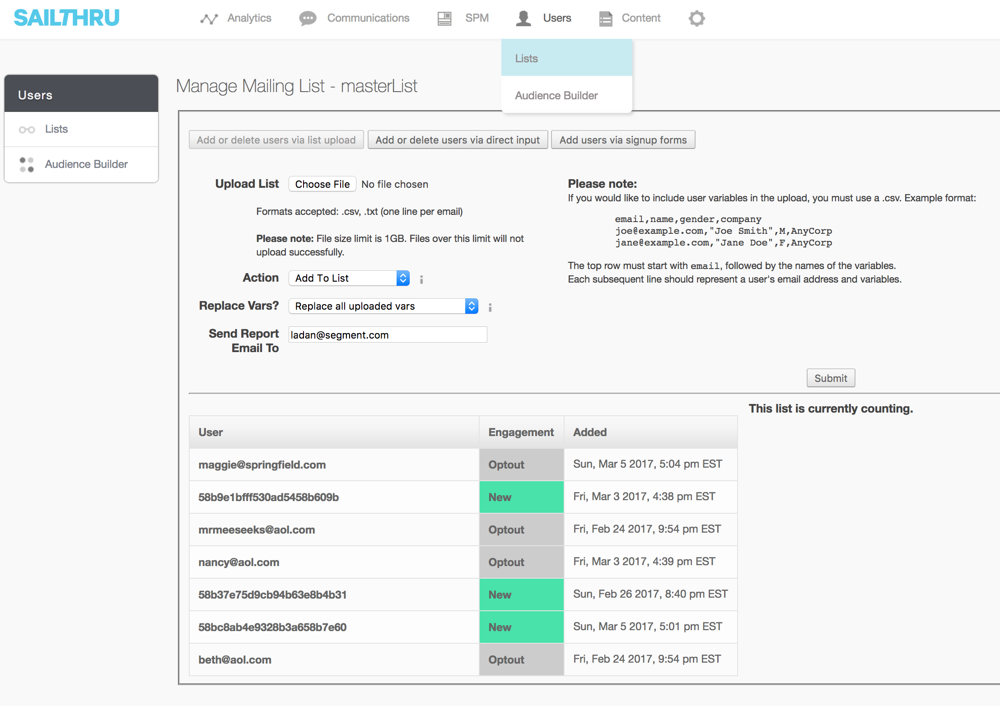
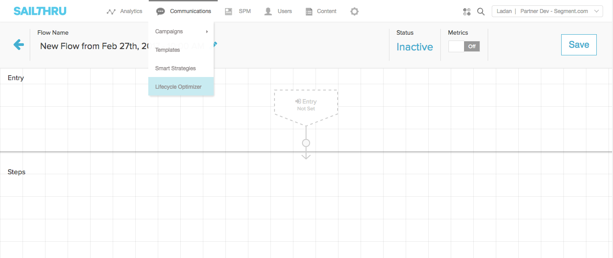
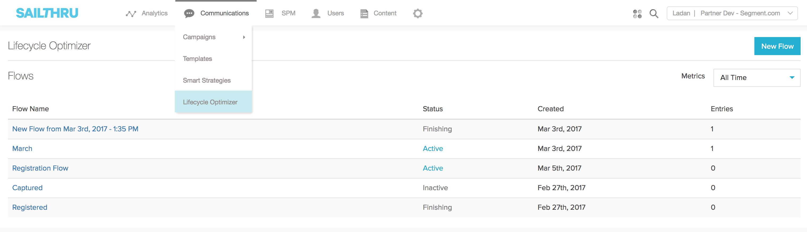
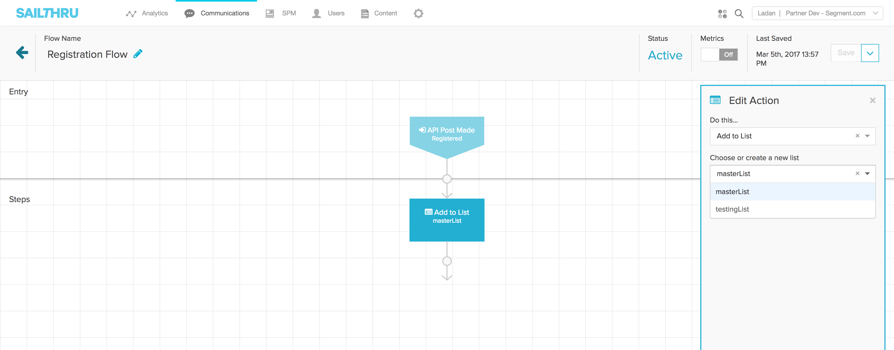
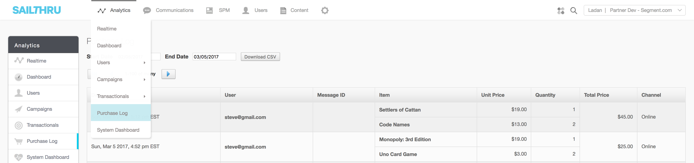
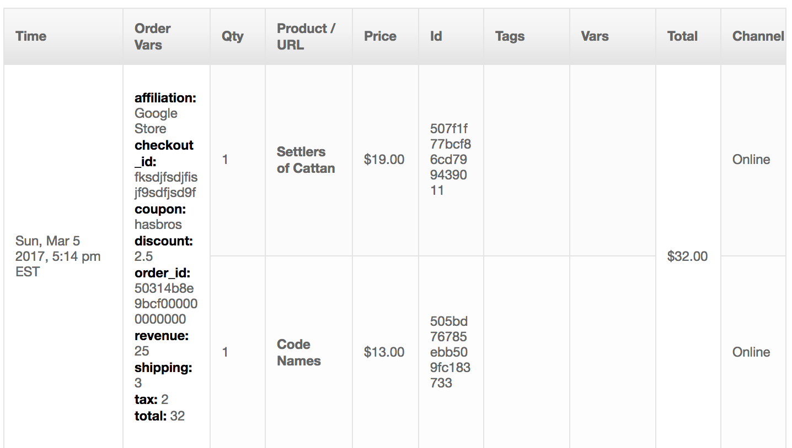
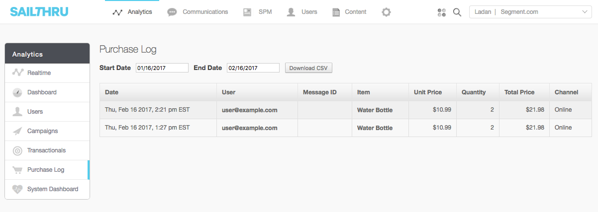

## Getting Started

The Sailthru server-side destination will allow you to add users, send custom events and purchase events. Once the Segment library is integrated, toggle Sailthru on in your Segment destination panel and add your API Key and Shared Secret, which you can find in the Sailthru Dashboard under **App Settings > set up > API & Postbacks**.

## Implementation Checklist

**Important**: In order for this destination to work, you must have a few prerequisite configurations.

- You must have `extid` lookup enabled in Sailthru.
- Use the [ecommerce v2](/docs/connections/spec/ecommerce/v2/) events to track `Order Completed`, `Product Added`, and `Product Removed`.
  -  For `Product Added` and `Product Removed` events, whether there is an `email` or not, we need to make a request to grab the items in the user's cart. We rely on the `userId` value for this request. It is essential that you have a `userId` on these calls, otherwise they will not make it to Sailthru.
  - To trigger abandoned cart campaigns, you must pass in a `reminder_time` and `reminder_template` on the `Product Added`and `Product Removed` events.
  - The template passed through as `reminder_template` must match the public name configured in Sailthru's UI.
- We recommend appending `traits.email` whenever possible in your `identify` calls. If you send an `identify` call without a `traits.email` and only a `userId`, the profile will be created in Sailthru but you would not be able to find that user using their **User Look Up** feature.

- - -
### Page

You must configure a `customerId` in your integration settings in order to use the `page` functionality. This value is only required for `page` calls and can be found in your Sailthru Dashboard under **App Settings**

When you call `page`, we will hit the Sailthru `page` endpoint and you will see the calls populate in the **Sailthru Realtime Dashboard**.

The `context.page.url` is also a required field for all `page` calls, so be sure this is present on each call.

We will automatically handle the proper identification of user's in Sailthru using the Segment `userId`.

#### Tags

Sailthru provides an out of band web scraper that will automatically collect contextual information from your pages to power their [personalization engine](https://getstarted.sailthru.com/site/personalization-engine/meta-tags/). If the design of your site requires passing these tags to Sailthru manually (Single Page Apps are one example) you can manually pass them using a `keywords` property in the `page` event:

```js
analytics.page('Page Name', {
  keywords: ['football', 'new york giants', 'eli manning']
})
```

See our [documentation](https://segment.com/docs/connections/spec/page/#properties) for more info on the `keywords` property.

- - -

### Identify

When you `identify` a user, we will pass that user's information to Sailthru with `userId` (or `anonymousId` if `userId` is not passed) as Sailthru's External User ID (`extid`). Segment sends all traits as `vars` to Sailthru.

Segment will automatically alias users for you so if you `identify` a user who you had previously only identified with an `anonymousId`, we will merge the profile with `anonymousId` into a new profile with `userId` as long as you pass both `anonymousId` and `userId`.

An `identify` event will appear in Sailthru's user lookup feature if there is an email present (Sailthru only allows a user lookup up based on an email):



Or within the **Users > Lists** feature, based on the default list you configured in the Segment UI or passed in through the destinations object like so:

```js
analytics.identify("38472034892",{
    "name": "Hamurai",
    "email": "Hamurai@example.com",
    "quote": "Rick, you love those BBQs, Rick"
  },{
    Sailthru:{
      defaultListName: "testingList"
    }
  });
```



You can also configure an `optout_email` value in the Segment UI, or pass in a value through the destinations object with one of the Sailthru expected values:

```
analytics.identify("3242351231",{
    "name": "Duck With Muscles",
    "email": "MusclesQuack@example.com",
    "quote":  "Oh, wow...Baby Wizard was a Parasite?!"
  },{
    Sailthru:{
      optoutValue: "basic"
    }
  });
```

So if you send an `identify` call without a `traits.email` and only a `userId`, the profile will be created in Sailthru but you would not be able to find that user using their **User Look Up** feature.

### Track

When you `track` an event, we will send that event to Sailthru as a custom event. **Important**: You must have each event mapped in Sailthru within **Communications > Lifecycle Optimizer** in order to use the custom event. Be sure that the **Status** is set to **Active**:



Your account must have triggers or lifecycle optimizer enabled. This should be enabled when the account is setup, however, just to be sure you may need to contact your account representative to confirm it is enabled.

A custom event will hit the **Sailthru Lifecycle Optimizer** feature. Navigate to **Communications > Lifecycle Optimizer** in your Sailthru dashboard:




Configure a custom event to a new flow and trigger a follow up action to the event:




For instance, in the above example notice that the `Registered` event will add the user who trigger the event to a list.

### Purchases

When you `track` an event with the name `Order Completed` using the [e-commerce tracking API](/docs/connections/spec/ecommerce/v2/#order-completed), we will send the products you've listed to Sailthru's purchase log:



In addition, it will also appear within the user view under purchase history:



Note that the main identifier is `email` not `id`


Sailthru does not allow the `extid` to be the main lookup identifier for their Purchase API. Instead, Sailthru requires an `email` as the primary identifier. Segment will make a GET request to retrieve the user's email based on their `userId`, which is their `extid` in Sailthru.

If the user and their email does not exist in Sailthru, the event will throw an error. If the user exists, the purchase will be added to their profile. Be sure to call `identify` with an `email` passed in the `traits` object prior to the `Order Completed` event. If you are sending events using one of Segment's server-side libraries and want to be sure, you can also send the email value in your `track` calls under `context.traits.email`.

Once `Order Completed` is triggered, Segment will pass in `incomplete: 0` to signify that the order is now complete. Segment will map the following Sailthru [required fields](https://getstarted.sailthru.com/new-for-developers-overview/advanced-features/purchase/#Parameters_forPOST) from the [v2 Order Completed Spec](/docs/connections/spec/ecommerce/v2/#order-completed):

| Sailthru Spec | Segment Spec |
| --- | --- |
| title | products.$.name |
| qty | products.$.quantity |
| price | products.$.price |
| id | products.$.product_id |
| url | products.$.url |

**Note**: the `url` field is required by Sailthru for each product. If it's not explicitly attached to the product, Segment will pull this value out from the `context.page.url` for you, so be sure this value is present on each `Order Completed` event if you're not attaching specific urls with each product.

In addition, the following optional parameters will be mapped:

| Sailthru Spec | Segment Spec |
| --- | --- |
| adjustments | adjustments |
| tags | products.$.tags |
| image_url | products.$.image_url |
| image_url_thumb | products.$.image_url_thumb |

`adjustments` is not a standard Segment event, but will be sent to Sailthru as-is if it's present in the event properties.

Note that purchases cannot be edited once they are posted.

## Abandoned Cart Events

In addition to `Order Completed` events, we support the concept of [Sailthru's Abandoned Carts](https://getstarted.sailthru.com/email/transactionals/abandoned-shopping-carts/) using Segment's `Product Added` and `Product Removed` events. When these events are triggered, Segment will pass in `incomplete: 1` to signify that the order is incomplete.

To send transactional emails when a user abandons their cart, you must pass in a `reminder_time` and `reminder_template` on the `Product Added` and `Product Removed` events. The template passed through as `reminder_template` must match the **public name** configured in Sailthru's UI.

If you send in a `Product Added` event without a valid template, Sailthru will return an error. If you send in a `Product Added` event with the `reminder_template` param, it will successfully send in and appear in the user view within their **incomplete purchase cart**. Some example values for `reminder_time` are 60 minutes, 24 hrs, 2 weeks. Segment will handle passing in the `+` increment.

```javascript
analytics.track('Product Added', {
  cart_id: 'skdjsidjsdkdj29j',
  product_id: '507f1f77bcf86cd799439011',
  sku: 'G-32',
  category: 'Games',
  name: 'Monopoly: 3rd Edition',
  brand: 'Hasbro',
  variant: '200 pieces',
  price: 18.99,
  quantity: 1,
  coupon: 'MAYDEALS',
  position: 3
}, {
  integrations: {
    Sailthru: {
    'reminder_template': 'abandoned cart',
    'reminder_time': '+20 minutes'
    }
  }
});
```
_Note:_ All `Product Added` and `Product Removed` events going into Sailthru must have a `userId`. Sailthru must understand the state of a user's cart when updating an item within the cart. To understand this, Segment makes a `get` request with the `userId` value to retrieve a user's cart.

For `Product Added` events, we check the item added using the `productId` against the items we retrieved from Sailthru within the user's cart. If the item is present, we increase the quantity by one. If there are no items in the retrieved cart, we simply add the item.

For `Product Removed` events, if the product is present, we then check the `qty`, subtracting the quantity of the one item, and add the remaining quantity back into the purchase payload.  If there is only item, we remove it completely and push up the empty cart. If we fetch an empty cart, we return the error `'Nothing to remove from Incomplete Cart for this user.'`.

## Settings

In addition to the required settings, you will have the option to configure an optout value, a default reminder time/template, and a default list name in the destination settings UI.

### Optout

The default status for the optout value is `none` or you can select `all`, `basic` or `blast`. **Note:** Configuring a setting other than `none` in your integrations settings will apply to **all users**. If you need to dynamically opt users in or out of emails, pass the setting as a parameter on each event.

`all`: Opts the user out of all emails (campaigns & transactionals). This is the default status when a subscriber marks your email as spam from within an email client.

`basic`: This opt-out set up allows for certain communications (see some acceptable examples in the next bullet) to always send to a user – despite their status.

`blast`: Opts the user out of all campaign emails. The user will still receive all transactional (1:1) emails.

`none`: Optout(none) is a way of revalidating users back from being any type of optout. This would only be used if an end user has previously opted out and would like to opt back in to be a valid user.

You can read more about [Optout Levels here](https://getstarted.sailthru.com/managing-my-account/hosted-pages/user-optout-levels/).


### Adding users to a list
To configure a default list name, Segment exposes a setting to configure this in the UI. You can also explicitly set your own `defaultListName` through the destination option on `identify`.

### Reminder Time and Template
To configure a default reminder time and template, enter the **public name** of your template (configured in Sailthru's UI) and the time frame you will want the email to send. Some example values are 60 minutes, 24 hours, 2 weeks. Segment will handle passing in the `+` increment. To read more about how Sailthru calculates time, refer to their [time documentation](https://getstarted.sailthru.com/developers/zephyr-functions-library/time/).


## FAQ

### Rate limits
All calls are subject to rate limits.
 * For `identify` events, we hit the `/user` endpoint, which allows 300 requests/second.
 * All others allow 40 requests/second.
 * Limits can be raised on a case-by-case basis in order to support valid business practices. contact your Sailthru account representative for more.

### Nested Traits and Property Handling

Sailthru does not accept nested custom traits or properties, so by default we will flatten any custom nested properties. For example, see the below nested properties and the flattened output:

```json
{
  "input": {
    "type": "track",
    "userId": "14092348",
    "event": "Played Game",
    "timestamp": "2017",
    "properties": {
      "levels": [
        1,
        2,
        3
      ],
      "arcade": {
        "blips and chitz": {
          "planet": "Parblesnops"
        },
        "galaxy": {
          "coordinates": "1232.4832"
        },
        "games": [
          "Roy: A life well lived",
          "Whack a mole"
        ]
      }
    }
  }
}
```

```json
"output": {
"id": "14092348",
"key": "extid",
"event": "Played Game",
"vars": {
"levels_0": 1,
"levels_1": 2,
"levels_2": 3,
"arcade_blips and chitz_planet": "Parblesnops",
"arcade_galaxy_coordinates": "1232.4832",
"arcade_games_0": "Roy: A life well lived",
"arcade_games_1": "Whack a mole"
},
"format": "json",
"api_key": "xxxxxxxxx",
"shared_secret": "xxxxxxxxxx",
"sig": "70f7461c89c789688c5a0680dae6f08f"
}
}
```

### Replays
Note that Sailthru does not support historical replay.
