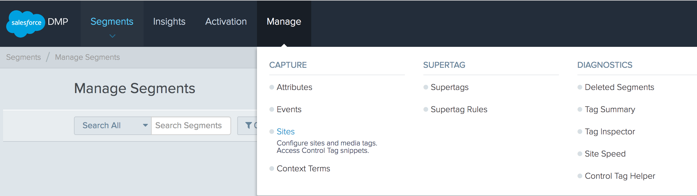

[Salesforce DMP](https://konsole.zendesk.com/hc/en-us) allows website operators
to create a holistic databank to organize, taxonomize and make their full range
of audience information actionable. It allows them to model, define and manage
audience segments to improve content delivery and advertising revenue.

_**NOTE:** Salesforce DMP is currently in beta. This means that there may still be some bugs for
us to iron out. If you are interested in joining or have any feedback to help
us improve the Salesforce DMP Destination and its documentation,
[let us know](https://segment.com/help/contact)!_

## Getting Started



Next, configure the Destination in the Segment web app:

1. From the Segment app Destinations page, click **Add Destination**.
2. Search for "Salesforce DMP" (or "SFDMP") in the Destinations Catalog, and confirm which Source to connect with this new destination.
3. Follow the steps in the sections below depending on which type of implementation you have:
   - [Set up for Client Side web Implementations](#setting-up-a-client-side-web-implementation)
   - [Set up for Server-Side Implementations](#setting-up-for-a-server-side-implementation)

### Setting up a Client-Side Web Implementation

3. Get your **Config ID** from your SFDMP console. Log into the
   console and go to **Manage** > **Capture** > **Sites**.
   If you don't see this option, contact your SFDMP representative.

4. In the **Sites** tab, locate the site you want to use as the SFDMP destination.
   If you haven't created any sites yet, click **Create Site** and go through the options to create a new site.

   

5. In the dropdown, find the site tag for the site you want to use. The string you need is under "Config" and will look something like `r0u08k4tz`.
6. Go back to the Segment App, and navigate to the Salesforce DMP destination you're setting up. Locate the ConfigID setting, and paste the value you found in that field.

To send client-side events to SFDMP, you must include a SFDMP Config ID and
SFDMP Namespace in your Segment settings. Segment's UI enforces inclusion of a
`configId` (meaning you can't enable the destination without it); however,
Segment's UI does not enforce the inclusion of a `namespace`.

If you don't provide a `namespace` Segment can't pass events downstream to SFDMP and will instead no-op until you add the `namespace`.

### Setting up for a Server-Side Implementation

6. To set up SFDMP for a server-side connection, enter your SFDMP `Server-side
   Publisher UUID`. To locate this, we recommend that you contact your SFDMP representative. Helpful documentation can be found
   [here](https://konsole.zendesk.com/hc/en-us/articles/219493027-Mobile-HTTP-API).
7. Once you've retrieved your `Server-side Publisher UUID`, follow the
   instructions in the Segment SFDMP settings to enter your `Pixel.gif Domain`,
   `Pixel.gif Site` and, optionally, your `Pixel.gif Section` in the correct
   fields.
8. If you instead want to send your `track` events to SFDMP's
   Event.gif endpoint instead of their Pixel.gif endpoint, first disable the
   `Send Server-Side Track Calls to the Pixel.gif Endpoint` (it defaults to on)
   setting in the Segment UI.

## Client-side Web: Identify

Upon invocation of a Segment `identify` event, Segment will push `userId`,
`anonymousId` and `crossDomainId`, if available, to the SFDMP `kruxDataLayer` as
`segmentio_user_id`, `segmentio_anonymous_id` and `segmentio_xid`,
respectively.

Segment does not support mapping `traits` to SFDMP attributes.

## Client-side Web: Track

Segment pushes only mapped properties and `context.traits` from whitelisted
Segment `track` events to the SFDMP `kruxDataLayer`.

You can whitelist Segment `track` events in your Segment UI settings.

You can map `track` event properties to SFDMP by specifying mappings in your
Segment UI settings.

Once mapped and associated with whitelisted events, Segment pushes properties
and `context.traits` to the `kruxDataLayer`. Key-value pairs pushed to the
`kruxDataLayer` are forwarded to SFDMP as `page attributes`. You can customize
whether these properties are classified as `page attributes` or other attribute
types (such as `user attributes`) in your SFDMP dashboard.

## Client-side Web: Page

Segment does not send client-side Web `page` events downstream to SFDMP. This
is to avoid sending duplicate data to SFDMP.

SFDMP's control tag automatically triggers a call to SFDMP's Pixel.gif endpoint
on page load. SFDMP's control tag automatically collects contextual information
about the user and browser as `page attributes`.

## SFDMP Client-Side FAQ

Segment's integration with SFDMP inherits many SFDMP native functionalities,
and these functionalities can be adjusted only by updating settings within the
SFDMP dashboard or by contacting your Salesforce representative.

If you are unsure of where to find your SFDMP settings or are unsure of what
your SFDMP settings are, contact your Salesforce representative.

### Allowlisting and Blocklisting Properties

SFDMP manages its own filters and settings, which you must adjust either in the
SFDMP dashboard or by contacting a Salesforce representative. Note that SFDMP
settings are independent of Segment UI settings. Updating a setting in SFDMP
will not affect settings in Segment and vice versa. Therefore, it is important
to ensure that SFDMP and Segment settings do not conflict.

SFDMP has its own property allowlisting and blocklisting rules. For example,
you could set up a blocklist rule in SFDMP. This means that Salesforce will
accept any attributes save for those that have been explicitly blocklisted in
their system.

A whitelist works the opposite way. Setting up a whitelist rule means that
SFDMP will not accept any attributes that have not been explicitly whitelisted
in their system.

If you map Segment properties in your Segment settings, remember that you must
also adjust your SFDMP settings appropriately to ensure that SFDMP will accept
your mapped properties.

Say you map property `price` in your Segment settings to SFDMP page attribute
`price`. If you have a whitelist set up in SFDMP and have not whitelisted the
attribute `price` in SFDMP, the expected behavior is that Pixel.gif calls to
SFDMP will not include the `price` attribute. Remember, mapping the property
within Segment's dashboard will not override your SFDMP's internal account
settings. If this is the case, adjust your SFDMP settings or contact your
Salesforce representative for assistance.

### Attribute Transformations

SFDMP collects any `track` event property pushed to the SFDMP `kruxDataLayer`
as a `page` attribute by default.

To collect a Segment property as an SFDMP `user attribute` instead, contact your Salesforce representative for instructions on how to adjust your SFDMP settings.

### Attribute Delimiters

SFDMP can split an attribute value into many individual values based on a
delimiter. For example, say you have a property `colors` with a value
`red,green,blue,yellow`. You can adjust your SFDMP settings so that it recognizes a comma as a delimiter for this attribute. That way, you can
create audience Segments based on individual attribute values such as "red",
"green", "blue" and "yellow" rather than on complete strings like
"red,green,blue,yellow".

To set up a custom delimiter, contact your Salesforce representative.

### Attribute Cacheing

SFDMP by default caches attributes client side. As a result, any attributes
collected client side will be associated with all following whitelisted events
unless the attribute is explicitly overridden.

For example, say one of your whitelisted Segment track events contains the
property key-value pair `color: 'red'` :

```javascript
analytics.track('Button Clicked',
  color: 'red'
});
```

The above Segment event pushes the key-value pair `color: 'red'` to the SFDMP
`kruxDataLayer`, then triggers a call to the Pixel.gif endpoint, which scrapes
the `kruxDataLayer` and sends `color: 'red'` as a page attribute.

Then you send another whitelisted event:

```javascript
analytics.track('Picture Viewed');
```

This event "Picture Viewed" will produce a call to SFDMP's Pixel.gif endpoint
with the page attribute `color: 'red'`, in spite of the fact that this
attribute was not explicitly associated with this event. This is expected
behavior and a result of SFDMP's out-of-the-box client-side cacheing.

Say, then, you send another whitelisted event:

```javascript
analytics.track('Updated Preferences', {
  color: 'blue'
});
```

This event would produce a call to SFDMP's Pixel.gif endpoint with the page
attribute `color: 'blue'`, as this event overrode the value of the previous
color attribute.

The ramification of this behavior is that SFDMP will continue to cache page
attributes for whitelisted events on all single-page applications until a page
reload. contact your Salesforce representative for additional questions
about SFDMP's attribute cacheing functionality.

### Page Scraping for Page Attributes

SFDMP may be set up to automatically scrape values from your page and append
these values to outgoing Pixel.gif calls.

For example, say you have defined a global object:

```javascript
var appInfo = { app_name: 'test application' }
```

You can set up SFDMP's control tag to automatically scrape the key-value pair
`app_name: 'test application'` from the global object "appInfo". This means that you don't necessarily have to update your Segment
implementation to send additional attributes downstream to SFDMP.

If you see page attributes automatically appended to outbound Pixel.gif calls
and you're not sure where the attributes came from, then you or someone on
your team has likely set up page scraping in SFDMP.

Warning: If you decide to rely on SFDMP's page scraping to transmit attributes
to SFDMP rather than adding them as properties to Segment events, you won't
see these properties in other Segment connections, including in a raw data
warehouse.

If you have questions about setting up or adjusting page scraping,
contact your Salesforce representative.


## Server-Side: Identify, Track, Page, and Screen

By default, Segment sends all events to SFDMP's Pixel.gif endpoint.

Segment treats `page`/`screen`, `track` and `identify` calls the same when
sending data to SFDMP regardless of if it's configured to use mobile or server side. This is because SFDMP is more interested in user properties and attributes associated with user actions, and does not usually create audiences from events. By treating all events the same, Segment stays unopinionated about the events with which user traits and properties are associated.

By default, Segment does not map any _properties_ downstream to SFDMP. You can
map properties and other values by adjusting the settings in your Segment/SFDMP
dashboard.

Segment, however, maps the following contextual information from raw Segment
payloads to SFDMP out of the box. Segment sends data to SFDMP in the
querystring of a `GET` request.

To illustrate where each field is located in a Segment raw event, and what
Segment maps downstream for each field, the examples in this section are
based on the following raw Segment event payload.

```javascript
{
  "anonymousId": "123",
  "context": {
    "device": {
      "advertisingId": "123",
      "manufacturer": "Apple",
      "model": "iPhone7,2"
    },
    "library": {
      "name": "analytics-android",
      "version": "4.3.1"
    },
    "locale": "en-US",
    "os": {
      "name": "Android",
      "version": "8.1.3"
    },
    "userAgent": "Dalvik/2.1.0 (Linux; U; Android 7.0; SAMSUNG-SM-G930A Build/NRD90M)",
    "ip": "127.0.0.1"
  },
  "event": "Segment Test Event",
  "type": "track",
  "userId": "123"
}
```

**advertisingId**

The value of field `msg.context.device.advertisingId`.

| Value Passed to Segment | Value Sent to SFDMP |
|-|-|
| Any String value (for example, `123`) | _kpid: `123` |

**userId**

The value of field `msg.userId`.

| Value Passed to Segment | Value Sent to SFDMP |
|-|-|
| Any String value (for example, `123`) | _kua_segmentio_id: `123` |

**anonymousId**

The value of field `msg.anonymousId`.

| Value Passed to Segment (Expected Data Type) | Value Sent to SFDMP |
|-|-|
| `123`(String) | _kua_segmentio_anonymous_id: `123`|

**os.name and tech_browser**

Segment uses the value of field msg.context.os.name to derive the `tech_browser` user attribute for SFDMP.

| Value Passed to Segment (Expected Data Type) | Value Sent to SFDMP |
|-|-|
| `Android`(String) | tech_browser: `android_app`|

Segment derives `tech_browser` from `msg.context.os.name` by appending `_app`
and calling the String method `.toLowercase()` on the concatenated value.

| Value Passed to Segment (Expected Data Type) | Value Sent to SFDMP |
|-|-|
| `Roku`(String) | tech_browser: `roku_app`|

**tech_browser_lang and context.locale**

Segment uses the value of field msg.context.locale to derive the `tech_browser_lang` user attribute for SFDMP.

| Value Passed to Segment (Expected Data Type) | Value Sent to SFDMP |
|-|-|
| `en-US`(String) | tech_browser_lang: `en`|

Segment derives tech_browser_lang from `msg.context.device.locale` by
extracting the first two characters of the String value of this field.

| Value Passed to Segment (Expected Data Type) | Value Sent to SFDMP |
|-|-|
| `en-US`(String) | tech_browser_lang: `en`|
| undefined or null | tech_browser_lang: `en`|

**device information**

Device.model Segment passes the value of field msg.context.device.model as
a user attribute for SFDMP.

| Value Passed to Segment (Expected Data Type) | Value Sent to SFDMP |
|-|-|
| `iPhone7,2`(String) | tech_device: `iPhone7,2`|

device.manufacturer Segment passes the value of field msg.context.device.model as user attribute tech_manufacturer to SFDMP.

| Value Passed to Segment (Expected Data Type) | Value Sent to SFDMP |
|-|-|
| `Apple`(String) | tech_manufacturer: `Apple`|

**os.version**

Segment passes the value of `msg.context.os.version` as user
attribute `tech_version` to SFDMP.

| Value Passed to Segment (Expected Data Type) | Value Sent to SFDMP |
|-|-|
| `8.1.3`(String) | tech_os: `8.1.3`|

If the value of `msg.context.os.name` is equal to `Android`, Segment prepends
`Android_`to the value of the user attribute (for example, `Android_8.1.3`) sent
downstream. This behavior is at SFDMP's request and does not apply to any
other OS.

**context.ip**

Segment sets the value of `msg.context.ip` in an
`X-Forwarded-For` header in the outbound payload.

| Value Passed to Segment (Expected Data Type) | Value Sent to SFDMP |
|-|-|
| `127.0.0.1`(String) | -H `X-Forwarded-For: 127.0.0.1`|
| undefined or null | The `X-Forwarded-For` header is not set in the outbound request to SFDMP. |

Segment's client-side libraries (Analytics.js, Android, iOS) collect IP address
automatically. If using a server-side library or HTTP library, you must collect
the IP address manually and pass it into your Segment event payload. Otherwise,
an `X-Forwarded-For` header will not be set.

## Sending Data to the Event.gif Endpoint

While Segment treats `page`/`screen` and `identify` events the same,
SFDMP works slightly differently for Segment `track` events if you decide to
send data to their Event.gif endpoint by disabling the `Send Server-Side Track Calls to the Pixel.gif Endpoint`
setting in the Segment UI.

Sending data to SFDMP's Event.gif endpoint requires that you map any Segment
event names to SFDMP event IDs in the `Server-side Event ID Mapping` setting in
Segment's UI. Segment `properties` must be mapped to SFDMP properties in the
`Event Attribute Mapping` setting in Segment's UI. **Note** that `track`
properties sent to SFDMP using their Event.gif endpoint must be set up in
SFDMP's dashboard before SFDMP will accept them.

In addition, Segment maps fewer event properties to SFDMP out of the box:

**advertisingId**

The value of field `msg.context.device.advertisingId`.

| Value Passed to Segment | Value Sent to SFDMP |
|-|-|
| Any String value (for example, '123') | _kpid: `123` |

**track event name**

The value of field `msg.event`.

| Value Passed to Segment | Value Sent to SFDMP |
|-|-|
| Any String value (for example, 'Account Created') | event_id: <`id mapped in Event ID Map UI setting`> |
