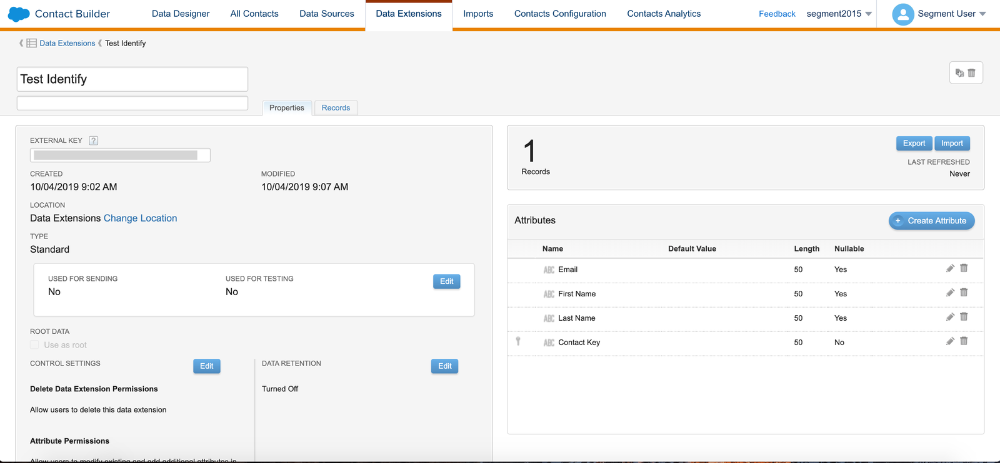
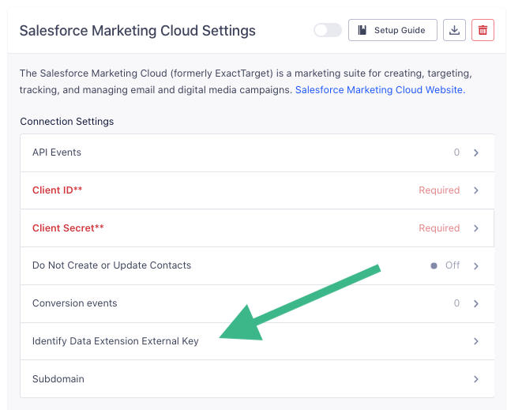
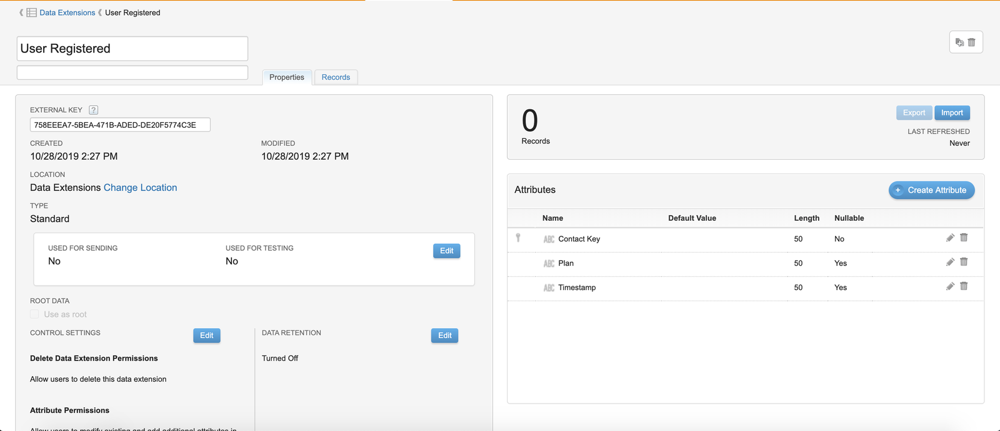
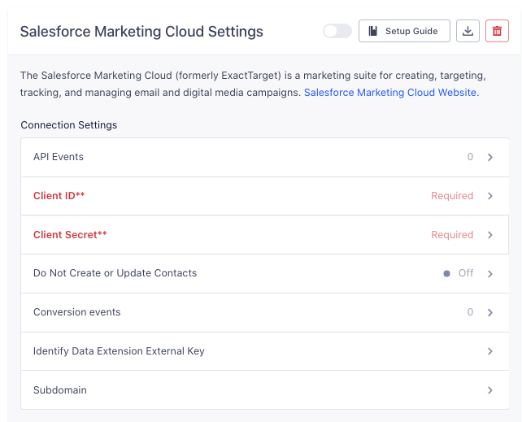
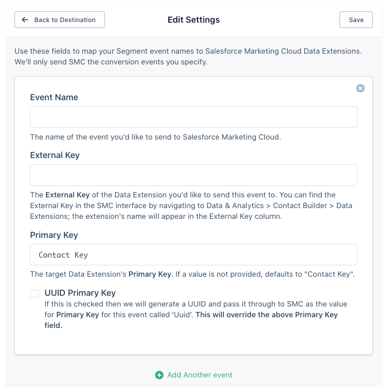
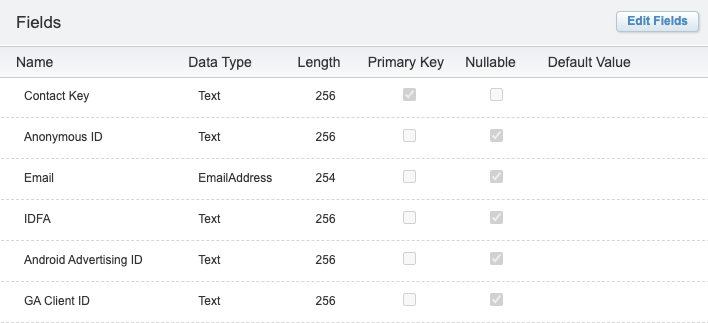
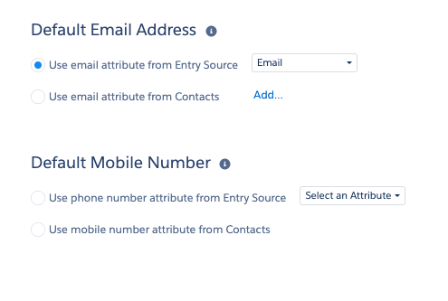

Salesforce Marketing Cloud (SFMC) provides digital marketing automation and analytics software and services. Marketers can use this software to create sophisticated multi-channel campaigns using the SFMC [Journey Builder](https://help.salesforce.com/articleView?id=mc_jb_journey_builder.htm&type=5). This is a campaign planning tool that helps you design and automate campaigns that guide customers through their journey with your brand, such as [Weekly Product Summary Emails](https://segment.com/recipes/product-summary-emails-salesforce/) that you can enable with Segment.

> info "A note about ExactTarget"
> ExactTarget was acquired by Salesforce in 2013 and renamed "Salesforce Marketing Cloud." At Segment we use the name "Salesforce Marketing Cloud" (or sometimes SFMC, for short), but the names "Salesforce Marketing Cloud" and "ExactTarget" refer to the same product.

> success ""
> **Good to know**: This page is about the Salesforce Marketing Cloud Segment destination, which receives data from Segment. There's also a page about the [Salesforce Marketing Cloud Segment source](/docs/connections/sources/catalog/cloud-apps/salesforce-marketing-cloud/), which sends data _to_ Segment!


### SFMC details

| **Support for Personas**               | Yes                                                                  |
| **Rate Limits**                        | 20 requests per second                                               |
| **Identifiers Required**               | `userId` or `email`                                                |
| **Identifiers Accepted from Personas** | `user_id, anonymous_id, email, ios.idfa, android.idfa, ga_client_id` |
| **Client vs. Server-Side Connection**  | Server-side                                                          |


### Segment and SFMC

Segment sends data to SFMC using [Data Extensions](https://help.salesforce.com/articleView?id=mc_co_salesforce_data_extensions.htm&type=5), or using API Events.

- **Data Extensions** are tables that contain your data. When this data arrives in SFMC, you can use it to create targeted marketing campaigns using push notifications and emails. You can view and query Data Extensions using the Journey Builder in SFMC. During the set up process, you will create a Data Extensions for Identify calls, and one for each unique Track call.

- **API Events** can trigger an email or push notification c ampaign immediately when they receive data from Segment.


## SFMC prerequisites

Before you start working with SFMC, work through the following sections to confirm that the destination will work as you expect, and set up any authentication requirements.

### Confirm that Salesforce Marketing Cloud supports your source type and connection mode



### Grant Segment API access to Salesforce Marketing Cloud

1. Log in to your Salesforce Marketing Cloud account and go to the **Setup** settings.
2. Under **Platform Tools**, expand Apps and select **Installed Packages**.
3. Click **New** to create a new package. We recommend giving it a name like "Segment".
4. Click **Add Component** and select **API Integration**.
5. Select the **Server-to-Server** Integration Type.
6. Enable the following permissions. If you don't add these permissions, you'll see an [Insufficient Privileges](https://developer.salesforce.com/docs/atlas.en-us.mc-apis.meta/mc-apis/error-handling.htm) error from SFMC.
    - **Email**: `Read`, `Write`
    - **Web:** `Read`, `Write`
    - **Automations:**  `Read`, `Write`, `Execute`
    - **Journeys:** `Read`
    - **List And Subscribers**: `Read`, `Write`
    - **Data Extensions**: `Read`, `Write`
    - **Tracking Events:** `Read`
    - **Webhooks:** `Read`, `Write`
7. Click **Save**.

Once you save the API integration and add permissions, SFMC shows a Summary page with a Components section. This section lists your *Client ID* and *Client Secret* settings.


### Find your SFMC subdomain

Segment uses your unique Salesforce subdomain to make API calls to SFMC. Your subdomain is a 28-character string that starts with the letters "mc" in any of your base URIs. For example, in the base URI `mc563885gzs27c5t9-63k636ttgm.rest.marketingcloudapis.com`, the subdomain is `mc563885gzs27c5t9-63k636ttgm`. When you find your subdomain, record it as you will use it in the SFMC Destination Settings in the Segment App.

> warning ""
> **Note**: If you do not set up your subdomain, Segment uses the legacy V1 endpoint and your events might result in authentication errors.


## Optional: Set up SFMC batching

SFMC has strict rate limits, usually 20 requests per second. If your organization sends a very high volume of data or has audiences with many people in them, Segment allows you to send data to SFMC in batches. This can help you reduce your SFMC API quota, reduce the number of rate-limiting errors you see, and help speed up transfers of large volumes of data.

> info ""
> The batching feature in SFMC is only available to our **Business Tier** customers.

To use the SFMC Batch feature:

1. **Make sure you don't need to use [API Events](#segment-and-sfmc) or create contacts from Identify calls**. If you have the SFMC Batch Integration enabled, you cannot use these two features at all.
2. **Enable the SFMC Data Extensions Async API on your account**. SFMC requires that each customer specifically request access to the Salesforce API that allows Segment to send batched data to SFMC. Contact your account representative to [enable the asynchronous REST API endpoints](https://developer.salesforce.com/docs/atlas.en-us.mc-apis.meta/mc-apis/data-extensions-api.htm). **This step is required.** If you do not enable these endpoints, your data will be dropped. This setting is configured by Salesforce per account, so if the account can already access these endpoints, go to the next step.
3. **Contact Segment to enable batching for each SFMC destination**. Once you confirm that you have access to the async API endpoints, contact your Segment CSM or [Segment Product Support](http://segment.com/help/contact/) to request that batching be enabled on your Segment account. You must do this step for each instance of the SFMC destination that you create in your Segment workspace. Provide the Support team with a link to the SFMC destination you want to enable this functionality on.
4. Once you complete these enablement steps, follow the standard set up instructions for the SFMC destination below.

If possible, you should enable batching for your SFMC destination before you send it any data. If you enable batching for an existing SFMC destination that has already received Segment data, you must work with [Segment Product Support](http://segment.com/help/contact/) to migrate that data.


## Set up to send Identify calls to SFMC

To use the Journey Builder to send campaigns to your users, you need to have data about those users in SFMC. The most common way to send data to SFMC is to send Segment [Identify](/docs/connections/spec/identify/) calls to an SFMC Data Extension which you specify. When you call `identify`, Segment creates a Salesforce Marketing Cloud Contact, and upserts (updates) the user's `traits` in the Data Extension.

> note ""
> **Note**: By default, `identify` events create or update contacts in SFMC. To prevent Identify calls from creating or updating a Contact when they update a Data Extension, enable the "Do Not Create or Update Contacts" option in the Destination Settings.

> info ""
> During this set up process, you will create one Data Extension for Identify calls ("the Identify Data Extension"), and one for each unique Track call ("the Track Data Extensions").

### Create a Data Extension in SFMC to store Identify calls
You must create a Data Extension in SFMC to store the Identify calls coming from Segment. For each trait you want to send to SFMC, you must manually create an attribute on the Data Extension in SFMC. When you create a Data Extension in SFMC, you can set up as many (or as few) attributes as you need.


- SFMC ignores keys that don't exist in the target data extension, so you must create attributes _before_ you send the data to SFMC. Attributes created in the Data Extension cannot be applied retroactively.
    If you send a trait `"nonexistent": "xyz"` with your data, but there's no matching `nonexistent` column in SFMC's table, that trait is ignored.
- You do not need to create attributes for _all_ of the traits in an Identify call. If you don't need a specific trait in SFMC, don't create an attribute for it, and Segment ignores the trait when it sends data to SFMC.
- All attributes you create in the Data Extension must be in **Title Case**, regardless of the casing used in your Segment Identify calls. When Segment sends Identify calls to SFMC it first transforms the data to use Title Case, but you still need to set the attributes up in SFMC in the correct format.
- Set up a Primary Key in the Identify Data Extension called `**Contact Key**`. Segment uses this to link users to SFMC's built-in Contact Key property. This field is populated with `userId`  by default in Identify calls. If no  `userId` exists, Segment uses the `email` instead.
- If you want to use this data to send emails or push notifications, check the **Is Sendable** box. (If you need to do this later, the box will be called "Used for Sending".)
- If you will be using this data to send emails, set up any **Email** attributes so they are of the "EmailAddress" type.

Before you leave this screen, copy the External Key for the Data Extension. You'll need it to set up the destination in Segment.

The example below shows a Data Extension for Identify calls that stores Email, First Name, and Last Name traits. Note the external key in the left column.




### Configure the Salesforce Marketing Cloud Destination in Segment

1. Add the Salesforce Marketing Cloud Destination to your Segment Workspace.
2. In the **Destination Settings**, locate the **Identify Data Extension External Key** setting. Enter the External Key you copied for the Data Extension that you set up in SFMC.



#### Data Formatting Requirements
SFMC is very strict about the format of your data, and rejects calls if they don't fit an expected format.

To keep your data format consistent, predictable, and readable in SFMC, Segment converts all of your property keys to **Title Case** before sending them to SFMC. For example, the following example data:

```js
{
  "firstName": "Amanda",
  "lastName": "Smith",
  "email": "amanda@example.com",
  "createdAt": "2020-05-30T13:30:00+00:00"
}
```

or
```js
{
  "first_name": "Amanda",
  "last_name": "Smith",
  "email": "amanda@example.com",
  "created_at": "2020-05-30T13:30:00+00:00"
}
```

are converted to:

```js
{
  "First Name": "Amanda",
  "Last Name": "Smith",
  "Email": "amanda@example.com",
  "Created At": "2020-05-30T13:30:00+00:00"
}
```

There are a few more things you should to know about sending data to SFMC:

- You must include a `userId` or `email` trait in every Identify call. Segment does not forward Identify calls to SFMC if both are missing.
   - If `userId` is present in the Identify call, Segment sends it to SFMC as the `Contact Key`
   - If no `userId` is present, Segment sends the `email` in the Identify to SFMC as the `Contact Key`
   - SFMC does not allow colon characters (":") in the `Contact Key` field, so you must remove those characters from any `userId` fields.
- SFMC doesn't handle nested objects gracefully, so Segment excludes any nested properties from the data it sends. To send nested context fields, see the section on [Using Context Properties](#using-context-properties-from-identify-or-track-calls) below.
- SFMC accepts ISO-8601-formatted dates, and rejects any calls that include dates not in that format. Make sure you send all dates in ISO format.


## Set up to send Track calls to SFMC

You can use Segment Track calls to send rich data about what your users are doing to a Data Extension in SFMC, which you can then use to build Journeys. When you send Track calls to SFMC, Segment fires an event using SFMC's [eventing API](https://developer.salesforce.com/docs/atlas.en-us.mc-apis.meta/mc-apis/putDataExtensionRowByKey.htm).

### Create a Data Extension in SFMC for each Track event

You must create a Data Extension in SFMC to store the Track calls coming from Segment. For each property you want to send to SFMC, you must manually create an attribute on the Data Extension in SFMC. When you create a Data Extension in SFMC, you can set up as many (or as few) attributes as you need.

For example, you could make the following  `track` call using Segment:

```js
analytics.track("User Registered", {
    "plan": "Free Trial"
})
```

To make this data available in SFMC, you would create a new Data Extension with the name `User Registered`, and with an attribute of `Plan`.

- All attributes you create in the Data Extension must be in **Title Case**, regardless of the casing used in your Segment Track calls. When Segment sends Track calls to SFMC it first transforms the data to use Title Case, but you still need to set the attributes up in SFMC in the correct format.
- Create an attribute called  `Contact Key` in the Track Data Extension. Segment sends the `userId` to this attribute if one is available in the Track call.
- SFMC ignores keys that don't exist in the target data extension, so you must create attributes *before* you send the data to SFMC. Attributes created in the Data Extension cannot be applied retroactively.
    If you send a property `"nonexistent": "xyz"` with your data, but there's no matching `nonexistent` column in SFMC's table, that property is ignored.

When you finish setting up the Data Extension, copy the External Key. You'll use this to configure the SFMC destination in Segment.

The example below shows a Data Extension for `User Registered` Track calls that stores the `userId`, `timestamp`, and `plan` properties:



> warning ""
> Segment doesn't automatically send timestamps. You must add timestamps as a property in the Track Call to send timestamps to the destination.

### Configure the SFMC Destination in Segment

You must add a Conversion Event in the SFMC Destination settings in the Segment App for each Track event you send to SFMC.

Just as you did for the Identify Data Extension, copy and paste the External ID of the Track Data Extension into the Conversion Events setting.


1. Add the Salesforce Marketing Cloud Destination to your Segment Workspace if you haven't already.
2. In the **Destination Settings**, locate the "Conversion events" setting. Enter the External Key you copied for the Track Data Extension that you set up in SFMC.



#### Configuring Primary Keys for each conversion event

Segment uses the Primary Key you define in the Conversion Events setting to *deduplicate* records in the Data Extension.

For example, if you use `Contact Key` as your Primary Key, the `userId` from the Segment Track call becomes the Primary Key for that Data Extension. The Data Extension maintains one row per `userId`, and updates the attributes in that row with the latest values coming from Segment.

If you send two events to the Data Extension and they have the same Primary Key value, the events deduplicate and the Data Extension contains the most recent attribute values that SFMC received. This means you should be thoughtful about which property to use as a Primary Key.

For example, you might use `Contact Key` as the Primary Key to pass the Segment  `userId` for each event into SFMC. However, if you set `Contact Key` as the Primary Key for the `Button Pressed` event, the Data Extension will only maintain one record per user in the `Button Pressed` Data Extension, even though each user will probably click more than one button.

You don't have to use `Contact Key` if there are other properties that make more sense to use as the Primary Key for that Track event. For example, you might want to use `ProductId` as the Primary Key if you want `Order Completed` Track events in the Data Extension to create a table of your products, with one row per product.

If you don't want to deduplicate rows, you can check the `UUID Primary Key` to create a table of every single Track event that you pass into the Data Extension. When you check this box it overrides any setting in the Primary Key Field, and Segment passes a Primary Key of `Uuid`  with a value that is the `messageId`.  If you check this box, make sure you create an attribute for `Uuid` in the Data Extension before sending any data.

If we return to the example of one user clicking multiple buttons, if you check the `UUID Primary Key` box then every time the user clicks a button, it creates a new record in the `Button Clicked` Data Extension.




#### Using multiple Primary Keys

You can use more than one Primary Key if needed. To add more than one Primary Key, enter them in the Primary Key Field separated by a comma. For example, if for the Primary Keys `Contact Key` and `Product Id`, you enter `Contact Key,Product Id`. The order of the keys does not change the deduplication behavior.

You might use more than one primary key if, for example, you want to track if a user clicks the Start Button and the Stop Button, but you don't care how many time the users clicked them. In this case, you could use `Contact Key` and `Button Title` as Primary Keys. Then, SFMC only deduplicates if *both* Contact Key (the user) and Button Title are the same. This means you would record that individual users clicked the Start Button and the Stop Button, but not how many times they clicked them.


## Using context properties from Identify or Track calls

The Segment SDKs and libraries automatically collect many [context properties](/docs/connections/spec/common/#context), and you can pass these properties into SFMC as Data Extension attributes.

To use context properties, you must create attributes in the Data Extensions that use specific naming conventions. The table below lists the Segment context properties available for SFMC, and the Data Extension attribute names they map to.

| **Segment Contextual Property** | **SFMC Attribute Name** |
| ------------------------------- | ----------------------- |
| app.name                        | App Name                |
| app.version                     | App Version             |
| app.build                       | App Build               |
| campaign.name                   | UTM Campaign            |
| campaign.source                 | UTM Source              |
| campaign.medium                 | UTM Medium              |
| campaign.term                   | UTM Term                |
| campaign.content                | UTM Content             |
| locale                          | Locale                  |
| userAgent                       | User Agent              |
| ip                              | IP Address              |
| device.adTrackingEnabled        | Ad Tracking Enabled     |
| device.manufacturer             | Device Manufacturer     |
| device.model                    | Device-model            |
| device.name                     | Device Name             |
| device.type                     | Device Type             |
| network.bluetooth               | Bluetooth Enabled       |
| network.carrier                 | Network Carrier         |
| network.cellular                | Cellular Enabled        |
| network.wifi                    | Wifi Enabled            |
| screen.density                  | Screen Density          |
| screen.height                   | Screen Height           |
| screen.width                    | Screen Width            |


## Using Personas with SFMC

You can send audiences and computed traits created in **Segment Personas** to SFMC to run more effective marketing campaigns.

In order to do this, you must have access to **Personas**. To learn more, [contact Segment for a demo](https://segment.com/contact/demo).

### Set up Personas with SFMC in Segment

> info ""
> **Tip**: We recommend that you use [SFMC batching](#optional-set-up-sfmc-batching) with Personas to help reduce the number of API calls that you send to SFMC, but this is optional. If you choose to set up batching, do this _before_ you set up the SFMC destination in your Segment workspace.

Personas sends audience membership and computed trait values to SFMC using Identify calls. To integrate Personas with SFMC:
1. [Create a Data Extension to store Identify calls](#create-a-data-extension-in-sfmc-to-store-identify-calls) if you haven't already.
2. [Configure SFMC as a Personas Destination](#configure-the-salesforce-marketing-cloud-destination-in-segment)

When you sync to an existing Data Extension, note these additional requirements:
- The table cannot have an existing **Primary Key**, unless it is the `Contact Key` field, and the field type is `Text`.
- All fields in the Data Extension must be nullable (meaning optional, or not required), except the `Contact Key` field.
- Any fields that you send with Segment, and which already exist in the Data Extension, must be of the correct data type. The standard identifiers Segment sends come from the [Context object](/docs/connections/spec/common/#context), and appear in the image below.




### Syncing Personas Audiences to SFMC

Use the following process when syncing audiences to SFMC:

1. Create a boolean field on the SFMC Data Extension to store audience membership information. The name of the field must match the name of the Segment audience you will create, and must be Title Cased.
2. In your Personas space, add the SFMC destination to an audience, ensuring you specify the same name assigned to the SFMC field.

When you add an audience to SFMC, the first sync contains all the users in that audience. A user is added as a new row to the Data Extension the first time they enter an audience. For example, let's say you have an "Active Users" audience. When you send this audience to SFMC, all the users in the audience are added to a Data Extension, with a field value that indicates their audience membership with `true`.  **To work correctly**, the Personas audience name should be Title Cased in the Data Extension field.

If a user leaves that audience, the value is automatically updated to `false`, but the user is not removed from the Extension. This allows you to see all users who have ever been in the audience, and then optionally create a filtered Data Extension if you want a subset. See the SFMC documentation for more details:

- [Create a Filtered Data Extension in Marketing Cloud](https://help.salesforce.com/articleView?id=mc_es_create_filtered_de.htm&r=https%3A%2F%2Fwww.google.com%2F&type=5)
- [Automatically refresh a Filtered Data Extension](https://help.salesforce.com/articleView?id=000264612&language=en_US&type=1)

### Syncing Personas Computed Traits to SFMC

Use the following process when syncing Computed Traits to SFMC:

1. Create a field on the SFMC Data Extension to store Computed Trait values. The name of the field must match the name of the Segment Computed Trait you'll create, and must be Title Cased. Choose a matching data type (for example, `text` for traits which produce string values, `number` or `decimal` for traits which produce numeric values).  
2. In your Personas space, add the SFMC destination to a Computed Trait, ensuring you specify the same name assigned to the SFMC field.

## Troubleshooting and Tips

### Connecting a Segment Workspace to an existing SFMC instance does not work as expected

Currently, the state of your SFMC instance changes how the integration with Segment works. If your SFMC instance is new and empty, then setting up SFMC with Segment works as expected. If your SFMC instance already has Contacts in it, then the implementation with Segment is more complex.
We recommend that you use a brand new SFMC instance where possible. Please reach out to friends@segment.com if this causes you problems.

If your SFMC instance already contains data, then when Segment sends Identify calls to SFMC it is not able to dedupe against existing Contact data. Instead, Segment creates duplicate Contacts, then uses the Contact Key to match the Segment and existing Data Extension data. However, this only works for Contacts that Segment creates, which means that you can't reliably build Journeys that use these Data Extensions to market to existing Contacts.


### Sync failures

- **Authentication Errors.** Confirm that you set up a [subdomain](#find-your-sfmc-subdomain) correctly, and that you linked to the correct subdomain in the Segment settings for SFMC. If you did not provide a subdomain, Segment uses a legacy endpoint that might result in authentication errors.
- **Data Extension Structure.** Confirm that the Data Extension columns that Segment syncs to have not been modified. Specifically, syncs fail if you change the column type.

### Referencing an email address or phone number in the Journey Builder

When you send an email or push notification, you need to choose which email address or phone number to send to. The options for selecting an email/phone in the Journey Builder look like this:



If you select **Use email attribute from Entry Source** you can use an email or phone attribute included in the API Event or Data Extension that triggers the Journey. (Otherwise, you must use an email address attribute or the default phone number attribute on a Contact record.)  To use this, you must include an email address and phone number as a property or trait in every single Track/Identify call mapped to SFMC.


### Personas data takes too long to sync to SFMC the first time

This issue usually occurs for customers that have very large volumes of customer data (10MM+ users), because multiple audiences and traits attempt to send large quantities of backfill data into SFMC at the same time, and compete for the SFMC rate limit. To help with this, avoid syncing multiple *new* audiences and *new* traits at the same time. Instead, create an audience, sync it to SFMC and wait for it to complete. Then, create and sync your next audience or trait.

You can also request a higher rate limit from your SFMC account representative. After you confirm the higher rate limit with your SFMC representative, contact [Segment Product Support](http://segment.com/help/contact) to adjust the rate limit from the Segment side for you.
