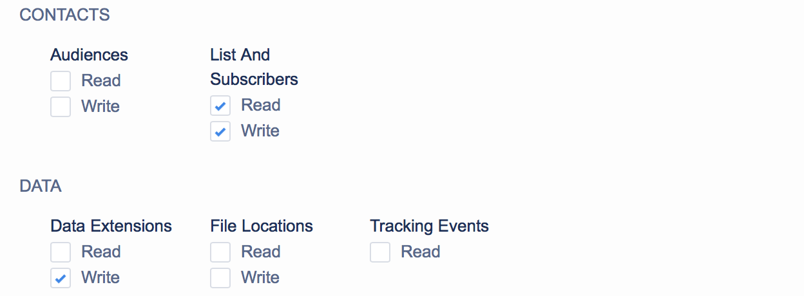

## Getting Started



Segment's Salesforce Marketing Cloud destination allows you to add contacts without using SOAP APIs.

### A Note About ExactTarget

ExactTarget was recently acquired by Salesforce and renamed "Salesforce Marketing Cloud." Throughout Segment, we'll stick to the name Salesforce Marketing Cloud, but know that the names "Salesforce Marketing Cloud" and "ExactTarget" refer to the same product.

### API Access

First, you'll need to provide Segment access to your Salesforce Marketing Cloud account. We'll do that by creating a Salesforce Marketing Cloud application.

1. Log in to your Salesforce Marketing Cloud account.
1. Click your name in the top-right corner of the screen and select "Administration".
1. Click the "Account" menu at the top-left corner of the page and select "Installed Packages".
1. If you want to use an existing package, click on that one or click "New" to create a new one. We recommend giving it a name like "Segment".
1. Click "Add Component".
1. Select "API Integration" and click "Next".
1. Select Server-to-Server
1. Enable the following permissions that Segment will need to create contacts and then click "Save".


You should now see a Summary page with a Components section. This section lists your _Client ID_ and _Client Secret_ settings.

### Set Up Contact Data Storage

Segment will pass any traits you specify in an `identify` call through to the *Identify Data Extension* you specify in the Segment UI. You'll need to create this Data Extension manually in SMC's Contact Builder UI. When creating a Data Extension in SMC, you can set up as many or as few traits as you would like, but a good starting point for your schema is to include Segment's [standard identify traits][].

### Set up your subdomain
Segment will use your unique Salesforce subdomain to make API calls to SFMC. Your subdomain is represented by a 28-character string starting with the letters "mc" in any of your base URIs. For example, in the base URI `mc563885gzs27c5t9-63k636ttgm.rest.marketingcloudapis.com`, the subdomain is `mc563885gzs27c5t9-63k636ttgm`.

**If you do not set your subdomain, Segment will use the legacy V1 endpoint and your events can result in authentication errors.**

## Data Formatting

SMC is very strict about the format of your data, and will reject most calls that don't fit an expected format. We format your data in a very consistent way to make setting up your destination as easy as possible.

To keep your data format consistent, predictable, and readable within SMC's interface, we convert all your property keys to `Title Case` before sending them to SMC. For example, the following example data:

```json
{
  "name": "firstLast",
  "email": "first@example.com",
  "createdAt": "1970-01-01T00:00:01.989Z"
}
```

or

```json
{
  "name": "first_last",
  "email": "first@example.com",
  "createdAt": "1970-01-01T00:00:01.989Z"
}
```

Will both be converted into:

```json
{
  "Name": "First Last",
  "Email": "first@example.com",
  "CreatedAt": "1970-01-01T00:00:01.989Z"
}
```

There are a few more things you should to know about sending data to SMC:

- Your Identify Data Extension must have a Primary Key called `Contact Key` (we'll use the `userId` from your Segment events to populate this field) so we can link users to SMC's built-in Contact Key property. (Your `track` events can use whichever Primary Key you specify.)
- SMC does not allow colon characters (":") in the `Contact Key` field, so your `userId` fields will need to be scrubbed of these characters.
- SMC doesn't have a good way of handling nested objects, so we exclude them from data we send over.
- SMC accepts ISO-8601-formatted dates, and will reject any calls that include dates which don't match that format. Be sure to send your dates in ISO format.
- SMC ignores casing differences (e.g. `created at` and `Created At` are interpreted the same way), so don't worry about that.
- SMC ignores keys that don't exist in the target data extension, so if you send a trait `"nonexistent": "xyz"` with your data but there's no matching `nonexistent` column on SMC's end, that trait will simply be ignored.

- - -

## Identify

When you call `identify`, we'll create a Salesforce Marketing Cloud Contact and upsert the user's `traits` into the Data Extension you specified in the Segment UI.

**_Note:_** You must include an `email` trait or a `userId` trait with all calls; we won't forward any `identify` calls that are missing both.

- - -

## Track

When you call `track`, we'll fire an event using Salesforce Marketing Cloud's [eventing API](https://developer.salesforce.com/docs/atlas.en-us.mc-apis.meta/mc-apis/putDataExtensionRowByKey.htm). This flexible API allows you to upsert information related to a contact, the properties you pass in the `track` event to Segment, into any Data Extension you choose.

First, you'll need to set up event mappings in the Segment UI, which tells us which Segment events we should forward to Salesforce Marketing Cloud, and to which Data Extension we should send any given event. When you fire a mapped event through Segment, we'll send those properties through to the Data Extension you specified. These data extensions upsert data so whatever you specify as the primary key, new data will be upserted off of the value of that key. For instance, if you use "Contact Key", we'll pass through your calls `userId` as the value and that data extension will only have 1 row per `userId`, updated with the latest values for each attribute.

We also let you choose other properties so that you can have 1 row per product, or 1 row per transaction based on a property on your call. If you are creating a data extension table for an `Order Completed` event, you could use "Order Id" to grab the value from the `orderId` property.

Similar to our conversions above, we will titlecase all properties so `order_id` and `orderId` both become "Order Id".

Finally, we have a checkbox, `UUID Primary Key` that will override whatever you have in the Primary Key Field and we will pass through a Primary Key with a key of 'Uuid' and the value being a UUID, the `messageId`.

### Multiple Primary Keys

If the data extension you are mapping to has more than one primary key, please enter each one seperated by a comma in the Primary Key Field. For example, if your primary keys were "Contact Key" and "Product Id", you would just enter "Contact Key, Product Id" (without the quotations). The ordering is not important.

## Features

### Contextual Properties

Our destination with SFMC supports passing in many of the contextual properties that our SDK's and libraries collect automatically as Data Extension attributes. Please reference our [documentation](https://segment.com/docs/connections/spec/common/#context) for more information on contextual properties and the SDK's/libraries that collect them.

In order to take advantage of this functionality, you will need to create attributes in your Data Extensions that adhere to specific naming conventions. The table below outlines the Segment contextual properties availble with this feature and the corresponding Data Extension attribute names they will map to.

<table>
  <tr>
      <td>app.name</td>
      <td>App Name</td>
  </tr>
  <tr>
      <td>app.version</td>
      <td>App Version</td>
  </tr>
  <tr>
      <td>app.build</td>
      <td>App Build</td>
  </tr>
  <tr>
      <td>campaign.name</td>
      <td>UTM Campaign</td>
  </tr>
  <tr>
      <td>campaign.source</td>
      <td>UTM Source</td>
  </tr>
  <tr>
      <td>campaign.medium</td>
      <td>UTM Medium</td>
  </tr>
  <tr>
      <td>campaign.term</td>
      <td>UTM Term</td>
  </tr>
  <tr>
      <td>campaign.content</td>
      <td>UTM Content</td>
  </tr>
  <tr>
      <td>locale</td>
      <td>Locale</td>
  </tr>
  <tr>
      <td>userAgent</td>
      <td>User Agent</td>
  </tr>
  <tr>
      <td>ip</td>
      <td>IP Address</td>
  </tr>
  <tr>
      <td>device.adTrackingEnabled</td>
      <td>Ad Tracking Enabled</td>
  </tr>
  <tr>
      <td>device.manufacturer</td>
      <td>Device Manufacturer</td>
  </tr>
  <tr>
      <td>device.model</td>
      <td>Device-model</td>
  </tr>
  <tr>
      <td>device.name</td>
      <td>Device Name</td>
  </tr>
  <tr>
      <td>device.type</td>
      <td>Device Type</td>
  </tr>
  <tr>
      <td>network.bluetooth</td>
      <td>Bluetooth Enabled</td>
  </tr>
  <tr>
      <td>network.carrier</td>
      <td>Network Carrier</td>
  </tr>
  <tr>
      <td>network.cellular</td>
      <td>Cellular Enabled</td>
  </tr>
  <tr>
      <td>network.wifi</td>
      <td>Wifi Enabled</td>
  </tr>
  <tr>
      <td>screen.density</td>
      <td>Screen Density</td>
  </tr>
  <tr>
      <td>screen.height</td>
      <td>Screen Height</td>
  </tr>
  <tr>
      <td>screen.width</td>
      <td>Screen Width</td>
  </tr>
</table>

<!-- Links -->

[app-center]: https://appcenter-auth.exacttargetapps.com/
[app center - permissions]: /docs/connections/destinations/catalog/salesforce-marketing-cloud/images/new_app-3_data_access.png
[app center - summary]: /docs/connections/destinations/catalog/salesforce-marketing-cloud/images/new_app-4_summary.png
[eventing API]: https://code.exacttarget.com/apis-sdks/rest-api/v1/hub/data-events/putDataExtensionRowByKeyAsync.html
[standard identify traits]: https://segment.com/docs/connections/spec/identify/#traits
