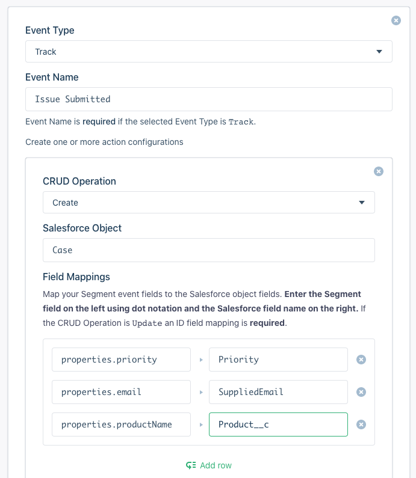
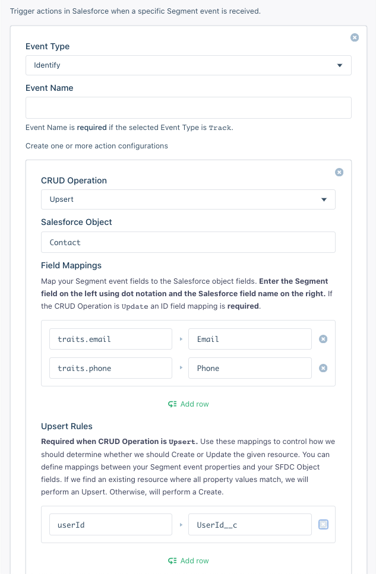

Segment's Salesforce destination allows you to create and store leads and records for other objects in Salesforce Sales Cloud.

> info ""
> Segment is aware of Salesforce's plans to enforce multi-factor authentication in 2022, and advises migrating to our new [Salesforce (Actions) destination](/docs/connections/destinations/catalog/actions-salesforce/) which supports OAuth 2.0.

### API Access

Segment uses the Salesforce SOAP API to connect. This API requires the following credentials of a registered Salesforce user:
- email
- password
- security token

Segment recommends that you create a separate user account specifically for this destination, if possible.

If you decide to create a new user account for the Segment API, create this user by going to *Setup > Administration set up > Users > New User*, and creating a new user with a System Administrator profile. This profile is required to give Segment enough permissions to access the API.

Also make sure that IP Security is disabled in this Salesforce user account. This is because Segment's servers often change and its hard to predict their IPs.

## Identify

This destination supports the most important pain point for Salesforce users: getting your prospective customers into Salesforce as Leads from your website or mobile app. Creating/updating Leads is the default behavior of `identify` events. If you would like to customize this you can do so using [Actions](#custom-actions).

### Identifying a Lead

The example below demonstrates identifying a lead:

```javascript
analytics.identify('YOUR_USERS_ID', {
  name: 'Peter Gibbons',
  title: 'VP of Derp',
  email: 'peter.gibbons@example.com',
  company: 'Initech',
  phone: '570-690-4150',
  state: 'California',
  rating: 'Hot',
  city: 'east greenwich',
  postalCode: '94115',
  country: 'USA',
  street: '19123 forest lane',
  state: 'RI'
}, {
  'integrations': {
    'Salesforce': true
  }
});
```

Additionally, if you're using another destination, like Intercom, that requires the company trait to be an object, you can pass the name of the company as follows and the destination still maps it as expected.

Also, you can send the address data in a object as well.

```javascript
analytics.identify('YOUR_USERS_ID', {
  name: 'Peter Gibbons',
  title: 'VP of Derp',
  email: 'peter.gibbons@example.com',
  company: {id: 666, name: 'Initech'},
  phone: '570-690-4150',
  state: 'California',
  rating: 'Hot',
  address: {
    city: 'east greenwich',
    postalCode: '94115',
    country: 'USA',
    street: '19123 forest lane',
    state: 'RI'
  }
}, {
  'integrations':{
    'Salesforce': true
  }
});
```

When you call `identify`, Segment checks to see if this Lead exists based on the `email` trait. If it does, Segment updates the Lead with the traits you've passed in your `identify` call, otherwise Segment creates a Salesforce Lead.

> warning ""
> If you're planning to update custom fields in Salesforce with Segment, you need to make sure you create the custom Lead Field inside Salesforce *prior* to sending the data. The [Salesforce API for Leads](https://developer.salesforce.com/docs/atlas.en-us.api.meta/api/sforce_api_objects_lead.htm) requires `lastName` and `company`. If either of this fields are not present in a server-side request Segment appends the string `'n/a'` to each of those fields even if you have provided those fields in a previous request.

For example, if you want to collect a custom trait in Segment called `testProp`, you can create a Field Label called `testProp` which will generate an API Name as `testProp__c`. Segment appends the `__c` to any custom traits so you don't need to worry about that. Make sure to stay consistent with your casing. If you create custom fields in camelCase, make sure you send `traits` to Segment in camelCase. If you are creating custom fields in SFDC as `snake_case`, then be sure to send your `traits` in the same format.

> info ""
> The Salesforce destination requires **every event to include a 'Salesforce': true in an integrations object**. Segment will not attempt to send any events to Salesforce that do not include this in their payload. The Salesforce SOAP API has very strict API limits so to prevent users from unintentionally hitting their limits, Segment requires this in all events.

By default Segment does not send identify calls to Salesforce, given their strict API limits.

## Group

`.group()` calls create or update **Account Objects** inside Salesforce. When Segment receives a group call, similar to the `.identify()` call, it first checks using the `groupId` to see if the Account Object already exists in your Salesforce account. Depending on the response, Segment updates that object or create a new one. Creating/updating Accounts is the default behavior of `group` events.

Take this sample `.group()` call that you might send to Segment:

(analytics.js)
```js
analytics.group('813', {
  name: 'Teemo Industries',
  address: {
    city: 'East Greenwich',
    state: 'RI',
    country: 'US',
    postalCode: '02818',
    street: '9000 Forest Lane'
  },
  phone: '222-555-4444',
  description: 'Makes great husky products',
  employees: 4,
  website: 'https://example.com'
}, {
  'integrations': {
    'Salesforce': true
   }
});
```
The above call will be sent like the following, in accordance with [Salesforce's API specs](https://developer.salesforce.com/docs/atlas.en-us.api.meta/api/sforce_api_objects_account.htm):

```js
{
  Name: 'Teemo Industries',
  AccountNumber: '813',
  BillingCity: 'East Greenwich',
  BillingCountry: 'US',
  BillingPostalCode: '02818',
  BillingState: 'RI',
  BillingStreet: '9000 Forest Lane',
  NumberOfEmployees: 4,
  Phone: '222-555-4444',
  Website: 'https://example.com',
  Description: 'Makes great husky products'
}
```

> info ""
> By default Segment maps `address` to the Account's **billing** address. To map the address to the Account's **shipping** address, you can do so inside your Salesforce settings in Segment. You can also opt to map it to *both* billing and shipping.

#### Required Steps

- You must be using V2 of this destination.
- You must pass in `traits.name` as this is a required field imposed by Salesforce for Account Objects.
- You must pass `{ 'Salesforce': true }` in the `options`.
- You must include `AccountNumber` as part of your page layout for Segment to be able to look up for the Account Objects using `groupId`:
  - Log into your Salesforce account and go to `setup`
  - Go to `Build` > `Customize` > `Accounts` > `Page Layout`
  - Drag the `Account Number` Field to the `Account Detail`
  - Click `Save`

#### Custom traits

In order to send custom traits, you must do the same steps as you had done for the `.identify()` call. You have to **predefine** them inside Salesforce. Segment appends `__c` to any custom traits.

## Trait Validation

Salesforce has documented strict validations on their semantic traits. Segment trims those traits if they go over the limit. Refer to their docs for [Account Objects](https://developer.salesforce.com/docs/atlas.en-us.200.0.api.meta/api/sforce_api_objects_account.htm#topic-title) and [Lead Objects](https://developer.salesforce.com/docs/atlas.en-us.200.0.api.meta/api/sforce_api_objects_lead.htm) to make sure you are sending the trait values under these limits if you do not want to see them trimmed off.

## Custom Actions
If you need to manually configure how your Segment events interact with Salesforce resources, you can do so using the [Actions](#actions) setting. This setting allows you to trigger standard CRUD operation (Create, Read, Update/Upsert, Delete) on your internal SFDC resources in response to your Segment events. You can configure as many of these actions as you would like. Each action must be associated with either a specific `track` event or **all** `identify` events. Actions can be further configured to map event properties to SFDC fields. Here's an example action configuration that will create a new Case in Salesforce in response to an **Issue Submitted** `track` event:



### Upsert Actions
Upsert actions either create or update a resource in Salesforce. For these to work, you must provide Upsert Rules in your action configuration that Segment can use to determine if an object exists to update. If Segment does not find an object, it creates a new object in SFDC. For that reason, fields in the Upsert Rules cannot map to Salesforce autogenerated fields like `Id`. In addition to Upsert Rules, you can also map event properties to be set in Update or Create with Field Mapping entries. Here's an example:



In this example, creating or updating a Contact in Salesforce based on whether or not the `userId` property in `identify` events maps to a Contact with a custom `UserId__c` field value in SFDC. Additionally, the Salesforce Contact record field values `Email` and `Phone` are populated by the Segment event `traits.email` and `traits.phone` respectively.

## Troubleshooting

### Sandbox Mode

To enable an integration with a Salesforce Sandbox instance:
1. Toggle the Sandbox setting to  `true` in the Salesforce Destination settings.
2. Append the sandbox name to the account email, as shown below:
   - `name@work.com` -> `name@work.com.sandboxname` where `sandboxname` is the name of your sandbox.

### API Call Limits

Salesforce limits both the concurrent amount of requests and the total amount of daily requests Segment can make to their API on your behalf. Check [these limits](https://developer.salesforce.com/docs/atlas.en-us.salesforce_app_limits_cheatsheet.meta/salesforce_app_limits_cheatsheet/salesforce_app_limits_platform_api.htm). They vary per edition and your number of bought user licenses.

Segment makes two API requests per `identify`. The first request is a SQL query to determine whether this object already exists. The second is to either update or create that object.

Also, every thirty minutes, Segment's servers make two queries: one to renew the connection's sessionId and another to describe your Salesforce object model so to determine which Salesforce objects are available.


### How can I check how many Salesforce API calls I have left today?

Go to `Setup > Administration set up > Company Profile > Company Information`, and you'll find a field labeled: `API Requests, Last 24 Hours`.


### What do I do if I ran out of calls?

You can either decrease the amount of Salesforce calls Segment makes using context.integrations, or buy more Salesforce user licenses.


### Lookup Fields

You can add whatever lookup fields you want to help Segment find the object you want to update.


### Custom Fields Aren't Updating

Make sure that the traits you're passing through match the Custom Field's API name and data type!


### Password Expiration

By default, Salesforce user accounts are set to have their passwords expire after 90 days. When this happens, the Salesforce user account that's making API calls on your behalf will no longer be able to make API calls. You'll need to set a new password, get a new security token, and then set both of these in your Segment Salesforce destination settings.

If you want to set your passwords to never expire, you can do so in **Salesforce set up > Administration set up > Security Controls > Password Policies**.

### Updating Lead Status

Currently Segment does not support updating the Salesforce Lead Status field due to constraints of the Salesforce API.
