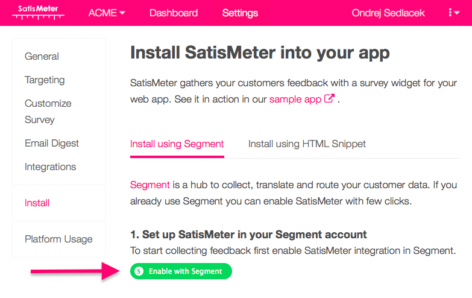

[Our SatisMeter destination code](https://github.com/segment-integrations/analytics.js-integration-satismeter) is all open-source on GitHub if you want to check it out.

See SatisMeter in action on their [sample app](https://app.satismeter.com/sample).

After you enable SatisMeter in Segment, the SatisMeter NPS survey will be shown to your customers.

## Features
With SatisMeter you can:

- gather NPS and customer feedback straight from your web app,
- send gathered customer feedback back to Segment which distributes it to other customer analytics tools,
- get the feedback directly into your Slack channel,
- customize SatisMeter survey to comply with your design,
- send email surveys to users that don't answer the in-app survey,
- ask every user in their own language.


## Get Started

To get started you need to sign up to SatisMeter, and click the green button "Enable with Segment". This will link your SatisMeter project with your Segment project and enable the destination.



## Identify

Users need to be identified in order to target surveys at the right time.

## Client-side destination

Identifying of users is done by calling an `analytics.identify` method using the [analytics.js](/docs/connections/sources/catalog/libraries/website/javascript/) library. The recommended traits are `name`, `email` and `createdAt`, however SatisMeter will collect any other traits you'd like to see next to feedback from your customers.

Here's an example of the identify call:
```js
analytics.identify('007', {
 name: 'James Bond',
 email: '007@sis.gov.uk',
 createdAt: '2015-06-16T09:19:47.155Z'
});
```

It is important to send the `createdAt` trait which tells us how long is the customer using your service. This way we can show the survey to people that already have some experience with your service.

## Server-side destination

You can also send additional traits you don't have available on client-side using one of the [server libraries](/docs/connections/sources/#server) provided by Segment. These traits will be added to the collected responses from your users.

## Sending data from SatisMeter back to Segment (optional)
We can send completed survey responses to Segment which will distribute it to all your other Segment destinations.

### Segment write key
You should copy the Segment write key (Project settings / API KEYS / WRITE KEY) and paste it into SatisMeter (Integrations / Segment).
The write key looks like this: `8lnHXS8z3lkCyNkFlggIvd59M2BXdSHn`

## SatisMeter traits and events
When a user completes a survey the following traits are added to the user:

- `NPS_rating`: NPS rating (0-10)
- `NPS_comment`: verbal feedback that user left
- `NPS_date`: date when the NPS survey was filled out

We also record the following events
- `Viewed NPS Survey`: The survey was shown to the user
- `Closed NPS Survey`: User closed the survey without filling it
- `Answered NPS Survey`: User filled the rating of NPS Survey
- `Completed NPS Survey`: User completed the survey (including the follow-up question)

# Troubleshooting
### The SatisMeter widget does not show up
Make sure you are sending an `analytics.identify()` call when the page is loaded. If you are calling this method, make sure SatisMeter survey has a reason to be displayed. The widget will not display unless the customer fits your targeting settings.

### The SatisMeter widget shows up right after sign-up
It is important to send the `createdAt` trait to `analytics.identify()` method. Without this SatisMeter widget will be shown right after sign-up to every user that fits your other targeting settings.
You can change the targeting settings in Targeting section of SatisMeter settings.
