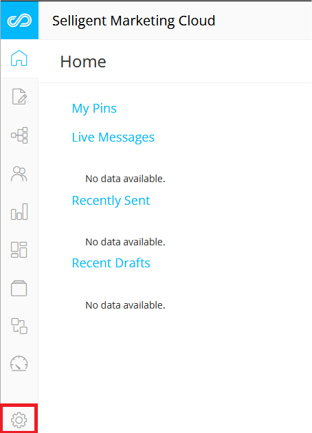
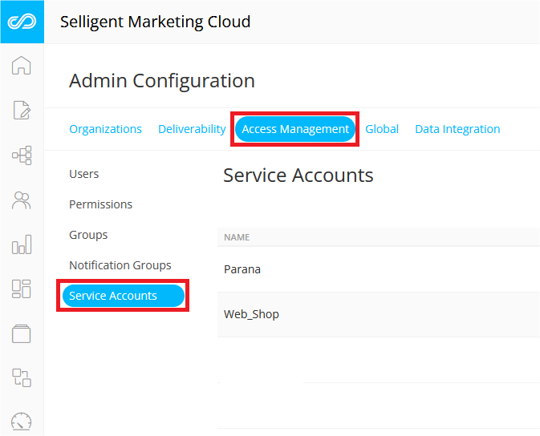
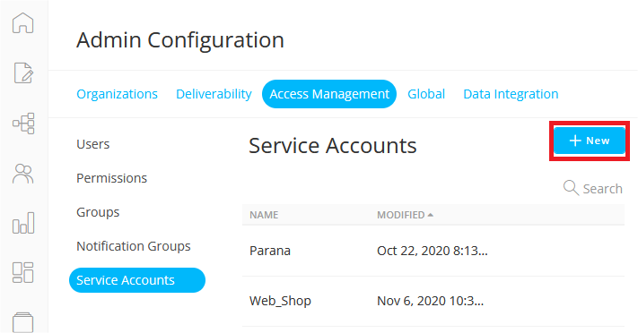
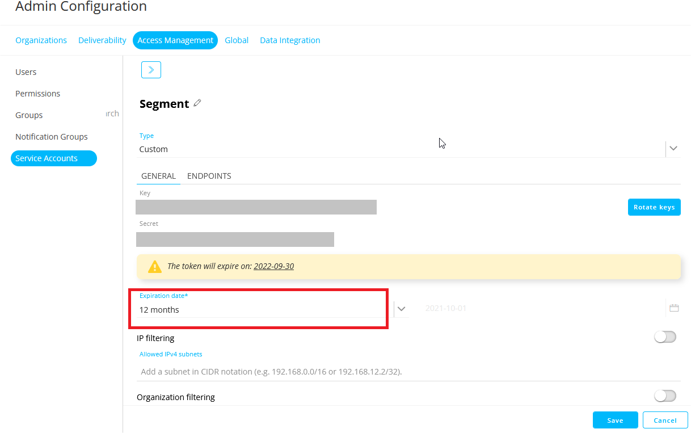
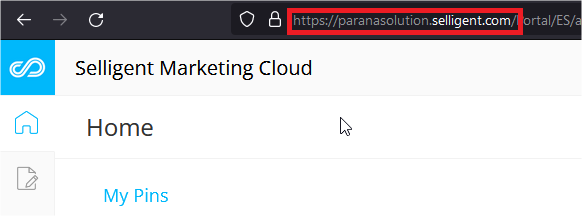
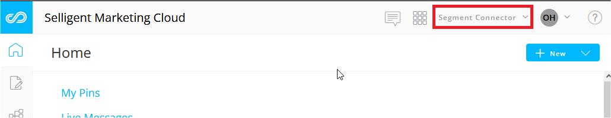

[Selligent Marketing Cloud](https://www.selligent.com/?utm_source=segment&utm_medium=integrations-page&utm_campaign=partners/) is a highly integrated, AI-powered omnichannel marketing automation platform which enables ambitious B2C marketers to maximize every moment of interaction with today’s connected consumers. Delivers ultra-personalized, highly relevant customer experiences across channels and devices, providing value swiftly and at scale.

This Destination is maintained by *Selligent Marketing Cloud*. For any issues with the Destination, please reach out to their [Support team](https://support.selligent.com)

> success ""
> **Good to know**: This page is about the Selligent Marketing Cloud Segment destination, which receives data from Segment. There's also a page about the [Selligent Marketing Cloud Segment source](/docs/connections/sources/catalog/cloud-apps/selligent-marketing-cloud/), which sends data _to_ Segment!

## Getting Started

Before you enable Selligent Marketing Cloud in your Destination page, validate with your Selligent CSM that the segment components needed to start receiving information from the connector are set up on your account.

1. Login into your *Selligent Marketing Cloud* environment.
2. Within the *Selligent Marketing Cloud* module click the wheel icon at the bottom-left corner to access the general configuration panel:

1. Navigate tothe "Access Management" tab and select "Service Accounts":

4. To create a new account click on the "New" icon:

5. Provide a "Name" and choose the type "Custom", confirm by clicking the Save button.
6. Set an expiration date. This indicates the period the key will be valid before it needs to be refreshed.
7. Copy the Key and Secret provided and click the save button:


You can then proceed to configure your destination.

1. From your Segment UI's Destinations page click on "Add Destination".
2. Search for "*Selligent Marketing Cloud*" within the Destinations Catalog and confirm the Source you'd like to connect to.
3. Enter the "*API Key*" and "*API Secret*" into your Segment Settings UI.
4. *SMC Admin URL* - Copy the link you use to log into the SMC admin should look like https://**{you company}**.slgnt.us

5. *Organization* - You will find the organization name on the top-right hand corner next to the menu icon.

6. *Allowed Events* - Add the `track` event names that you would like to allowlist or send to SMC
7. *Events data list API name* - The default value is **segment_events**, if you have any issue regarding the property please contact the *Selligent Marketing Cloud* [Support team](https://support.selligent.com).

## Identify

If you haven't had a chance to review the Segment spec, please take time to review and to understand what the [`identify` method](/docs/spec/identify/) does.

An example call can look like:

```js
analytics.identify('userId123', {
    property1: 1,
    property2: 'test',
    property3: true
});
```
The `userId` field, `userId123`, is mapped to the Business Key defined for the SMC database.

Identify calls will be sent to *Selligent Marketing Cloud* as an `identify` event.

## Track

If you haven't had a chance to review the Segment spec, please take time to review to understand what the [`track` method](/docs/spec/track/) can do. 

An example call can look like:

```js
analytics.track('userId123', {
    property1: 1,
    property2: 'test',
    property3: true
});
```

Track calls will be sent to *Selligent Marketing Cloud* as a `track` event.

## Group

If you haven't had a chance to review the Segment spec, please take time to review to understand what the [`group` method](/docs/spec/group/) can do. 

An example call can look like:

```json
{
  "type": "group",
  "groupId": "SegmentToSMCStatic",
  "userId": "segmenttest@selligent.com",
  "traits": {
    "matchkey": "MAIL",
    "method": "ADD",
    "userlist": "USERS_SEGMENT"
  }
}
```

Segment sends Group calls to *Selligent Marketing Cloud* as a `group` event. These calls are used to populate static segments in the *Selligent Marketing Cloud* platform. The static segment must be created in Selligent Marketing Cloud before you can use it. The call should adhere the above example and contain the following elements:
* <u>groupId</u>: The *api_name* of the static segment to populate
* <u>userId</u>: The value on which the matching to populate the segment should happen
* <u>traits</u>:
  * <u>matchkey</u>: this is a mandatory trait and should contain the name of the field in the userlist on which the matching should be done
  * <u>method</u>: this trait is optional and indicates either a remove call or an add call to the *Selligent Marketing Cloud* segment. The two values possible are REMOVE or ADD but it will default to ADD. So it’s only needed in case of a remove call
  * <u>userlist</u>: this is a mandatory trait and should contain the *api_name* of the userlist in *Selligent Marketing Cloud*

## Alias

If you haven't had a chance to review the Segment spec, please take time to review to understand what the [`alias` method](/docs/spec/alias/) can do. 

An example call can look like:

```js
analytics.alias("507f191e81");
```

Track calls will be sent to *Selligent Marketing Cloud* as a `alias` event.

## Page

If you haven't had a chance to review the Segment spec, please take time to review to understand what the [`page` method](/docs/spec/page/) can do. 

An example call can look like:
```js
analytics.page("Home");
```

Track calls will be sent to *Selligent Marketing Cloud* as a `page` event.


## Screen

If you haven't had a chance to review the Segment spec, please take time to review to understand what the [`screen` method](/docs/spec/screen/) can do. 

An example call in Objective C can look like:

```obj-c
[[SEGAnalytics sharedAnalytics] screen:@"Home"
                            properties:@{ @"Feed Type": @"private" }];
```

Track calls will be sent to *Selligent Marketing Cloud* as a `screen` event.
