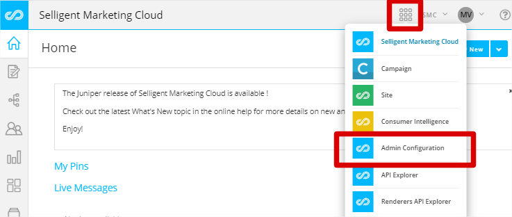
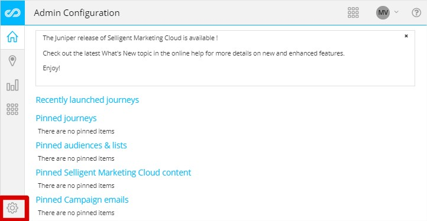
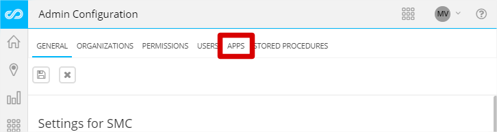
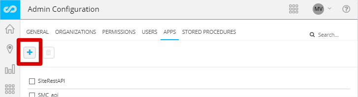
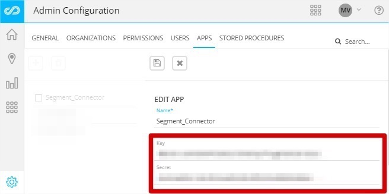
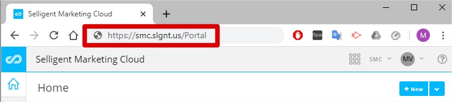
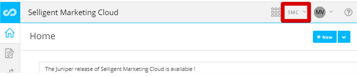

[Selligent Marketing Cloud](https://www.selligent.com/?utm_source=segment&utm_medium=integrations-page&utm_campaign=partners/) is a highly integrated, AI-powered omnichannel marketing automation platform which enables ambitious B2C marketers to maximize every moment of interaction with today’s connected consumers. Delivers ultra-personalized, highly relevant customer experiences across channels and devices, providing value swiftly and at scale.

This Destination is maintained by Selligent Marketing Cloud. For any issues with the Destination, [contact their support team](mailto:jason.morgan@acceleration.biz).

## Getting Started

Before you enable Selligent Marketing Cloud in your Destination page, validate with your Selligent CSM that the segment components needed to start receiving information from the connector are set up on your account.

1. Login into your SMC environment.
2. At the top-right hand side  click on the options menu and open the Admin Configuration module:

3. Within the Admin Configuration module click the wheel icon at the bottom-left corner to access the general configuration panel:

4. Click on the "Apps" tab:

5. In order to create a new API Key-Secret click on the plus icon:

6. Provide an API name and confirm clicking the plus icon:
7. Copy the Key and Secret provided and click the save button:


You can then proceed to configure your destination.

1. From the Segment web app, click **Catalog**.
2. Search for "*Selligent Marketing Cloud*" in the Catalog, select it, and choose which of your sources to connect the destination to.
3. Enter the "*API Key*" and "*API Secret*" into your Segment Settings UI.
4. *SMC Admin URL* - Copy the link you use to log into the SMC admin should look like https://**{you company}**.slgnt.us

5. *Organization* - You will find the organization name on the top-right hand corner next to the menu icon.

6. *Allowed Events* - Add the `track` event names that you would like to whitelist/send to SMC
7. *Events data list API name* - The default value is **segment_events**, if you have any issue regarding the property [contact the support team](mailto:jason.morgan@acceleration.biz).

## Identify

If you aren't familiar with the Segment Spec, take a look to understand what the [`identify` method](/docs/connections/spec/identify/) does.

An example call looks like:
```js
analytics.identify('userId123', {
    property1: 1,
    property2: 'test',
    property3: true
});
```
The `userId` field, `userId123`, is mapped to the Business Key defined for the SMC database.

`identify` calls will be sent to *Selligent Marketing Cloud* as an `identify` event.

## Track

If you aren't familiar with the Segment Spec, take a look to understand what the [`track` method](/docs/connections/spec/track/) can do.

An example call looks like:
```js
analytics.track('userId123', {
    property1: 1,
    property2: 'test',
    property3: true
});
```
`track` calls will be sent to *Selligent Marketing Cloud* as a `track` event.

## Group

If you aren't familiar with the Segment Spec, take a look to understand what the [`group` method](/docs/connections/spec/group/) can do.

An example call looks like:
```js
analytics.group("0e8c78ea9d97a7b8185e8632", {
  name: "Initech",
  industry: "Technology",
  employees: 329,
  plan: "enterprise",
  "total billed": 830
});
```
`group` calls will be sent to *Selligent Marketing Cloud* as a `group` event.

## Alias

If you aren't familiar with the Segment Spec, take a look to understand what the [`alias` method](/docs/connections/spec/alias/) can do.

An example call looks like:
```js
analytics.alias("507f191e81");
```
`alias` calls will be sent to *Selligent Marketing Cloud* as a `alias` event.

## Page

If you aren't familiar with the Segment Spec, take a look to understand what the [`page` method](/docs/connections/spec/page/) can do.

An example call looks like:
```js
analytics.page("Home");
```
`page` calls will be sent to *Selligent Marketing Cloud* as a `page` event.

## Screen

If you aren't familiar with the Segment Spec, take a look to understand what the [`screen` method](/docs/connections/spec/screen/) can do.

An example call in Objective C looks like:

```objc
[[SEGAnalytics sharedAnalytics] screen:@"Home"
                            properties:@{ @"Feed Type": @"private" }];
```
`screen` calls will be sent to *Selligent Marketing Cloud* as a `screen` event.
