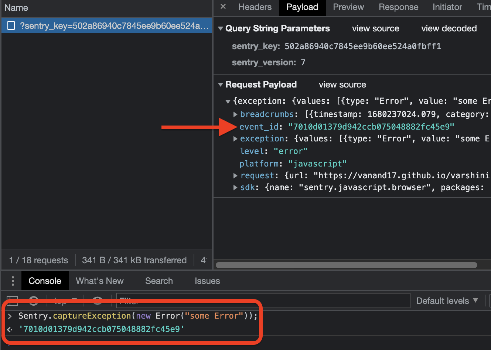

[Sentry](https://sentry.io) is open-source error tracking that helps developers monitor and fix crashes in real time. Iterate continuously. Boost efficiency. Improve user experience. The `analytics.js` Sentry Destination is open-source. You can browse the code [on GitHub](https://github.com/segmentio/analytics.js-integrations/tree/master/integrations/sentry).

## Getting Started



1. From the Segment web app, click **Catalog**.
2. Search for "Sentry" in the Catalog, select it, and choose which of your sources to connect the destination to.
3. In the destination settings, enter your "Public DSN".
4. Segment automatically initializes Sentry with your "Public DSN" upon loading analytics.js.
5. Sentry will automatically start tracking errors in your app's JavaScript.

## Identify

If you're not familiar with the Segment Specs, take a look to understand what the [Identify method](/docs/connections/spec/identify/) does. An example call would look like:

```javascript
analytics.identify('userId123');
```

When you call `identify` Segment calls `Sentry.setUser` by passing in the `traits` you provided. Segment maps the `userId` you provide as `traits.id`.

## Troubleshooting

Since Sentry is an error tracking application, Segment needs to send something broken from the website to see the event appear in the Sentry dashboard. For example, firing the following error event from the web console, `Sentry.captureException(new Error("Some error"))`; Segment can see the relevant event payload with the `event_id` information.
 
 
 
 This error will appear in Sentry with the same `event_id` displayed in developer tools. This helps verify that Segment has the correct implementation of the destination.


