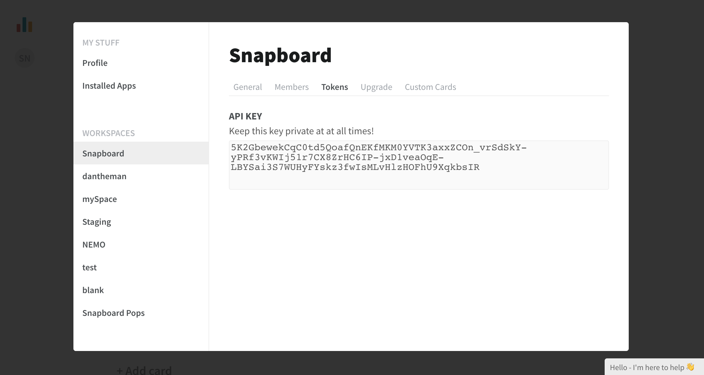

[Snapboard](https://snapboard.io/?utm_source=segmentio&utm_medium=docs&utm_campaign=partners) allows customers to build dashboards and internal tools without code. Snapboard pulls in your data from the apps you use (Segment, Stripe, etc) and displays them as a spreadsheet in Snapboard (which you can filter, sort, group, etc).


You can then create any tool you want by hooking up the data to the cards/components (inputs, sliders, tables, charts, forms, todos, calendars, gallery, etc).


This destination is maintained by Snapboard. For any issues with the destination, [contact the Snapboard Support team](mailto:calum@snapboard.io).



## Getting Started




1. From the Segment web app, click **Catalog**.
2. Search for "Snapboard" in the Catalog, select it, and choose which of your sources to connect the destination to.
3. Enter the "API Key" into your Segment Settings UI which you can find from your Snapboard dashboard.

You can obtain the API Key by [logging into Snapboard](https://snapboard.io/login), clicking on the circle icon in the top-left, and then clicking on the workspace name. Then click on the Settings menu item.


And then select the [Workspace Name] that your would like to send your Segment events to. Ensure you select the correct workspace, because data cannot be shared between workspaces.




## Page

If you're not familiar with the Segment Specs, take a look to understand what the [Page method](/docs/connections/spec/page/) does. An example call would look like:

```js
analytics.page()
```

Page calls are sent to Snapboard as a `pageview`.


## Screen

If you're not familiar with the Segment Specs, take a look to understand what the [Screen method](/docs/connections/spec/screen/) does. An example call would look like:

```objc
[[SEGAnalytics sharedAnalytics] screen:@"Home"];
```

Screen calls are sent to Snapboard as a `screenview`.


## Identify

If you're not familiar with the Segment Specs, take a look to understand what the [Identify method](/docs/connections/spec/identify/) does. An example call would look like:

```js
analytics.identify('userId123', {
  email: 'john.doe@example.com'
});
```

Identify calls are sent to Snapboard as an `identify` event.


## Track

If you're not familiar with the Segment Specs, take a look to understand what the [Track method](/docs/connections/spec/track/) does. An example call would look like:

```js
analytics.track('Login Button Clicked')
```

Track calls are sent to Snapboard as a `track` event.


## Alias

If you're not familiar with the Segment Specs, take a look to understand what the [Alias method](/docs/connections/spec/alias/) does. An example call would look like:

```js
analytics.alias("507f191e81");
```

Alias calls are sent to Snapboard as a `alias` event.
