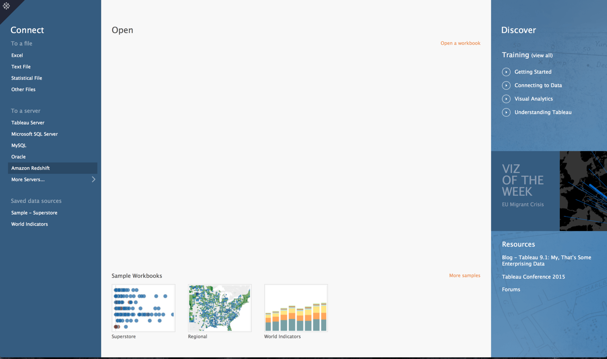
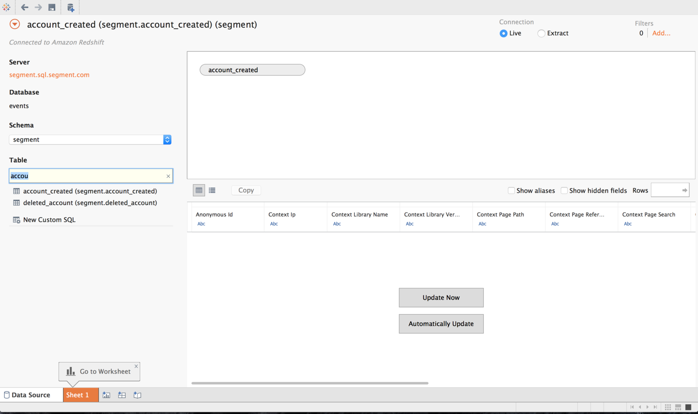
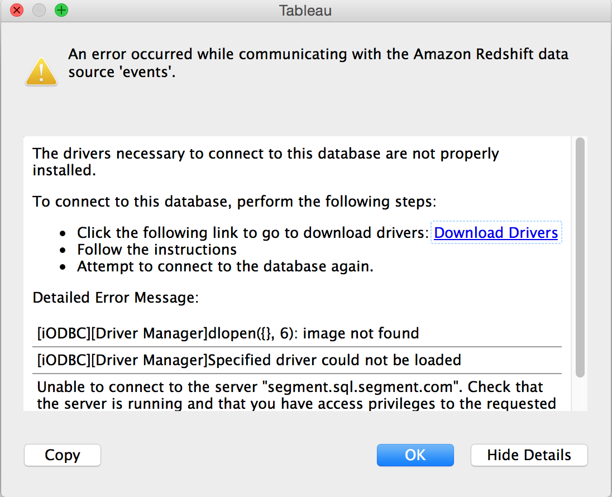

## Getting Started

In your Tableau dashboard, go to the "To A Server" category in the Connect panel on the page's left side. Click on the Amazon Redshift tab.

Next, enter your credentials in the popup window as they show up in your Segment Warehouse settings tab.

From here you can choose how you want it to update, choose a connection type, and set up any filters.

## Troubleshooting

You may get an error that looks like the below. If so, fear not! You just need to [download the necessary drivers](https://www.tableau.com/en-us/support/drivers?edition=pro&lang=en-us&platform=mac&cpu=64&version=9.1&__full-version=9100.15.0828.1711#redshift).

You'll have to close out of Tableau as you set up the necessary drivers. Once those are installed, restart Tableau, repeat the getting started steps.


