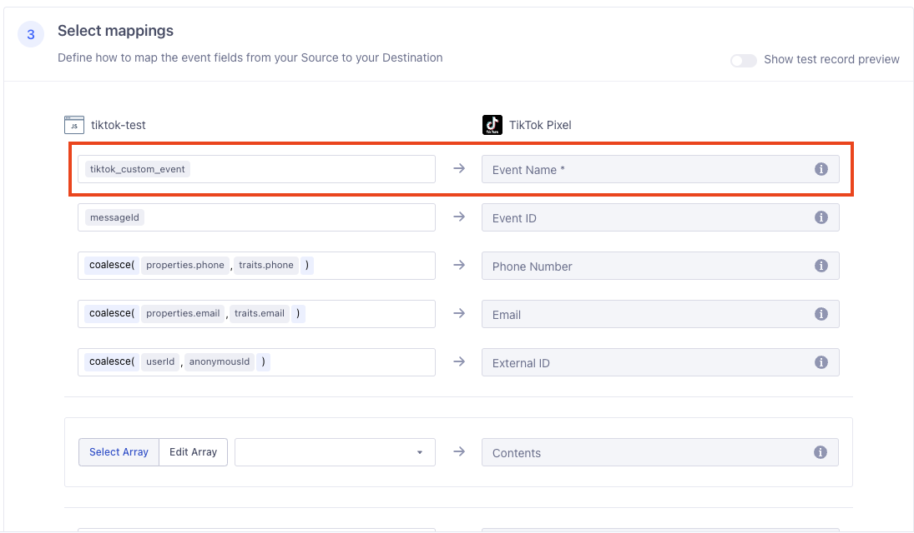



The TikTok Conversions destination is a secure server-to-server integration that allows advertisers to share the actions customers take on their websites from Segment directly with TikTok using [TikTok Web Events API](https://business-api.tiktok.com/portal/docs?id=1771100799076354){:target="_blank”}. By sharing these events with TikTok, you can better optimize your campaigns and measure ad performance.

## Benefits of TikTok Conversions
The TikTok Conversions destination provides the following benefits:

1. **Clear mapping of data.** Actions-based destinations enable you to define the mapping between the data Segment receives from your source and the data Segment sends to TikTok.
2. **Prebuilt mappings.** Mappings for TikTok Standard Events, like `CompletePayment`, are prebuilt with the prescribed parameters and available for customization. 
3. **Streamlined stability and security.** Integrate and iterate without client-side limitations, like network connectivity or ad blocker issues.
4. **Privacy-focused**: Stay compliant with rapidly evolving requirements with automatic PII hashing and flexible controls that let you adapt what data you share.
5. **Maximum event measurement**: Capture more events with improved accuracy across different browsers, apps, and devices to get a unified view of your customer's journey from page view to purchase.

This destination is maintained by TikTok. For any issues with the destination, [contact TikTok's Support team](mailto:segmenteng@bytedance.com).

## Getting started

Follow the instructions below to enable your TikTok ads account and add the TikTok Conversions destination to your Segment workspace.

### TikTok Requirements

The TikTok Conversions destination is configured to use the TikTok Events API. To generate a TikTok Pixel Code and Access Token:

1. [Create a TikTok For Business account](https://business-api.tiktok.com/portal/docs?id=1738855099573250){:target="_blank"}.
2. [Create a TikTok Pixel](https://business-api.tiktok.com/portal/docs?id=1771100865818625){:target="_blank"} for Events API to obtain a Pixel Code. For more information about retrieving the Pixel Code, please refer the [FAQ section](https://business-api.tiktok.com/portal/docs?id=1771101001228290){:target="_blank"}.
3. Follow instructions for [Authentication](https://business-api.tiktok.com/portal/docs?id=1771101130925058){:target="_blank"} to generate the Access Token.

### Connect TikTok Conversions to your workspace

1. From the Segment web app, click **Catalog**, then click **Destinations**.
2. Search for “TikTok Conversions” in the Destinations Catalog, and select the destination.
3. Click **Configure TikTok Conversions**.
4. Select the source that will send data to TikTok Conversions and follow the steps to name your destination.
5. On the Settings tab, enter in your TikTok Access Token and Pixel Code and click **Save**.
6. Follow the steps in the Destinations Actions documentation on [Customizing mappings](/docs/connections/destinations/actions/#customizing-mappings).



## FAQ & Troubleshooting

### Deduplication with the TikTok Pixel SDK

If you independently placed the TikTok Pixel on your website, reach out to your TikTok representative to see if there are any necessary changes to your Pixel to properly deduplicate events sent through both the Pixel and the Segment TikTok Conversions destination.

### Deduplication with the Segment TikTok Pixel Destination

When connected to the same Segment source, the destination will have a default mapping `messageId` assigned to Event ID parameter. This will need to match the Event ID mapping from the client-side Segment integration (TikTok Pixel Destination).

### Match Keys

To increase the probability of matching website visitor events with TikTok ads, send one or more of the following match keys and identifiers when possible:
- TikTok Click ID
- External ID
- Phone Number
- Email
- IP Address
- User Agent

### PII Hashing

Segment creates a SHA-256 hash of the following fields before sending to TikTok:
- External ID
- Email
- Phone Number

### Custom Event Implementation

1. Click **New Mapping**, then click **Report Web Event**.

    
    <!--  -->

2. Provide the Segment event to map and trigger the connection (i.e. `segment_event`)

    

3. Provide the custom event name in the **Event Name** field from the mappings section (i.e. `tiktok_custom_event`)

    

4. Edit parameter mappings for each event

    

### Web Diagnostics

You can check whether the integration is working, test events in real-time, and troubleshoot common issues in TikTok's Web Diagnostics Suite. See the [TikTok Pixel Web Diagnostics documentation](https://ads.tiktok.com/help/article?aid=10000360){:target="_blank"} for more information.

## Support

The TikTok Conversions destination is owned and maintained by the TikTok team. For any issues with the destination, [contact TikTok's Support team](mailto:segmenteng@bytedance.com).
