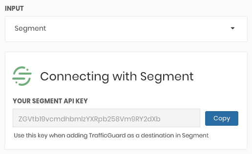

[TrafficGuard](https://trafficguard.ai/?utm_source=segmentio&utm_medium=docs&utm_campaign=partners) detects, mitigates, and reports on ad fraud before it hits digital advertising budgets. Three formidable layers of protection block both general invalid traffic (GIVT) and sophisticated invalid traffic (SIVT) to ensure that digital advertising results in legitimate advertising engagement.

This destination is maintained by TrafficGuard.




## Getting Started



1. From the Segment web app, click **Catalog**.
2. Search for "TrafficGuard" in the Catalog, select it, and choose which of your sources to connect the destination to.
3. Enter the "API Key" into your Segment Settings UI which you can find in the property in the TrafficGuard dashboard.



4. Calls will now be visible in TrafficGuard dashboards in real-time.

NOTE: For TrafficGuard to successfully validate calls, `context.ip` and `context.userAgent` values as well as either `context.campaign.source`, `context.app.name` or `properties.url` will need to be sent. Calls without those values will return an error.


## Page

If you're not familiar with the Segment Specs, take a look to understand what the [Page method](/docs/connections/spec/page/) does. An example call would look like:

```
analytics.page()
```

Page calls will be sent to TrafficGuard as a `pageview` event.


## Screen

If you're not familiar with the Segment Specs, take a look to understand what the [Screen method](/docs/connections/spec/page/) does. An example call would look like:

```
[[SEGAnalytics sharedAnalytics] screen:@"Home"];
```

Screen calls will be sent to TrafficGuard as a `pageview` event.


## Track

If you're not familiar with the Segment Specs, take a look to understand what the [Track method](/docs/connections/spec/track/) does. An example call would look like:

```
analytics.track('Clicked Login Button')
```

The following `track` calls will be sent to TrafficGuard as events.

| Segment Call | TrafficGuard event |
| -------- | -------- |
| Application Installed | `install` |
| Application Opened, Email Opened | `open` |
| Products Searched | `search` |
| Product Viewed, Product Reviewed, Promotion Viewed | `viewcontent` |
| Product Added | `Add` |
| Checkout Started | `checkout` |
| Product Shared, Cart Shared | `share` |

All other calls will be recorded as `pageview` events until TrafficGuard supports ad hoc event types.

---
