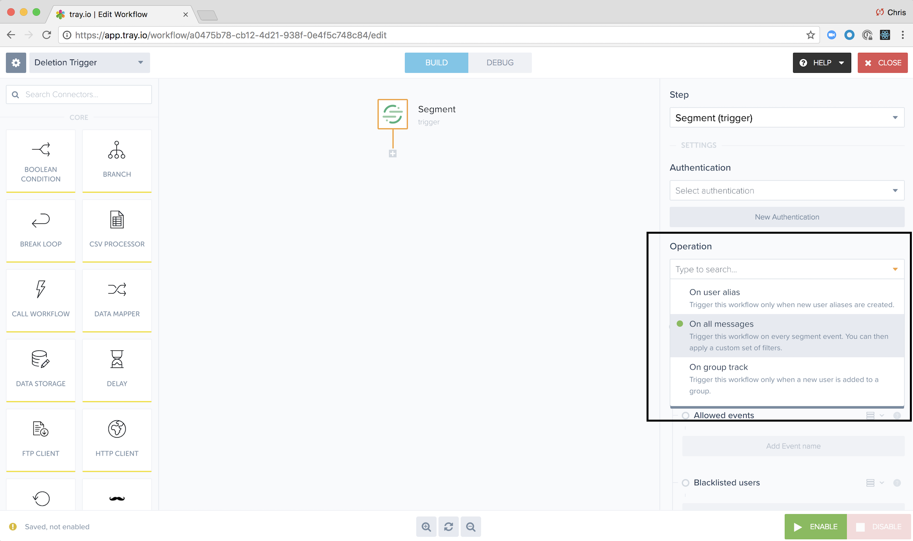

## Getting Started

Once your application is set up and instrumented with Segment, turn on tray in your Segment destinations page. After that, log in to your tray account and create a new workflow, using Segment as your trigger.

You can target up to 10 discrete tray workflows from within Segment.

## Message Types
Tray supports all message types. You can filter the message type when you configure the trigger within tray.

### Delete

When you trigger a user deletion using our [Privacy features](/docs/privacy/user-deletion-and-suppression/), we will forward a delete notification to tray so that you can automate further deletion and compliance workflows using tray.

The payload will consist of:

- `type`: `"delete"`
- `userID`: `"the deleted userID"`
- `timestamp`: `"the time of deletion"`

In order to receive and process the message, we recommend starting with an "All Message Types" filter, and then removing all the default types and adding `"delete"` manually. We're working with tray to add a dedicated `"delete"` message type filter in the dropdown pictured above.

