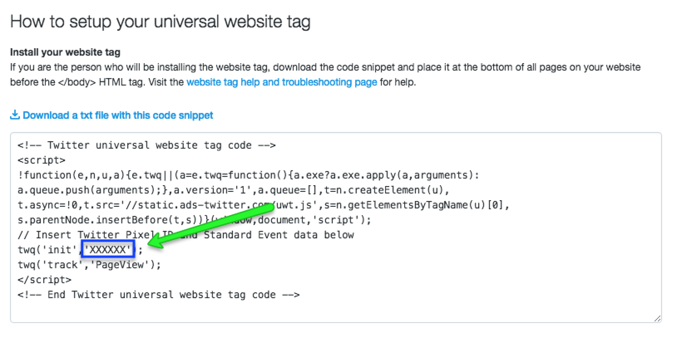
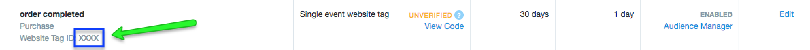
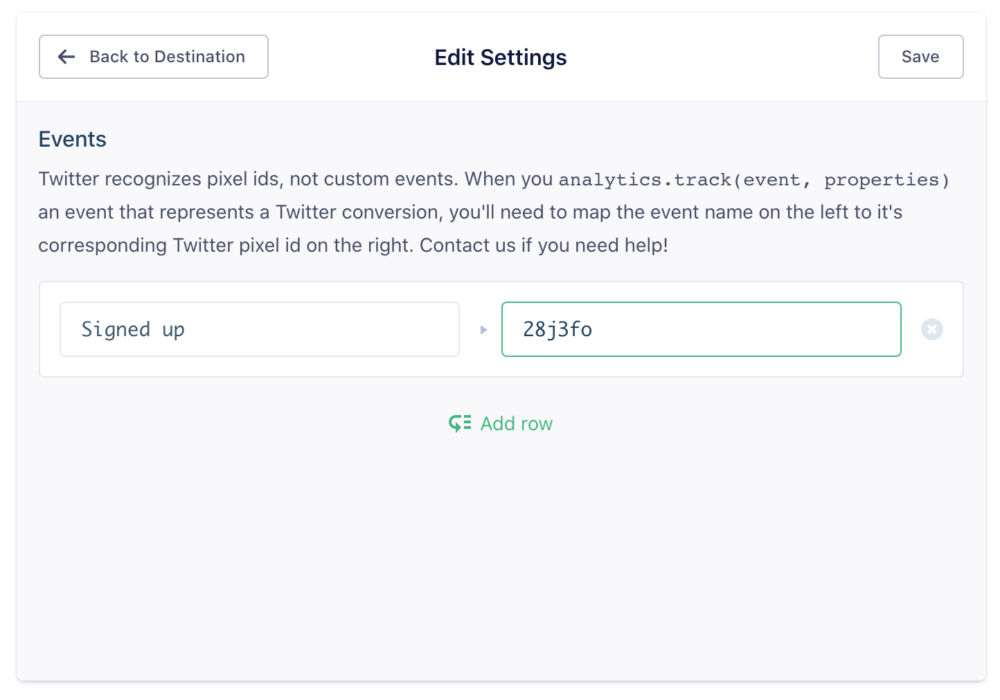

[Our Twitter Ads destination code](https://github.com/segment-integrations/analytics.js-integration-twitter-ads) is all open-source on GitHub if you want to check it out.

## Getting Started

From your Segment Destinations page click on Twitter Ads. Twitter Ads can track conversions in two ways. You can opt to use their newest **Universal Website Tag** or their **Single Event Website Tag**. You could also use both types of tags on the same page.

If you want to use the universal tag, all you have to do is enter your **Universal Website Tag Pixel ID** in the settings and create your conversion events inside Twitter's UI. The **Universal Website Tag** will map to any Segment event listed in the table [Advanced Conversion Tracking/Dynamic Ads](#advanced-conversion-tracking-and-dynamic-ads). You can find this pixel ID in Twitter's snippet that is generated for you after making a new Universal Conversion Event:



If you'd like to use the **Single Event Website Tags**, you must map the Segment events to your tags' respective conversion pixel IDs. The **Single Event Website Tag** is good to use if your event names do not match the Segment supported events with the **Universal Website Tag**.

Note that Twitter Ads only works with Segment's client-side JavaScript library `analytics.js` as it requires its script or pixel to be loaded onto your website.

## Page

If you are using the **Universal Website Tag**, when you call `.page()` we will fire a standard pageview event using Twitter's JS library: `window.twq('track', 'PageView')` as seen in their auto generated snippet.

If you are only using **Single Event Website Tags**, we will load their standard pageview pixel with default query values (`revenue: 0, quantity: 0`) given that you have provided the **Page Pixel** in your Segment settings for Twitter Ads.

If you have both tags defined in your destination settings, we will load **both** the single event pixel as well as the use the universal JS library to send the pageview event.

## Track

### Single Event Website Tags

Each time you [`track`](/docs/connections/spec/track) an event from the browser with our Twitter Ads destination enabled we compare the event name to the events you have mapped to **Twitter Conversion IDs** inside of Segment. If the event being tracked corresponds to a Twitter conversion, a Twitter conversion pixel will be loaded on that page with the ID that you mapped it to.

You can find your conversion pixel IDs after you create the single conversion event inside Twitter:



For example, if your mapping in Segment looks like this:



Then every time you make this [`track`](/docs/connections/spec/track) call (from the browser):

```javascript
analytics.track('Signed Up', {
  quantity: 1,
  revenue: 10
});
```

We will fire a Twitter conversion pixel for you with a **Twitter Conversion ID** of `28j3fo`.

It doesn't matter what you call the conversion inside of Twitter Ads as long as you paste your **Twitter Conversion ID** next to the right event in Segment.

If you include `properties.quantity` and `properties.revenue` with your events, we will send that along as parameters of the conversion tag. If these two properties are not provided, we will send the two parameters as `0`.

Thus the example `.track()` event above would fire this tag:

```html

```

### Advanced Conversion Tracking and Dynamic Ads

Our Twitter destination supports [Advanced Conversion Tracking](https://business.twitter.com/en/help/campaign-measurement-and-analytics/conversion-tracking-for-websites.html#advanced) which can be used to run **Dynamic Ads Campaigns**. Once you create your conversion events using **Universal Website Tag** inside Twitter's UI, just follow our [Ecommerce V2 Spec](/docs/connections/spec/ecommerce/v2) and we will automatically map select events (listed below). Keep in mind that you **must** provide the **Universal Website Pixel ID** in your settings for this feature to work.

*NOTE*: *For each of these Segment events, we will still check if you had mapped any of them to a* **Single Event Website Tag** *in your Segment settings and fire those tags in addition to these advanced conversion tags.*

The following table shows which Segment events map to which type of Twitter tags:

<table>
  <tr>
    <td>**Segment Event Name**</td>
    <td>**Twitter Tag Type**</td>
  </tr>
  <tr>
    <td>Order Completed</td>
    <td>Purchase</td>
  </tr>
  <tr>
    <td>Product Viewed</td>
    <td>ViewContent</td>
  </tr>
  <tr>
    <td>Product Added</td>
    <td>AddToCart</td>
  </tr>
  <tr>
    <td>Products Searched</td>
    <td>Search</td>
  </tr>
  <tr>
    <td>Product Added To Wishlist</td>
    <td>AddToWishlist</td>
  </tr>
  <tr>
    <td>Checkout Started</td>
    <td>InitiateCheckout</td>
  </tr>
  <tr>
    <td>Payment Info Entered</td>
    <td>AddPaymentInfo</td>
  </tr>
</table>

The following table show how the properties of Segment events would map to Twitter's supported parameters:

<table>
  <tr>
    <td>**Segment Property Name**</td>
    <td>**Twitter Parameter**</td>
  </tr>
  <tr>
    <td>value / revenue / (price * quantity)</td>
    <td>value</td>
  </tr>
  <tr>
    <td>currency</td>
    <td>currency</td>
  </tr>
  <tr>
    <td>products.$.product_id / products.$.sku</td>
    <td>content_ids</td>
  </tr>
  <tr>
    <td>N/A</td>
    <td>content_type</td>
  </tr>
  <tr>
    <td>products.$.name</td>
    <td>content_name</td>
  </tr>
  <tr>
    <td>products.$.category</td>
    <td>content_category</td>
  </tr>
  <tr>
    <td>products.$.quantity</td>
    <td>num_items</td>
  </tr>
  <tr>
    <td>order_id</td>
    <td>order_id</td>
  </tr>
  <tr>
    <td>status</td>
    <td>status</td>
  </tr>
</table>

**IMPORTANT**:

- You can choose in your Segment settings if you want to populate `content_ids` parameter with your `product_id`(s) or `sku`(s). Whatever you choose should match the IDs in your Product Feed if you are running dynamic ads.
- `content_type` will always be correctly hardcoded to be `'product'`.
- `content_name` and `content_category` for multiple products will be concatenated delimited by commas.
- `num_items` represents the sum total of all your products' respective quantities.
- While `properties.status` is not spec'd by Segment, you can still send that property through and we will map it to Twitter's `status` parameter, which is an optional free text field representing the state of the conversion event (eg. 'completed', 'in review', 'processed', etc.)
- `value`, `currency`, `order_id` and `num_items` will not be mapped for any pre-purchase tags because it will attribute revenue, which is undesired behavior for ecommerce/retail businesses.

The following code snippets represent the code we would fire under the hood on your webpage given an example Segment event.

> note ""
> The following assumes that the setting for* **Product Identifier** *is `product ID` (it can also be SKU).

**Order Completed** -> **Purchase**

```js
analytics.track('Order Completed', {
  orderId: '50314b8e9bcf000000000000',
  total: 30,
  revenue: 25,
  shipping: 3,
  tax: 2,
  discount: 2.5,
  coupon: 'hasbros',
  currency: 'USD',
  repeat: true,
  products: [
    {
      product_id: '507f1f77bcf86cd799439011',
      sku: '45790-32',
      name: 'Monopoly: 3rd Edition',
      price: 19,
      quantity: 1,
      category: 'Games'
    },
    {
      product_id: '505bd76785ebb509fc183733',
      sku: '46493-32',
      name: 'Uno Card Game',
      price: 3,
      quantity: 2,
      category: 'Games'
    }
  ],
  status: 'completed!'
});
```
```js
window.twq('track', 'Purchase', {
  value: '25.00', // Required
  currency: 'USD', // Required. Defaults to 'USD'
  content_ids: ['505bd76785ebb509fc183733', '507f1f77bcf86cd799439011'], // Required
  content_type: 'product', // Required
  content_name: 'Monopoly: 3rd Edition, Uno Card Game',
  num_items: '3',
  order_id: '50314b8e9bcf000000000000',
  status: 'completed!'
});
```

**Product Viewed** -> **ViewContent**

```js
analytics.track('Product Viewed', {
  product_id: '507f1f77bcf86cd799439011',
  sku: 'G37',
  category: 'eSports',
  name: 'Starcraft: Brood War',
  brand: 'Blizzard',
  variant: 'Expansion Pack',
  price: 12.99,
  quantity: 2,
  coupon: 'STOPTHETILT',
  currency: 'USD',
  position: 1,
  value: 0.50
});
```

```js
window.twq('track', 'ViewContent', {
  content_ids: ['507f1f77bcf86cd799439011'], // Required
  content_type: 'product', // Required
  content_name: 'Starcraft: Brood War',
  content_category: 'eSports'
});
```

**NOTE**: *For this event, since `properties.value` is spec'd by Segment. we will respect that property over the `properties.price * properties.quantity` since the former can be a different explicit monetary value.*

**Product Added** -> **AddToCart**

```js
analytics.track('Product Added', {
  cart_id: 'yolo123',
  product_id: 'kenbone777',
  sku: '1',
  category: 'Political Action Figure',
  name: 'The Bone Zone',
  brand: 'Winner',
  variant: 'Original',
  price: 1738.00,
  quantity: 1,
  coupon: 'KENBONE',
  position: 1
});
```

```js
window.twq('track', 'AddToCart', {
  content_ids: ['kenbone777'], // Required
  content_type: 'product', // Required
  content_name: 'The Bone Zone'
});
```

**Products Searched** -> **Search**

```js
analytics.track('Products Searched', { query: 'gluten rich food' });
```

```js
window.twq('track', 'Search', {});
```

*NOTE*: *Since no parameters are required for this tag and its supported ones do not correspond with this spec'd event's properties, we will not map any properties for this tag other than `properties.status`.*

**Product Added To Wishlist** -> **AddToWishlist**

```js
analytics.track('Product Added to Wishlist', {
  wishlist_id: 'cmon-santa-bro',
  wishlist_name: 'This is the year',
  product_id: '507f1f77bcf86cd799439011',
  sku: 'G-32',
  category: 'TV Shows',
  name: 'Rick and Morty: Season 3',
  brand: 'Adult Swim',
  variant: 'DVD',
  price: 19.99,
  quantity: 1,
  coupon: 'RICKPOTION',
  position: 1
});
```

```js
window.twq('track', 'AddToWishlist', {
  content_name: 'Rick and Morty: Season 3',
  content_category: 'TV Shows',
  content_ids: ['507f1f77bcf86cd799439011']
});
```

**Checkout Started** -> **InitiateCheckout**

```js
analytics.track('Checkout Started', {
  order_id: '50314b8e9bcf000000000000',
  affiliation: 'Google Store',
  revenue: 25,
  shipping: 3,
  tax: 2,
  discount: 2.5,
  coupon: 'hasbros',
  currency: 'USD',
  products: [
    {
      product_id: '507f1f77bcf86cd799439011',
      sku: '45790-32',
      name: 'Monopoly: 3rd Edition',
      price: 19,
      quantity: 1,
      category: 'Games'
    },
    {
      product_id: '505bd76785ebb509fc183733',
      sku: '46493-32',
      name: 'Uno Card Game',
      price: 3,
      quantity: 2,
      category: 'Games'
    }
  ]
});
```

```js
window.twq('track', 'InitiateCheckout', {
  content_ids: ['505bd76785ebb509fc183733', '507f1f77bcf86cd799439011'],
  content_name: 'Monopoly: 3rd Edition, Uno Card Game',
  content_category: 'Games, Games'
});
```

**Payment Info Entered** -> **AddPaymentInfo**

```js
analytics.track('Payment Info Entered', {
  checkout_id: 'co-120387',
  order_id: '182hjdld9sl',
  step: 4,
  shipping_method: 'FedEx',
  payment_method: 'Credit Card'
});
```

```js
window.twq('track', 'AddPaymentInfo', {});
```

*NOTE*: *Since no parameters are required for this tag and its supported ones do not correspond with this spec'd event's properties, we will not map any properties for this tag.*

## Troubleshooting


