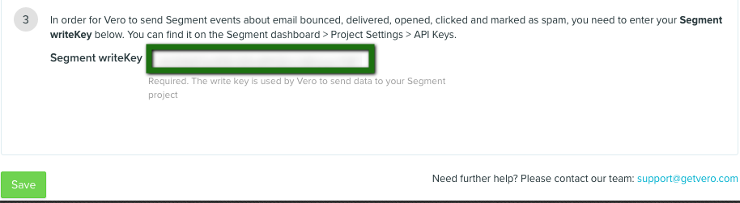

Our Vero destination code is all open-source on GitHub if you want to check it out: [JavaScript](https://github.com/segmentio/analytics.js-integrations/tree/master/integrations/vero), [Server](https://github.com/segmentio/integration-vero).

## Getting Started

Vero helps you send targeted emails to customers based on their behavior.

When you enable Vero in the Segment web app, your changes appear in the Segment CDN in about 45 minutes, and then Analytics.js starts asynchronously loading Vero's `m.js` onto your page. This means you should remove Vero's snippet from your page.
+ Since Vero only records custom events and custom user data, no events or users will appear in Vero until you start using the API outlined below.

Vero is supported on the client-side, server-side and mobile.

- - -


## Identify


### Client Side

When you call [`identify`](/docs/connections/spec/identify/) on analytics.js, we augment `traits` to have `traits.id` set to the `userId`, and then call Vero's `user` with the augmented traits object. You should provide both a `traits.email` and a `userId` for Vero to work best.

If no `email` is attached, the user is created in Vero but cannot be emailed. If you send omit the `userId`, Vero will use the email as the ID, which is is not recommended. Check out the [Vero docs](https://help.getvero.com/workflows/articles/creating-and-matching-vero-customer-ids/){:target="_blank"} for more information.

A `userId` is a required value for all types of calls. Be sure you call `identify` with a `userId` for subsequent `track` calls to populate into Vero correctly. For server side calls, you will have to manually pass in the `userId` at the top level.

### Server Side

When you call [`identify`](/docs/connections/spec/identify/) from one of our server-side languages, we'll  call Vero's REST API and update the traits for the customer with that `userId`. If your `userId` is an email, we'll also set the trait `email` as your `userId` in the update call.


## Track

When you call [`track`](/docs/connections/spec/track/), we'll send the event to Vero with the event `name` and `properties` you provide. Events will be matched to the current user.

You can also unsubscribe users by sending a `track` event, passing in the user's ID as a `property`, like so:

```javascript
analytics.track('Unsubscribe', {
  id: '12345'
});
```

Note: If you'd like to explicitly specify a user's email with track events that is not an event metadata, you can send that under `context.traits.email`!

## Sending Data from Vero

Vero supports sending [email events](/docs/connections/spec/email) to other tools on the Segment platform. These events will be sent as `track` calls to the other destinations you've turned on.

To enable this feature,

1. Log into Vero and go to Settings
2. Then go to [Integrations](https://app.getvero.com/settings/integrations?integrations=all)
3. Hit 'view' next to the Segment integration
4. Enter in your Segment write key at the bottom.




## Group

When you call [`group`](/docs/connections/spec/group/), the `traits` included in the call will be set to the current user's **Group** property in Vero.

## Alias

Our [`alias`](/docs/connections/spec/alias/) method can be used from your server to "re-identify" an existing user identity to a new one.

Most of the time this happens when you identify a visitor by their email address after they opt in, then later re-identify with a database ID when they become registered users.

To connect the two identities you'll need to [`alias`](/docs/connections/spec/alias/) their current identity to their new one.

Here's a python example of using [`alias`](/docs/connections/spec/alias/) to update the identity from an email address to a database ID:

```python
analytics.alias('example@example.com', '8765309')
```

## Features

### Tags

The destination is capable of both adding and removing tags in Vero for a given user. Because `tags` is not a common property of events, this functionality is invoked using an [destination specific option](/docs/connections/sources/catalog/libraries/website/javascript/#selecting-destinations-with-the-integrations-object).

To start using this feature, pass an object called `tags` with the following properties:

<table>
  <tr>
    <td>`id` optional</td>
    <td>String</td>
    <td>The user Id to associate tags with. If this is not specified, the destination will simply use the userId from the event itself.</td>
  </tr>
  <tr>
    <td>`action` required</td>
    <td>String</td>
    <td>Must be either 'add' or 'remove'. Indicates whether you would like to add or remove the tags for the given user.</td>
  </tr>
  <tr>
    <td>`values` required</td>
    <td>Array</td>
    <td>An array of strings representing the tags to either add or remove.<td>
  </tr>
</table>

Here is an example using our Node.js library:

```javascript
analytics.identify('324LKJF', {
    email: 'example@example.com'
}, {
    integrations: {
        Vero: {
            tags: {
                id: '235FAG', // This is optional! If not defined, we default to the event's userId (ie: 324LKJF)
                action: 'add',
                values: ['warriors', 'giants', 'niners']
            }
        }
    }
})
```
