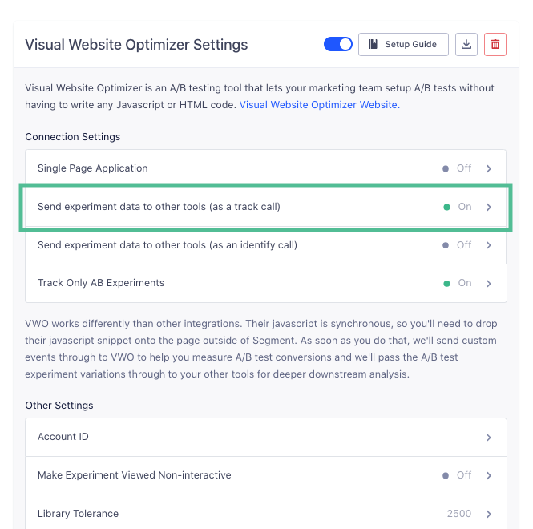

[VWO](https://vwo.com/) is an all-in-one platform that helps you conduct visitor research, build an optimization roadmap, and run continuous experimentation. Their platform enables you to create a process-driven optimization, get benefits of a connected, unified view of the individual visitor and run A/B tests at scale without reducing performance.

The VWO Destination is open-source and you can browse the code [on GitHub](https://github.com/segment-integrations/analytics.js-integration-visual-website-optimizer).

If you notice any gaps, outdated information or simply want to leave some feedback to help us improve our documentation, [let us know](https://segment.com/help/contact)!

## Getting Started



Because the VWO destination needs to be on the page right away, there are two ways for the VWO JavaScript snippet to be loaded on your page. You can either:

1. Add the JavaScript snippet directly on your codebase by following the instructions in [these docs](https://vwo.com/knowledge/add-vwo-smartcode-to-your-website/) from the VWO documentation. Make sure to paste the snippet inside your `<HEAD>` tag above your Segment snippet!
2. Have Segment include the JavaScript snippet for you by toggling on the "Use Async Smart Code" setting and then including your Account ID in the "Account ID" setting. When both these settings are correctly set, you will not need to include VWO's native snippet on your page as Segment will do this on your behalf.

Additionally, to enable the destination  follow these instructions:

1. From the Segment web app, click **Catalog**.
2. Search for "Visual Web Optimizer" in the Catalog, select it, and choose which of your sources to connect the destination to.
3. Toggle the destination on!


### Send Experiment Data from VWO

When you enable the VWO destination, we set the option for "Send experiment data to other tools (as a track call)" to true by default and we will automatically collect the [`Experiment Viewed`](/docs/connections/spec/ab-testing/) event as a track call.



This event supports the following semantic properties:

| Property        | Type   | Description                          |
| --------------- | ------ | ------------------------------------ |
| `experimentId`  | String | The experiment's ID.                 |
| `variationName` | String | The variation's human-readable name. |

#### Example

```javascript
analytics.track('Experiment Viewed', {
  experiment_id: 'home-page-title-2819',
  variation_name: 'Enterprise Solutions Synergy'
});
```

However, you can also send the Experiment data as traits of an identify call that can be routed to all other destinations you have enabled. You'll just need to enable the "Send experiment data to other tools (as an identify call)" setting and we will send those experiment values as traits of the user. An example would look like this:

```javascript
'Experiment: Home CTA': 'Create free account now'
```

### Recording Variations

By default, we will take the variation data that is available in VWO and send that data to the other user-tracking destinations you have enabled in Segment automatically. That way, you can segment your analytics reports by the variations a user has seen.

For example, if you have an experiment called Home CTA and a visitor sees a variation called **Create free account now**, we will send the `Create free account now` value as the `variation_name` property of the [`Experiment Viewed`](/docs/connections/spec/ab-testing/) event and/or as a trait of the user in an identify call (depending on your delivery settings).


### Track Revenue Goals

The Track Revenue goal allows you to track revenue from purchases and other transactions on your website by attributing the revenue amount for every valid and successful transaction. In order to track these transactions, you'll need to use our `Order Completed` ecommerce track event and include the revenue data as `total`. An example call would look like this:

```javascript
analytics.track('Order Completed', {
  total: 25
});
```

## Additional settings

### Make Experiment Viewed Non-interactive
If you are using VWO together with Google Analytics, you can enable this setting to add the `nonInteraction` flag to your `Experiment Viewed` track events. This can help with low bounce rates.

### Library Tolerance
The maximum amount of time (in milliseconds) to wait for VWO's full library to be downloaded before simply displaying your original page. This setting is only effective if "Use Async Smart Code" is set to "true".

### Settings Tolerance
The maximum amount of time (in milliseconds) to wait for test settings before VWO will simply display your original page. This setting is only effective if "Use Async Smart Code" is set to "true".

## Use Existing JQuery
If your page already includes JQuery, you can set this to "true". Otherwise, VWO will include JQuery onto the page for you. VWO needs JQuery on the page to function correctly. This setting is only effective if "Use Async Smart Code" is enabled.
