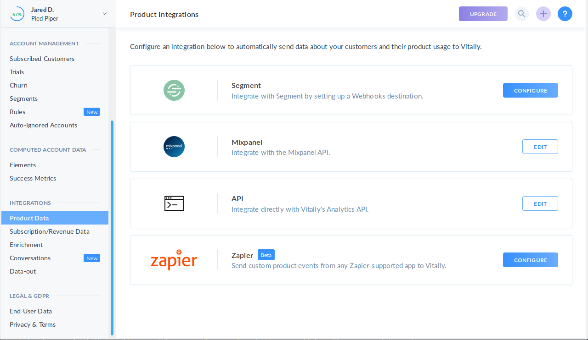
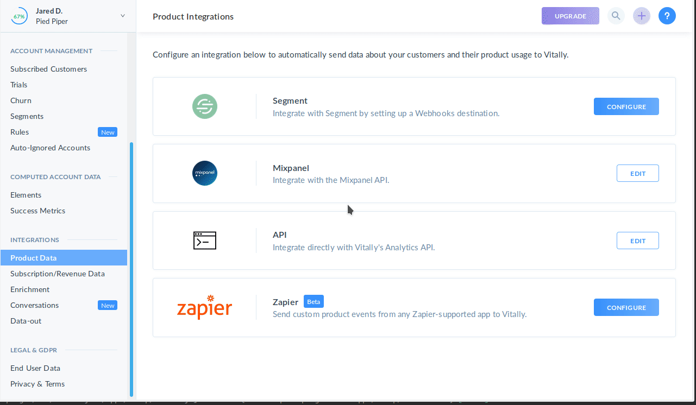
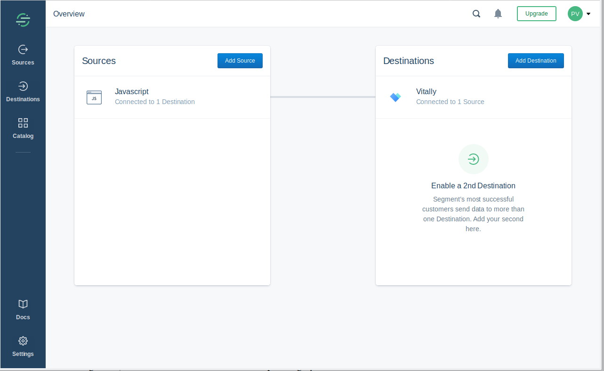

[Vitally](https://vitally.io/?utm_source=segmentio&utm_medium=docs&utm_campaign=partners){:target="_blank"} is a customer success platform for B2B SaaS companies that wraps your unified customer data with powerful analytics, alerts, and workflows to help you build successful customers.

This destination is maintained by Vitally. For any issues with the destination, [contact the Vitally Support team](mailto:support@vitally.io).


## Getting Started



Enabling Vitally as a destination in Segment can be done in one click from your Vitally account. 

1. Navigate to the Segment integration page within your Vitally account. This can be found in your **Account Settings** in Vitally by navigating to the **Product Data** integrations list.

  

2. In a separate tab/window, make sure you are logged into your Segment account
3. Configure the Segment integration using the one-click "Enable with Segment" button. Choose the primary source of product usage data in Segment and Segment will automatically create a destination for Vitally:

  

4. You'll now be able to see and manage your Vitally Destination directly from your Segment workspace

  

5. Once Vitally receives at least one event from Segment, you'll be able to proceed with the set up process and configure how to [create accounts from Segment](https://docs.vitally.io/managing-the-customer-lifecycle/account-hierarchy-using-vitallys-organization-object/supported-integrations-and-how-to-create-the-hierarchy#segment){:target="_blank"}

## Identify

If you haven't had a chance to review the spec, take a look to understand what the [Identify method](/docs/connections/spec/identify/) does. An example call would look like:

```
analytics.identify('userId123', {
  name: 'John Doe',
  email: 'john.doe@yourcustomer.com',
  avatar: 'https://yourdomain.com/avatars/johndoe.png',
  role: 'CEO'
});
```

Identify calls are used by Vitally to maintain a picture of a single user. The traits you pass to the Identify call will be displayed on the user's dashboard and can be used for sorting and filtering users within an account and across all of your users.

Passing along the following traits will correspond to what is displayed in Vitally:
  * `name` is used to set the name of the user in Vitally
  * `email` sets the user's email in Vitally
  * `avatar` is used to display an avatar for the user

## Track

If you haven't had a chance to review the spec, take a look to understand what the [Track method](/docs/connections/spec/track/) does. An example call would look like:

```
analytics.track('enabled-slack-integration', {
   channel: '#support'
})
```

Track calls are used in Vitally to track and analyze your accounts' engagement with your product. Vitally provides out-of-the box analysis on your events, plus the ability to define your own custom metrics on top of those events, like [Success Metrics](https://docs.vitally.io/account-health-scores-and-metrics/success-metrics){:target="_blank"} and [Elements](https://docs.vitally.io/account-health-scores-and-metrics/elements).


## Group

If you haven't had a chance to review the spec, take a look to understand what the [Group method](/docs/connections/spec/group/) does. An example call would look like:

```js
analytics.group("accountId123", {
  name: "Initech",
  industry: "Technology",
  plan: "enterprise",
  mrr: 2000
});
```

Group calls are used by Vitally to maintain a picture of an account. Any traits you pass to the Group call are added to the account in Vitally and can be used to analyze your customer base as a whole. You can view a customer's traits on their dashboard, use them for sorting and filtering, configure rules to automate your customer success process, and even create segments) of your accounts.

Passing along the following traits will correspond to what is displayed in Vitally:
  * `name` is used to set the name of the account in Vitally
