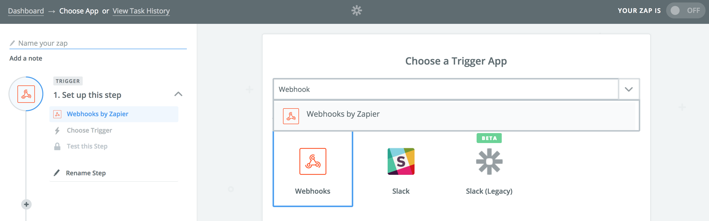
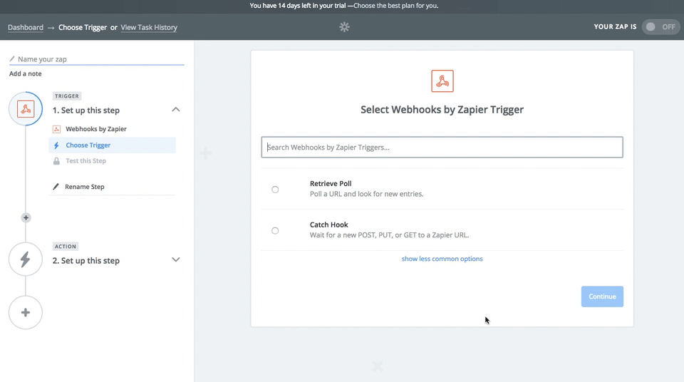
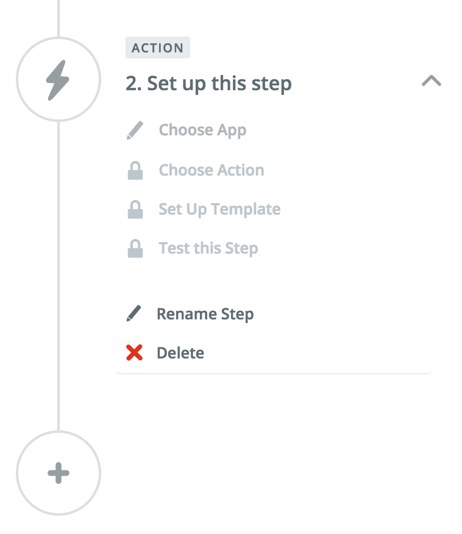

[Zapier](https://zapier.com/apps/integrations) empowers businesses to create processes and systems that let computers do what they do best - automating information transfer, allowing humans to be more productive.

## Getting Started



1. Navigate to your Zapier dashboard and select "Make A Zap" - you'll need at least one Zap so you can tell Segment where to route data later on.
2. Search "Webhooks", then select "Catch Raw Hook" (Segment POSTs raw data to Zapier using our destination).

    
    

3. Complete the remaining Webhook set up steps, and Zapier will present you with a custom Webhook URL.
4. Repeat step 3 to create as many Webhook URLs as you like.
5. Remember that each Zapier "trigger" should be connected to an "Action" - i.e. posting the Webhook data to another downstream tool, such as Slack.

    

6. From your Segment UI's Destinations page click on "Add Destination".
7. Search for "Zapier" in the Catalog, select it, and choose which of your sources to connect the destination to.
8. Add your custom Webhook URLs to your destination settings as desired.
9. Starting sending data!

## Page / Screen

Segment doesn't perform any transformations or mappings on data you send to Zapier - we send raw payloads. When you specify a "Zap" URL, Segment will send all your `page`/`screen` events to that Zapier URL. If you also specify any "Page/Screen Zaps" under "Optional Settings" in your Segment settings UI, Segment will send these named `page`/`screen` events to the specific Webhook URL instead of to the "Zap" URL.

## Track

When you specify a "Zap" URL, Segment will send all your track events to that Zapier URL. Leave this setting blank if you do not wish to send all track events to Zapier. As with page/screen events, Segment does not perform any transformations or mappings. If you also specify any "Event Zaps", Segment will send these events to the specific Webhook URL instead of to the "Zap" URL.
