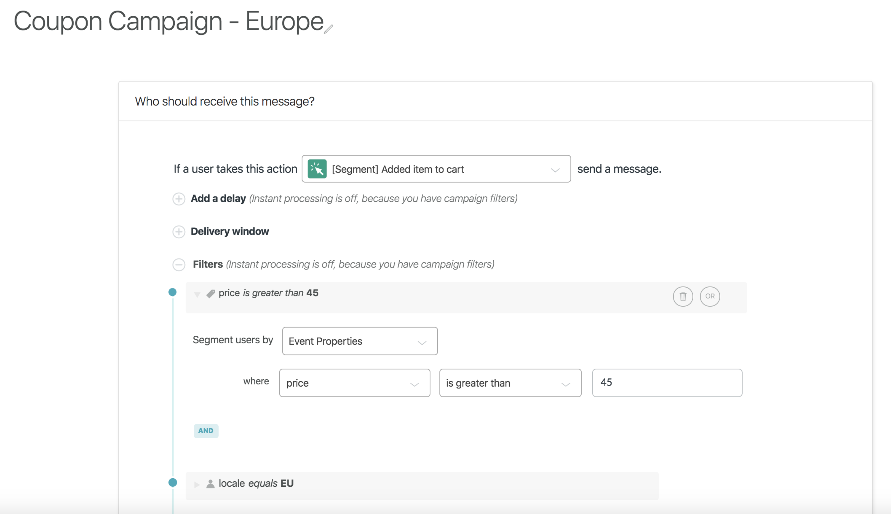
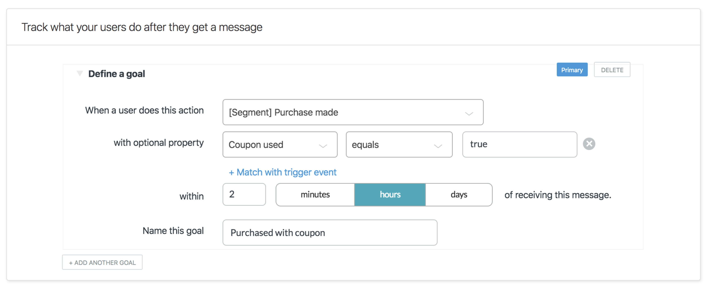
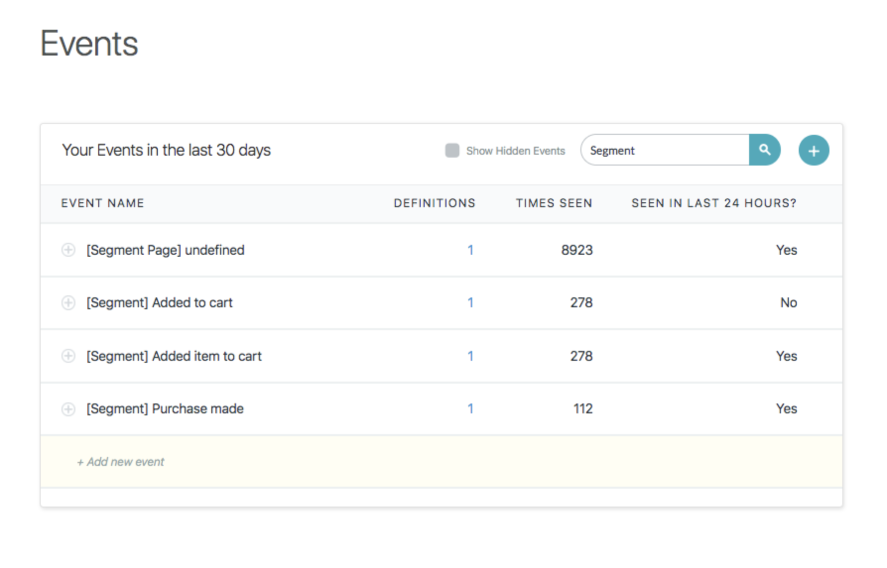

## Getting Started

When you enable Zendesk Connect from the Segment web app:

- Your changes appear in the Segment CDN in about 45 minutes, and then Analytics.js starts asynchronously sending all your analytics data to Segment's servers, and onwards to Connect.
- Your Zendesk Connect real-time feed starts showing visitor data.

If you plan on having both a production and development environment, make sure you enter your Connect API keys into the corresponding Segment sources.

Connect is supported on the client-side, server-side and on mobile.


## Identify

Connect needs to identify users and their data to track who we should message. Segment will pass your UserID and any traits that you store on that user to Connect. (Note: Segment refers to user data as "traits"; Connect refers to user data as "attributes".)

```js
analytics.identify({
  userId: '019mr8mf4r',
  traits: {
    name: 'Michael Bolton',
    email: 'mbolton@example.com',
    phone: '1234567890',
  },
  context: {
    device: {
      type: "ios",
      token: 'XXXYYYZZZ'
}}});
```

Segment traits correspond to specific top level attributes within Connect. These attributes are used to send and customize messages on various channels:

+ `name` maps to Connect's `first_name` and `last_name` attributes recommended for targeted copy.
+ `email` maps to Connect's `email` attribute required for email campaigns
+ `phone` maps to Connect's `phone_number` attribute for sms & voice campaigns
+ `context.device.token` maps to Connect's `apns` or `fcm` attribute for iOS and Android Push.
+ `timezone` maps to Connect's `timezone` attribute recommended to use Connect's time of day message delivery feature (note - Connect only accepts Olson name values) These are automatically collected if you're using Segment's mobile SDKs.


## Alias

Connect allows aliasing, which enables you to join an anonymous pre-signup ID with a post-signup userID. When you send an identify call that has an anonymous user, that user will be created using the anonymous id you supply in the identify call. Later, when you want to update this anonymous user's id to their actual id, you can do so by using Segment's alias method. The following is an example alias call from Segment's Analytics.js library:

```js
analytics.alias('019mr8mf4r');
```

## Track

Events and their properties are used to trigger and customize message campaigns within Connect:

```js
analytics.track('Signed Up', {
  plan: 'Startup',
  source: 'Analytics Academy'
});
```

Connect's campaign filters allow you to target specific segments of users based on events, event properties, and attributes. Having specific events and attributes allow you to better target your audiences with custom messaging:



Once a user is sent a message, you will often want to measure whether or not they reach a specific goal. Events are used to calculate if users reach these goals:




## Features
### Test your Destination within Connect


Connect shows all received events on the Connect Settings > Events page. Searching for your Segment events will show if it has been received in the last 24 hours and how many times.



If your Segment events do not appear, they have not yet been received by Connect.


### Build your First Campaign


Now that everything is hooked up, you can start messaging your users! Check out the following guides at Connect:


1. [Getting started with Connect](https://support.zendesk.com/hc/en-us/articles/360022370293-Introduction-Getting-started-with-Connect)
2. [Understanding events in Connect](https://support.zendesk.com/hc/en-us/articles/360022178494-Understanding-Connect-events)
3. [Create a trigger based campaign](https://support.zendesk.com/hc/en-us/articles/360022362093-Creating-a-trigger-based-campaign)
