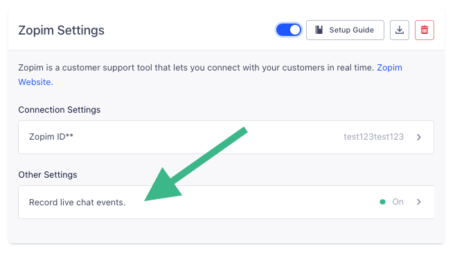

[Zendesk Chat](https://developer.zendesk.com/rest_api/docs/chat/introduction), (previously called Zopim) is a live chat solution that helps businesses increase sales conversion by engaging important leads on their websites. The `analytics.js` Zendesk Chat Destination is open-source. You can browse the code [on GitHub](https://github.com/segmentio/analytics.js-integrations/tree/master/integrations/zopim).

**NOTE:** Zendesk Chat currently offers [two types of widgets](https://support.zendesk.com/hc/en-us/articles/115007912068-Using-the-Chat-JavaScript-API): a standalone `Chat Widget`, which is mainly designed to provide chat related features, and a `Web Widget`, which incorporates both Zendesk Chat and Zendesk Support functionalities. At the moment, Segment only supports the `Chat Widget`. For more details refer to the "Getting Started" section below.

## Getting Started



1. From the Segment web app, click **Catalog**.
2. Search for "Zopim" in the Catalog, select it, and choose which of your sources to connect the destination to. (This is the old name.)
3. Add your Zendesk Chat ID (Zopim ID) to your Destination Settings. If you are using the `Chat Widget`, you can find your ID in the widget script itself. See example below:

```js
<!--Start of Zendesk Chat Script-->
<script type="text/javascript">
window.$zopim||(function(d,s){var z=$zopim=function(c){z._.push(c)},$=z.s=
d.createElement(s),e=d.getElementsByTagName(s)[0];z.set=function(o){z.set.
_.push(o)};z._=[];z.set._=[];$.async=!0;$.setAttribute("charset","utf-8");
$.src="https://v2.zopim.com/?[ZOPIM ID]";z.t=+new Date;$.
type="text/javascript";e.parentNode.insertBefore($,e)})(document,"script");
</script>
<!--End of Zendesk Chat Script-->
```

If you are using the `Web Widget` (see example below), **you will need to contact Zendesk Support in order to get your Chat Account ID or you can follow the steps outlined [here](https://support.zendesk.com/hc/en-us/articles/360022366613-How-do-I-find-my-Chat-Account-Key-):**

```js
<!-- Start of Zendesk Widget script -->
<script>/*<![CDATA[*/window.zEmbed||function(e,t){var n,o,d,i,s,a=[],r=document.createElement("iframe");window.zEmbed=function(){a.push(arguments)},window.zE=window.zE||window.zEmbed,r.src="javascript:false",r.title="",r.role="presentation",(r.frameElement||r).style.cssText="display: none",d=document.getElementsByTagName("script"),d=d[d.length-1],d.parentNode.insertBefore(r,d),i=r.contentWindow,s=i.document;try{o=s}catch(e){n=document.domain,r.src='javascript:var d=document.open();d.domain="'+n+'";void(0);',o=s}o.open()._l=function(){var e=this.createElement("script");n&&(this.domain=n),e.id="js-iframe-async",e.src="https://assets.zendesk.com/embeddable_framework/main.js",this.t=+new Date,this.zendeskHost="SUBDOMAIN.zendesk.com",this.zEQueue=a,this.body.appendChild(e)},o.write('<body onload="document._l();">'),o.close()}();
/*]]>*/</script>
<!-- End of Zendesk Widget script -->
```

Your changes appear in the Segment CDN in about 45 minutes, and then Analytics.js starts asynchronously loading the Zendesk Chat snippet on your page and sending data.

## Identify

If you're not familiar with the Segment Specs, take a look to understand what the [Identify method](/docs/connections/spec/identify/) does. An example call would look like:

```javascript
analytics.identify('ze8rt1u89', {
  name: 'Zaphod Kim',
  email: 'jane.kim@example.com',
  phone: '1-401-826-4421',
});
```

When you call identify, the `name`, `email`, and `phone` traits included in the call will be set to the current user in Zendesk Chat.

## Record Live Chat Events

With this destination, you can automatically record `track` events for live chat conversations. If you select this option, we'll collect the following events:
* Live Chat Conversation Started
* Live Chat Conversation Ended

These events will then flow out to your other tools, so you can do things like analyze if users who chat spend more money over time.

To learn more about the live chat events you can capture with this destination, head on over to our [Live Chat spec docs](/docs/connections/spec/live-chat/).



## Troubleshooting

### I want to hide the Zendesk Chat widget on certain pages, or after a analytics.js call is made.

Currently, the best way to ensure that the Zendesk Chat widget does not load on a page is to fire a small JavaScript snippet as [documented here on the legacy Zopim site](https://api.zopim.com/files/meshim/widget/controllers/liveChatAPI/Window-js.html#$zopim.livechat.window.hide). To ensure that the Zendesk Chat snippet fires after the library loads on the page, you can either wrap the snippet in an [analytics.ready()](/docs/connections/sources/catalog/libraries/website/javascript/#ready) method with any conditional logic you'd like, or place the script in the callback of any Analytics.js (`.track()`, `.identify()`, etc) call so that it hides after that call is made.
