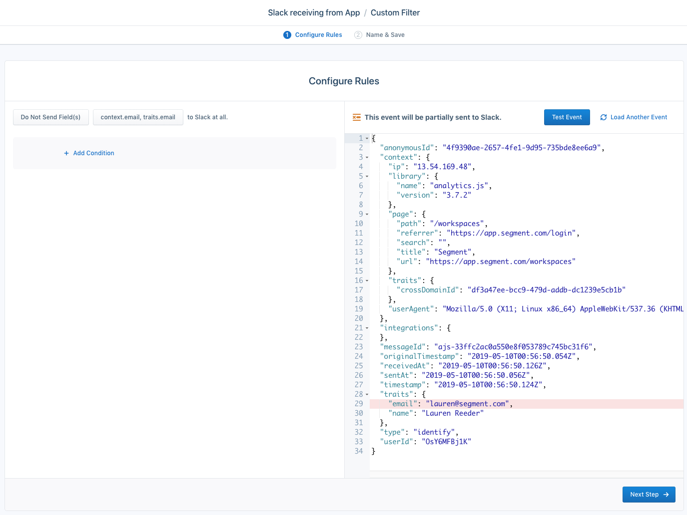
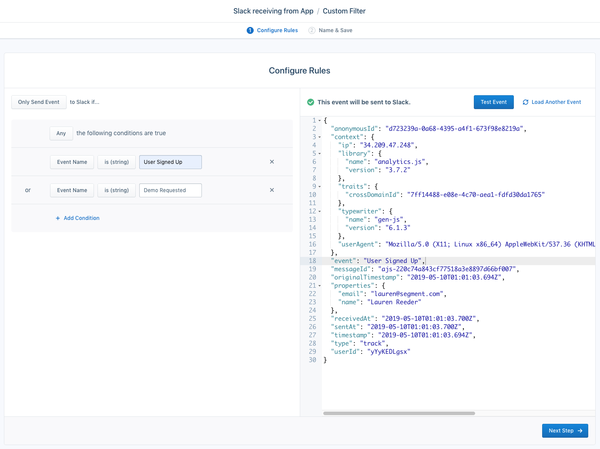
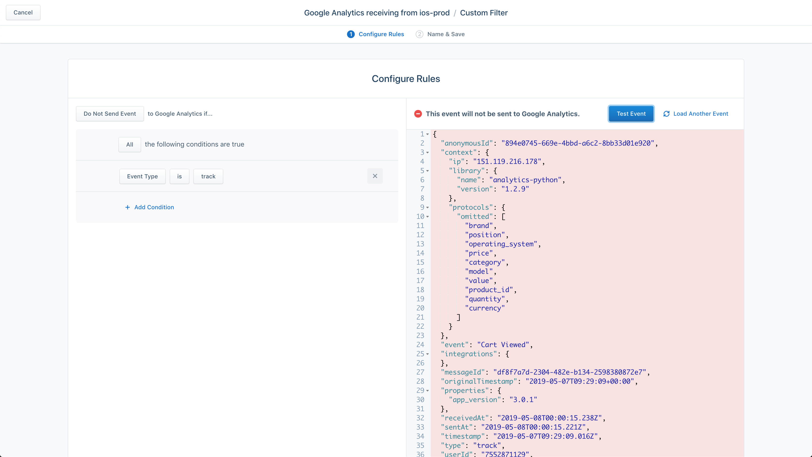
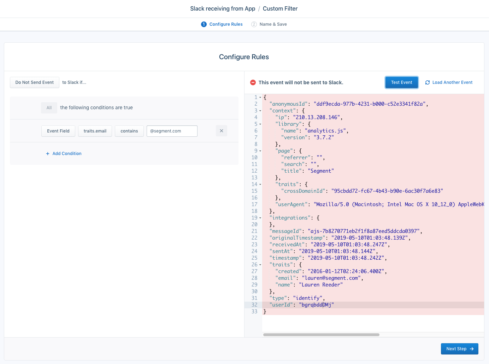
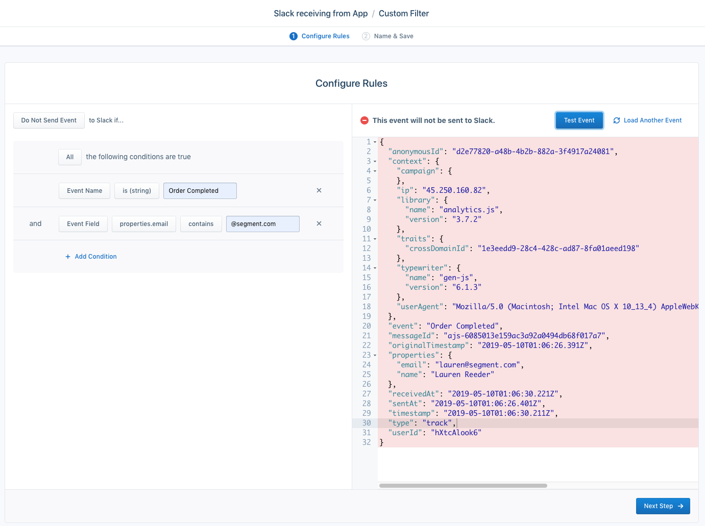

Destination Filters let you prevent certain data from flowing into a destination.

Using Destination Filters, you can conditionally filter out event properties, traits, and fields, or even filter out the event itself.

Common use cases for Destination Filters include the following:

- Managing PII (personally identifiable information) by blocking fields from reaching certain destinations
- Controlling event volume by sampling or dropping unnecessary events for specific destinations
- Increasing data relevance in your destinations by removing unused or unwanted data
- Preventing test or internally-generated events from reaching your production tools

> note ""
> Destination Filters are available to Business Tier customers only.

### Destination Filtering Limitations

Keep the following limitations in mind when you use Destination Filters:

- Destination Filters can only be applied to cloud-mode (server-side) streaming destinations. Device-mode destinations aren't supported.
- You can't apply Destination Filters to Warehouses or S3 destinations.
- Each filter can only apply to one source-destination pair.

[Contact Segment](https://segment.com/help/contact/){:target="_blank"} if these limitations impact your use case.

## Create a Destination Filter

To create a Destination Filter, follow these steps:

1. Go to **Connections > Destinations** and select your destination.
2. Click on the **Filters** tab of your destination.
3. Click **+ New Filter**.
4. Configure the rules for your filter.
5. *(Optional)* Click **Load Sample Event** to see if the event passes through your filter.
6. Click **Next Step**.
7. Name your filter and click the toggle to enable it.
8. Click **Save**.

## Destination Filters API

The Destination Filters API provides more power than the Segment dashboard's Destination Filters settings. With the API, you can create complex filters that are conditionally applied using Segment's [Filter Query Language (FQL)](/docs/config-api/fql).

The Destination Filters API offers four different filter types:

| Filter             | Details                                                      |
| ------------------ | ------------------------------------------------------------ |
| `drop_event`       | Don't send matched events to the destination.                |
| `sample_event`     | Send only a percentage of events through to the destination. |
| `whitelist_fields` | Only send whitelisted properties to the destination.         |
| `blocklist_fields` | Don't send blocklisted properties to the destination.        |

To learn more, read Segment's [Destination Filters API docs](https://reference.segmentapis.com/#6c12fbe8-9f84-4a6c-848e-76a2325cb3c5){:target="_blank"}.

## Examples

The following examples illustrate common Destinations Filters use cases.

### PII Management

Example: Remove email addresses from `context` and `properties`:

Property-level allowlisting is available with Segment's API. Using Destination Filters, you can configure a rule that removes email addresses from `context` and `properties`. As a result, Segment only sends traits without PII to the destination.

### Control Event Volume

This example shows a filter that controls event volume by only sending `User Signed Up` and `Demo Requested` events.

### Cleaner Data

This example shows a rule that only sends track calls to Google Analytics.

### Remove Internal and Test Events From Production Tools

This rule targets email addresses with internal domains to stop test events from reaching Destinations.

This rule prevents an event from sending if `Order Completed` and `properties.email` contain an internal `@segment.com` email address.

### Sample a Percentage of Events

Using the [Destination Filters API](https://reference.segmentapis.com/#6c12fbe8-9f84-4a6c-848e-76a2325cb3c5){:target="_blank"}, you can create a rule to randomly sample video heartbeat events.

### Drop Events

[Watch this Destination Filters walkthrough](https://www.youtube.com/watch?v=47dhAF1Hoco){:target="_blank"} to learn how to use event names to filter events sent to destinations.

## Important Notes

**Conflicting settings**

Some destinations offer settings that also allow you to filter data. For example, the Facebook App Events destination allows you to map `Screen` events to `Track` events. Because Destination Filters are evaluated and applied _before_ the Destination settings are applied, they can conflict with your settings.

In the example in the video above, if you have a Destination Filter that filters Track events _and_ you have the **Use Screen Events as Track Events** setting enabled, `Track` events will be dropped, but `Screen` events still process. The destination settings will transform it into a `Track` event - *after* the filters.

**Error handling**

Segment makes effort to ensure that Destination Filters handle unexpected situations. For example, if you use the `contains()` FQL function on `null` field, Segment returns `false` instead of returning an error. If Segment can't infer your intent, Segment logs an internal error and drops the event. Segment defaults to this behavior to prevent sensitive information, like a PII filter, from getting through.

Errors aren't exposed in your Destination's Event Deliverability tab. For help diagnosing missing destination filter events, [contact Segment](https://segment.com/help/contact/){:target="_blank"}.

## FAQ

**How do Destination Filters work with array properties?**

Destination Filters can filter properties out of objects nested in an array. For example, you can filter out the `price` property of every object in an array at `properties.products`. You can also filter out an entire array from the payload. However, you can't drop nested objects in an array or filter properties out of a single object in an array.

To block a specific property from all of the objects within a properties array, set the filter using the following the format: `<propertyType>.<arrayName>.<arrayElementLabel>​`.

For example, the `properties.products.newElement` filter blocks all `newElement` property fields from each `products` object of an array within the `properties` object of a Track event.

To block the Identify event trait `products.newElement`, select the option under the **User Traits** list instead. To block a context object field `products.newElement`, select it from the **Context Fields** list.

**How many filters can I create?**

Segment supports 10 filters per destination. If you need help consolidating filters or would like to discuss your use case, [contact Segment](https://segment.com/help/contact/){:target="_blank"}.

**Can I set multiple `Only Send` Destination Filters?**

Segment evaluates multiple `Only Send` filters against each other and resolves Destination Filters in order. If multiple `Only Send` filters conflict with each other, Segment won't send information downstream.

**How many properties can I view in the filter dropdown?**

Segment displays the most recent 15,000 properties. To find a property not in the filter dropdown, enter the property manually.

**How can I filter out warehouse events?**

To filter out events from warehouses, use Selective Sync.

**I don't see a `name` property at the top level of my events to filter on "event name".**

Generally, only Track calls have "name" properties, which correspond to the "Event" field in an event.

**How can I find out when new Destination Filters have been added or removed?**

The activity feed shows the action, date, and user who performed the action when a Destination Filter is created, modified, enabled, disabled, or deleted. You can also subscribe to notifications for any of these changes in the Activity Feed settings page.

The Activity Feed shows the user, date, and action performed when a Destination Filter is created, modified, enabled, disabled, or deleted.

**Why am I getting a permissions denied error when I try to save a filter?**

You must have write access to save and edit filters; read permission allows viewing and testing access only.

**How can I test my filter?**

Use the Destination Filter tester during setup to verify that you're filtering out the right events. Filtered events show up on the schema page but aren't counted in event deliverability graphs.
